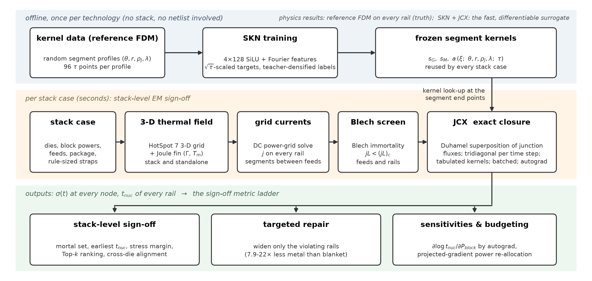
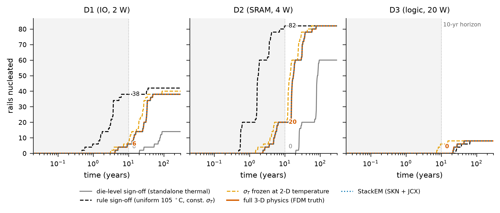
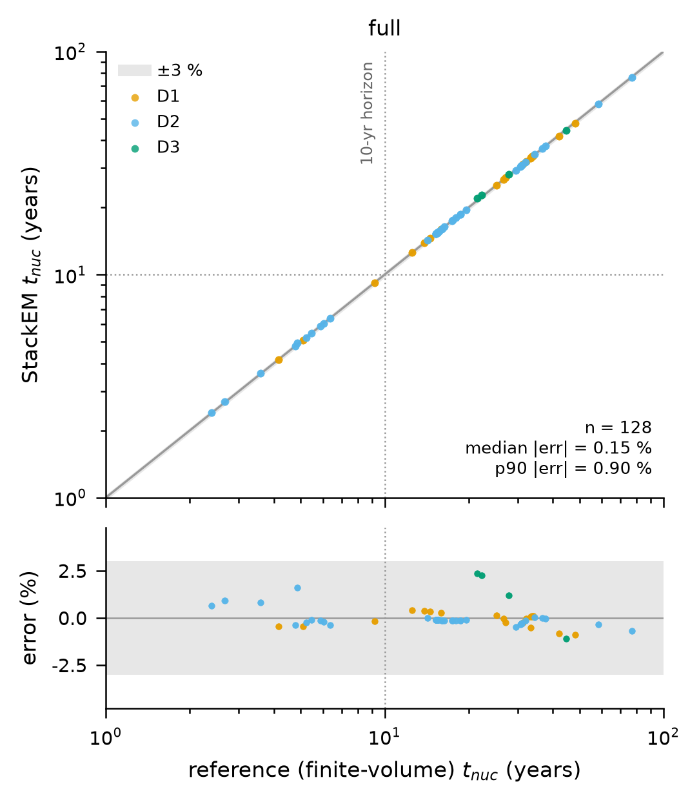
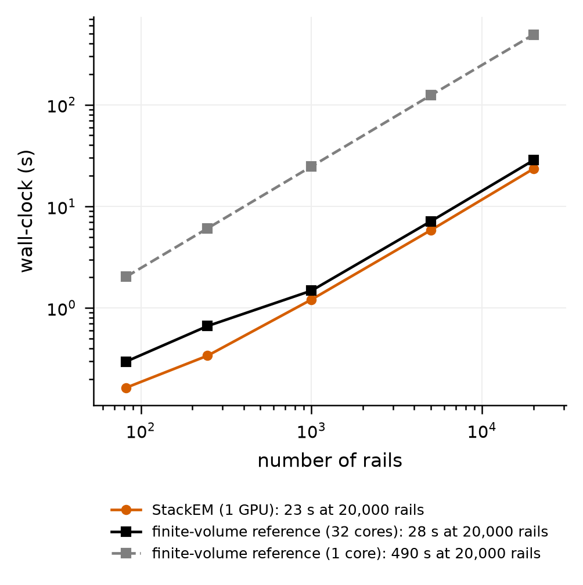
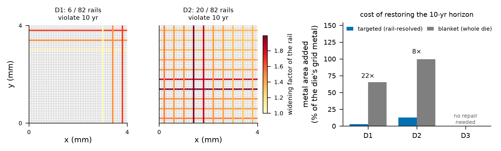

# StackEM

StackEM 是一套用来预测三维堆叠芯片里电源线何时因电迁移而开始损坏的程序，附带产生全部结果所需的代码、网络权重、参考结果和逐步操作文档。本仓库只包含最终的实验流程：一个代码包、一套数据、一条命令链。

本页先用白话讲清楚它在算什么，再给出主要结果、仓库内容和两条使用路线。从没用过终端的读者请直接从 [docs/01_准备电脑与软件.md](docs/01_准备电脑与软件.md) 开始，按编号往下做。

## 1. 它解决什么问题

先解释几个词。

| 词 | 白话解释 |
|---|---|
| 电迁移，EM | 电流长期流过金属线时，电子会把金属原子一点点推走。原子流失的一端受拉，拉应力大到一定程度就出现空洞，线最终断开 |
| 成核时间 t_nuc | 一条线上的拉应力第一次达到临界值的时刻。本项目把它当作这条线的寿命 |
| 轨，rail | 供电网里一条直的铜线，由许多段首尾相接而成 |
| 三维堆叠，混合键合 | 把几颗减薄的芯片叠在一起直接键合。芯片之间只隔几微米，热量很容易互相传递 |
| 签核，sign-off | 流片之前对可靠性做的最终核查 |
| 参考求解器 | 本仓库里用有限体积法直接解应力方程的程序，是所有结论的真值来源 |

问题在于：每颗芯片单独检查时都合格，叠在一起以后却可能不合格。原因是低功耗的芯片会被旁边的高功耗芯片加热，温度升高后原子扩散成倍加快。传统做法按单颗芯片自己的温度做签核，看不到这种跨芯片的影响。

StackEM 的做法分三步。

1. 用开源热仿真器 HotSpot 算出整个堆叠的三维温度场，再求出每条轨上每一段的电流和温度。
2. 把一条轨拆成段。单独一段的应力响应可以预先算好，称为核。用一个小神经网络 SKN 学会这三个核，以后查核只需一次网络前向计算。
3. 段与段在结点处相接，结点上应力连续、原子通量守恒。利用方程的线性，用核的叠加把所有结点的通量解出来，这一步称为结点闭合 JCX。它是严格的线性代数，没有近似的网络参与。

网络只负责提供单段的核，物理结论由参考求解器在每条轨上给出，SKN 与 JCX 组成的快速通道逐条轨与参考求解器对照。



读图方法：图分三行。第一行是离线阶段，只做一次，用参考求解器在随机的段剖面上生成核数据并训练网络。第二行是每个堆叠算例要走的流程，从左到右依次是算例定义、三维热场、供电网电流、Blech 筛查、结点闭合。Blech 筛查用来先剔除永远不会成核的轨。第三行是三种用途：堆叠级签核、只加宽违规轨的定向修复、对功耗的灵敏度与功耗重新分配。

## 2. 主要结果图

下面四张图都来自 `reference_results/`，是参考机上最终运行的原样输出。

### 2.1 单颗芯片合格，叠起来不合格



三个子图对应主算例 base3 的三颗芯片，横轴是时间，纵轴是已经成核的轨数，竖虚线是十年的签核期限。灰线是按单颗芯片自己的温度场做签核时的预测，十年内没有一条轨成核。橙色粗线是考虑完整三维物理后的真值，十年内 D1 有 6 条、D2 有 20 条轨成核。蓝色点线是 StackEM 的预测，与真值重合。黑色虚线是按统一 105 摄氏度的规则做签核的结果，它在 D1 和 D2 上过于悲观。

### 2.2 快速通道与参考求解器逐条轨对照



上图每个点是一条会成核的轨，横轴是参考求解器的成核时间，纵轴是 StackEM 的成核时间，点落在对角线上表示两者一致。下图是相对误差，灰带是正负百分之三。base3 的 128 条成核轨上，误差中位数是 0.15 %。

### 2.3 速度



横轴是轨数，纵轴是墙钟时间。橙线是 StackEM 在一块显卡上的耗时，黑线是参考求解器用满 32 个线程的耗时，灰色虚线是参考求解器只用一个核的耗时。两万条轨时三者分别是 23.4 秒、28.4 秒和 490.4 秒。请注意这张图的含义：StackEM 在一块显卡上与 32 线程的参考求解器相当，比单核参考求解器快一个数量级以上。它没有显示出对多核参考求解器的大幅领先，这一点在第 8 节的局限里再说。

### 2.4 定向修复比整体加宽省金属



左边两张图标出 D1 和 D2 上十年内会成核的轨，颜色表示需要把这条轨加宽多少倍才能撑过十年。右图比较两种修复办法增加的金属面积：蓝色是只加宽违规的轨，灰色是把整颗芯片的轨统一加宽。D1 上整体加宽多用 22.3 倍的金属，D2 上多用 7.9 倍。D3 没有违规的轨，不需要修复。

## 3. 主要结果表

每个数字都能在 `reference_results/` 里找到，逐条的机器核对写在 `docs/checks/README.jsonl`，运行 `python3 tools/verify_docs.py docs/checks/README.jsonl` 即可复核。

三个堆叠算例，快速通道使用同一个 4x128 学生网络：

| 算例 | 轨数 | 单颗签核预测的最早成核 | 堆叠真值的最早成核 | 十年内成核的轨数，真值 | StackEM 预测的最早成核 | 成核时间误差中位数，最差的一颗芯片 |
|---|---|---|---|---|---|---|
| base3，三颗 4 mm 芯片 | 246 | 20.36 年 | 2.39 年 | 26 | 2.41 年 | 1.72 % |
| quad4，四颗 6 mm 芯片 | 488 | 20.38 年 | 3.95 年 | 47 | 3.95 年 | 2.39 % |
| dense3，轨间距减半的 base3 | 486 | 23.03 年 | 4.33 年 | 10 | 4.34 年 | 4.02 % |

IBM 电源网基准，每个网表的全部直轨：

| 网表 | 轨数 | 成核时间误差中位数 | 参考求解器秒数，32 线程 | StackEM 闭合秒数，显卡 |
|---|---|---|---|---|
| ibmpg1 | 1942 | 0.35 % | 3.0 | 2.6 |
| ibmpg2 | 1177 | 0.55 % | 4.0 | 5.5 |
| ibmpg3 | 11135 | 0.30 % | 69.0 | 43.2 |
| ibmpg4 | 13348 | 1.38 % | 37.2 | 33.3 |
| ibmpg5 | 4123 | 0.72 % | 98.1 | 34.7 |
| ibmpg6 | 20732 | 1.04 % | 97.0 | 51.8 |

其他几项：

| 项目 | 数值 | 来源 |
|---|---|---|
| 教师网络参数量 | 343811 | `weights/weights_info.json` |
| 学生网络参数量 | 54915，约为教师的 6.3 分之一 | 同上 |
| base3 上 StackEM 对最危险十条轨的命中率 | 100 % | `reference_results/base3/e7/e7_ranking.json` |
| base3 上 StackEM 排序与真值的 Kendall 相关 | 0.991 | 同上 |
| 重新分配功耗后的最早成核时间 | 由 2.39 年延长到 5.20 年 | `reference_results/base3/e5/e5_summary.json` |
| COMSOL 与参考求解器的成核时间差，中位数 | 0.084 % | `reference_results/comsol/comsol_rails_compare.json` |
| StackEM 与 COMSOL 的成核时间差，中位数 | 0.18 % | 同上 |
| COMSOL 每条轨的耗时，中位数 | 1.35 秒 | 同上 |

Kendall 相关衡量两个排序的一致程度，1 表示顺序完全相同。

## 4. 仓库里有什么

| 文件夹或文件 | 内容 |
|---|---|
| `README.md` | 本页 |
| `docs/` | 中文操作文档，按编号阅读。`docs/checks/` 是文档里每个数字的机器核对清单 |
| `stackem/` | 唯一的 Python 代码包。`experiments/` 是各个实验的入口，`viz/` 是画图，`tests/` 是单元测试 |
| `configs/` | 算例配置。`base3.json` 是主算例，`quad4.json` 和 `dense3.json` 是另外两个堆叠，`smoke.json` 是冒烟测试，`base3_teacher.json` 是教师引擎对照 |
| `scripts/` | 安装与运行脚本：`setup_env.sh`、`run_smoke.sh`、`run_with_released_weights.sh`、`run_all.sh`、`run_ibmpg.sh`、`download_ibmpg.sh` |
| `tools/` | 辅助工具：结果比对 `check_results.py`、进度监视 `monitor.sh`、IBM 基准 `run_ibmpg.py`、图表整理等 |
| `comsol/` | 可选的 COMSOL 交叉验证脚本与说明 |
| `third_party/HotSpot-master.zip` | HotSpot 热仿真器源码，安装脚本从这里编译 |
| `weights/` | 发布的三个网络：教师 `skn_teacher.npz`、学生 `skn_student.npz`、带方程残差项训练的对照网络 `skn_teacher_pde.npz`，以及校验和与说明 |
| `reference_results/` | 参考机上最终运行的全部结果，目录结构与你自己运行后得到的输出目录相同。`logs/` 是当时的运行日志 |
| `LICENSE` | 许可证 |

你自己运行产生的结果一律写到 `~/stackem_work/outputs/`，不会写进仓库。

## 5. 两条使用路线

两条路线的前三步相同，都要先装好环境。命令的逐条解释、预期输出和出错处理在对应的文档里，这里只列最短的命令序列。

准备环境，一次即可：

```bash
cd ~/StackEM_clean
bash scripts/setup_env.sh 2>&1 | tee setup_env.log
source ~/stackem_work/venv/bin/activate
bash scripts/run_smoke.sh
```

路线 A，使用发布的权重，不生成训练数据也不训练：

```bash
cd ~/StackEM_clean
source ~/stackem_work/venv/bin/activate
bash scripts/download_ibmpg.sh
bash scripts/run_with_released_weights.sh
python tools/check_results.py
```

路线 B，一切从零开始，自己生成核数据、训练教师、蒸馏学生，再跑全部实验：

```bash
cd ~/StackEM_clean
source ~/stackem_work/venv/bin/activate
bash scripts/download_ibmpg.sh
bash scripts/run_all.sh
python tools/check_results.py --retrained
```

`download_ibmpg.sh` 是可选的，不下载时 IBM 基准这一组会自动跳过。在参考机上，路线 A 的各步耗时相加约 3.0 小时，路线 B 约 6.6 小时，明细见 [docs/03_复现实验_使用发布的权重.md](docs/03_复现实验_使用发布的权重.md) 和 [docs/04_复现实验_从零开始.md](docs/04_复现实验_从零开始.md)。

## 6. 文档阅读顺序

| 文档 | 讲什么 | 什么时候读 |
|---|---|---|
| [docs/01_准备电脑与软件.md](docs/01_准备电脑与软件.md) | 选什么电脑、装什么系统、怎样打开终端、把仓库放到哪里 | 最先读 |
| [docs/02_安装.md](docs/02_安装.md) | 逐段解释安装脚本，检查安装，冒烟测试 | 电脑准备好之后 |
| [docs/03_复现实验_使用发布的权重.md](docs/03_复现实验_使用发布的权重.md) | 路线 A 的每一步、耗时、输出位置、怎样与参考结果比对 | 想尽快复现全部实验时 |
| [docs/04_复现实验_从零开始.md](docs/04_复现实验_从零开始.md) | 路线 B：生成核数据、训练、蒸馏、消融、单步手动运行 | 想连网络也自己训练时 |
| [docs/05_IBM基准与COMSOL.md](docs/05_IBM基准与COMSOL.md) | IBM 电源网基准和可选的 COMSOL 交叉验证 | 做这两项时 |
| [docs/09_常见问题.md](docs/09_常见问题.md) | 内存不足、进程被杀、中断后续跑、清理输出、怎样引用数字 | 出问题时 |

想理解原理和每个实验的含义时，接着读下面这些。

| 文档 | 讲什么 |
|---|---|
| [docs/06_思路与方法.md](docs/06_思路与方法.md) | 物理模型、参考求解器、核、网络和结点闭合的原理 |
| [docs/07_设计选择与简化.md](docs/07_设计选择与简化.md) | 各项建模选择和简化的理由与后果 |
| `docs/results/` | 逐个实验的结果解读，每个实验一个文件 |

## 7. 论文之外还有什么

论文受篇幅限制只报告了一部分结果。本仓库的流程会产生下面这些论文没有或只是简略提到的内容，全部有参考结果可比对。

1. 第三个堆叠算例 dense3，把轨间距从 100 微米减到 50 微米。
2. 教师引擎对照：用 6x256 的教师网络、直接查核、64 个输出时刻在 base3 上重跑 E1、E2、E4、E5、E8，并生成与学生引擎的对比表，结果在 `reference_results/base3_teacher/`。
3. 方程残差项消融：训练时在损失里加入方程残差的教师网络，以及它的 E1 和 E2，结果在 `reference_results/ablation_pde/`。
4. IBM 基准 ibmpg1 到 ibmpg6 的全部直轨，每个网表一份摘要和一张对照图。
5. E0 求解器自检的全部项目：核与解析级数的比较、闭合误差随时间步数的收敛、制表查核的误差、HotSpot 的线性检查。
6. E6 的 24 行参数扫描，涵盖封装热阻、键合层热导、馈电间距、顶层功耗、叠放顺序、激活能、临界应力和签核裕量。
7. E8，用 HotSpot 自带的 ev6 三芯片真实布图做的堆叠。
8. COMSOL 对 base3 全部 246 条轨的独立求解和计时。
9. 每张图配套的 `_data.json` 与 `_data.npz`，里面是画这张图用到的数组，可以直接重画。

## 8. 局限

1. 堆叠算例是合成的。base3、quad4、dense3 的功耗、布图和供电网都是按合理量级设定的，并非某个真实产品。E8 的布图来自 HotSpot 的示例，IBM 基准提供的是真实的电源网拓扑，但它的温度场是把 base3 顶层芯片的温度投影上去的。
2. 供电网被简化成一横一竖两层全局金属构成的格子，只分析直轨，不含过孔阵列和局部金属层。
3. 失效判据是成核，没有模拟空洞长大和电阻上升。
4. 速度上，StackEM 在一块显卡上与 32 线程的参考求解器相当。它的价值在于可微和可批量，速度优势只相对于单核参考求解器和 COMSOL 成立。
5. COMSOL 的计时只在 246 条轨上实测，更大规模的数字是按单轨平均耗时外推的，并且 COMSOL 一侧没有保存求解日志。
6. 全部耗时只在一台机器上测过一次，没有重复测量，也没有在其他硬件上测量。
7. 发布结果只在 Python 3.11.16 与 PyTorch 2.14.0 的 CUDA 13.0 版本下产生过。其他版本能否得到相同数字没有验证。
8. 从零训练得到的网络与发布的网络不会逐位相同，比对时要用宽松模式，见 [docs/04_复现实验_从零开始.md](docs/04_复现实验_从零开始.md)。
9. 逐轨的应力数组和核训练集体积较大，不在仓库里。不下载它们不影响任何一步的运行，流程会自己重新生成需要的部分。

## 9. 许可证

代码以 MIT 许可证发布，版权归 StackEM Authors，全文见 [LICENSE](LICENSE)。`third_party/HotSpot-master.zip` 是弗吉尼亚大学的 HotSpot 热仿真器，按它自己的许可证分发，许可证文本是压缩包里的 `HotSpot-master/LICENSE`。IBM 电源网基准和 COMSOL 不随仓库分发，需要自行下载或自备许可证。
