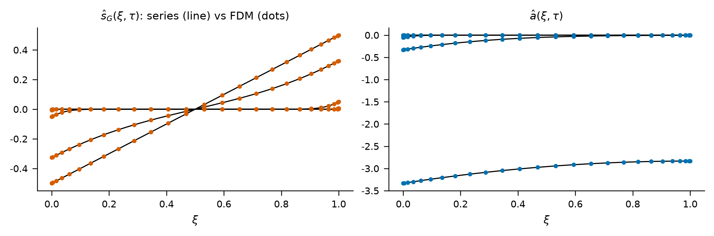
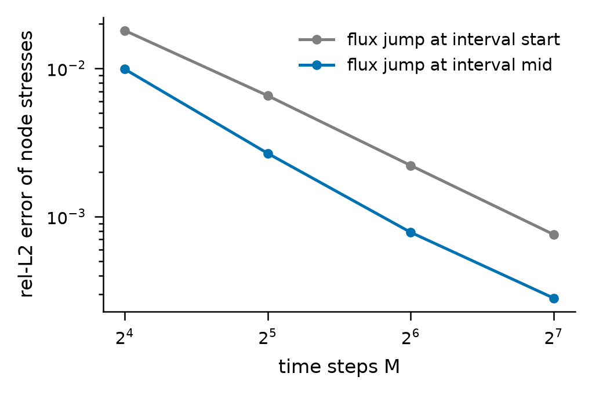
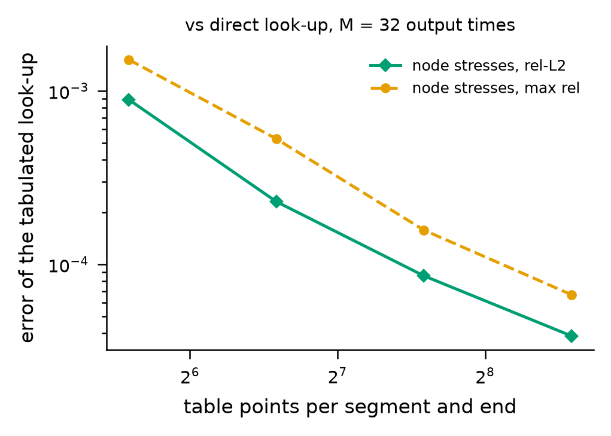

# 实验 E0：参考求解器与结点闭合的正确性验证

本章说明 `reference_results/base3/e0/` 里的全部内容。数字由脚本从结果文件取出，核对清单是 `docs/checks/results_01.jsonl`，在仓库根目录运行 `python3 tools/verify_docs.py docs/checks/results_01.jsonl` 可以重新核对。实验总表见 [00_总览.md](00_总览.md)。

## 1. 这个实验回答什么问题

StackEM 的所有结论都相对一个有限体积参考求解器来度量。参考求解器若有错，后面每个实验的“真值”都不可信。E0 在进入正式实验之前回答四个问题。

1. 单段求解器算出的核函数与闭式级数解是否一致。
2. 多段互连树的装配是否守恒，装配顺序是否影响结果。
3. 结点闭合在使用精确核函数时，是否随输出时间点数 M 收敛到整树有限体积解。
4. 查表插值会引入多大误差，HotSpot 热模型对功耗是否线性。

先解释本章用到的术语。

- 电迁移：电流推动铜原子沿导线迁移。原子流失的一端受拉，原子堆积的一端受压。
- Korhonen 方程：描述导线里静水应力 $\sigma(x,t)$ 随时间演化的扩散方程。
- 成核时间 t_nuc：导线上最大拉应力第一次达到临界应力 $\sigma_{crit}$ 的时刻，此时空洞开始形成。本项目把它当作失效时刻。
- 段、轨、结点：段是两个相邻通孔之间的一截导线；轨是若干段首尾相接组成的一条电源带；结点是相邻两段共用的端点。
- 核函数：单段无量纲问题的三个基本解。$s_G$ 是电迁移驱动下的应力响应，$s_M$ 是热迁移驱动下的应力响应，$a$ 是一端注入单位原子通量时的应力响应。方程是线性的，任何一段的应力都能写成这三个核函数的叠加。
- 结点闭合，代码里叫 JCX：把一条多段轨拆成各段核函数的叠加，再用结点处应力连续和原子通量守恒两个条件解出每个结点的通量历史。
- rel-L2：相对二范数误差，即预测与真值之差的二范数除以真值的二范数。
- HotSpot：开源的芯片热仿真器，本项目用它计算堆叠里每层芯片的温度场。

## 2. 原理与做法

### 2.1 参考求解器

求解器在 `stackem/korhonen_fdm.py`。每一段上求解

$$\frac{\partial \sigma}{\partial t} = \frac{\partial}{\partial x}\Big[\kappa(x)\Big(\frac{\partial \sigma}{\partial x} - G - M(x)\Big)\Big]$$

其中 $\kappa = D_a B \Omega/(k_B T)$ 是应力扩散系数，$G$ 是电迁移驱动项，与电流密度成正比，$M$ 是热迁移驱动项，与温度梯度成正比。离散方式如下。

1. 空间上用顶点中心的有限体积，网格在两端加密，函数 `chebyshev_mesh`。早期的应力变化集中在端点附近很薄的一层里，所以两端需要更密的网格。
2. 时间上前 4 步用隐式欧拉，之后用 Crank-Nicolson。这种启动方式用来抑制初始间断引起的振荡。内部步长按 1.10 倍几何增长，并保证恰好落在每个输出时刻上。
3. 单段无量纲问题由 `solve_segment_hat` 求解，无量纲坐标 $\xi = x/L$，无量纲时间 $\tau = \bar\kappa t/L^2$。
4. 多段树由类 `TreeFDM` 求解。直链用带状矩阵，一般的树用稀疏 LU 分解。
5. 成核时间在相邻两个输出时刻之间按 $\sqrt{t}$ 线性插值得到。

### 2.2 八项检查

`stackem/experiments/e0_validate.py` 依次做下面的检查，结果写进 `e0_validation.json`。“断言”表示不达标时脚本报错停止，“只记录”表示只把数写进文件。

| 序号 | 检查内容 | 做法 | 阈值 |
|---|---|---|---|
| 0 | 物理常数自检 | `constants.verify_constants`，检查原子体积、扩散系数等落在合理区间 | 断言，见 `stackem/constants.py` |
| 1 | 核函数对级数解 | 均匀 $\kappa$，200 个单元，64 个 $\tau$ 点覆盖 1e-6 到 3，与 `stackem/analytic.py` 的闭式级数比较最大绝对误差 | 断言，两个核都小于 1e-4 |
| 2 | 早期半无限极限 | 在 $\tau = 10^{-6}$ 处把端点值与 $2\sqrt{\tau/\pi}$ 比较 | 只记录 |
| 3 | 质量守恒 | 6 段两端封闭的测试轨，每段 120 个单元，比较首末时刻应力的体积积分 | 断言，相对漂移小于 1e-9 |
| 4 | 两种装配方式 | 同一条测试轨把各段按乱序加入，迫使求解器走稀疏 LU 分支，再比较同一段的应力剖面 | 断言，相对差小于 1e-9 |
| 5 | 闭合收敛 | 用精确核函数做结点闭合，M 取 16、32、64、128，与同一时间网格上的整树解比较结点应力 | 断言，M=64 且跳变放在区间中点时 rel-L2 小于 5e-3 |
| 6 | 最大值原理 | 全部网格点上的最大应力减去结点上的最大应力 | 只记录 |
| 7 | 查表误差 | 表点数取 48、96、192、384，与直接求值的闭合结果比较 | 只记录 |
| 8 | HotSpot 线性 | 每个功耗块单独加 1 W 运行 HotSpot，按实际功耗叠加后与直接仿真比较 | 断言，最大误差小于 0.3 K |

检查 3 到 7 用同一条手工构造的 6 段测试轨，参数直接写在脚本里：段长 100、150、80、120、100、90 微米，电流密度依次为 1.2、0.6、-0.3、-0.9、0.4、1.0 MA/cm²，结点温度从 340 K 升到 358 K 再回到 357 K，各段焦耳温升幅值 0.1 到 2.0 K。它与任何算例配置无关，所以 E0 只在 base3 上运行一次，quad4 和 dense3 没有各自的 E0 目录。

### 2.3 通量跳变放在哪里

结点闭合把每个结点的通量历史近似成分段常数，每个输出区间一个值。跳变可以放在区间起点，也可以放在区间中点，配置项是 `closure.jump_at`，取 `start` 或 `mid`。放在中点相当于中点求积，精度更高。E0 两种都测，正式实验一律用 `mid`。

### 2.4 查表是什么

闭合需要每一段的 $a$ 核在全部 $M(M+1)/2$ 个时间差上的端点值，直接调用网络的次数随 $M^2$ 增长。查表的做法在 `stackem/closure_tab.py`：每段每个端点只在 n_tab 个对数等距的 $\tau$ 点上求值，把结果除以 $\sqrt\tau$ 后对 $\log\tau$ 线性插值。结果文件里有两个计数：

- `kernel_evals` 是查表方式实际求值的点数，等于 6 乘段数乘 n_tab。
- `kernel_points` 是直接方式需要的点数，等于 4 乘段数乘 $M(M+1)/2$ 再加 2 乘段数乘 M。

### 2.5 单元测试

`stackem/tests/test_core.py` 是更快的一层验证，不需要 HotSpot 和 PyTorch，共 22 个测试，覆盖常数自检、核函数对级数解、质量守恒、闭合对整树解、查表对直接求值、电源网格的基尔霍夫电流定律、定线宽的二分法、配置文件与默认配置一致等。它对应 `run_all.sh` 的 `tests` 步骤。

## 3. 怎么运行

`scripts/run_all.sh` 里与本章有关的两个步骤是 `tests` 和 `e0`。只跑这两步：

```bash
source ~/stackem_work/venv/bin/activate
cd <仓库根目录>
STACKEM_ONLY=tests,e0 bash scripts/run_all.sh
```

脚本实际执行的命令是

```bash
python -m unittest stackem.tests.test_core
python -m stackem.experiments.e0_validate --config configs/base3.json \
    --root ~/stackem_work/outputs --hotspot ~/stackem_work/HotSpot
```

`--config` 指定算例配置，`--root` 指定输出根目录，`--hotspot` 指定 HotSpot 可执行文件所在目录。E0 不需要网络权重，也不依赖其他实验的结果。屏幕最后一行出现 `E0 PASSED` 表示全部断言通过。若某项断言失败，Python 会打印 `AssertionError` 和对应的数值，此时先确认 HotSpot 已按环境说明编译，再重跑。

参考机器上的耗时取自 `reference_results/logs/final_3_full.log` 里相邻两个步骤标题的时间戳。

| 步骤 | 日志中的标题 | 耗时 |
|---|---|---|
| `tests` | `unit tests` | 1.334 秒，日志显示 21 个测试 |
| `e0` | `E0 solver + tabulation` | 39 秒 |

日志里的测试数比现在少一个，因为本仓库的测试文件多了一个核对配置文件的测试。E0 的几十秒主要花在 HotSpot 线性检查上，它要做 48 次单位功耗仿真，对应 3 层芯片各 16 个功耗块。闭合和查表两部分在结果文件里记录的耗时合计不到 2 秒。

## 4. 输出文件

`reference_results/base3/e0/` 共 14 个文件。

| 文件 | 内容 |
|---|---|
| `e0_validation.json` | 全部检查结果，各字段见第 5 节 |
| `config_used.json` | 这次运行实际使用的完整配置 |
| `e0_kernels_vs_series.png`、`.pdf` | 核函数与级数解的对比图 |
| `e0_closure_convergence.png`、`.pdf` | 闭合误差随 M 的收敛图 |
| `e0_tabulation.png`、`.pdf` | 查表误差随表点数的变化图 |
| `e0_kernels_vs_series_data.json`、`.npz` | 第一张图里每条曲线的坐标。json 说明每条曲线的含义，npz 存数组 |
| `e0_closure_convergence_data.json`、`.npz` | 第二张图的曲线坐标 |
| `e0_tabulation_data.json`、`.npz` | 第三张图的曲线坐标 |

自己运行时目录里还会多出一个 `hotspot_lin/` 子目录，里面是 HotSpot 线性检查的输入输出草稿，参考结果里没有收录。`config_used.json` 和 `_meta.cmd` 里记录的 HotSpot 路径是参考运行当时的目录，与现在脚本默认的 `~/stackem_work/HotSpot` 写法不同，内容是同一个程序。

## 5. 结果

### 5.1 物理常数

`constants` 字段是常数自检顺带算出的几个派生量。

| 字段 | 含义 | 值 |
|---|---|---|
| `kappa_353K_m2_per_s` | 353 K 下的应力扩散系数 | 9.58e-18 m²/s |
| `blech_jL_crit_353K_A_per_cm` | 353 K 下单段封闭导线的 Blech 临界乘积。电流密度乘段长低于它的导线永不成核 | 1295 A/cm |
| `sigma_T_353K_MPa` | 353 K 下的热残余应力，也就是导线的初始应力 | 236.5 MPa |
| `Gamma_um` | 键合堆叠里导线的热特征长度，焦耳热沿导线衰减的尺度 | 6.92 µm |
| `T_m_at_1e10_K` | 电流密度 1 MA/cm² 时的焦耳温升幅值 | 0.36 K |
| `G_at_1e10_Pa_per_m` | 同一电流密度下的电迁移驱动梯度 | 4.07e13 Pa/m |
| `dsigmaT_dT_MPa_per_K` | 残余应力对温度的导数。负号表示升温使初始拉应力减小 | -1.39 MPa/K |

### 5.2 检查 1 到 6 的标量结果

| 字段 | 含义 | 值 | 阈值 |
|---|---|---|---|
| `kernel_vs_series.sG_max_abs_err` | $s_G$ 对级数解的最大绝对误差 | 1.98e-5 | 1e-4 |
| `kernel_vs_series.a_max_abs_err` | $a$ 对级数解的最大绝对误差 | 1.63e-5 | 1e-4 |
| `kernel_vs_series.sG_end_semi_inf_rel` | $\tau=10^{-6}$ 时 $s_G$ 端点值对半无限解的相对差 | 1.36 % | 无 |
| `kernel_vs_series.a_end_semi_inf_rel` | 同上，$a$ 核 | 1.36 % | 无 |
| `mass_drift_rel` | 应力体积积分的相对漂移 | 7.88e-13 | 1e-9 |
| `chain_vs_general_rel` | 两种装配方式的相对差 | 7.92e-14 | 1e-9 |
| `max_principle_gap_MPa` | 全部网格点最大应力减结点最大应力 | 0.0 MPa | 无 |

前两行远低于阈值，说明 200 个单元的网格足以复现级数解。第三、四行约 1.4 %，是求解器在最早时刻的离散误差，核数据集的 $\tau$ 下界也取在 $10^{-6}$。质量漂移和装配差都在浮点舍入的量级。最大值原理间隙为 0，表示这条测试轨上应力最大值始终出现在结点上，闭合只在段的两端求值，这一项是它的依据。

### 5.3 核函数对级数解的图



左图是 $s_G$，右图是 $a$，横轴都是无量纲位置 $\xi$。黑线是闭式级数解，圆点是有限体积解，每隔 8 个节点画一个点。每张图有 5 条曲线，对应 64 个 $\tau$ 点里的第 0、16、32、48、63 个，从最早到最晚。

1. 左图里早期曲线贴着零线，只在两端有很薄的边界层；最晚的一条趋于稳态直线，右端 0.5，左端 -0.5。
2. 右图里早期曲线只在左端有小的负值；最晚的一条整体下移到 -3 附近，因为左端持续有单位通量流出，平均应力随 $\tau$ 线性下降。
3. 圆点都落在黑线上，肉眼看不出偏差，与上表 1e-5 量级的误差相符。圆点在两端更密，这是端点加密网格的样子。

### 5.4 闭合收敛

`closure_convergence` 字段。`rel_L2` 是结点应力的相对二范数误差，`max_rel` 是最大绝对误差除以真值的最大绝对值，`t_nuc_rel_err` 是成核时间的相对误差，`seconds` 是这一次闭合的耗时。

| M | 起点 rel_L2 | 起点 max_rel | 起点 t_nuc 误差 % | 起点 秒 | 中点 rel_L2 | 中点 max_rel | 中点 t_nuc 误差 % | 中点 秒 |
|---|---|---|---|---|---|---|---|---|
| 16 | 1.80e-2 | 2.65e-2 | 0.0765 | 0.398 | 9.88e-3 | 1.48e-2 | 0.0765 | 0.008 |
| 32 | 6.54e-3 | 1.16e-2 | 0.0822 | 0.025 | 2.67e-3 | 4.78e-3 | 0.0822 | 0.025 |
| 64 | 2.21e-3 | 4.01e-3 | 0.0820 | 0.105 | 7.82e-4 | 1.46e-3 | 0.0820 | 0.088 |
| 128 | 7.56e-4 | 1.34e-3 | 0.0819 | 0.370 | 2.81e-4 | 4.94e-4 | 0.0819 | 0.332 |



横轴是输出时间点数 M，以 2 为底的对数刻度；纵轴是结点应力的 rel-L2 误差，对数刻度。灰线是跳变放在区间起点，蓝线是放在区间中点。两条线都近似直线下降，说明误差随 M 按幂律收敛。蓝线始终在灰线下方。

从表里可以算出几个关系。M 从 32 加倍到 64 时，中点模式的误差缩小到原来的 2 的 -1.77 次方，起点模式是 2 的 -1.56 次方。中点模式从 M=16 到 M=128 误差缩小 35.1 倍。正式实验的学生引擎用 M=32，教师引擎用 M=64。

起点模式 M=16 那一格的耗时明显大于其他格，因为它是第一次调用，要先为 6 段各算一次精确核函数并缓存。

### 5.5 查表误差

`tabulation_error` 字段。这项检查用的 M 取自配置的 `times.n`，base3 是 32。误差的参照是同一 M 下直接求值的闭合结果，所以这里量到的只是插值误差。

| n_tab | rel_L2 | max_rel | t_nuc 相对误差 | kernel_evals | kernel_points | 耗时 毫秒 |
|---|---|---|---|---|---|---|
| 48 | 8.92e-4 | 1.52e-3 | 1.76e-5 | 1728 | 13056 | 6.1 |
| 96 | 2.30e-4 | 5.29e-4 | 4.94e-6 | 3456 | 13056 | 8.6 |
| 192 | 8.58e-5 | 1.57e-4 | 7.20e-5 | 6912 | 13056 | 14.4 |
| 384 | 3.86e-5 | 6.68e-5 | 4.80e-5 | 13824 | 13056 | 25.2 |



横轴是每段每个端点的表点数，纵轴是相对于直接求值的误差，都是对数刻度。绿色实线是结点应力的 rel-L2，橙色虚线是最大相对误差。两条线随表点数增加单调下降。正式采用的 192 点处 rel-L2 比 M=32 的闭合离散误差小一个量级以上，后者见 5.4 节表中中点模式 M=32 一行。

### 5.6 HotSpot 线性与温度摘要

`hotspot_linearity_max_K` 是每层芯片上叠加结果与直接仿真结果的最大温差。`hotspot_summary` 是键合堆叠状态下每层芯片的最低、最高和平均温度。

| 芯片 | 线性误差 K | 最低温度 K | 最高温度 K | 平均温度 K |
|---|---|---|---|---|
| D1 | 0.066 | 342.31 | 359.36 | 344.90 |
| D2 | 0.073 | 342.23 | 359.56 | 344.83 |
| D3 | 0.071 | 341.98 | 359.87 | 344.59 |

线性误差都低于 0.3 K 的阈值。HotSpot 输出的温度只保留两位小数，这个量级的误差里有一部分来自 48 项叠加时舍入的累积。三层芯片的平均温度都在 345 K 左右，这是后面“单独通过签核的芯片键合后被邻居加热”这一结论的起点，见 [05_物理分解与排序_E3_E7.md](05_物理分解与排序_E3_E7.md)。

## 6. 怎么理解

1. 参考求解器可信。核函数对闭式解的误差是 1e-5 量级，守恒和装配一致性达到舍入精度。
2. 结点闭合本身是收敛的。用精确核函数时，结点应力的误差随 M 增大按幂律下降，中点模式在 M=32 时是 0.27 %，M=64 时是 0.078 %。后面实验里代理解的误差主要来自网络对核函数的拟合，闭合的时间离散只占很小一部分。
3. 192 点查表的插值误差是 8.58e-5，远小于闭合离散误差，可以放心用它换速度。M=32 时它的求值点数约为直接方式的一半；M 越大节省越多，因为直接方式的点数随 $M^2$ 增长，查表的点数与 M 无关。
4. HotSpot 对功耗是线性的。E5 的功耗灵敏度和功耗再分配都建立在这个线性叠加上。

## 7. 论文用了哪些，哪些是论文之外的

| 论文中的说法 | 本目录的值 |
|---|---|
| 参考求解器对闭式级数验证到 2×10⁻⁵ | 5.2 节表前两行 |
| 质量守恒相对漂移 6×10⁻¹³ | 结果文件的值是 7.88e-13，量级相同，数字不同 |
| M=32 时成核时间代价 0.08 % | 5.4 节表，0.082 % |
| 消融表里 M 为 16、32、64、128 的 t_nuc 误差 | 5.4 节表的 t_nuc 误差列 |
| 消融表里 48、96、192 点查表的 rel-L2 | 5.5 节表前三行 |
| 键合导线的热特征长度约 7 µm，焦耳温升低于 1 K | 5.1 节表 |
| 残余应力随温度以 -1.4 MPa/K 变化 | 5.1 节表 |

论文没有用到的内容：三张图，HotSpot 线性误差，半无限端点检查，最大值原理间隙，起点模式的收敛数据，结点应力 rel-L2 随 M 的收敛，384 点查表，核函数求值计数。

## 8. 注意事项

1. 成核时间误差一列不随 M 收敛。四个 M 下它都在 0.0765 % 到 0.0822 % 之间，而且起点模式与中点模式的值完全相同，两者之差的最大值是 0.0。合理的解释是这条测试轨的首次成核发生在封闭端点，发生得足够早，相邻结点的通量还没有影响到它，所以这一列量到的是越界时刻插值规则的误差。它不能当作闭合对成核时间收敛的证据，论文消融表里 M 那一行的四个 0.08 % 也应这样理解。
2. 这里的真值成核时间取自与闭合相同的 M 个输出时刻上的插值，双方共用同一种插值规则。正式实验的真值用更细的内部时间历史。
3. 查表的成核时间误差不随表点数单调下降，192 点时比 96 点时大。384 点时 `kernel_evals` 已经超过 `kernel_points`，在 M=32 下把表加密到 384 点并不省计算。
4. 检查 2 和检查 6 没有断言。实测值没有问题，但它们变差时脚本不会报错。
5. 检查 3 到 7 只在一条 6 段测试轨上进行，段数、段长和温差范围都小于真实电源轨。真实轨上的精度由 E2 检验，见 [04_逐轨精度_E2.md](04_逐轨精度_E2.md)。
6. 查表误差在这里只用精确核函数度量。网络核函数经过查表后的误差在 E1 里度量，见 [02_核数据集与网络训练_E1.md](02_核数据集与网络训练_E1.md)。
7. 论文写的质量漂移 6×10⁻¹³ 与本目录的 7.88e-13 不一致。另外这个量测的是参考求解器的应力积分漂移，并没有单独测闭合输出的守恒性。
