# 实验 E1：核数据集、教师与学生网络的训练、核函数精度

本章覆盖从生成训练数据到评估网络精度的整条链，对应这些目录：

- `reference_results/base3/kernels/`，核数据集的说明文件
- `reference_results/base3/skn/`，教师网络的训练记录
- `reference_results/base3/skn_distill/`，学生网络的蒸馏记录
- `reference_results/ablation_pde/skn_pde/`，带方程残差的消融网络的训练记录
- `reference_results/base3/e1/`、`reference_results/base3_teacher/e1/`、`reference_results/ablation_pde/e1/`，三个网络的核函数精度
- `weights/`，三个网络的权重

核对清单是 `docs/checks/results_02.jsonl`。图里的文字标注，例如图标题里的剖面温度，是照图转写的，不在核对清单里。

## 1. 这个实验回答什么问题

1. 用一个神经网络代替单段有限体积求解器给出三个核函数，在没见过的温度剖面上误差有多大。
2. 把 34 万参数的教师网络压缩成 5.5 万参数的学生网络，核函数误差放大多少。
3. 训练范围之外的剖面上网络还能不能用。
4. 在训练损失里加入 Korhonen 方程的残差有没有帮助。

术语：

- SKN，Segment Kernel Network：输入一段导线的温度剖面描述符和无量纲坐标，输出三个核函数值的多层感知机。三个核函数 $s_G$、$s_M$、$a$ 的含义见 [01_求解器验证_E0.md](01_求解器验证_E0.md)。
- 教师与学生：教师是大网络，直接拟合求解器数据。学生是小网络，训练时既看求解器数据，也看教师给出的标签，这种做法叫知识蒸馏。正式实验的引擎用学生。
- 验证集：与训练集同分布但没有参与训练的剖面。分布外集，下文写作 OOD 集：温度范围故意取在训练范围之外的剖面。
- epoch：把全部训练数据过一遍叫一个 epoch。
- 方程残差损失：把网络输出代入偏微分方程，要求方程两边之差尽量小。这是物理信息神经网络的常规做法。
- p90：90 % 分位数，即 90 % 的样本不超过它。

## 2. 原理与做法

### 2.1 四个描述符

一段导线的温度剖面由两端通孔温度 $T_L$、$T_R$ 决定，段内线性变化，再叠加焦耳自热的鼓包

$$T(x) = T_{sub}(x) + T_m\Big[1 - \frac{\cosh((x-L/2)/\Gamma)}{\cosh(L/(2\Gamma))}\Big]$$

$T_m$ 是焦耳温升幅值，$\Gamma$ 是热特征长度。核函数只通过四个无量纲量依赖剖面，代码在 `stackem/thermal_profile.py`。

| 描述符 | 定义 | 含义 |
|---|---|---|
| $\theta$ | $k_B \bar T / E_a$ | 平均温度 |
| $r$ | $\ln[\kappa(T_R)/\kappa(T_L)]$ | 两端扩散系数的不对称程度 |
| $\rho_J$ | $\ln[\kappa(\bar T + T_m)/\kappa(\bar T)]$ | 焦耳鼓包的强度 |
| $\lambda$ | $L/\Gamma$ | 段长与热特征长度之比，决定鼓包的形状 |

这里 $\bar T = (T_L+T_R)/2$，无量纲时间 $\tau = \bar\kappa t / L^2$。

### 2.2 数据集怎么生成

`stackem/experiments/gen_kernels.py` 调用 `stackem/kernel_dataset.py`。每个训练剖面做四步。

1. 随机抽一个剖面：$\bar T$、两端温差、$\log_{10}\lambda$ 各自均匀抽样；以一定概率令 $T_m = 0$，否则 $T_m$ 均匀抽样。
2. 用参考求解器在完整的 $(\xi,\tau)$ 网格上算出三张核函数曲面。
3. 从曲面上随机取若干点作为训练行，其中一部分强制取在 $\xi=0$ 和 $\xi=1$ 两端。结点闭合只在端点求值，所以端点要多采。
4. 目标值除以 $\sqrt\tau$ 后存储。早期核函数按 $\sqrt\tau$ 增长，不做这个缩放的话，早期很小的绝对误差会变成很大的相对误差，闭合会不稳定。

输入特征是 6 维 `[xi, log10_tau, theta, r, rho_J, lam]`，输出是 3 维。验证集和 OOD 集各是 400 个和 100 个剖面的完整曲面，每张 48 个 $\tau$ 点，随机种子与训练集不同。

### 2.3 网络结构与训练

网络在 `stackem/skn_model.py`：6 个输入先标准化；对 $\xi$ 和 $\log_{10}\tau$ 做随机傅里叶特征，即乘以一个固定的随机矩阵后取正弦和余弦；与 6 个输入拼接后送入若干层全连接加 SiLU 激活；输出 3 个值。训练在 `stackem/train_skn.py`：

1. 按剖面划分训练集和验证集，同一剖面的所有点进同一边，验证比例 5 %。
2. 优化器 AdamW，学习率先线性预热再余弦衰减。
3. 损失是标准化后的均方误差。`--w-pde` 大于 0 时再加方程残差项。
4. 每个 epoch 结束在验证集上算三个目标的 rel-L2，取最差的那个作为选模指标，变好就保存 `skn_best.npz`。

带残差的消融训练里，残差用自动微分求出，乘以 $\tau$ 加权，并除以第一个 batch 的残差值做归一化。`--w-pde 0.05` 的意思是残差项的初始大小相当于数据项的 5 %。

### 2.4 蒸馏

`stackem/train_distill.py` 的做法：

1. 读入同一份训练数据，按同样的种子划分，所以学生与教师的验证集相同。
2. 生成教师标注的合成点：描述符取自训练行，$\log_{10}\tau$ 在训练范围内重新抽，$\xi$ 以 `end_fraction` 的概率取 0 或 1。用教师给这些点打标签。
3. 把求解器数据行和合成行合在一起训练学生。
4. 验证始终对照求解器数据。

### 2.5 E1 怎么评估

`stackem/experiments/e1_skn_eval.py` 对验证集或 OOD 集的每个剖面，在完整的 $(\xi,\tau)$ 网格上比较网络与求解器，比较的是没有除以 $\sqrt\tau$ 的核函数。每个剖面、每个核函数得到两个数：

- `rel_l2`：整张曲面的相对二范数误差。
- `end_max_rel`：两个端点上、所有 $\tau$ 上的最大相对误差。

再对所有剖面汇总成四个字段：`rel_l2_median`、`rel_l2_p90`、`rel_l2_max`、`end_max_rel_median`。

学生引擎的配置 `configs/base3.json` 下，脚本评估三个“核函数提供者”：

- `distilled SKN`：学生网络直接求值。
- `distilled SKN, tabulated (192 pts)`：学生网络外面包一层 192 点查表。这是正式实验实际使用的方式，脚本把它标为 `main_provider`，结果文件顶层的 `val` 和 `ood` 就是它。
- `full SKN`：教师网络直接求值。

教师引擎的配置 `configs/base3_teacher.json` 下只有一个提供者，标签 `SKN`。消融网络用同一个配置加 `--weights` 指向消融权重。

## 3. 怎么运行

`run_all.sh` 里与本章有关的步骤：

| 步骤 | 实际命令 | 输出 |
|---|---|---|
| `kernels` | `python -m stackem.experiments.gen_kernels --config configs/base3.json --root <根> --hotspot <HotSpot> --n-profiles 120000` | `base3/kernels/` |
| `kernels_val` | 同上加 `--val-only`，只在两个留出集不存在时运行 | `base3/kernels/` |
| `train_teacher` | `python -m stackem.experiments.train_or_fallback --config configs/base3.json --root <根> --hotspot <HotSpot> --epochs 300 --w-pde 0` | `base3/skn/` |
| `distill` | `python -m stackem.train_distill --data <根>/base3/kernels/kernels_train.npz --teacher <根>/base3/skn/skn_best.npz --out <根>/base3/skn_distill` | `base3/skn_distill/` |
| `e1` | `python -m stackem.experiments.e1_skn_eval --config configs/base3.json --root <根> --hotspot <HotSpot>` | `base3/e1/` |
| `teacher.e1` | 同上，配置换成 `configs/base3_teacher.json` | `base3_teacher/e1/` |
| `ablation.train` | `python -m stackem.experiments.train_or_fallback --config configs/base3_teacher.json --out-name ablation_pde --root <根> --hotspot <HotSpot> --epochs 300 --w-pde 0.05 --out-subdir skn_pde` | `ablation_pde/skn_pde/` |
| `ablation.e1` | `python -m stackem.experiments.e1_skn_eval --config configs/base3_teacher.json --out-name ablation_pde --root <根> --hotspot <HotSpot> --weights <根>/ablation_pde/skn_pde/skn_best.npz` | `ablation_pde/e1/` |

`<根>` 默认是 `~/stackem_work/outputs`，`<HotSpot>` 默认是 `~/stackem_work/HotSpot`。蒸馏命令不带网络大小的参数，脚本的默认值就是最终设置：4 层每层 128 个单元，150 个 epoch。

两种用法：

```bash
# 从零开始：生成数据，训练三个网络，再评估
STACKEM_ONLY=kernels,train_teacher,distill,e1,teacher.e1,ablation.train,ablation.e1 bash scripts/run_all.sh

# 用仓库里的权重：不生成训练集，不训练，只重新生成两个留出集后评估
STACKEM_ONLY=kernels_val,e1,teacher.e1,ablation.e1 bash scripts/run_with_released_weights.sh
```

训练需要 PyTorch 和 GPU。训练时屏幕每个 epoch 打印一行，形如 `epoch  299 lr 1.00e-05 mse 1.961e-06 pde 0.000e+00 val rel-L2 [sG 1.07e-03 sM 1.82e-03 a 6.34e-04] 1345s`，最后一个数是累计秒数。看到 `done. best val worst-target rel-L2 ...` 表示训练结束。若报显存不足，先确认没有别的程序占用同一块显卡。

参考机器上的耗时：

| 步骤 | 耗时 | 来源 |
|---|---|---|
| `kernels`，12 万个剖面 | 222 秒 | `logs/kernels_and_teacher_training.log` 里脚本自报的时间 |
| `train_teacher`，300 个 epoch | 1344.6 秒，即 22.4 分钟 | `base3/skn/train_log.csv` 末行的 `seconds` 列 |
| `distill`，150 个 epoch | 331.6 秒，即 5.5 分钟 | `base3/skn_distill/train_log.csv` 末行 |
| `ablation.train`，300 个 epoch | 11080 秒，即 184.7 分钟 | `ablation_pde/skn_pde/train_log.csv` 末行 |
| `e1`，三个提供者 | 344 秒 | `logs/final_3_full.log` 的步骤时间戳 |
| `teacher.e1`，一个提供者 | 125 秒 | `logs/final_1_full.log` |
| `ablation.e1` 与 `ablation.e2` 合计 | 920 秒，即 15.3 分钟 | `logs/final_2_extras.log`，日志里这两步写在同一个标题下 |

带残差的训练耗时是纯数据训练的 8.2 倍，因为每个 batch 要做二阶自动微分。

## 4. 输出文件

### 4.1 `reference_results/base3/kernels/`

| 文件 | 内容 |
|---|---|
| `dataset_info.json` | 剖面数、抽样范围 `ranges`、OOD 范围 `ood_ranges`、电迁移参数 `em` |
| `config_used.json` | 生成时的完整配置 |

自己运行后这个目录里还有三个数组文件：`kernels_train.npz` 是训练行，`kernels_val_full.npz` 是 400 个验证剖面的完整曲面，`kernels_ood_full.npz` 是 100 个 OOD 剖面的完整曲面。它们体积大，不放在仓库里。`weights/weights_info.json` 的 `kernel_dataset.arrays` 字段写明它们随发布文件 `stackem_kernels_dataset.tar` 提供。

### 4.2 `reference_results/base3/skn/` 与 `reference_results/ablation_pde/skn_pde/`

| 文件 | 内容 |
|---|---|
| `train_summary.json` | 最佳指标、最佳 epoch、参数量、训练行数、全部命令行参数 `args` |
| `train_log.csv` | 每个 epoch 一行：`epoch, lr, train_mse, train_pde, val_rel_l2_sG, val_rel_l2_sM, val_rel_l2_a, seconds` |
| `train_curves.png` | 训练曲线 |

### 4.3 `reference_results/base3/skn_distill/`

| 文件 | 内容 |
|---|---|
| `distill_summary.json` | `student` 和 `teacher` 两组指标，`compression` 是参数量之比，`rows` 是三类数据的行数，`args` 是全部参数 |
| `train_log.csv` | 每个 epoch 一行，比教师日志多三列端点 rel-L2 |
| `distill_curves.png`、`.pdf` | 蒸馏曲线 |

### 4.4 `weights/`

| 文件 | 内容 |
|---|---|
| `skn_teacher.npz` | 教师，6 层每层 256 个单元，纯数据损失 |
| `skn_student.npz` | 学生，4 层每层 128 个单元，正式实验的引擎 |
| `skn_teacher_pde.npz` | 带方程残差训练的教师结构网络，只用于消融 |
| `weights_info.json` | 三个网络的结构、训练设置、指标和 sha256 |
| `SHA256SUMS` | 三个权重文件的校验值 |

`reference_results/` 里的全部结果就是用这三个权重算出来的。

### 4.5 三个 `e1/` 目录

每个目录 26 个文件：`e1_summary.json`、`config_used.json`，以及六张图各自的 png、pdf、`_data.json`、`_data.npz`。

| 图 | 内容 |
|---|---|
| `e1_error_by_tau_val`、`e1_error_by_tau_ood` | 按 $\tau$ 的每个十倍程统计的平均 rel-L2 |
| `e1_kernel_cuts_val`、`e1_kernel_cuts_ood` | 前三个剖面在两个端点上的核函数随 $\tau$ 的曲线 |
| `e1_kernels_profile_val`、`e1_kernels_profile_ood` | 第一个剖面的三张曲面：求解器、网络、两者之差 |

## 5. 结果

### 5.1 核数据集

| 量 | 训练与验证范围 | OOD 范围 |
|---|---|---|
| `T_bar`，段平均温度 K | 300 到 450 | 450 到 480 |
| `dT`，两端温差 K | -12 到 12 | -20 到 20 |
| `T_m`，焦耳温升幅值 K | 0 到 40 | 40 到 60 |
| `log10_lam` | -0.5 到 2.1 | 与训练相同 |
| `log10_tau` | -6 到 1 | 与训练相同 |

其余字段：`n_profiles` 为 120000，令 $T_m$ 为 0 的概率 `p_zero_Tm` 为 0.3，求解器单元数 `n_cells` 为 200，曲面的 $\tau$ 点数 `n_tau_grid` 为 96，每个剖面取 `points_per_profile` 128 个点，其中端点 `n_end_points` 32 个。训练文件的行数是剖面数乘每剖面点数，即 15360000 行。按 5 % 划分后训练 14592000 行，验证 768000 行。数据集使用的激活能是 0.86 eV，换一个激活能需要重新生成数据和重新训练。

OOD 集只把温度相关的三个量推到训练范围之外，$\lambda$ 和 $\tau$ 的范围不变。

### 5.2 三个网络的训练摘要

| 网络 | 参数量 | 傅里叶频率数 | epoch 数 | batch | `w_pde` | 最佳 epoch | 最差目标的验证 rel-L2 | torch 与 numpy 前向最大差 |
|---|---|---|---|---|---|---|---|---|
| 教师 | 343811 | 24 | 300 | 8192 | 0.00 | 295 | 1.82e-3 | 1.94e-5 |
| 消融，带残差 | 343811 | 24 | 300 | 8192 | 0.05 | 299 | 2.94e-3 | 2.04e-5 |

最佳 epoch 从 0 计数。两个网络结构相同，都是 6 层每层 256 个单元。最差目标都是 $s_M$。最后一列是同一组权重在 PyTorch 和 numpy 两种实现下输出的最大差，属于单精度舍入量级，说明后面实验用 numpy 推理与训练时的网络是同一个函数。

训练日志首尾两行：

| 网络 | 行 | `train_mse` | `train_pde` | 验证 rel-L2 $s_G$ | 验证 rel-L2 $s_M$ | 验证 rel-L2 $a$ |
|---|---|---|---|---|---|---|
| 教师 | 首个 epoch | 3.11e-1 | 0 | 1.87e-1 | 4.02e-1 | 7.35e-2 |
| 教师 | 末个 epoch | 1.96e-6 | 0 | 1.07e-3 | 1.82e-3 | 6.34e-4 |
| 消融，带残差 | 首个 epoch | 6.23e-1 | 9.94e-1 | 4.46e-1 | 7.68e-1 | 3.60e-1 |
| 消融，带残差 | 末个 epoch | 4.28e-6 | 1.10e-4 | 1.13e-3 | 2.94e-3 | 6.85e-4 |

这里的 rel-L2 是在除以 $\sqrt\tau$ 后的目标上、对验证集全部行合并计算的。它与 E1 里“每张未缩放曲面一个 rel-L2 再取中位数”是两个不同的量，数值不能直接比较。`train_pde` 是相对于第一个 batch 残差的比例，教师没有残差项所以是 0。

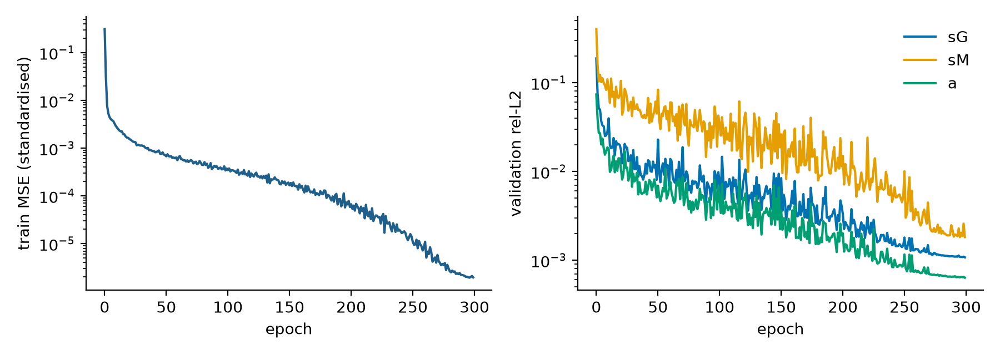

教师的训练曲线。左图是标准化训练均方误差随 epoch 的变化，纵轴对数刻度。曲线第一个 epoch 急降，之后大致沿直线下降，约 200 个 epoch 以后随着学习率衰减到底而加速下降，最后变平。右图是三个目标的验证 rel-L2：蓝线 $s_G$，橙线 $s_M$，绿线 $a$。三条线前 250 个 epoch 抖动很大，学习率降下来以后才平稳。$s_M$ 始终最高，$a$ 最低，这个次序贯穿后面所有结果。

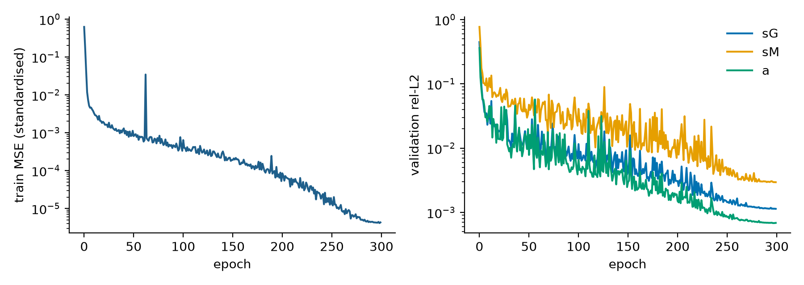

带残差的消融网络。读法相同。左图在第 60 个 epoch 附近有一个孤立的尖峰，训练误差瞬间跳高两个量级后回落，第 190 个 epoch 附近还有一个小尖峰。右图三条线的次序不变，$s_M$ 最终停在比教师高的位置。残差项本身从首个 epoch 到末个 epoch 降了约四个量级，验证集上最差目标的误差却比教师大。

### 5.3 蒸馏

`distill_summary.json`。验证集共 768000 行，训练数据是 14592000 行求解器数据加 8000000 行教师标注的合成点，合成点里端点占比 `end_fraction` 为 0.7，batch 为 16384。

| 网络 | 参数量 | 验证 rel-L2 % $s_G$ | $s_M$ | $a$ | 端点行 rel-L2 % $s_G$ | $s_M$ | $a$ |
|---|---|---|---|---|---|---|---|
| 学生 4 层 128 | 54915 | 0.350 | 0.538 | 0.174 | 0.152 | 0.300 | 0.101 |
| 教师 6 层 256 | 343811 | 0.109 | 0.182 | 0.064 | 0.060 | 0.131 | 0.046 |

学生有 16 个傅里叶频率，最佳 epoch 是 149，参数量是教师的 6.26 分之一。学生的验证 rel-L2 是教师的 3.2、3.0、2.7 倍，依次对应 $s_G$、$s_M$、$a$。

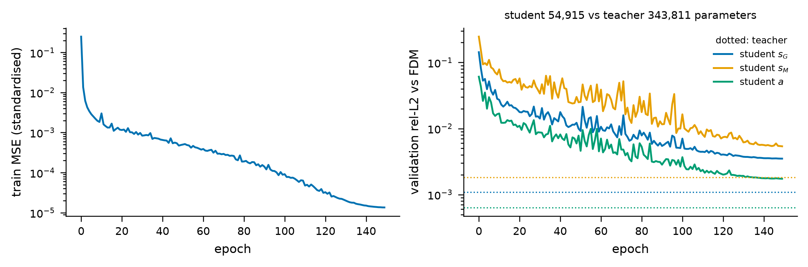

左图是训练均方误差。右图的实线是学生三个目标的验证 rel-L2 随 epoch 的变化，三条水平点线是教师在同一验证集上的水平，颜色对应。学生的三条线一路下降，在第 100 个 epoch 以后趋平，最终都停在各自教师线的上方。绿色的 $a$ 最后落到 $s_M$ 的教师线附近。

### 5.4 E1：核函数精度的完整表

数值都是百分数。验证集 400 个剖面，OOD 集 100 个剖面。“学生查表”是正式引擎。“教师”一行取自 `base3_teacher/e1/`，“消融”一行取自 `ablation_pde/e1/`，其余取自 `base3/e1/`。

验证集：

| 网络 | 核函数 | rel-L2 中位数 % | rel-L2 p90 % | rel-L2 最大 % | 端点最大相对误差的中位数 % |
|---|---|---|---|---|---|
| 学生查表，正式引擎 | $s_G$ | 0.831 | 1.199 | 2.366 | 1.114 |
| 学生查表，正式引擎 | $s_M$ | 2.590 | 16.961 | 82.272 | 4.251 |
| 学生查表，正式引擎 | $a$ | 0.107 | 0.165 | 0.304 | 1.810 |
| 学生直接求值 | $s_G$ | 0.832 | 1.200 | 2.369 | 1.117 |
| 学生直接求值 | $s_M$ | 2.591 | 16.970 | 82.324 | 4.251 |
| 学生直接求值 | $a$ | 0.108 | 0.166 | 0.304 | 1.790 |
| 教师 | $s_G$ | 0.218 | 0.326 | 0.809 | 0.300 |
| 教师 | $s_M$ | 0.688 | 4.617 | 18.738 | 1.590 |
| 教师 | $a$ | 0.035 | 0.053 | 0.101 | 0.707 |
| 消融，带残差 | $s_G$ | 0.251 | 0.357 | 0.600 | 0.559 |
| 消融，带残差 | $s_M$ | 1.957 | 44.350 | 287.504 | 11.365 |
| 消融，带残差 | $a$ | 0.163 | 0.193 | 0.234 | 0.793 |

OOD 集：

| 网络 | 核函数 | rel-L2 中位数 % | rel-L2 p90 % | rel-L2 最大 % | 端点最大相对误差的中位数 % |
|---|---|---|---|---|---|
| 学生查表，正式引擎 | $s_G$ | 0.883 | 1.134 | 1.703 | 1.584 |
| 学生查表，正式引擎 | $s_M$ | 2.656 | 14.562 | 69.035 | 4.867 |
| 学生查表，正式引擎 | $a$ | 0.129 | 0.174 | 0.258 | 1.841 |
| 学生直接求值 | $s_G$ | 0.882 | 1.133 | 1.702 | 1.584 |
| 学生直接求值 | $s_M$ | 2.659 | 14.572 | 69.068 | 4.867 |
| 学生直接求值 | $a$ | 0.130 | 0.173 | 0.258 | 1.790 |
| 教师 | $s_G$ | 0.268 | 0.376 | 0.571 | 0.387 |
| 教师 | $s_M$ | 0.886 | 4.492 | 16.700 | 2.793 |
| 教师 | $a$ | 0.046 | 0.063 | 0.080 | 0.966 |
| 消融，带残差 | $s_G$ | 0.256 | 0.354 | 0.461 | 0.611 |
| 消融，带残差 | $s_M$ | 2.861 | 51.960 | 212.121 | 16.261 |
| 消融，带残差 | $a$ | 0.174 | 0.191 | 0.200 | 0.972 |

`base3/e1/e1_summary.json` 里还有第三个提供者 `full SKN`，它就是教师。它的 24 个数与 `base3_teacher/e1/` 的结果完全相同，逐项差的最大值是 0.0 和 0.0，分别对应验证集和 OOD 集。所以上表没有重复列出。

从表里能读出的事实：

1. 正式引擎在验证集上的中位误差是 $s_G$ 0.83 %，$s_M$ 2.59 %，$a$ 0.11 %。闭合最依赖的 $a$ 核最准。
2. 查表几乎不改变误差。学生查表与学生直接求值的中位数之差，三个核函数里最大的是 1.3e-5，以小数计。
3. 学生相对教师，验证集中位数放大到 3.8、3.8、3.1 倍。
4. $s_M$ 的分布有长尾。教师的中位数不到 1 %，最大值到 18.7 %；学生的最大值到 82.3 %。热迁移响应在温度梯度很小的剖面上本身接近零，相对误差的分母很小。
5. OOD 集上三个核函数的中位数只比验证集略高，没有出现越界后失控的情况。
6. 消融网络的 $s_G$ 与教师相当，$s_M$ 的中位数是教师的 2.8 倍，$a$ 是 4.7 倍；$s_M$ 的最大值 288 % 已经超过 100 %。

### 5.5 学生引擎的六张图，`base3/e1/`

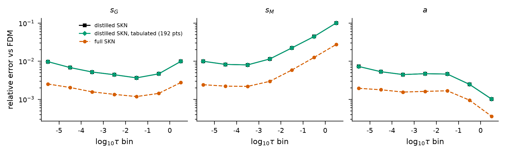

三个子图各对应一个核函数，纵轴共用，是该十倍程内的平均 rel-L2，对数刻度；横轴是 $\log_{10}\tau$ 的区间中点，从 -5.5 到 0.5 共 7 个区间。每个子图三条线对应三个提供者：黑色方块是学生直接求值，绿色菱形是学生查表，橙红色虚线是教师。黑线和绿线完全重合，只看得见绿线。绿线在每个区间都位于教师线上方，间距大致不变，说明学生的误差在所有时间尺度上都比教师高出一个差不多固定的倍数，没有哪个时段特别差。$s_M$ 从 $\tau\approx10^{-3}$ 起一路上升，$a$ 在最后两个区间下降。

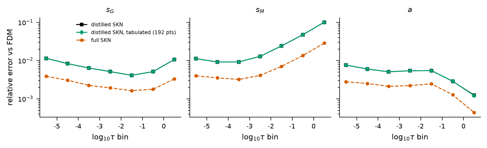

OOD 集的同一张图。三条线整体略高，相对关系不变。


三个子图分别是 $s_G/\sqrt\tau$、$s_M/\sqrt\tau$、$a/\sqrt\tau$ 在段两端的值随 $\log_{10}\tau$ 的变化，这正是闭合实际用到的量。三种颜色是验证集的前三个剖面，图例写着 profile 1：两端 357 和 359 K，$\lambda=49.0$；profile 2：356 和 364 K，$\lambda=0.5$；profile 3：305 和 299 K，$\lambda=14.7$。实线是 $\xi=0$ 端的求解器结果，虚线是 $\xi=1$ 端的求解器结果，空心圆和方块是网络在两端的预测。

1. 左图：$\lambda$ 小的 profile 2 两端曲线几乎是常数；$\lambda$ 大的 profile 1 和 3 在中间时段鼓起一个包，这是段中部被焦耳热加快扩散的结果。晚期所有曲线收拢并趋于零。
2. 中图：profile 1 的 $s_M$ 幅值最大，因为它的焦耳温升最大；profile 2 几乎为零。
3. 右图：$\xi=1$ 端的虚线在早期为零，表示从左端注入的通量还没传到右端；晚期所有曲线一起向下，对应平均应力的线性下降。
4. 所有标记都压在线上。

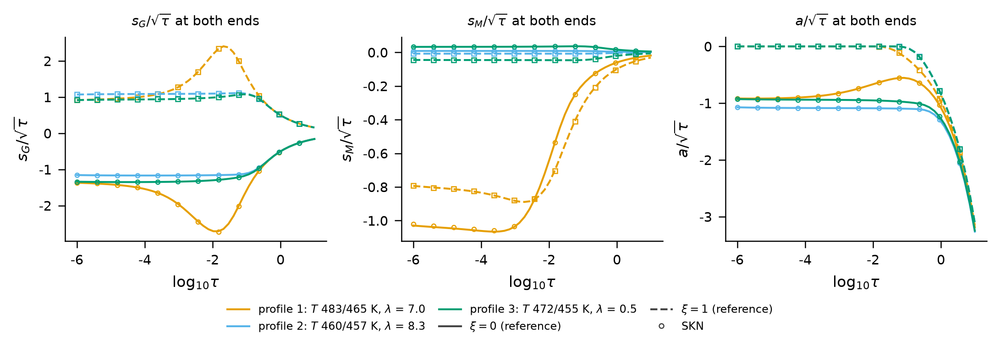

OOD 集前三个剖面，图例为 profile 1：483 和 465 K，$\lambda=7.0$；profile 2：460 和 457 K，$\lambda=8.3$；profile 3：472 和 455 K，$\lambda=0.5$。这些温度都高于训练上限。标记仍然压在线上。

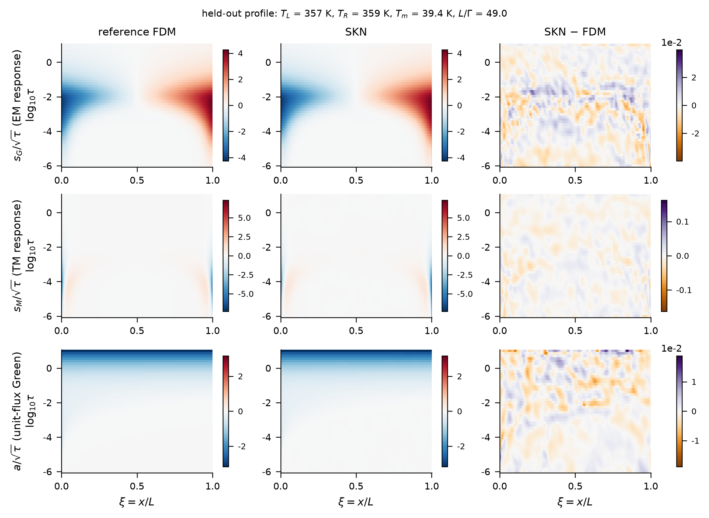

验证集第一个剖面的完整曲面，图标题给出它的参数：$T_L=357$ K，$T_R=359$ K，$T_m=39.4$ K，$L/\Gamma=49.0$。三行分别是 $s_G/\sqrt\tau$、$s_M/\sqrt\tau$、$a/\sqrt\tau$；三列分别是求解器、网络、两者之差。每个小图横轴是 $\xi$，纵轴是 $\log_{10}\tau$。

1. 第一行：左端蓝色受压，右端红色受拉，结构集中在 $\log_{10}\tau$ 从 -4 到 -1 之间。前两列看不出区别。差值图是无结构的斑块，色标量级 $10^{-2}$，曲面本身的幅值是 4 左右。
2. 第二行：$s_M$ 只在紧贴两端的窄带里有明显的值。差值图的色标刻度到 0.1。
3. 第三行：$a/\sqrt\tau$ 的上沿是一条深蓝色带，对应晚期的线性下降。差值图色标量级 $10^{-2}$。

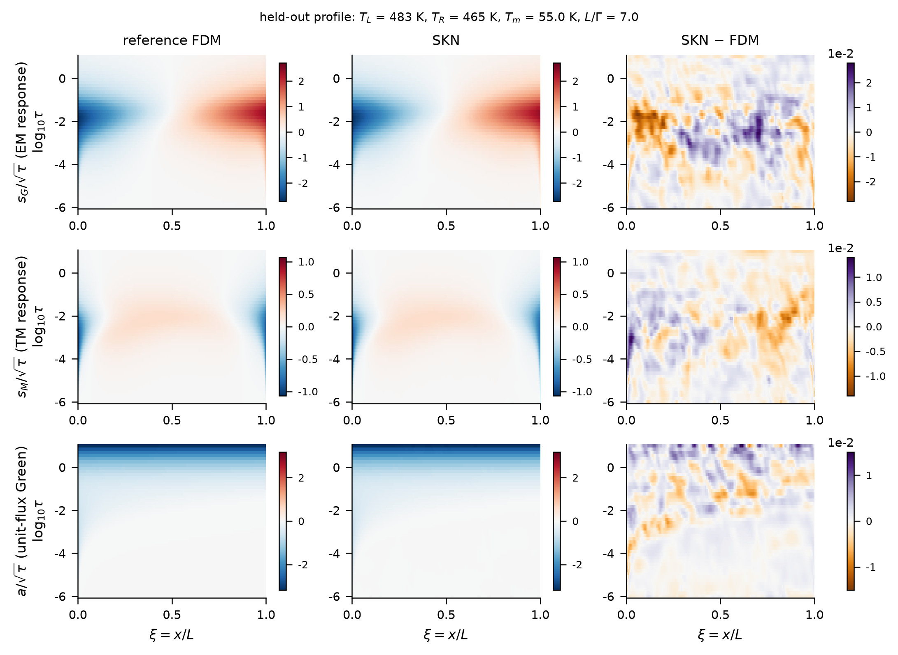

OOD 集第一个剖面，标题为 $T_L=483$ K，$T_R=465$ K，$T_m=55.0$ K，$L/\Gamma=7.0$。$\lambda$ 较小，焦耳鼓包占了段的大部分，所以 $s_M$ 的结构比上一张图宽得多，中部出现一片浅红。三行差值的色标都在 $10^{-2}$ 量级，第一行出现成片的同号区域，说明越界后误差开始带有系统性。

### 5.6 教师的六张图，`base3_teacher/e1/`

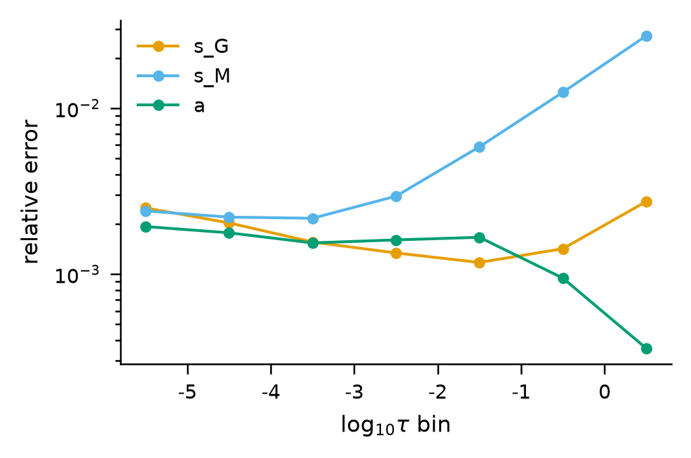

教师配置下只有一个提供者，图是单个坐标系：橙线 $s_G$，蓝线 $s_M$，绿线 $a$。三条线在早期区间聚在一起，说明除以 $\sqrt\tau$ 的缩放让早期的相对精度保持均匀。$s_M$ 从 $\tau\approx10^{-3}$ 起上升，在最后一个区间比另外两条高一个量级；$a$ 在最后两个区间下降，因为此时 $a$ 以随 $\tau$ 线性下降的部分为主，相对误差自然变小。

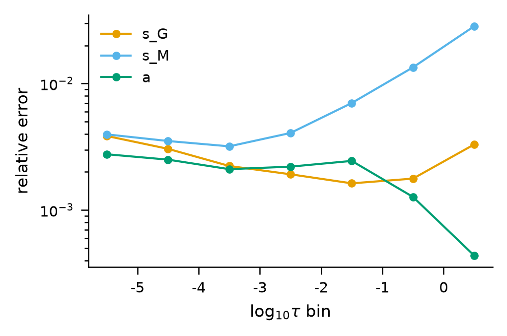

OOD 集。形状与验证集相同，整体略微上移。

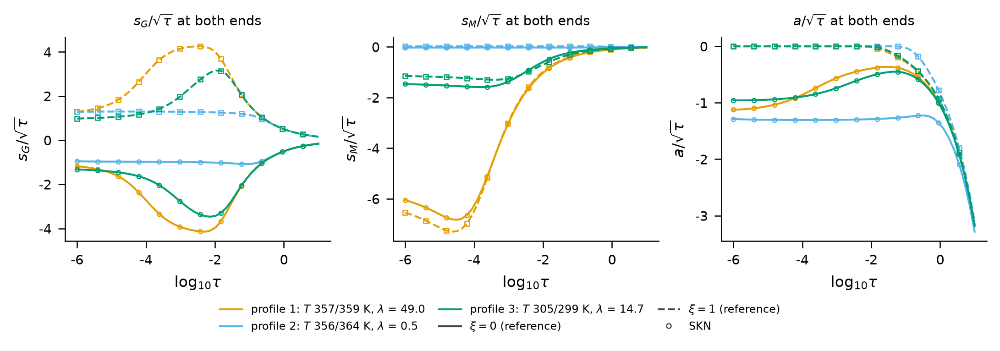

与学生的端点曲线图是同三个剖面，线是相同的求解器结果，标记换成教师的预测。标记都压在线上。

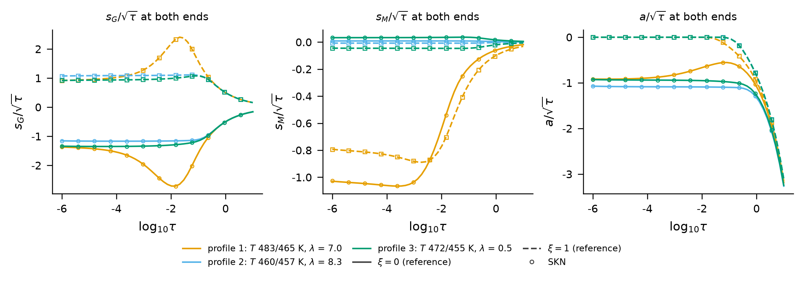

OOD 的三个剖面，同样看不出偏差。

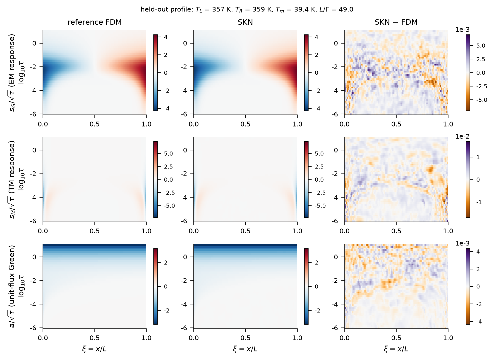

与学生图同一个剖面。差值列的色标比学生小：第一行和第三行是 $10^{-3}$ 量级，第二行是 $10^{-2}$ 量级。差值是无结构的斑点。

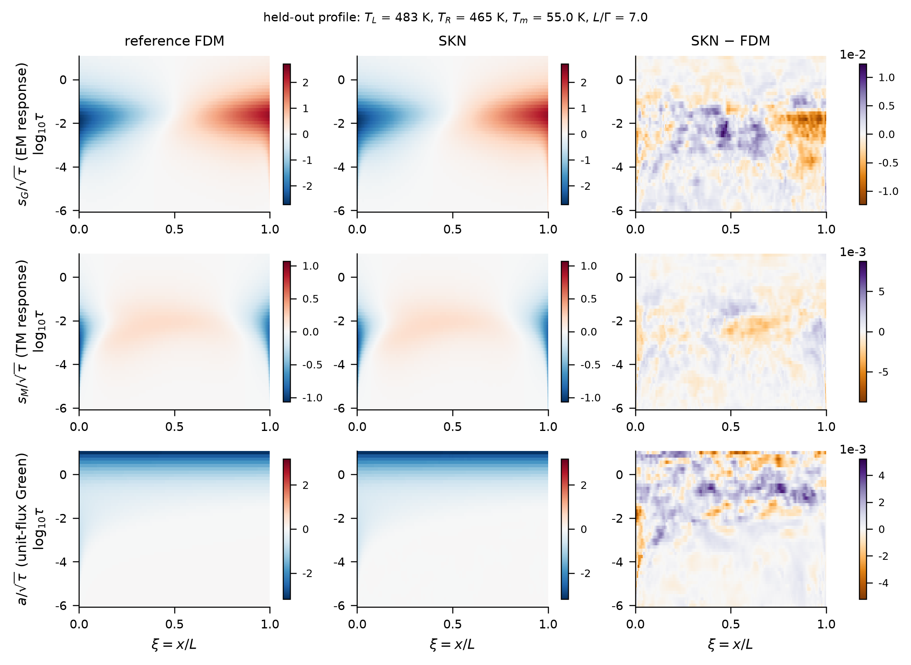

OOD 剖面。第一行差值的色标升到 $10^{-2}$，并出现成片的同号区域；第二、三行仍在 $10^{-3}$ 量级。

### 5.7 消融网络的六张图，`ablation_pde/e1/`

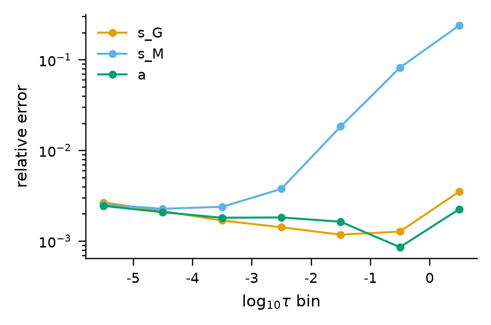

$s_M$ 的蓝线在 $\tau > 10^{-2}$ 后急剧上升，最后一个区间超过 $10^{-1}$，比教师的同一条线高约一个量级。$a$ 的绿线在最后一个区间不再下降，反而回升。$s_G$ 与教师相近。

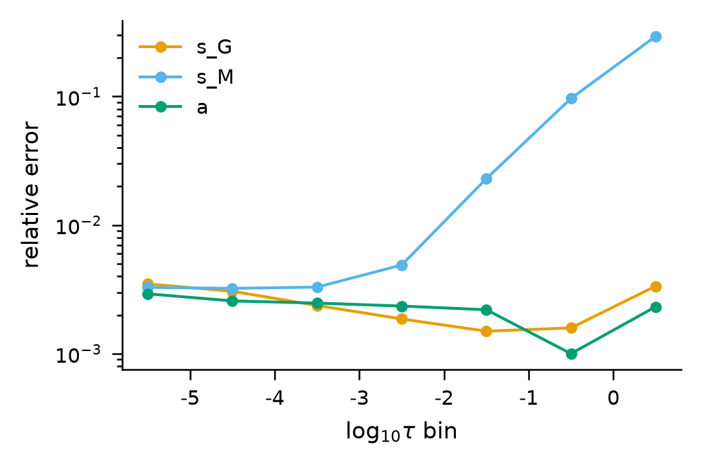

OOD 集上同样的形状，$s_M$ 在最后一个区间更高。


同三个剖面。标记依然落在线上，端点上的差别在这种尺度下看不出来。


OOD 的端点曲线，同样看不出与教师图的差别。

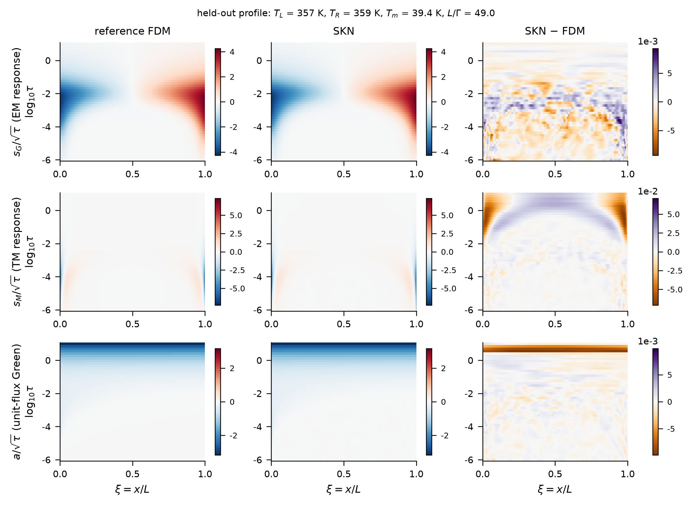

差值列与教师的图明显不同。第二行 $s_M$ 的差值在 $\log_{10}\tau > -1$ 的晚期出现一个大尺度的拱形图案：两端深橙色，中间浅紫色，色标量级 $10^{-2}$ 且幅值是教师的数倍。第三行 $a$ 的差值在最上沿出现一条横贯全段的深色带。第一行 $s_G$ 的差值在晚期出现水平条纹。这些都是晚期稳态区的系统性偏差，正是分区误差图里晚期上升的来源。

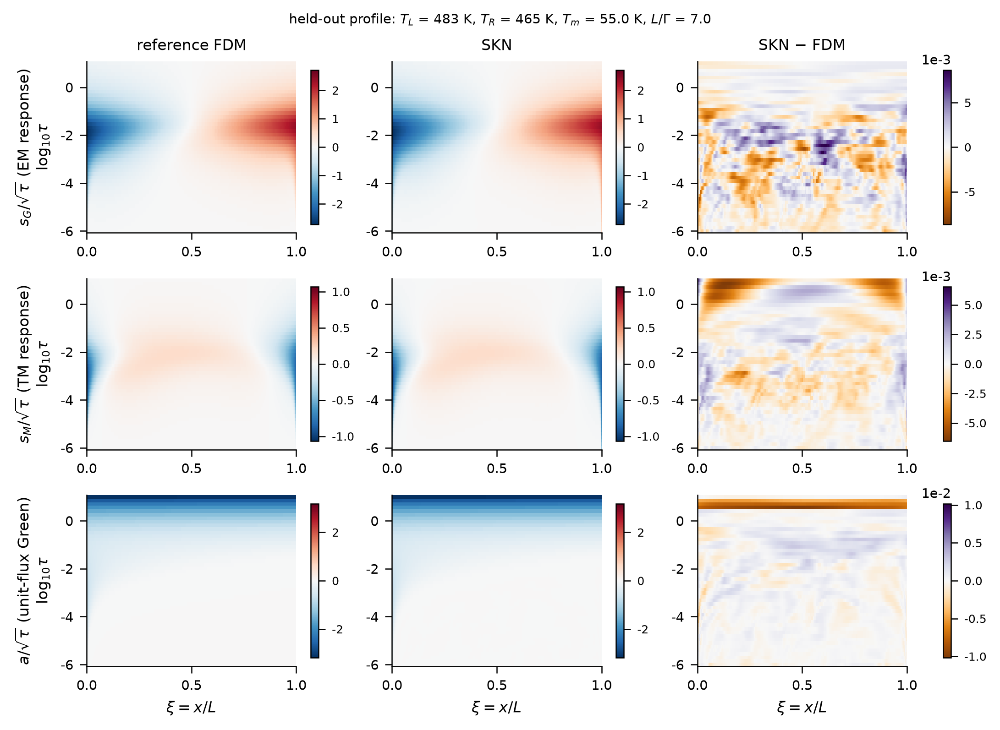

OOD 剖面上同样的图案：$s_M$ 的晚期差值两端为负、中间为正，$a$ 的差值在上沿有一条深色带且色标量级升到 $10^{-2}$。

### 5.8 三个网络在轨级的表现

核函数误差最终要看它对成核时间的影响。下表取自三个目录的 `e2/e2_summary.json`，变体 `full`，各芯片成核时间相对误差的中位数和 p90。E2 的完整说明在 [04_逐轨精度_E2.md](04_逐轨精度_E2.md)。

| 网络与引擎设置 | D1 中位数 / p90 % | D2 中位数 / p90 % | D3 中位数 / p90 % | 预测的堆叠最早成核 年 | 闭合耗时 秒 |
|---|---|---|---|---|---|
| 学生查表，M=32 | 0.259 / 0.612 | 0.142 / 0.660 | 1.715 / 2.344 | 2.405 | 13.5 |
| 教师直接求值，M=64 | 0.228 / 0.415 | 0.192 / 0.610 | 2.274 / 2.389 | 2.425 | 251.4 |
| 消融直接求值，M=64 | 0.225 / 0.279 | 0.076 / 0.262 | 0.527 / 2.312 | 2.402 | 251.5 |

参考解的堆叠最早成核时间是 2.389 年。

## 6. 怎么理解

1. 网络能代替单段求解器。正式引擎在 400 张留出曲面上的中位误差是 0.1 % 到 2.6 %，最关键的 $a$ 核是 0.1 % 量级。
2. 压缩的代价是核函数误差放大三到四倍，参数量减到约六分之一。5.8 节的表说明这个放大在轨级并不明显：学生在 D2 和 D3 上的中位误差比教师还小，D1 上略大。两行的引擎设置不同，这个对比不能只归因于网络大小，详见 [12_教师引擎与学生引擎对比.md](12_教师引擎与学生引擎对比.md)。
3. 查表不带来可见的额外误差。
4. 温度越出训练范围 30 K 以内时，误差只小幅上升。
5. 加方程残差没有改善留出核函数，$s_M$ 和 $a$ 反而变差，训练时间是原来的八倍。对晚期偏差的一个解释：残差按 $\tau$ 加权后晚期点权重最大，而晚期的 $s_M$ 接近稳态、时间导数接近零，残差对稳态值本身的偏差不敏感。这个解释没有做过针对性实验。

## 7. 论文用了哪些，哪些是论文之外的

| 论文中的说法 | 本章对应 |
|---|---|
| 网络是 4 层 128 单元、16 个傅里叶特征、5.5×10⁴ 个参数 | 5.3 节 |
| 在 1.2×10⁵ 个随机剖面上训练一次 | 5.1 节 |
| 一个更大的 6 层 256 单元网络只用于在段端点加密标签 | 5.2 和 5.3 节 |
| 400 张留出曲面上中位 rel-L2 为 0.83 %、2.6 %、0.11 % | 5.4 节验证集表，学生查表三行 |
| 消融表：纯数据 0.22、0.69、0.035 % 对加残差 0.25、1.96、0.16 % | 5.4 节验证集表，教师与消融的中位数列 |
| 紧凑网络以 3 到 4 倍的核函数误差换取 6 倍的压缩 | 5.4 节第 3 条与 5.3 节 |
| 消融表：D1、D2、D3 中位 t_nuc 误差 0.26、0.14、1.7 % 对 0.23、0.19、2.3 % | 5.8 节前两行 |
| 参考数据 4 分钟，教师 22 分钟，蒸馏 6 分钟 | 第 3 节耗时表 |
| 精度图右半：三个留出剖面在段端点的 $a$ 核 | `base3/e1/e1_kernel_cuts_val` 的第三个子图 |

论文之外的内容：全部 OOD 指标，p90 和最大值，端点误差，学生直接求值这一提供者，消融网络在轨级的数字，三张训练曲线，全部曲面图和分区误差图。

## 8. 注意事项

1. 消融网络在核函数指标上更差，在 5.8 节的三个芯片上却不更差，D2 和 D3 的中位数比教师小。核函数层面与轨层面的结论方向不一致，目前没有解释。论文只引用了核函数层面的比较。
2. $s_M$ 的最大误差很大，学生在验证集上到 82 %。这些是热迁移响应本身接近零的剖面。它对成核时间的影响由 E2 和 E3 里的热迁移开关实验间接说明：去掉热迁移对冷芯片的寿命影响在 1 % 以内。
3. OOD 集只在温度上越界，不检验 $\lambda$ 或 $\tau$ 越界的情形。推理时 $\lambda$ 超出训练范围会被截断到训练上下界，$\tau$ 超出范围用闭式延拓，代码在 `stackem/skn_numpy.py`。
4. E1 只在 base3 目录下运行。网络与具体堆叠无关，quad4 和 dense3 直接使用 base3 的学生权重，没有各自的 E1。
5. 教师最终用纯数据损失，`w_pde` 为 0。网络本身没有用到物理方程，物理只体现在训练数据来自求解器和闭合满足守恒条件上。
6. `dataset_info.json` 和各 `e1_summary.json` 的 `_meta.cmd` 记录的是参考运行当时的命令行，其中的输出根目录和参数写法与现在的 `run_all.sh` 不完全相同，说明见 [00_总览.md](00_总览.md)。
7. `train_curves.png` 只有 png 没有 pdf，也没有 `_data` 文件，曲线数据在 `train_log.csv` 里。
8. `logs/kernels_and_teacher_training.log` 结尾有一行 `RuntimeWarning: overflow encountered in exp`，出自训练结束时 numpy 前向的一次指数溢出提示，不影响结果。`logs/pde_ablation_training.log` 最后一行打印的权重路径是教师的默认路径，实际写出的消融权重在 `skn_pde/` 下，教师权重没有被覆盖。
