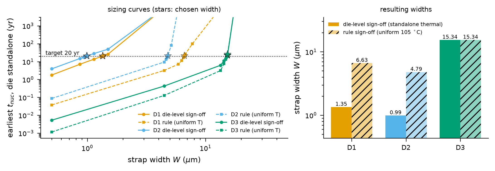
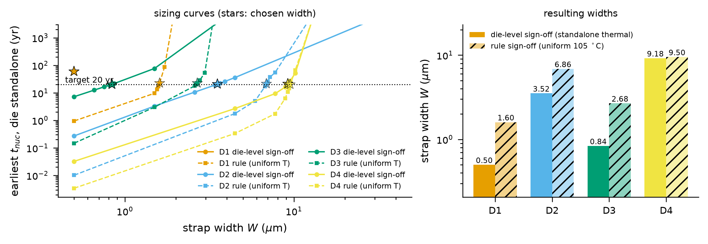
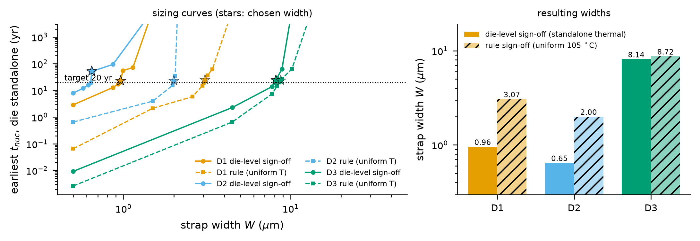

# 签核定线宽：让每层芯片先“单独通过签核”

本章说明三个目录：`reference_results/base3/signoff/`、`reference_results/quad4/signoff/`、`reference_results/dense3/signoff/`。这一步没有 E 编号，但 E2 到 E8 的所有堆叠实验都使用这里定出的线宽。核对清单是 `docs/checks/results_03.jsonl`。

## 1. 这个实验回答什么问题

整个项目要问的是：每层芯片各自通过了电迁移签核，键合成堆叠以后还能通过吗。这个问题要有意义，基准堆叠里的每层芯片必须先处在“刚好通过自己的签核”的状态。定线宽做的就是这件事，它回答三个问题。

1. 每层芯片单独封装、单独散热时，电源带至少要多宽，才能让最早的成核时间达到寿命目标乘以裕量。
2. 改用工业上常见的均匀最坏温度规则来定线宽，线宽会是多少。
3. 单独状态和堆叠状态下各层芯片的温度相差多少。

术语：

- 签核：流片前对设计做的最终检查。电迁移签核检查导线在寿命期内是否会因电迁移失效。
- 电源带：电源网格里的一条金属线，本文档里也叫轨。线宽 W 越大，同样电流下电流密度越小，成核越晚。
- 芯片级签核：用芯片自己单独封装时的热仿真结果做签核，不考虑堆叠里的邻居。图和文件里写作 die-level 或 standalone。
- 规则签核：假设整层芯片处在一个统一的最坏结温下，本项目取 105 °C，并假设残余应力为常数。图和文件里写作 uniform rule。
- 不朽：稳态最大应力低于临界应力的轨永远不会成核，成核时间记为无穷大。
- 饱和：定线宽的搜索碰到了允许宽度的上界或下界，没有找到恰好满足目标的宽度。

## 2. 原理与做法

### 2.1 规则

每层芯片的线宽取满足下式的最小宽度

$$\min_{\text{轨}} t_{nuc}(\text{芯片单独}; W) \ge \text{寿命目标} \times \text{裕量}$$

配置在 `configs/base3.json` 的 `signoff` 段：`horizon_years` 为 10，`margin` 为 2，即目标 20 年；搜索范围从 `W_min` 0.5 µm 到 `W_max` 40 µm。除线宽外，算例的功耗、几何、馈电间距、材料参数都不变。

“单独”的含义：同一层芯片加同样的导热界面层、散热器和对流热阻，单独做一次 HotSpot 仿真。导线的散热按单面计算，因为单独封装时导线上方没有键合层。

### 2.2 一次评估怎么算

对给定的线宽，`stackem/signoff.py` 做三步。

1. 按新线宽重建电源网格并解直流电流分布。电流分布与线宽无关，电流密度随线宽成反比变化。
2. 把芯片单独状态的温度场插值到每个结点，加上焦耳温升和随温度变化的残余应力，得到该芯片的全部轨。
3. 先筛掉不朽的轨，再用参考求解器对剩下的每条轨做整树有限体积求解，取最小的成核时间。所有轨都不朽时返回无穷大。

定线宽完全基于参考求解器，网络不参与。

### 2.3 二分搜索

搜索在线宽的对数上做二分。

1. 先算下界。最窄的线已经达标就直接返回下界，标记饱和，评估次数为 1。
2. 再算上界。最宽的线仍不达标就返回上界，标记饱和。
3. 否则反复取对数中点，达标就把上界移到中点，否则把下界移到中点，直到上下界之比小于 1.02。返回上界，也就是搜索到的达标宽度里最小的一个。

从 0.5 到 40 µm 需要 8 次对分，加上两个端点共 10 次评估。最终宽度的分辨率约 1.7 %。所有芯片、所有算例的候选宽度都落在同一组离散格点上，所以不同芯片的结果可能在全部有效数字上相同。返回的宽度对应的成核时间一般高于目标，高出多少取决于那一段曲线有多陡。

### 2.4 均匀规则定线宽

脚本在芯片级定线宽之后，再按规则签核的假设做一次，结果只作对照，不用于后续实验：所有结点温度设为 105 °C，残余应力取该温度下的常数，散热仍按单面计算。

### 2.5 结果怎么被后续实验使用

每个实验启动时读取 `<根>/<算例>/signoff/signoff_sizing.json` 的 `dies` 字段，把每层芯片的线宽换成定出的值，并在屏幕上打印一行 `[sign-off sizing] strap widths: ...`。`base3_teacher` 和 `ablation_pde` 两个目录共用 base3 的定线宽文件。文件不存在时打印一条警告并使用配置里的统一宽度 `pg.W`。

## 3. 怎么运行

`run_all.sh` 的三个步骤：`signoff`、`quad4.signoff`、`dense3.signoff`。

```bash
STACKEM_ONLY=signoff,quad4.signoff,dense3.signoff bash scripts/run_all.sh
```

对应的命令：

```bash
python -m stackem.experiments.signoff_size --config configs/base3.json  --root <根> --hotspot <HotSpot>
python -m stackem.experiments.signoff_size --config configs/quad4.json  --root <根> --hotspot <HotSpot> --weights <根>/base3/skn_distill/skn_student.npz
python -m stackem.experiments.signoff_size --config configs/dense3.json --root <根> --hotspot <HotSpot> --weights <根>/base3/skn_distill/skn_student.npz
```

`--weights` 是脚本统一带上的参数，定线宽本身不用网络。可选参数 `--margin` 和 `--horizon` 覆盖配置里的裕量和寿命目标，`--skip-rule` 跳过均匀规则定线宽。

运行时每评估一个中点打印一行，例如 base3 的 D1：

```
  sizing D1 (standalone T 320.0-321.9 K, target 20 yr)
    W =   4.47 um -> earliest      inf yr
    W =   1.50 um -> earliest    25.87 yr
    ...
    W =   1.33 um -> earliest    19.56 yr
  -> D1: W = 1.35 um, earliest 20.4 yr, j_max 6.29e+05 A/cm^2
```

两个端点的评估不打印，所以每层芯片只看到 8 行。最后出现 `[saved] .../signoff_sizing.json` 表示成功。

参考机器上的耗时，取自 `reference_results/logs/final_1_full.log` 和 `final_2_extras.log`：

| 算例 | HotSpot 秒 | 芯片级定线宽 秒 | 整个步骤 秒 |
|---|---|---|---|
| base3 | 2 | 39 | 60 |
| quad4 | 3 | 86 | 日志里与 quad4 的 E2、E3 写在同一个标题下，没有单独计时 |
| dense3 | 2 | 105 | 163 |

“芯片级定线宽”一列是日志里 `sizing NNs` 的值，不含随后的均匀规则定线宽。

## 4. 输出文件

每个 `signoff/` 目录 5 个文件。

| 文件 | 内容 |
|---|---|
| `signoff_sizing.json` | 定线宽结果，字段见下表 |
| `signoff_sizing.png`、`.pdf` | 定线宽曲线和结果柱状图 |
| `signoff_sizing_data.json`、`.npz` | 图里每条曲线的坐标 |

自己运行时目录里还会有 `hotspot/` 子目录，是 HotSpot 的输入输出草稿，参考结果没有收录。

`signoff_sizing.json` 的字段：

| 字段 | 含义 |
|---|---|
| `horizon_years`、`margin` | 寿命目标和裕量 |
| `rule.kind` | 一句文字说明 |
| `dies.<芯片>.W`、`W_um` | 定出的线宽，单位米和微米 |
| `dies.<芯片>.t_earliest_s`、`t_earliest_years` | 该线宽下芯片单独状态的最早成核时间 |
| `dies.<芯片>.iterations` | 评估次数 |
| `dies.<芯片>.saturated` | 是否碰到搜索边界 |
| `dies.<芯片>.history` | 每次评估的宽度和最早成核时间，按宽度排序，单位米和秒 |
| `dies.<芯片>.j_max_A_per_cm2` | 定线宽后该芯片网格上的最大电流密度 |
| `dies.<芯片>.T_alone_mean`、`T_alone_max` | 单独状态的平均和最高温度 |
| `uniform_rule_sizing.<芯片>` | 均匀规则定线宽的 `W_um`、`t_earliest_years`、`saturated`、`history` |
| `thermal.<芯片>` | 堆叠状态的 `min`、`max`、`mean` 和单独状态的 `alone_min`、`alone_max`、`alone_mean` |
| `n_cells` | 参考求解器每段的单元数 |

## 5. 结果

三个算例的寿命目标都是 10 年，裕量都是 2，每段单元数都是 60。

### 5.1 base3

base3 是三层 4 mm 芯片：D1 为 2 W 的 IO 存储芯片，带一个 4 倍功耗的热块；D2 为 4 W 的 SRAM 芯片；D3 为 20 W 的逻辑芯片，带一个 5 倍功耗的热块，位于顶部靠散热器一侧。电源带间距 100 µm。

| 芯片 | 线宽 µm | 单独最早成核 年 | 相对寿命目标的倍数 | 最大电流密度 MA/cm² | 评估次数 | 饱和 | 规则线宽 µm | 规则下最早成核 年 | 规则线宽与芯片级线宽之比 |
|---|---|---|---|---|---|---|---|---|---|
| D1 | 1.349 | 20.36 | 2.04 | 0.629 | 10 | 否 | 6.630 | 21.18 | 4.91 |
| D2 | 0.992 | 20.46 | 2.05 | 0.624 | 10 | 否 | 4.789 | 21.10 | 4.83 |
| D3 | 15.338 | 22.08 | 2.21 | 0.122 | 10 | 否 | 15.338 | 25.96 | 1.00 |

温度，单位 K：

| 芯片 | 单独最低 | 单独最高 | 单独平均 | 堆叠最低 | 堆叠最高 | 堆叠平均 | 平均温升 |
|---|---|---|---|---|---|---|---|
| D1 | 319.96 | 321.88 | 320.17 | 342.31 | 359.36 | 344.90 | 24.73 |
| D2 | 322.04 | 322.32 | 322.21 | 342.23 | 359.56 | 344.83 | 22.62 |
| D3 | 335.96 | 358.70 | 338.52 | 341.98 | 359.87 | 344.59 | 6.07 |

完整的搜索历史。每一项是“线宽 µm → 最早成核时间 年”，按线宽从小到大排列，“不成核”表示该线宽下所有轨都不朽。

| 芯片 | 做法 | 评估点 |
|---|---|---|
| D1 | 芯片级 | 0.500 → 1.77；0.865 → 7.08；1.137 → 13.64；1.304 → 18.80；1.326 → 19.56；1.349 → 20.36；1.396 → 22.05；1.495 → 25.87；4.472 → 不成核；40.000 → 不成核 |
| D1 | 均匀 105 °C 规则 | 0.500 → 0.04；4.472 → 3.20；5.881 → 7.11；6.298 → 11.40；6.517 → 16.88；6.630 → 21.18；6.744 → 26.63；7.734 → 98.08；13.375 → 不成核；40.000 → 不成核 |
| D2 | 芯片级 | 0.500 → 3.94；0.865 → 14.86；0.926 → 17.44；0.958 → 18.89；0.975 → 19.66；0.992 → 20.46；1.137 → 28.19；1.495 → 49.05；4.472 → 不成核；40.000 → 不成核 |
| D2 | 均匀 105 °C 规则 | 0.500 → 0.09；4.472 → 9.40；4.628 → 13.07；4.708 → 16.32；4.789 → 21.10；5.128 → 80.99；5.881 → 不成核；7.734 → 不成核；13.375 → 不成核；40.000 → 不成核 |
| D3 | 芯片级 | 0.500 → 0.01；4.472 → 0.43；13.375 → 6.20；14.323 → 11.06；14.821 → 14.93；15.077 → 17.94；15.338 → 22.08；17.589 → 不成核；23.130 → 不成核；40.000 → 不成核 |
| D3 | 均匀 105 °C 规则 | 0.500 → 0.00；4.472 → 0.13；13.375 → 3.12；14.323 → 7.48；14.821 → 13.25；15.077 → 18.38；15.338 → 25.96；17.589 → 不成核；23.130 → 不成核；40.000 → 不成核 |



左图是定线宽曲线，横轴是线宽，纵轴是芯片单独状态下的最早成核时间，都是对数刻度。每种颜色一层芯片：橙色 D1，蓝色 D2，绿色 D3。实线带圆点是芯片级签核，虚线带方块是均匀规则。水平点线是 20 年目标。五角星是选定的宽度，深色星对应芯片级，浅色星对应规则。不成核的点被画到纵轴上限之外，所以曲线表现为直冲图顶。

1. D1 和 D2 的实线在图的左侧，线宽 0.5 到 1.5 µm，平缓上升后冲顶，表示再宽一点所有轨都不朽。两颗深色星紧贴目标线上方。
2. D1 和 D2 的虚线整体右移到 4 到 8 µm，这就是规则的过度设计。
3. D3 的实线和虚线几乎重合，在 15 µm 附近近乎垂直地穿过目标线，两颗星叠在一起。
4. 每条曲线在低宽度处近似直线，接近不朽阈值时急剧变陡。陡峭段意味着宽度的微小变化会带来寿命的巨大变化，定线宽结果因此对二分的分辨率敏感。

右图是结果柱状图，纵轴对数刻度。每层芯片两根柱：实色是芯片级，带斜线的浅色是规则，柱顶标着微米数。

从表里读出的事实：

1. D1 和 D2 单独工作时只有 320 到 322 K，1 µm 左右的线宽就能撑过 20 年。D3 自己发热大，需要 15 µm 以上，相当于 100 µm 间距的 15.3 %。
2. 键合后三层芯片的平均温度都在 345 K 左右。D1 和 D2 被邻居加热了二十多 K，D3 只升高约 6 K。这张温度对照表是整个项目物理结论的起点。
3. 均匀 105 °C 规则给 D1 和 D2 定出的线宽接近芯片级结果的 5 倍，因为这两层芯片实际远低于 105 °C。对 D3，两种做法落在同一个格点上，这只说明两者的真实阈值在同一个 1.7 % 的分辨率格子里；在这个宽度下两种做法算出的最早成核时间并不相同。
4. 实际裕量略高于 2。D3 偏高是因为它的定线宽曲线在目标附近很陡，相邻两个格点的成核时间一跳就越过了目标。

### 5.2 quad4

quad4 是四层 6 mm 芯片：D1 为 3 W 的 IO 芯片，D2 为 12 W 的逻辑芯片并带 4 倍热块，D3 为 6 W 的 SRAM 芯片，D4 为 25 W 的顶部逻辑芯片并带 5 倍热块。对流热阻 0.3 K/W。

| 芯片 | 线宽 µm | 单独最早成核 年 | 相对寿命目标的倍数 | 最大电流密度 MA/cm² | 评估次数 | 饱和 | 规则线宽 µm | 规则下最早成核 年 | 规则线宽与芯片级线宽之比 |
|---|---|---|---|---|---|---|---|---|---|
| D1 | 0.500 | 59.63 | 5.96 | 0.412 | 1 | 是 | 1.601 | 22.18 | 3.20 |
| D2 | 3.519 | 20.58 | 2.06 | 0.331 | 10 | 否 | 6.861 | 21.09 | 1.95 |
| D3 | 0.836 | 20.39 | 2.04 | 0.336 | 10 | 否 | 2.676 | 22.30 | 3.20 |
| D4 | 9.178 | 21.11 | 2.11 | 0.127 | 10 | 否 | 9.497 | 20.02 | 1.03 |

温度，单位 K：

| 芯片 | 单独最低 | 单独最高 | 单独平均 | 堆叠最低 | 堆叠最高 | 堆叠平均 | 平均温升 |
|---|---|---|---|---|---|---|---|
| D1 | 319.76 | 319.91 | 319.85 | 343.10 | 353.09 | 344.90 | 25.05 |
| D2 | 324.39 | 329.82 | 324.96 | 343.04 | 353.19 | 344.85 | 19.89 |
| D3 | 321.36 | 321.67 | 321.55 | 342.77 | 353.25 | 344.59 | 23.04 |
| D4 | 331.03 | 345.45 | 332.33 | 342.39 | 353.35 | 344.23 | 11.90 |

完整的搜索历史。每一项是“线宽 µm → 最早成核时间 年”，按线宽从小到大排列，“不成核”表示该线宽下所有轨都不朽。

| 芯片 | 做法 | 评估点 |
|---|---|---|
| D1 | 芯片级 | 0.500 → 59.63 |
| D1 | 均匀 105 °C 规则 | 0.500 → 0.95；1.495 → 9.64；1.547 → 13.57；1.574 → 17.05；1.601 → 22.18；1.715 → 87.58；1.966 → 不成核；2.586 → 不成核；4.472 → 不成核；40.000 → 不成核 |
| D2 | 芯片级 | 0.500 → 0.27；1.495 → 3.30；2.586 → 10.64；3.401 → 19.09；3.459 → 19.82；3.519 → 20.58；3.642 → 22.20；3.900 → 25.91；4.472 → 35.86；40.000 → 不成核 |
| D2 | 均匀 105 °C 规则 | 0.500 → 0.01；4.472 → 1.76；5.881 → 5.03；6.744 → 17.21；6.861 → 21.09；6.979 → 25.76；7.222 → 37.42；7.734 → 54.91；13.375 → 不成核；40.000 → 不成核 |
| D3 | 芯片级 | 0.500 → 7.23；0.658 → 12.57；0.754 → 16.57；0.807 → 19.02；0.821 → 19.69；0.836 → 20.39；0.865 → 21.85；1.495 → 76.91；4.472 → 不成核；40.000 → 不成核 |
| D3 | 均匀 105 °C 规则 | 0.500 → 0.15；1.495 → 3.02；2.586 → 17.90；2.631 → 19.92；2.676 → 22.30；2.769 → 28.56；2.966 → 52.98；3.401 → 不成核；4.472 → 不成核；40.000 → 不成核 |
| D4 | 芯片级 | 0.500 → 0.03；4.472 → 2.68；7.734 → 9.35；8.869 → 16.23；9.022 → 18.19；9.178 → 21.11；9.497 → 27.26；10.171 → 51.49；13.375 → 不成核；40.000 → 不成核 |
| D4 | 均匀 105 °C 规则 | 0.500 → 0.00；4.472 → 0.33；7.734 → 1.74；8.869 → 6.31；9.178 → 10.68；9.336 → 14.42；9.497 → 20.02；10.171 → 66.20；13.375 → 不成核；40.000 → 不成核 |



读法与 base3 的图相同，多了黄色的 D4。

1. 橙色的 D1 没有实线，只有一颗孤立的深色星，位于线宽 0.5 µm、目标线上方约半个量级处。这就是饱和的样子：历史里只有一个点，画不出曲线。
2. D1 的橙色虚线在 1.5 µm 附近陡峭上升，浅色星在目标线上。
3. 绿色的 D3 实线在左侧，蓝色的 D2 实线在中间，黄色的 D4 实线与虚线在 9 µm 附近靠得很近。
4. 图上 `target 20 yr` 的文字与 D3 的星重叠，是绘图上的小瑕疵。

从表里读出的事实：

1. D1 饱和在下界。最窄的 0.5 µm 线已经让 D1 单独撑到约 60 年，搜索只做了 1 次评估就返回。D1 因此不是一个“刚好 2 倍裕量通过”的芯片。后面凡是涉及 quad4 D1 的“单独对堆叠”比值，都要记住它的起点裕量本来就大得多。
2. 其余三层芯片正常收敛，最早成核时间在 20 到 21 年之间。
3. 键合后四层芯片的平均温度在 344 到 345 K 之间。
4. 均匀规则没有饱和。对顶部的 D4，规则线宽与芯片级几乎没有差别。

### 5.3 dense3

dense3 的芯片与 base3 完全相同，只把电源带间距从 100 µm 减到 50 µm，每层芯片的轨数加倍，每条轨承担的电流减小。温度场与 base3 相同。

| 芯片 | 线宽 µm | 单独最早成核 年 | 相对寿命目标的倍数 | 最大电流密度 MA/cm² | 评估次数 | 饱和 | 规则线宽 µm | 规则下最早成核 年 | 规则线宽与芯片级线宽之比 |
|---|---|---|---|---|---|---|---|---|---|
| D1 | 0.958 | 23.05 | 2.30 | 0.858 | 10 | 否 | 3.069 | 24.94 | 3.20 |
| D2 | 0.646 | 52.13 | 5.21 | 0.856 | 10 | 否 | 2.000 | 22.86 | 3.09 |
| D3 | 8.141 | 24.00 | 2.40 | 0.284 | 10 | 否 | 8.718 | 23.33 | 1.07 |

温度，单位 K：

| 芯片 | 单独最低 | 单独最高 | 单独平均 | 堆叠最低 | 堆叠最高 | 堆叠平均 | 平均温升 |
|---|---|---|---|---|---|---|---|
| D1 | 319.96 | 321.88 | 320.17 | 342.31 | 359.36 | 344.90 | 24.73 |
| D2 | 322.04 | 322.32 | 322.21 | 342.23 | 359.56 | 344.83 | 22.62 |
| D3 | 335.96 | 358.70 | 338.52 | 341.98 | 359.87 | 344.59 | 6.07 |

完整的搜索历史。每一项是“线宽 µm → 最早成核时间 年”，按线宽从小到大排列，“不成核”表示该线宽下所有轨都不朽。

| 芯片 | 做法 | 评估点 |
|---|---|---|
| D1 | 芯片级 | 0.500 → 2.89；0.865 → 12.93；0.926 → 17.31；0.942 → 19.24；0.958 → 23.05；0.992 → 55.81；1.137 → 71.88；1.495 → 不成核；4.472 → 不成核；40.000 → 不成核 |
| D1 | 均匀 105 °C 规则 | 0.500 → 0.07；1.495 → 2.15；2.586 → 5.83；2.966 → 15.16；3.017 → 19.59；3.069 → 24.94；3.176 → 36.86；3.401 → 62.23；4.472 → 不成核；40.000 → 不成核 |
| D2 | 芯片级 | 0.500 → 8.00；0.573 → 12.07；0.614 → 15.80；0.635 → 19.30；0.646 → 52.13；0.658 → 53.65；0.865 → 94.95；1.495 → 不成核；4.472 → 不成核；40.000 → 不成核 |
| D2 | 均匀 105 °C 规则 | 0.500 → 0.66；1.495 → 3.98；1.966 → 15.52；2.000 → 22.86；2.035 → 35.58；2.106 → 不成核；2.255 → 不成核；2.586 → 不成核；4.472 → 不成核；40.000 → 不成核 |
| D3 | 芯片级 | 0.500 → 0.01；4.472 → 2.29；7.734 → 13.92；8.003 → 19.69；8.141 → 24.00；8.282 → 29.39；8.869 → 63.64；10.171 → 不成核；13.375 → 不成核；40.000 → 不成核 |
| D3 | 均匀 105 °C 规则 | 0.500 → 0.00；4.472 → 0.66；7.734 → 7.40；8.282 → 14.32；8.570 → 19.87；8.718 → 23.33；8.869 → 27.28；10.171 → 64.01；13.375 → 不成核；40.000 → 不成核 |



读法同前。与 base3 的图相比有三处不同。

1. 蓝色 D2 的深色星明显高于目标线，位于 50 年附近；它左边紧邻的圆点在目标线下方，两点之间的线段几乎垂直。
2. 橙色 D1 的实线在星的右侧有一个台阶。
3. 绿色 D3 的实线与虚线不再重合，规则的虚线偏右，两颗星分开。

从表里读出的事实：

1. 间距减半后线宽也变窄，最大电流密度升高。
2. D2 的结果是 52.13 年，远高于 20 年目标。原因在搜索历史里：线宽从 0.635 µm 增加到 0.646 µm，只宽了 1.7 %，最早成核时间却变成原来的 2.7 倍。定线宽曲线在这里不连续，二分法只能落在跳变的某一侧，规则要求取达标的一侧。
3. D1 也有同样的跳变，发生在选定点的右边一格，成核时间变成 2.4 倍。它的选定点恰好在跳变之前，所以结果看起来正常。
4. 对跳变的解释：最早成核时间是所有没被筛掉的轨里的最小值。线宽增加到某个值时，原来最先失效的那条轨的稳态应力降到临界应力以下，被判为不朽而退出比较，最小值改由另一条寿命长得多的轨决定。dense3 的轨更多更短，这种换轨更容易发生。结果文件没有记录每个评估点上是哪条轨最先失效，这个解释没有直接验证。

### 5.4 ev6 真实版图的定线宽

ev6 算例的定线宽在 E8 脚本内部完成，规则相同，结果存在 `reference_results/base3/e8/e8_summary.json` 的 `sizing` 字段，没有单独的 `signoff/` 目录，也没有搜索历史和均匀规则对照。两层缓存芯片饱和在下界 0.5 µm 且全部轨不朽，处理器芯片定到 35.48 µm。详见 [09_真实版图_ev6_E8.md](09_真实版图_ev6_E8.md)。

## 6. 怎么理解

1. 基准的定义是公平的：base3 的三层芯片单独看都以约 2 倍裕量通过了自己的签核。之后在堆叠里出现的任何违例，都来自堆叠带来的温升，而不来自基准本身设计不足。
2. 冷芯片是受害者。D1、D2 单独时温度低，线宽被定得窄，键合后温升二十多 K，寿命会大幅缩短。热芯片 D3 单独时已经很热，线宽宽，键合后温度变化小。
3. 均匀 105 °C 规则对冷芯片过度设计，线宽是芯片级的 3 到 5 倍；对热芯片几乎没有额外裕量。
4. 定出的最大电流密度在三个算例里从 0.12 到 0.86 MA/cm²，属于工业上常见的范围。

## 7. 论文用了哪些，哪些是论文之外的

| 论文中的说法 | 本章对应 |
|---|---|
| D1 和 D2 单独运行在 320 到 322 K，线宽 1.35 和 0.99 µm | 5.1 节 |
| D3 单独运行在 338 K，需要 15.3 µm，相当于 100 µm 间距下 15 % 的金属占用 | 5.1 节 |
| 键合后三层芯片平均 345 K，热点 360 K；D1 和 D2 被加热 23 到 25 K | 5.1 节温度表 |
| 均匀温度规则使电源带过度设计 5 倍 | 5.1 节，只对 D1、D2 成立 |
| 参数表：定线宽后 j_max 为 0.63、0.62、0.12 MA/cm²；dense3 为 0.3 到 0.9 | 5.1 和 5.3 节 |
| dense3 线宽 0.96、0.65、8.14 µm | 5.3 节 |
| 各算例汇总表里“单独最早成核” base3 20.4、quad4 20.4、dense3 23.0 年 | 各节第一张表里各芯片的最小值；quad4 取的是没有饱和的芯片里的最小值 |
| 签核目标 10 年乘以 2 | 第 5 节开头 |

论文之外的内容：quad4 的定线宽细节和 D1 饱和这一事实，所有搜索历史，均匀规则下的成核时间，三张定线宽图，dense3 的 D2 落在 52 年这一点。

## 8. 注意事项

1. quad4 的 D1 饱和在下界，单独裕量约 6 倍。论文汇总表给 quad4 写的乐观倍数上限 6.1 来自 D1，它不是一个 2 倍裕量芯片的结果。见 [05_物理分解与排序_E3_E7.md](05_物理分解与排序_E3_E7.md)。
2. dense3 的 D2 定在 52 年，原因是定线宽曲线的跳变。跳变的成因只有上面的推断，没有逐轨记录可查。dense3 里 D2 的乐观倍数 12 也带有这个成分。
3. dense3 的 D3 最早成核时间是 24.000000 年，比整 24 年只多 0.19 秒。一个连续求解得到的成核时间与整年数吻合到这种程度很不寻常，原因没有查明。
4. `signoff_sizing.json` 含有裸的 `Infinity` 记号，base3 有 16 个，quad4 有 16 个，dense3 有 18 个。Python 的 `json` 模块能读，严格的 JSON 解析器会拒绝，例如浏览器的 `JSON.parse` 和 `jq`。其他结果文件把无穷大写成字符串 `"inf"`，两种写法并存。`tools/verify_docs.py` 读取时会先把裸记号替换成字符串。
5. 这个文件没有 `_meta` 字段，目录里也没有 `config_used.json`，无法从文件本身看出生成时间和命令行。
6. 定线宽结果落在离散格点上。base3 的 D3 在两种做法下线宽完全相同，是分辨率造成的巧合，不代表两种做法对 D3 等价。
7. 重新运行时线宽会逐位复现。`t_earliest_s` 可能在第四位有效数字上与参考文件不同：参考文件是在 64 个输出时刻的设置下算的，现在的 `configs/base3.json` 用 32 个，参考求解器的内部时间步要落在输出时刻上，结果因此有 0.1 % 以内的差别。`tools/check_results.py` 的容差已经考虑了这一点。
8. 定线宽图里不成核的点被画在纵轴范围之外，曲线看起来像垂直冲顶，读图时不能把那一段当作真实斜率。
9. 每层芯片只用一个线宽，由最差的那条轨决定，其余轨都有富余。被分析的只是一对全局金属层，承担配置 `pg.current_fraction` 比例的芯片电流。
