# 实验 E2：逐轨精度，代理解对参考解

本章说明五个目录：`reference_results/base3/e2/`、`quad4/e2/`、`dense3/e2/`、`base3_teacher/e2/`、`ablation_pde/e2/`。核对清单是 `docs/checks/results_04.jsonl`。

## 1. 这个实验回答什么问题

StackEM 的快速路径由两部分组成：网络给出单段导线的三个核函数，结点闭合把一条轨上的各段在结点处拼起来，得到每个结点的应力历史和这条轨的成核时间。E2 要回答的是：把这条快速路径用到整个堆叠的每一条轨上，结果与逐条轨的有限体积参考解相差多少。

它同时检验零样本能力。网络只在随机的单段温度剖面上训练，从没见过任何堆叠。quad4 和 dense3 直接使用 base3 的学生权重，`alone` 和 `uniform` 两个变体还换了温度场。

术语：

- 轨：电源网格里的一整条金属带，从芯片一边到另一边，被馈电点切成若干段。base3 每层芯片有 41 条横向轨和 41 条纵向轨。
- 会成核的轨，图和文件里写作 mortal：在时间窗内成核时间有限的轨。时间窗的上限是 $10^{9.5}$ 秒，约 100 年。
- 不朽的轨，文件里写作 immortal：稳态最大应力低于临界应力，永远不成核，成核时间记为无穷大。
- 参考解，文件里写作 truth：对每条轨建一棵有限体积树，每段 60 个单元。
- 代理解，文件里写作 pred：网络加结点闭合。
- Kendall tau：衡量两个排序一致程度的系数，1 表示完全同序。
- 合并统计，图和论文里写作 pooled：把一个堆叠里所有芯片的轨合在一起统计。

## 2. 原理与做法

### 2.1 脚本流程

`stackem/experiments/e2_rail_accuracy.py` 的步骤：

1. 读配置和定线宽结果，载入网络权重。
2. 运行 HotSpot，得到堆叠里每层芯片的温度场和每层芯片单独封装时的温度场，再对每层芯片的电源网格做直流求解，得到每段的电流密度。
3. 对三个变体依次做两次求解，先代理解再参考解，分别计时。
4. 计算逐芯片指标和堆叠级摘要，画图，保存逐轨数据。

### 2.2 三个变体

变体只在给轨赋温度的方式上不同。

| 变体 | 温度来源 | 含义 |
|---|---|---|
| `full` | 堆叠的三维温度场 | 完整物理 |
| `alone` | 芯片单独封装时的温度场，单面散热 | 芯片级签核看到的温度 |
| `uniform` | 整层芯片取堆叠中该芯片的平均温度 | 只提供一个平均温度的做法 |

在 E2 里这三个变体用来换输入分布，检验代理解在不同温度场下是否都准确。它们的物理含义在 [05_物理分解与排序_E3_E7.md](05_物理分解与排序_E3_E7.md) 里讨论。

### 2.3 成核时间怎么求

参考解的成核时间取自有限体积求解器内部的细时间步历史，在相邻两个内部时间步之间线性插值。代理解的成核时间在 M 个输出时刻上找第一次越过临界应力的区间，再按 $\sqrt t$ 线性插值。

### 2.4 逐芯片指标

记某层芯片上代理解的成核时间为 tp，参考解为 tt。

| 字段 | 定义 |
|---|---|
| `n` | 该芯片参与比较的轨数 |
| `n_mortal` | 两种解法都给出有限成核时间的轨数 |
| `tnuc_rel_median`、`tnuc_rel_p90`、`tnuc_rel_max` | 在上面这些轨上算 `abs(tp - tt) / tt`，再取中位数、90 % 分位数、最大值 |
| `sigma_relL2_median`、`sigma_relL2_p90` | 对每条轨，把全部输出时刻、全部结点的应力排成一个向量，算相对二范数误差，再在轨之间取中位数和 90 % 分位数。只统计没被筛成不朽的轨 |
| `mortality_agreement` | 两种解法对是否成核判断一致的轨所占比例 |
| `top10_hit` | 按参考解取成核最早的 10 条轨，按代理解也取 10 条，交集大小除以 10 |
| `kendall_top50` | 取参考解最早的 50 条轨，算两种解法排序的 Kendall tau |

堆叠级摘要 `stack_pred` 和 `stack_truth`：`earliest_t_nuc_years` 是所有芯片里最早的成核时间，`critical_die` 是它所在的芯片，`n_mortal_10yr` 和 `n_mortal_100yr` 是成核时间不超过 10 年和 100 年的轨数。一年按 365.25 天即 31557600 秒换算。

### 2.5 合并统计的算法

`e2_summary.json` 只存逐芯片的指标。论文引用的是把所有芯片合在一起的统计，图右下角标注的 n、median、p90 也是合并统计，由绘图代码现算。本章的合并数字按下面的步骤从逐轨文件重算。

1. 读 `e2_<变体>_pred.json` 和 `e2_<变体>_truth.json` 的 `rails` 列表。两个列表顺序相同，每个元素是一条轨，其中 `t_nuc_s` 是以秒计的成核时间，不成核时为无穷大。
2. 保留两边 `t_nuc_s` 都有限的轨，个数记为 n。
3. 对每条保留的轨算带符号的相对误差 `(pred - truth) / truth`。
4. 中位数取绝对值的中位数，p90 取绝对值的 90 % 分位数，最大值取绝对值的最大值，带符号中位数取第 3 步的中位数。
5. “10 年内”的统计在第 2 步上再加条件 `truth <= 10 * 31557600` 秒。

用 Python 写出来就是：

```python
import json, math, statistics
J = lambda p: json.load(open(p))            # 文件里的 Infinity，Python 的 json 模块可以直接读
P = J("reference_results/base3/e2/e2_full_pred.json")["rails"]
T = J("reference_results/base3/e2/e2_full_truth.json")["rails"]
r = [(float(p["t_nuc_s"]) - float(t["t_nuc_s"])) / float(t["t_nuc_s"])
     for p, t in zip(P, T)
     if math.isfinite(float(p["t_nuc_s"])) and math.isfinite(float(t["t_nuc_s"]))]
a = sorted(abs(x) for x in r)
print(len(r), statistics.median(a))          # n 和中位数
k = (len(a) - 1) * 0.9; f = int(k)           # 线性插值的 90 % 分位数，与 numpy.percentile 相同
print(a[f] + (a[min(f + 1, len(a) - 1)] - a[f]) * (k - f))
```

核对清单里每个合并数字都是一条这样的表达式。

## 3. 怎么运行

| 步骤 | 命令 | 输出 |
|---|---|---|
| `e2` | `python -m stackem.experiments.e2_rail_accuracy --config configs/base3.json --root <根> --hotspot <HotSpot>` | `base3/e2/` |
| `quad4.e2` | 同上，配置 `configs/quad4.json`，加 `--weights <根>/base3/skn_distill/skn_student.npz` | `quad4/e2/` |
| `dense3.e2` | 同上，配置 `configs/dense3.json`，加同样的 `--weights` | `dense3/e2/` |
| `teacher.e2` | 配置 `configs/base3_teacher.json` | `base3_teacher/e2/` |
| `ablation.e2` | 配置 `configs/base3_teacher.json`，加 `--out-name ablation_pde --weights <根>/ablation_pde/skn_pde/skn_best.npz` | `ablation_pde/e2/` |

```bash
STACKEM_ONLY=e2,quad4.e2,dense3.e2,teacher.e2,ablation.e2 bash scripts/run_all.sh
```

运行前必须已有对应算例的定线宽结果和网络权重，否则脚本会报 `SKN weights not found`。屏幕上每个变体打印一行各芯片的三个数和两个耗时，最后出现 `[saved] .../e2_summary.json`。

参考机器上整个步骤的耗时：

| 步骤 | 耗时 秒 | 来源 |
|---|---|---|
| `e2` | 61 | `logs/final_3_full.log` |
| `dense3.e2` | 174 | `logs/final_4_extras.log` |
| `quad4.e2` | 没有单独计时 | 日志里与 quad4 的 E3、E7 在同一个标题下，求解本身的耗时见 5.2 节 |
| `teacher.e2` | 790 | `logs/final_1_full.log` |
| `ablation.e2` | 没有单独计时 | 日志里与 `ablation.e1` 在同一个标题下，见 [02_核数据集与网络训练_E1.md](02_核数据集与网络训练_E1.md) |

教师引擎的 E2 慢得多，因为它用 numpy 在 CPU 上直接求值 6 层 256 单元的网络，并且用 64 个输出时刻。学生引擎用查表和 32 个输出时刻。E2 的闭合都在 CPU 上运行，GPU 上的速度见 [06_规模与速度_E4.md](06_规模与速度_E4.md)。

## 4. 输出文件

每个 `e2/` 目录 20 个文件。

| 文件 | 内容 |
|---|---|
| `e2_summary.json` | 全部指标：`provider`；`pg` 是每层芯片的电流密度与压降统计；三个变体各自的 `metrics`、`seconds_closure`、`seconds_truth`、`stack_pred`、`stack_truth`；`_meta` |
| `config_used.json` | 这次运行的完整配置 |
| `e2_full_pred.json`、`e2_alone_pred.json`、`e2_uniform_pred.json` | 代理解的逐轨数据。`summary` 与 `stack_pred` 相同；`rails` 是每条轨一条记录：`die`、`kind` 即 H 或 V、`index`、`t_nuc_s`、成核结点及其坐标、稳态最大应力 `sigma_ss_max`、是否不朽 `immortal`、最大电流密度 `j_max`、最高温度 `T_max`、平均残余应力、裕量 `margin_h` |
| `e2_full_truth.json`、`e2_alone_truth.json`、`e2_uniform_truth.json` | 参考解的逐轨数据，结构同上 |
| `e2_parity_full`、`e2_parity_alone`、`e2_parity_uniform` 的 `.png`、`.pdf` | 对角图 |
| 三张图的 `_data.json`、`_data.npz` | 图里每个点的坐标 |

自己运行时还会写出逐轨的应力数组 `e2_<变体>_pred.npz`、`_truth.npz` 和轨的几何描述 `_rails.json`，以及 `hotspot/` 草稿目录。这些文件体积大，不在仓库里。

## 5. 结果

### 5.0 各目录 `full` 变体的合并结果一览

| 目录 | n | 中位 % | p90 % | 最大 % | 带符号中位 % | 10 年内 n | 10 年内中位 % | 10 年内成核轨数，代理对参考 | 闭合 秒 | 参考解 秒 |
|---|---|---|---|---|---|---|---|---|---|---|
| base3，学生引擎 | 128 | 0.15 | 0.90 | 2.34 | -0.12 | 26 | 0.38 | 26 对 26 | 13.5 | 4.5 |
| quad4，学生引擎 | 289 | 0.37 | 1.30 | 3.09 | -0.30 | 47 | 0.37 | 48 对 47 | 45.4 | 13.6 |
| dense3，学生引擎 | 136 | 1.83 | 2.88 | 4.28 | -1.83 | 10 | 0.26 | 10 对 10 | 42.9 | 12.7 |
| base3，教师引擎 | 128 | 0.22 | 1.49 | 4.73 | 0.20 | 26 | 0.25 | 26 对 26 | 251.4 | 4.3 |
| base3，消融网络 | 128 | 0.10 | 0.28 | 2.31 | 0.04 | 26 | 0.23 | 26 对 26 | 251.5 | 4.3 |

n 是两种解法都成核的轨数。带符号中位数为负表示代理解偏早，偏早等于偏保守。

下面各小节先给完整的表，再给图。每个小节的结构相同：合并统计，逐芯片指标，堆叠级摘要，三张对角图。

### 5.1 base3，学生引擎

三层芯片各 82 条轨，共 246 条。这是论文采用的主结果。

合并统计：

| 变体 | n | 中位 % | p90 % | 最大 % | 带符号中位 % | 10 年内 n | 10 年内中位 % |
|---|---|---|---|---|---|---|---|
| `full` | 128 | 0.15 | 0.90 | 2.34 | -0.12 | 26 | 0.38 |
| `alone` | 82 | 0.68 | 0.78 | 3.50 | 0.68 | 0 | 无 |
| `uniform` | 128 | 0.35 | 0.79 | 1.47 | -0.14 | 26 | 0.39 |

逐芯片指标，误差列都是百分数：

| 变体 | 芯片 | n | 成核轨数 | t_nuc 中位 | t_nuc p90 | t_nuc 最大 | 应力 rel-L2 中位 | 应力 rel-L2 p90 | 成核判断一致率 | Top-10 命中 | Kendall |
|---|---|---|---|---|---|---|---|---|---|---|---|
| `full` | D1 | 82 | 38 | 0.259 | 0.612 | 0.911 | 0.099 | 0.242 | 1.0000 | 1.0 | 0.991 |
| `full` | D2 | 82 | 82 | 0.142 | 0.660 | 1.597 | 0.220 | 0.441 | 1.0000 | 1.0 | 0.994 |
| `full` | D3 | 82 | 8 | 1.715 | 2.344 | 2.344 | 0.043 | 0.052 | 1.0000 | 1.0 | 1.000 |
| `alone` | D1 | 82 | 14 | 0.401 | 0.535 | 0.546 | 0.014 | 0.076 | 1.0000 | 1.0 | 0.992 |
| `alone` | D2 | 82 | 60 | 0.677 | 0.753 | 0.788 | 0.063 | 0.114 | 1.0000 | 1.0 | 0.988 |
| `alone` | D3 | 82 | 8 | 2.396 | 3.503 | 3.503 | 0.041 | 0.062 | 1.0000 | 1.0 | 0.995 |
| `uniform` | D1 | 82 | 38 | 0.428 | 0.708 | 1.235 | 0.100 | 0.252 | 1.0000 | 1.0 | 0.996 |
| `uniform` | D2 | 82 | 82 | 0.123 | 0.467 | 1.468 | 0.232 | 0.445 | 1.0000 | 1.0 | 0.996 |
| `uniform` | D3 | 82 | 8 | 1.346 | 1.423 | 1.423 | 0.037 | 0.044 | 1.0000 | 1.0 | 0.995 |

堆叠级摘要，每格是“代理解 对 参考解”：

| 变体 | 最早成核 年 | 最先失效的芯片 | 10 年内成核轨数 | 100 年内成核轨数 | 耗时 秒 |
|---|---|---|---|---|---|
| `full` | 2.405 对 2.389 | D2 对 D2 | 26 对 26 | 128 对 128 | 13.5 对 4.5 |
| `alone` | 20.278 对 20.355 | D1 对 D1 | 0 对 0 | 82 对 82 | 14.7 对 4.8 |
| `uniform` | 3.992 对 4.008 | D1 对 D1 | 26 对 26 | 128 对 128 | 13.5 对 4.5 |


怎么读对角图。上半幅的横轴是参考解的成核时间，纵轴是代理解的成核时间，都是对数刻度，单位年。灰色斜线是完全相等的位置，线两侧的浅灰带是正负 3 %。每个点是一条两种解法都成核的轨，颜色表示芯片。竖直和水平的点线是 10 年的寿命目标：点线左下方的象限是两种解法都判为违例的轨。右下角写着合并统计。下半幅把同一批点画成带符号的相对误差，灰带同样是正负 3 %。

这张图上所有点都贴着对角线。下半幅里蓝色的 D2 和橙色的 D1 都在正负 1 % 上下，绿色的 D3 有三个点在正 1 % 到 2.5 % 之间，一个点在负 1 % 附近，是误差最大的一组。10 年线左边的 26 个点没有一个跨到线的另一侧。

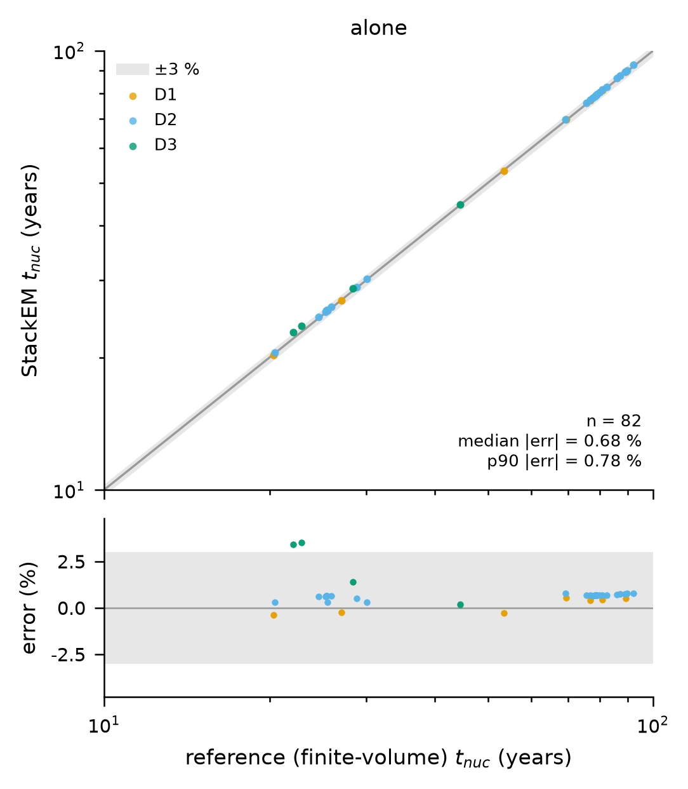

`alone` 变体下芯片更冷，成核时间都在 20 年以上，所以横轴从 10 年开始，图上没有 10 年线。大部分点的误差是正的零点几个百分点，D3 有两个点略超出正 3 % 的灰带。

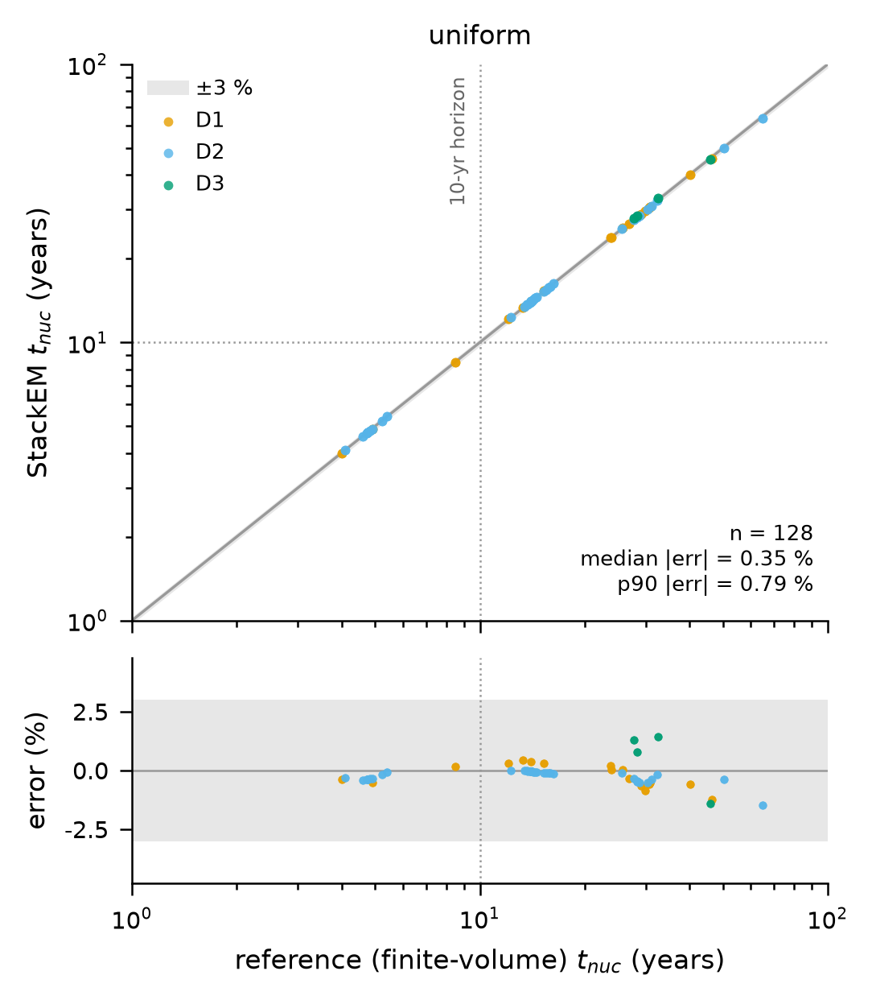

`uniform` 变体。分布与 `full` 相似，10 年内的点集中在 4 到 5 年。D3 的点仍是误差最大的一组。

### 5.2 quad4，学生引擎

四层芯片各 122 条轨，共 488 条。使用 base3 的学生权重，不重新训练。

合并统计：

| 变体 | n | 中位 % | p90 % | 最大 % | 带符号中位 % | 10 年内 n | 10 年内中位 % |
|---|---|---|---|---|---|---|---|
| `full` | 289 | 0.37 | 1.30 | 3.09 | -0.30 | 47 | 0.37 |
| `alone` | 86 | 0.38 | 1.09 | 4.97 | 0.38 | 0 | 无 |
| `uniform` | 288 | 0.49 | 1.11 | 3.22 | -0.37 | 70 | 0.61 |

逐芯片指标，误差列都是百分数：

| 变体 | 芯片 | n | 成核轨数 | t_nuc 中位 | t_nuc p90 | t_nuc 最大 | 应力 rel-L2 中位 | 应力 rel-L2 p90 | 成核判断一致率 | Top-10 命中 | Kendall |
|---|---|---|---|---|---|---|---|---|---|---|---|
| `full` | D1 | 122 | 113 | 0.242 | 1.430 | 2.644 | 0.157 | 0.378 | 0.9918 | 0.9 | 0.984 |
| `full` | D2 | 122 | 48 | 0.507 | 0.827 | 1.287 | 0.036 | 0.100 | 1.0000 | 1.0 | 0.998 |
| `full` | D3 | 122 | 120 | 0.345 | 0.410 | 1.083 | 0.077 | 0.182 | 1.0000 | 1.0 | 1.000 |
| `full` | D4 | 122 | 8 | 2.394 | 3.084 | 3.091 | 0.036 | 0.044 | 1.0000 | 1.0 | 1.000 |
| `alone` | D1 | 122 | 30 | 0.503 | 0.530 | 0.690 | 0.030 | 0.092 | 1.0000 | 1.0 | 1.000 |
| `alone` | D2 | 122 | 8 | 0.767 | 1.491 | 1.539 | 0.013 | 0.060 | 1.0000 | 1.0 | 1.000 |
| `alone` | D3 | 122 | 40 | 0.354 | 0.461 | 1.005 | 0.025 | 0.130 | 1.0000 | 1.0 | 0.996 |
| `alone` | D4 | 122 | 8 | 1.307 | 4.916 | 4.973 | 0.028 | 0.052 | 1.0000 | 1.0 | 0.989 |
| `uniform` | D1 | 122 | 114 | 0.488 | 1.074 | 1.938 | 0.158 | 0.377 | 0.9836 | 1.0 | 0.997 |
| `uniform` | D2 | 122 | 46 | 1.112 | 1.390 | 2.171 | 0.038 | 0.099 | 1.0000 | 1.0 | 1.000 |
| `uniform` | D3 | 122 | 120 | 0.293 | 0.610 | 0.692 | 0.081 | 0.180 | 1.0000 | 1.0 | 0.995 |
| `uniform` | D4 | 122 | 8 | 2.494 | 3.198 | 3.216 | 0.032 | 0.039 | 1.0000 | 1.0 | 1.000 |

堆叠级摘要，每格是“代理解 对 参考解”：

| 变体 | 最早成核 年 | 最先失效的芯片 | 10 年内成核轨数 | 100 年内成核轨数 | 耗时 秒 |
|---|---|---|---|---|---|
| `full` | 3.948 对 3.951 | D3 对 D3 | 48 对 47 | 290 对 289 | 45.4 对 13.6 |
| `alone` | 20.375 对 20.384 | D3 对 D3 | 0 对 0 | 86 对 86 | 45.4 对 13.9 |
| `uniform` | 3.589 对 3.591 | D3 对 D3 | 70 对 70 | 290 对 288 | 44.9 对 13.8 |

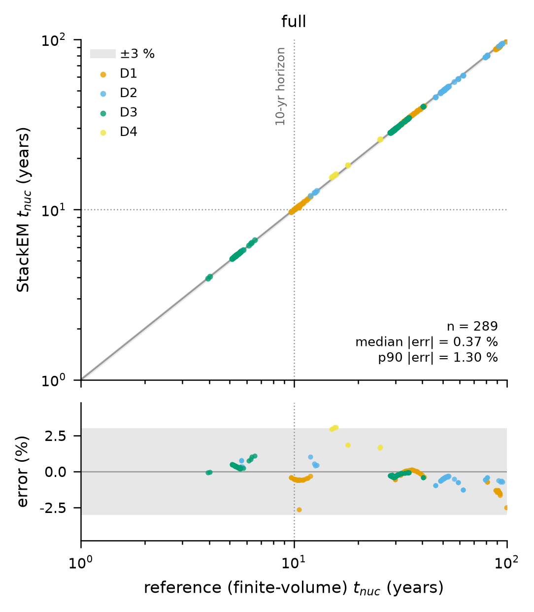

读法同前，多了黄色的 D4。下半幅里同一层芯片的点连成弯曲的短弧，这是相邻轨的电流和温度连续变化的结果。黄色 D4 的几个点在正 2 % 到 3 % 之间，贴着灰带上沿。有一个橙色 D1 的点孤立在负 2.6 % 处，位置正好在 10 年线右侧；图的最右端有几个 D1 的点接近 100 年的时间窗上限，误差向负方向滑到 2.5 % 左右。

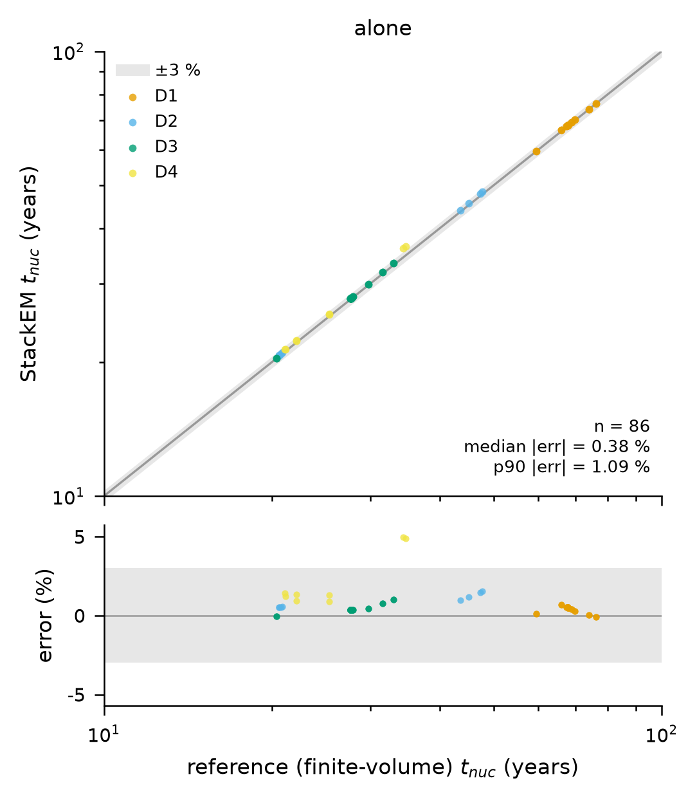

`alone` 变体。有两个黄色 D4 的点在正 5 % 处，超出灰带，其余都在灰带内。

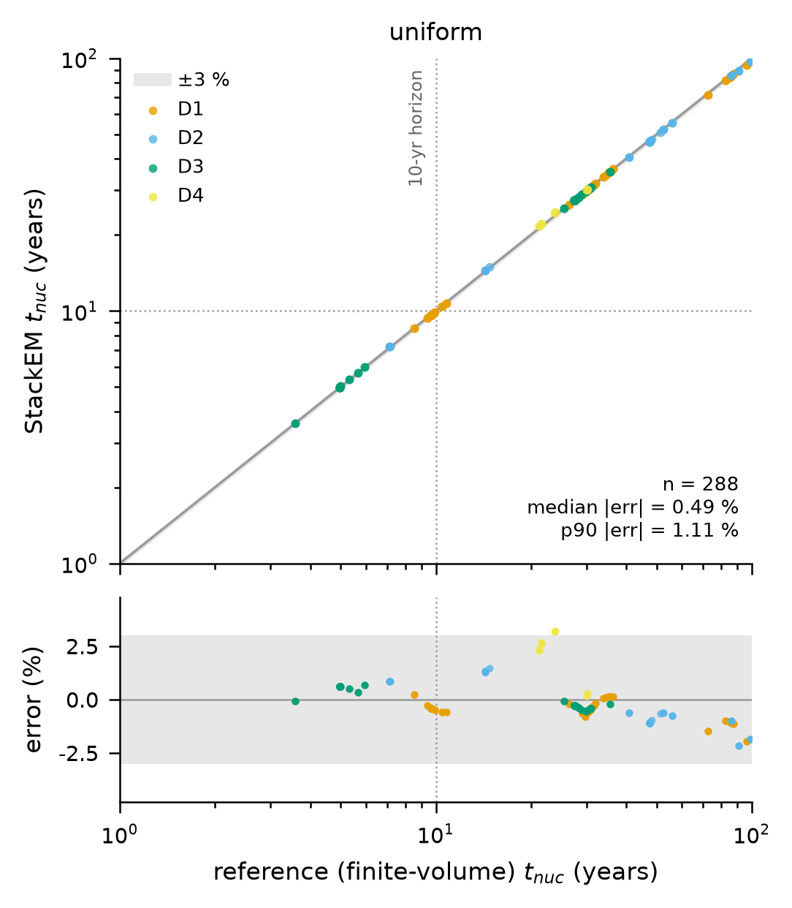

`uniform` 变体。D4 的三个点在正 2.5 % 到 3 % 附近，其余在正负 2.5 % 以内。

quad4 上有三处代理解与参考解的判断不一致，都发生在边界上：

1. `full` 变体，D1 的 H38：参考解 10.032 年，代理解 9.979 年。两者相差不到 1 %，但正好落在 10 年线的两侧，所以代理解的 10 年内成核轨数比参考解多一条。
2. `full` 变体，D1 的 V48：代理解判它在 99.8 年成核，参考解在约 100 年的时间窗内没有成核。这使 D1 的成核判断一致率低于 1。D1 的 Top-10 命中率 0.9 则来自另一处：D1 最早的十来条轨成核时间都挤在 10 年附近，彼此只差千分之几，代理解把第 10 名和第 11 名调换了。
3. `uniform` 变体，D1 的 H56 和 V56：同样是代理解在时间窗末端判为成核，参考解没有。

### 5.3 dense3，学生引擎

三层芯片各 162 条轨，共 486 条，每条轨 80 段。使用 base3 的学生权重。

合并统计：

| 变体 | n | 中位 % | p90 % | 最大 % | 带符号中位 % | 10 年内 n | 10 年内中位 % |
|---|---|---|---|---|---|---|---|
| `full` | 136 | 1.83 | 2.88 | 4.28 | -1.83 | 10 | 0.26 |
| `alone` | 32 | 0.68 | 2.41 | 127.19 | -0.64 | 0 | 无 |
| `uniform` | 136 | 1.32 | 3.53 | 6.22 | -1.32 | 4 | 0.47 |

逐芯片指标，误差列都是百分数：

| 变体 | 芯片 | n | 成核轨数 | t_nuc 中位 | t_nuc p90 | t_nuc 最大 | 应力 rel-L2 中位 | 应力 rel-L2 p90 | 成核判断一致率 | Top-10 命中 | Kendall |
|---|---|---|---|---|---|---|---|---|---|---|---|
| `full` | D1 | 162 | 28 | 1.570 | 2.983 | 3.113 | 0.186 | 0.371 | 1.0000 | 1.0 | 0.990 |
| `full` | D2 | 162 | 100 | 1.799 | 2.380 | 2.925 | 0.295 | 0.822 | 1.0000 | 1.0 | 0.987 |
| `full` | D3 | 162 | 8 | 4.015 | 4.275 | 4.275 | 0.061 | 0.139 | 1.0000 | 1.0 | 1.000 |
| `alone` | D1 | 162 | 4 | 64.260 | 127.191 | 127.191 | 0.013 | 0.049 | 1.0000 | 1.0 | 0.979 |
| `alone` | D2 | 162 | 20 | 0.651 | 0.814 | 0.928 | 0.021 | 0.220 | 1.0000 | 1.0 | 0.990 |
| `alone` | D3 | 162 | 8 | 2.211 | 2.429 | 2.430 | 0.050 | 0.183 | 1.0000 | 1.0 | 0.989 |
| `uniform` | D1 | 162 | 28 | 1.546 | 2.771 | 3.361 | 0.189 | 0.376 | 1.0000 | 1.0 | 0.993 |
| `uniform` | D2 | 162 | 100 | 0.877 | 3.522 | 3.551 | 0.299 | 0.828 | 1.0000 | 1.0 | 0.993 |
| `uniform` | D3 | 162 | 8 | 5.304 | 6.224 | 6.224 | 0.056 | 0.121 | 1.0000 | 1.0 | 1.000 |

堆叠级摘要，每格是“代理解 对 参考解”：

| 变体 | 最早成核 年 | 最先失效的芯片 | 10 年内成核轨数 | 100 年内成核轨数 | 耗时 秒 |
|---|---|---|---|---|---|
| `full` | 4.343 对 4.331 | D2 对 D2 | 10 对 10 | 136 对 136 | 42.9 对 12.7 |
| `alone` | 24.581 对 23.026 | D3 对 D1 | 0 对 0 | 32 对 32 | 43.1 对 12.9 |
| `uniform` | 9.294 对 9.335 | D1 对 D1 | 4 对 4 | 136 对 136 | 43.2 对 13.3 |

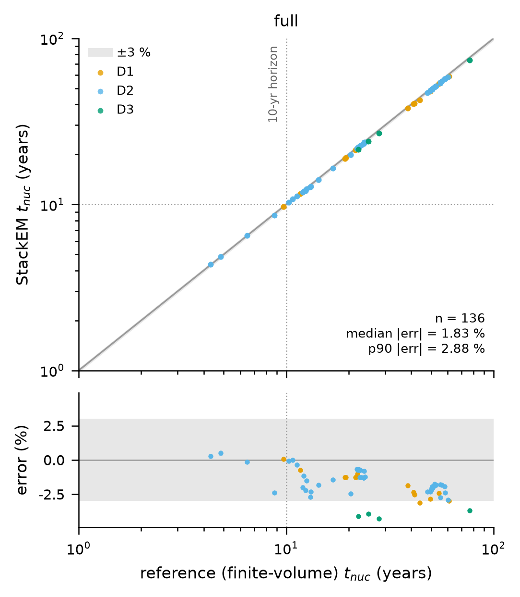

上半幅的点仍贴着对角线，下半幅显示出系统性的负偏：10 年以后的点几乎都在零线以下，越晚越低，D3 的四个绿点落在负 3.5 % 到负 4.5 %，在灰带之外。10 年线左边的点误差很小。这就是为什么 dense3 的合并中位误差比 base3 大一个量级，而只统计 10 年内的轨时又很小。

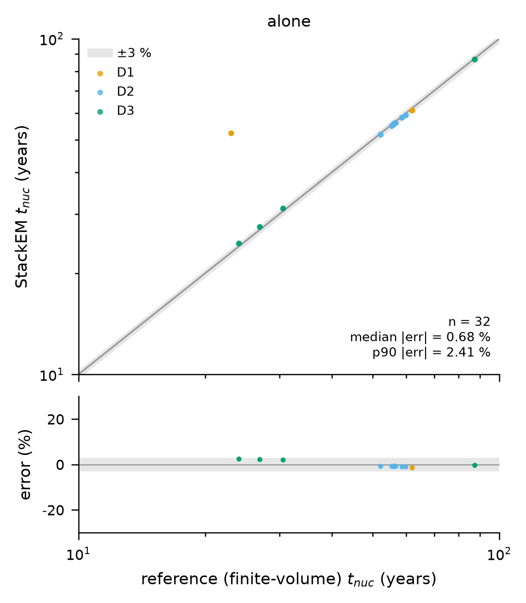

上半幅左上方有一个孤立的橙色点，远离对角线：参考解约 23 年，代理解约 52 年。下半幅的纵轴被它撑到正负 20 % 以上，这个点本身超出了下半幅的显示范围，只在上半幅可见。其余点都在灰带内。

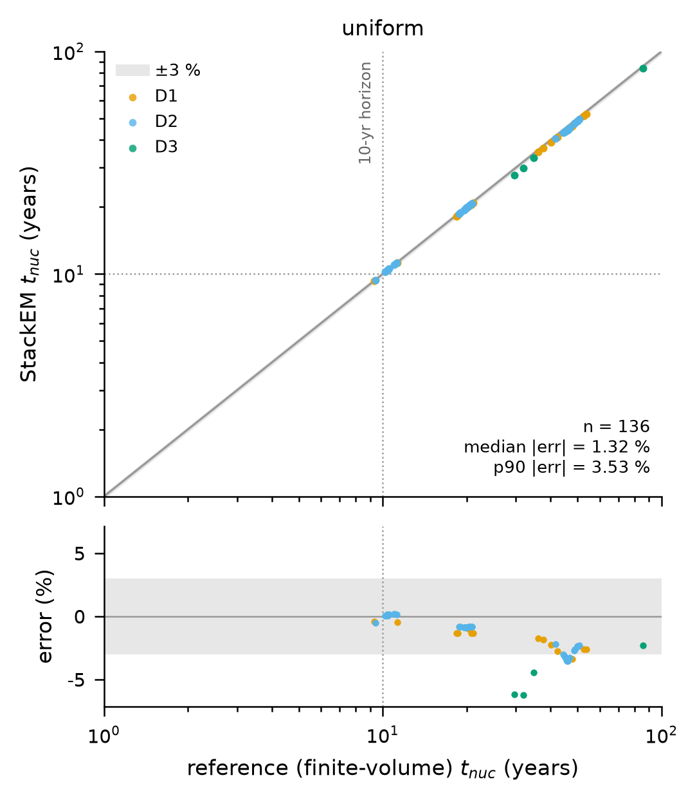

`uniform` 变体。同样的负偏，D3 有两个点在负 6 % 附近。

dense3 `alone` 变体里 D1 的大误差需要单独说明。D1 在这个变体下只有 4 条轨成核，成对出现，因为横向和纵向的同号轨是对称的：

| 轨 | 参考解 年 | 代理解 年 |
|---|---|---|
| H68 与 V68 | 62.03 | 61.21 |
| H76 与 V76 | 23.03 | 52.31 |

H76 和 V76 的代理解比参考解晚一倍多，D1 的中位误差因此达到 64 %，堆叠最先失效的芯片也判错了。这两条轨正是定线宽时决定 D1 线宽的轨，见 [03_签核定线宽.md](03_签核定线宽.md) 5.3 节：D1 的定线宽曲线在选定点右边一格发生跳变，最早成核时间从 23 年跳到 56 年。合理的解释是这条轨的最大应力在 23 年前后只是刚刚碰到临界应力，之后要到 50 多年才明显越过；代理解的应力只要低千分之几，就会错过第一次触碰，成核时间跳到后一次。这条轨的应力 rel-L2 误差本身很小，上表 D1 一行的中位数只有万分之一量级。这个解释是推断，没有逐时刻的应力曲线可以直接验证，因为应力数组不在仓库里。

### 5.4 base3，教师引擎

与 5.1 节同一个堆叠、同一组线宽，引擎换成教师网络直接求值，64 个输出时刻。

合并统计：

| 变体 | n | 中位 % | p90 % | 最大 % | 带符号中位 % | 10 年内 n | 10 年内中位 % |
|---|---|---|---|---|---|---|---|
| `full` | 128 | 0.22 | 1.49 | 4.73 | 0.20 | 26 | 0.25 |
| `alone` | 82 | 0.37 | 0.99 | 2.49 | -0.36 | 0 | 无 |
| `uniform` | 128 | 0.22 | 0.36 | 1.44 | 0.22 | 26 | 0.03 |

逐芯片指标，误差列都是百分数：

| 变体 | 芯片 | n | 成核轨数 | t_nuc 中位 | t_nuc p90 | t_nuc 最大 | 应力 rel-L2 中位 | 应力 rel-L2 p90 | 成核判断一致率 | Top-10 命中 | Kendall |
|---|---|---|---|---|---|---|---|---|---|---|---|
| `full` | D1 | 82 | 38 | 0.228 | 0.415 | 0.444 | 0.025 | 0.064 | 1.0000 | 1.0 | 0.989 |
| `full` | D2 | 82 | 82 | 0.192 | 0.610 | 4.732 | 0.043 | 0.781 | 1.0000 | 1.0 | 0.987 |
| `full` | D3 | 82 | 8 | 2.274 | 2.389 | 2.389 | 0.023 | 0.036 | 1.0000 | 1.0 | 0.995 |
| `alone` | D1 | 82 | 14 | 0.842 | 1.372 | 1.536 | 0.009 | 0.072 | 1.0000 | 1.0 | 0.992 |
| `alone` | D2 | 82 | 60 | 0.356 | 0.491 | 0.730 | 0.044 | 0.134 | 1.0000 | 1.0 | 0.983 |
| `alone` | D3 | 82 | 8 | 1.783 | 2.487 | 2.487 | 0.035 | 0.083 | 1.0000 | 1.0 | 0.995 |
| `uniform` | D1 | 82 | 38 | 0.193 | 0.246 | 0.358 | 0.019 | 0.060 | 1.0000 | 1.0 | 0.992 |
| `uniform` | D2 | 82 | 82 | 0.218 | 0.342 | 0.980 | 0.046 | 0.940 | 1.0000 | 1.0 | 0.994 |
| `uniform` | D3 | 82 | 8 | 1.281 | 1.439 | 1.439 | 0.012 | 0.023 | 1.0000 | 1.0 | 0.995 |

堆叠级摘要，每格是“代理解 对 参考解”：

| 变体 | 最早成核 年 | 最先失效的芯片 | 10 年内成核轨数 | 100 年内成核轨数 | 耗时 秒 |
|---|---|---|---|---|---|
| `full` | 2.425 对 2.389 | D2 对 D2 | 26 对 26 | 128 对 128 | 251.4 对 4.3 |
| `alone` | 20.309 对 20.357 | D2 对 D1 | 0 对 0 | 82 对 82 | 270.1 对 4.5 |
| `uniform` | 4.009 对 4.008 | D1 对 D1 | 26 对 26 | 128 对 128 | 251.1 对 4.2 |

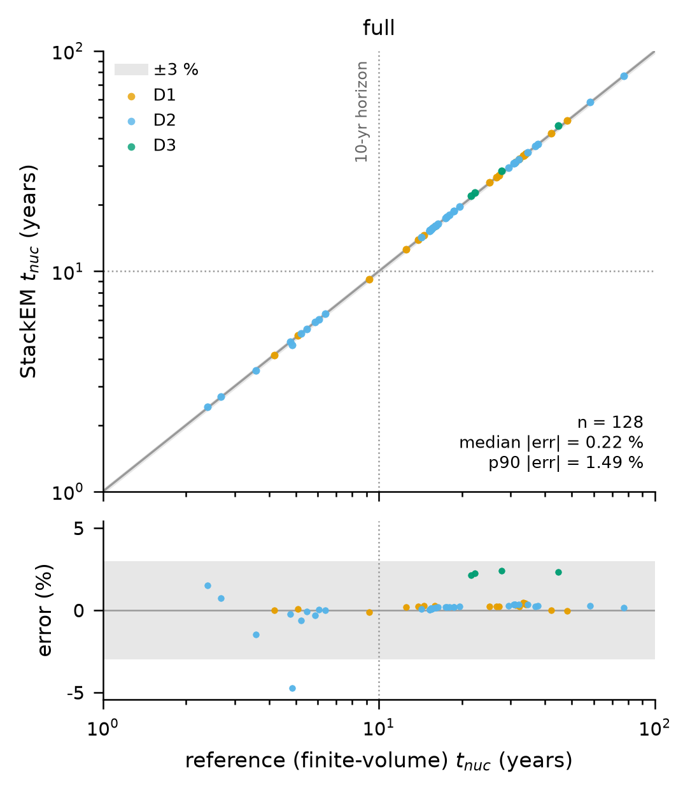

与学生引擎的图相比，10 年以后的点更集中在零线附近，D3 的四个绿点都在正 2 % 到 2.5 %。10 年线左边有一个蓝色 D2 的点在负 4.7 % 处，超出灰带，对应 D2 的 H22 和 V22 两条轨，参考解约 4.9 年。这一个离群点使教师引擎 D2 的最大误差大于学生引擎。

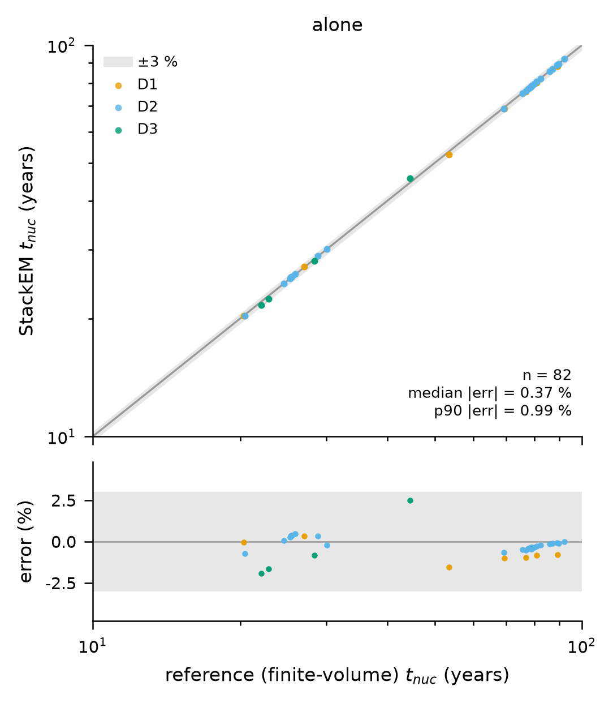

`alone` 变体。所有点在灰带内。这个变体下代理解判最先失效的芯片是 D2，参考解是 D1：两层芯片最早的成核时间只差 0.1 年，代理解的误差足以调换次序。

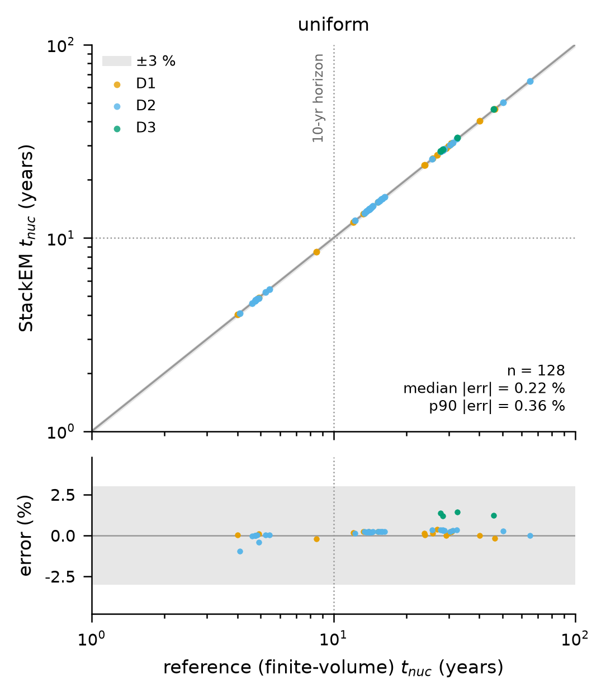

`uniform` 变体。除 D3 的几个点在正 1.3 % 附近外，其余都在正负 1 % 以内。

### 5.5 base3，消融网络

同一个堆叠和线宽，网络换成带方程残差训练的那一个，引擎设置与教师相同。

合并统计：

| 变体 | n | 中位 % | p90 % | 最大 % | 带符号中位 % | 10 年内 n | 10 年内中位 % |
|---|---|---|---|---|---|---|---|
| `full` | 128 | 0.10 | 0.28 | 2.31 | 0.04 | 26 | 0.23 |
| `alone` | 82 | 1.34 | 1.52 | 2.99 | -1.30 | 0 | 无 |
| `uniform` | 128 | 0.10 | 0.30 | 0.73 | -0.03 | 26 | 0.15 |

逐芯片指标，误差列都是百分数：

| 变体 | 芯片 | n | 成核轨数 | t_nuc 中位 | t_nuc p90 | t_nuc 最大 | 应力 rel-L2 中位 | 应力 rel-L2 p90 | 成核判断一致率 | Top-10 命中 | Kendall |
|---|---|---|---|---|---|---|---|---|---|---|---|
| `full` | D1 | 82 | 38 | 0.225 | 0.279 | 0.441 | 0.041 | 0.174 | 1.0000 | 1.0 | 0.987 |
| `full` | D2 | 82 | 82 | 0.076 | 0.262 | 0.535 | 0.082 | 0.268 | 1.0000 | 1.0 | 0.994 |
| `full` | D3 | 82 | 8 | 0.527 | 2.312 | 2.312 | 0.039 | 0.066 | 1.0000 | 1.0 | 1.000 |
| `alone` | D1 | 82 | 14 | 1.343 | 1.646 | 1.732 | 0.007 | 0.080 | 1.0000 | 1.0 | 0.992 |
| `alone` | D2 | 82 | 60 | 1.306 | 1.444 | 1.522 | 0.093 | 0.181 | 1.0000 | 1.0 | 0.996 |
| `alone` | D3 | 82 | 8 | 2.422 | 2.990 | 2.990 | 0.028 | 0.064 | 1.0000 | 1.0 | 0.995 |
| `uniform` | D1 | 82 | 38 | 0.236 | 0.329 | 0.417 | 0.039 | 0.104 | 1.0000 | 1.0 | 0.992 |
| `uniform` | D2 | 82 | 82 | 0.051 | 0.154 | 0.315 | 0.094 | 0.272 | 1.0000 | 1.0 | 0.993 |
| `uniform` | D3 | 82 | 8 | 0.169 | 0.727 | 0.727 | 0.023 | 0.035 | 1.0000 | 1.0 | 0.995 |

堆叠级摘要，每格是“代理解 对 参考解”：

| 变体 | 最早成核 年 | 最先失效的芯片 | 10 年内成核轨数 | 100 年内成核轨数 | 耗时 秒 |
|---|---|---|---|---|---|
| `full` | 2.402 对 2.389 | D2 对 D2 | 26 对 26 | 128 对 128 | 251.5 对 4.3 |
| `alone` | 20.314 对 20.357 | D2 对 D1 | 0 对 0 | 82 对 82 | 270.8 对 4.6 |
| `uniform` | 3.992 对 4.008 | D1 对 D1 | 26 对 26 | 128 对 128 | 252.0 对 4.4 |

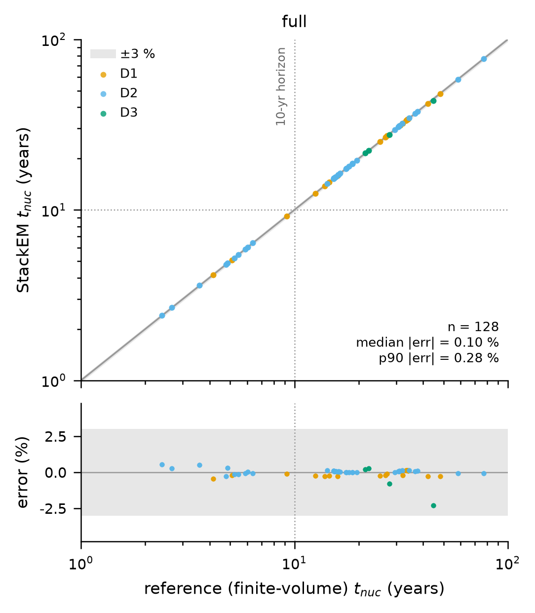

点比教师的图更贴近零线，只有 D3 的一个点在负 2.3 %。

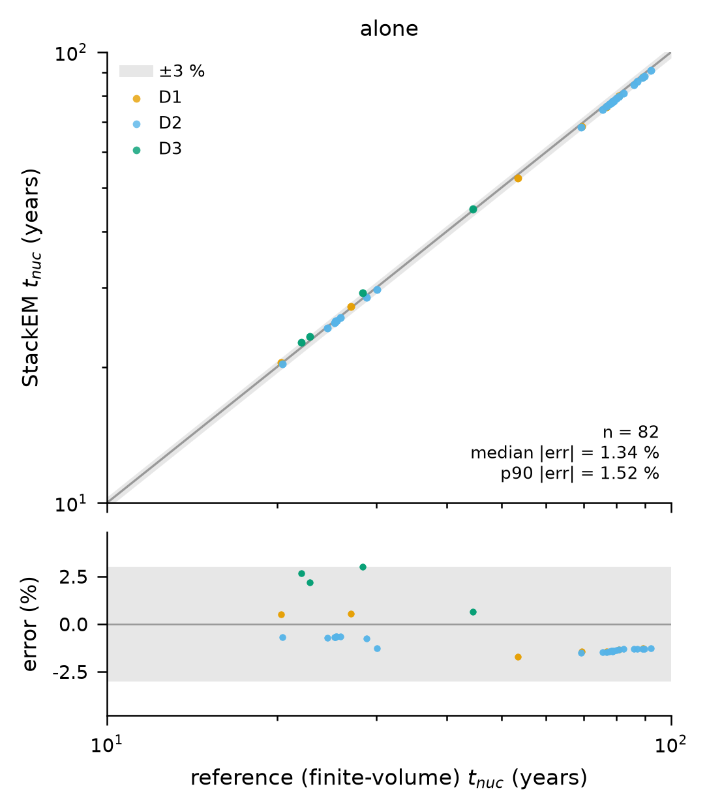

`alone` 变体。D2 的蓝点整体落在负 0.7 % 到负 1.5 %，有系统性的负偏；D3 的三个点在正 2 % 到 3 %。


`uniform` 变体。所有点在正负 1 % 以内。

## 6. 怎么理解

1. 在主算例 base3 上，学生引擎对 128 条会成核的轨的成核时间中位误差是 0.15 %，90 % 的轨在 0.90 % 以内，10 年内违例的 26 条轨一条不多一条不少。堆叠最早成核时间代理解 2.405 年对参考解 2.389 年，相差 0.66 %。
2. 零样本迁移成立。quad4 的芯片数、尺寸、功耗、热阻都与 base3 不同，中位误差仍在千分之几。
3. 签核真正关心的是 10 年内的轨。在这个范围内，三个堆叠的中位误差都不超过 0.4 %。
4. 误差最大的总是顶层的热芯片，base3 和 dense3 的 D3，quad4 的 D4。它们线宽大、电流密度低、成核晚，热迁移的贡献相对最大，而 $s_M$ 是网络拟合得最差的核函数。
5. 应力的误差比成核时间的误差小。成核时间是应力曲线与临界应力的交点，曲线越平，同样的应力误差换算成的时间误差越大。dense3 `alone` 的离群点是这一点的极端情形。
6. 5.0 节的表里，base3 上三个网络的合并中位误差从小到大依次是消融网络、学生引擎、教师引擎，三者都在千分之几以内。学生引擎并不比教师引擎差，它的闭合耗时不到教师引擎的十八分之一。

## 7. 论文用了哪些，哪些是论文之外的

| 论文中的说法 | 本章对应 |
|---|---|
| base3 上 128 条轨的中位 t_nuc 误差 0.15 %，p90 0.90 % | 5.1 节合并统计 `full` 一行 |
| 堆叠最早成核 2.405 年对 2.389 年，相差 0.7 % | 5.1 节堆叠级摘要 |
| 违例集合完全恢复 | 5.1 节，26 对 26 |
| quad4 中位 0.37 %，边界上多一条轨 | 5.2 节 |
| dense3 时限内 0.26 %，全部 136 条轨上 1.8 % | 5.3 节合并统计 |
| 消融表：D1、D2、D3 中位误差 0.26、0.14、1.7 % 对教师的 0.23、0.19、2.3 % | 5.1 和 5.4 节逐芯片表 `full` 三行 |
| 精度图左半：误差对参考成核时间的散点 | `base3/e2/e2_parity_full` 的下半幅 |

论文之外的内容：`alone` 和 `uniform` 两个变体的全部数字，应力 rel-L2，逐芯片的 Top-10 与 Kendall，闭合与参考解的耗时，消融网络的轨级结果，除 `base3/e2/e2_parity_full` 以外的 14 张图。

两处措辞上的出入：论文贡献列表写每个算例的中位误差在 0.15 % 到 1.4 % 之间，dense3 按全部会成核的轨统计是 1.8 %，只有限定在 10 年内才落进这个范围。论文签核对比表最后一行把 StackEM 的最早成核时间写成 2.39 年，结果文件里代理解的值是 2.405 年，论文正文写的也是 2.405。

## 8. 注意事项

1. dense3 的 `alone` 变体在 D1 的 H76、V76 两条轨上代理解误差超过 100 %，并使该变体最先失效的芯片判错，见 5.3 节。`alone` 变体不参与堆叠签核的结论，但 E7 里“芯片级签核”那一行的参考数字用的是参考解，不受影响。
2. dense3 的 `full` 变体有系统性的负偏，代理解整体偏早约 1.8 %。偏早意味着偏保守。原因没有查明；dense3 的轨有 80 段，是 base3 的两倍，闭合里误差的累积可能更明显。
3. quad4 多报一条边界轨，另有几条轨在时间窗末端被代理解判为成核，见 5.2 节。
4. 教师引擎的参考解与学生引擎的参考解不是逐位相同。例如 base3 `alone` 的最早成核时间，5.1 节是 20.3551 年，5.4 节是 20.3568 年。两种引擎的输出时刻数不同，参考求解器的内部时间步要落在输出时刻上，结果在万分之一量级上有差别，不影响任何计数。
5. 教师引擎在 `full` 变体的 D2 上有一个 4.7 % 的离群点，学生引擎没有。教师并不是在每条轨上都比学生准。
6. 误差统计只包含两种解法都成核的轨。只在一种解法里成核的轨不进入误差统计，只体现在成核判断一致率里。
7. 误差统计不设时间权重。一条 90 年才成核的轨与一条 3 年成核的轨权重相同。
8. D3 和 D4 每个变体只有 8 条轨成核，它们的 p90 与最大值几乎相等，统计意义有限。
9. 一层芯片会成核的轨少于 50 条时，`kendall_top50` 的排序里会混入成核时间为无穷的轨，它们成为并列值。
10. 合并统计没有存进任何摘要文件，只能从逐轨文件重算，或从图上读。论文引用的正是这组数字。
11. 对角图下半幅的纵轴范围有上限，超出的点不显示。
12. `base3_teacher` 和 `ablation_pde` 两个目录的 `_meta.cmd` 与 `config_used.json` 记录的是参考运行当时的写法，见 [00_总览.md](00_总览.md)。
