# 实验 E3 与 E7：物理分解与排序

本章说明六个目录：`reference_results/base3/e3/`、`quad4/e3/`、`dense3/e3/` 和对应的三个 `e7/`。E3 是整个项目的主要物理结果，E7 读取 E3 的输出做排序比较。核对清单是 `docs/checks/results_05.jsonl`。

## 1. 这个实验回答什么问题

芯片堆叠的设计流程里，每层芯片先作为独立的模块完成电迁移签核。现行做法有两种：

- 芯片级签核：用这层芯片自己单独封装时的温度场。
- 规则签核：整层芯片取一个最坏结温 105 °C，并假定残余应力是常数。

E3 的问题是：各层芯片按 10 年寿命、2 倍裕量定好线宽之后键合在一起，在真实的三维温度场下还剩多少寿命，哪些轨会在 10 年内失效，两种现行做法各自错在哪里、朝哪个方向错。E3 还把温度影响寿命的几条物理通道逐一关掉，看哪一条起主要作用；并移动顶层芯片热块的位置，看下层芯片的失效轨是否跟着热块走。

E7 的问题是：用简化物理代替完整物理，排出来的最危险轨名单和 10 年内失效的集合，与完整物理相比差多少。

术语：

- 残余应力 $\sigma_T$：导线从无应力温度冷却到工作温度后留下的初始拉应力，是成核过程的起点。温度越高它越小，离临界应力越远。
- 热迁移：温度梯度驱动的原子迁移。
- 导线自热：电流在导线上产生的焦耳热使导线温度略高于衬底。
- 热块：功耗明显高于周围的功耗块。base3 的 D3 在块 (1,1) 有一个 5 倍功耗的热块。
- 漏报与误报：完整物理判为 10 年内失效而某种做法没有判出的轨是漏报；某种做法判为失效而完整物理没有的是误报。
- Jaccard 系数：两个集合的交集大小除以并集大小，1 表示完全相同。

## 2. 原理与做法

### 2.1 七个变体

每个变体都给同一批轨、同一组电流，只改变温度和物理开关，代码在 `stackem/assembler.py`。

| 变体 | 图例名称 | 结点温度 | 残余应力 | 自热 | 热迁移 | 代表什么 |
|---|---|---|---|---|---|---|
| `alone` | die-level sign-off (standalone thermal) | 单独封装的温度场，单面散热 | 随温度变化 | 有 | 有 | 芯片级签核 |
| `uniform_signoff` | rule sign-off (uniform 105 °C, const. σT) | 全芯片 378.15 K | 常数，取 378.15 K 下的值 | 有 | 有 | 规则签核 |
| `uniform` | uniform die temperature | 全芯片取它在堆叠中的平均温度 | 随温度变化 | 有 | 有 | 由封装方提供一个平均温度的芯片级签核 |
| `sigmaT_const` | σT frozen at 2-D temperature | 堆叠三维温度场 | 常数，取单独封装平均温度下的值 | 有 | 有 | 只关掉“残余应力随温度变化”这条通道 |
| `no_joule` | no wire self-heating | 堆叠三维温度场 | 随温度变化 | 无 | 有 | 只关掉自热 |
| `no_tm` | no thermomigration | 堆叠三维温度场 | 随温度变化 | 有 | 无 | 只关掉热迁移 |
| `full` | full 3-D physics (FDM truth) | 堆叠三维温度场 | 随温度变化 | 有 | 有 | 完整物理，作为基准 |

所有变体用的都是按 `alone` 条件定出的线宽，见 [03_签核定线宽.md](03_签核定线宽.md)。七个变体全部用有限体积参考解求得，与网络无关。E3 的物理结论因此不依赖代理解是否准确。

### 2.2 E3 脚本流程

`stackem/experiments/e3_decomposition.py` 的步骤：

1. 读配置与定线宽结果，运行 HotSpot，求各层芯片电源网格的直流解。
2. 对七个变体依次求参考解，每个变体存一个 `e3_<变体>_truth.json`。
3. 对 `full` 变体再用 StackEM 代理解算一次，存为 `e3_full_stackem.json`，摘要写进 `stackem_overlay`。图里的 StackEM 曲线就是它。
4. 计算各项统计，画 12 张图。
5. 热块位置扫描：把顶层芯片的热块依次放到 (0,0)、(1,1)、(2,2)、(3,3)、(0,3) 五个位置，每个位置重跑 HotSpot 并只求 `full` 的参考解，结果存在 `hot_<i><j>/`。扫描时总功耗和热块倍数不变，线宽不重新定。

### 2.3 E3 的统计量

| 字段 | 定义 |
|---|---|
| `stack[变体]` | 全部轨里最早的成核时间及其所在芯片，10 年内和 100 年内成核的轨数，以及每层芯片的明细 |
| `mortal_counts[变体][芯片][年限]` | 成核时间不超过 1、10、100 年的轨数 |
| `immortal_counts[变体][芯片]` | 被判为不朽的轨数 |
| `effect_ratios[名称][芯片]` | 变体下该芯片最早成核时间除以 `full` 下该芯片最早成核时间。大于 1 表示这个变体估得比真实情况晚，是乐观，会漏掉失效；小于 1 是悲观，会产生误报 |
| `ratio_distributions[变体][芯片]` | 在两种情形下都成核的轨上，逐轨比值 `t_nuc(变体) / t_nuc(full)` 的第 5、50、95 百分位和轨数 |
| `min_margin_h[变体][芯片]` | 每条轨的裕量 `1 - 10 年内最大应力 / 临界应力` 在该芯片上的最小值。负值表示 10 年内越过了临界应力 |
| `thermal[芯片]` | 堆叠中与单独封装时的最低、最高、平均温度 |
| `vertical_screen` | 对每层芯片的硅通孔和键合焊盘算 Blech 乘积与临界值之比，小于 1 即不朽 |
| `cross_die_alignment[芯片]` | 下层芯片的失效轨是否集中在顶层热块正下方，见下 |
| `stackem_overlay` | 代理解对 `full` 的堆叠摘要 |
| `hotspot_sweep` | 五个热块位置各一条记录 |

对齐统计的算法。顶层芯片的功耗图里，功耗超过块平均功耗 1.5 倍的块算热块。下层芯片的一条轨只要有一段的中点落在热块的投影内，就算“穿越”热块。

- `share_of_rails_crossing_hot_block`：穿越热块的轨占该芯片全部轨的比例。
- `crossing_enrichment_signoff`，下文叫 10 年富集度：10 年内失效的轨里穿越热块的比例，除以上面的总体比例。等于 1 表示失效轨与热块位置无关，大于 1 表示热块在挑选失效轨。
- `tnuc_ratio_cross_over_noncross`：穿越与不穿越两组轨各自成核时间中位数之比。
- `spearman_rho` 与 `p_value`：轨的平均温度与成核时间对数之间的 Spearman 秩相关及其显著性。负值表示越热的轨失效越早。
- `earliest_rail_crosses_hot_block`：该芯片最早失效的轨是否穿越热块。

成核总发生在轨的端点或结点上，所以对齐效应体现在“哪些轨失效”，不体现在轨上的具体位置。

### 2.4 E7 的做法

`stackem/experiments/e7_ranking.py` 不做任何求解。它读 E3 目录里各变体的成核时间，把所有芯片的轨拼成一个向量，再把六个简化变体和代理解 `stackem` 分别与 `full` 比较。

| 字段 | 定义 |
|---|---|
| `top10`、`top50` | `full` 下成核最早的 k 条轨与该变体下最早的 k 条轨的交集大小除以 k |
| `top10_tol1pct` | 带 1 % 容差的 Top-10，用来排除并列名次的影响 |
| `kendall` | 在 `full` 最早的 50 条轨上，两种排序的 Kendall tau |
| `same_critical_die`、`same_earliest_rail` | 最早失效的轨是否在同一层芯片上、是否是同一条轨 |
| `mortal10_jaccard` | 10 年内失效集合的 Jaccard 系数 |
| `mortal10_missed`、`mortal10_false` | 漏报数和误报数 |
| `optimism_factor[芯片]` | 与 E3 的 `effect_ratios` 相同 |
| `earliest_years[芯片]` | 该变体下这层芯片的最早成核时间 |
| `top10_boundary_gap_rel` | `full` 排序里第 11 名与第 10 名成核时间的相对差。这个间隔很小时，极小的误差就能交换这两名 |

## 3. 怎么运行

| 步骤 | 命令 |
|---|---|
| `e3` | `python -m stackem.experiments.e3_decomposition --config configs/base3.json --root <根> --hotspot <HotSpot>` |
| `e7` | `python -m stackem.experiments.e7_ranking --config configs/base3.json --root <根> --hotspot <HotSpot>` |
| `quad4.e3`、`quad4.e7` | 同上，配置 `configs/quad4.json`，加 `--weights <根>/base3/skn_distill/skn_student.npz` |
| `dense3.e3`、`dense3.e7` | 同上，配置 `configs/dense3.json`，加同样的 `--weights` |

```bash
STACKEM_ONLY=e3,e7,quad4.e3,quad4.e7,dense3.e3,dense3.e7 bash scripts/run_all.sh
```

E7 必须在同一算例的 E3 之后运行。E3 可加 `--no-overlay` 跳过代理解，此时不需要网络权重，E7 的结果里会少 `stackem` 一行。运行时 E3 每个变体打印一行，形如 `full            4.5s  earliest 2.389 yr on D2; mortal10yr 26 /100yr 128`，随后每个热块位置打印一行，最后是 `[saved] .../e3_summary.json`。

参考机器上的耗时：

| 步骤 | 耗时 秒 | 来源 |
|---|---|---|
| `e3` | 97 | `logs/final_3_full.log` |
| `e7` | 2 | 同上 |
| `dense3.e3` | 233 | `logs/final_4_extras.log` |
| `dense3.e7` | 2 | 同上 |
| `quad4.e2`、`quad4.e3`、`quad4.e7` 合计 | 440 | `logs/final_3_full.log`，三步写在同一个标题下 |

单个变体的参考解耗时见第 5 节各算例的第一张表。

## 4. 输出文件

每个 `e3/` 目录 63 个文件，含五个热块子目录各 1 个文件。

| 文件 | 内容 |
|---|---|
| `e3_summary.json` | 2.3 节列出的全部统计，另有 `provider`、`sizing`、`pg`、`_meta` |
| `config_used.json` | 这次运行的完整配置 |
| `e3_<变体>_truth.json`，七个 | 参考解的逐轨记录和堆叠摘要，字段与 E2 的逐轨文件相同 |
| `e3_full_stackem.json` | 代理解对 `full` 的逐轨记录 |
| `hot_00/`、`hot_11/`、`hot_22/`、`hot_33/`、`hot_03/` | 各含一个 `e3_full_truth.json`，是该热块位置下的参考解 |
| 12 张图，每张有 `.png`、`.pdf`、`_data.json`、`_data.npz` | 见第 5 节 |

12 张图的名字：`e3_cdf`、`e3_cdf_paper`、`e3_diemaps_alone`、`e3_diemaps_full`、`e3_effect_ratios`、`e3_hotspot_alignment`、`e3_margin_alone`、`e3_margin_full`、`e3_margin_uniform_signoff`、`e3_stack3d_full`、`e3_stress_surface`、`e3_thermal_slice`。

每个 `e7/` 目录 10 个文件：`e7_ranking.json`、`config_used.json`，以及 `e7_ranking` 和 `e7_confusion` 两张图各自的四个文件。`e7_ranking.json` 含 `results`、`n_rails`、`n_mortal10_full`、`top10_boundary_gap_rel`、`e3_dir`、`full_summary`、`_meta`。

自己运行时 `e3/` 里还会有逐轨应力数组、轨的几何描述和 HotSpot 草稿目录，这些不在仓库里。E7 读的是应力数组文件里的成核时间，所以单独重跑 E7 需要先在本机跑过 E3。

## 5. 结果

### 5.1 base3

三层 4 mm 芯片，每层 82 条轨。D1 是底层 IO 芯片，2 W，自己在块 (3,3) 有一个 4 倍热块；D2 是中间的 SRAM 芯片，4 W，功耗均匀；D3 是顶层逻辑芯片，20 W，在块 (1,1) 有一个 5 倍热块，紧贴散热器。这是论文采用的主结果。

**表 a：堆叠级结果，参考解**

| 变体 | 含义 | 最早成核 年 | 最先失效的芯片 | 1 年内成核 | 10 年内成核 | 100 年内成核 | 不朽轨数 | 求解耗时 秒 |
|---|---|---|---|---|---|---|---|---|
| `alone` | 芯片级签核 | 20.355 | D1 | 0 | 0 | 82 | 62 | 4.7 |
| `uniform_signoff` | 规则签核 | 0.474 | D1 | 26 | 120 | 132 | 98 | 4.0 |
| `uniform` | 均匀芯片温度 | 4.008 | D1 | 0 | 26 | 128 | 76 | 4.4 |
| `sigmaT_const` | 冻结残余应力 | 1.495 | D2 | 0 | 34 | 130 | 62 | 4.8 |
| `no_joule` | 去掉自热 | 2.413 | D2 | 0 | 26 | 128 | 76 | 4.3 |
| `no_tm` | 去掉热迁移 | 2.393 | D2 | 0 | 26 | 128 | 74 | 4.3 |
| `full` | 完整物理 | 2.389 | D2 | 0 | 26 | 128 | 76 | 4.4 |

轨总数 246。

**表 b：逐芯片明细，参考解**

| 变体 | 芯片 | 最早成核 年 | 最早的轨 | 不朽轨数 | 1 / 10 / 100 年内成核 | 最小裕量 |
|---|---|---|---|---|---|---|
| `alone` | D1 | 20.355 | H38 | 0 | 0 / 0 / 14 | 0.138 |
| `alone` | D2 | 20.457 | H2 | 0 | 0 / 0 / 60 | 0.138 |
| `alone` | D3 | 22.072 | V15 | 62 | 0 / 0 / 8 | 0.043 |
| `uniform_signoff` | D1 | 0.474 | V38 | 34 | 6 / 38 / 42 | -2.143 |
| `uniform_signoff` | D2 | 0.482 | V2 | 0 | 20 / 82 / 82 | -2.110 |
| `uniform_signoff` | D3 | 25.782 | V15 | 64 | 0 / 0 / 8 | 0.010 |
| `uniform` | D1 | 4.008 | V38 | 14 | 0 / 6 / 38 | -0.358 |
| `uniform` | D2 | 4.102 | V2 | 0 | 0 / 20 / 82 | -0.347 |
| `uniform` | D3 | 27.690 | V15 | 62 | 0 / 0 / 8 | 0.096 |
| `sigmaT_const` | D1 | 3.145 | V38 | 0 | 0 / 8 / 40 | -0.402 |
| `sigmaT_const` | D2 | 1.495 | V14 | 0 | 0 / 20 / 82 | -0.632 |
| `sigmaT_const` | D3 | 7.349 | H15 | 62 | 0 / 6 / 8 | -0.014 |
| `no_joule` | D1 | 4.169 | V38 | 14 | 0 / 6 / 38 | -0.334 |
| `no_joule` | D2 | 2.413 | V14 | 0 | 0 / 20 / 82 | -0.529 |
| `no_joule` | D3 | 21.494 | H15 | 62 | 0 / 0 / 8 | 0.039 |
| `no_tm` | D1 | 4.164 | V38 | 12 | 0 / 6 / 38 | -0.335 |
| `no_tm` | D2 | 2.393 | V14 | 0 | 0 / 20 / 82 | -0.529 |
| `no_tm` | D3 | 23.863 | H15 | 62 | 0 / 0 / 8 | 0.041 |
| `full` | D1 | 4.166 | V38 | 14 | 0 / 6 / 38 | -0.335 |
| `full` | D2 | 2.389 | V14 | 0 | 0 / 20 / 82 | -0.530 |
| `full` | D3 | 21.508 | H15 | 62 | 0 / 0 / 8 | 0.039 |

**表 c：效应比值，各变体的芯片最早成核时间除以 `full` 的**

| 变体 | 含义 | D1 | D2 | D3 |
|---|---|---|---|---|
| `alone` | 芯片级签核 | 4.886 | 8.562 | 1.026 |
| `uniform_signoff` | 规则签核 | 0.114 | 0.202 | 1.199 |
| `uniform` | 均匀芯片温度 | 0.962 | 1.717 | 1.287 |
| `sigmaT_const` | 冻结残余应力 | 0.755 | 0.626 | 0.342 |
| `no_joule` | 去掉自热 | 1.001 | 1.010 | 0.999 |
| `no_tm` | 去掉热迁移 | 1.000 | 1.002 | 1.110 |

**表 d：逐轨比值 `t_nuc(变体) / t_nuc(full)` 的分布**

| 变体 | 芯片 | 轨数 | 第 5 百分位 | 中位数 | 第 95 百分位 |
|---|---|---|---|---|---|
| `alone` | D1 | 14 | 4.886 | 5.543 | 5.801 |
| `alone` | D2 | 60 | 4.333 | 4.921 | 9.517 |
| `alone` | D3 | 8 | 0.997 | 1.022 | 1.026 |
| `uniform_signoff` | D1 | 38 | 0.100 | 0.112 | 0.129 |
| `uniform_signoff` | D2 | 82 | 0.097 | 0.106 | 0.153 |
| `uniform_signoff` | D3 | 8 | 1.199 | 1.288 | 1.454 |
| `uniform` | D1 | 38 | 0.874 | 0.942 | 0.964 |
| `uniform` | D2 | 82 | 0.837 | 0.880 | 1.318 |
| `uniform` | D3 | 8 | 1.029 | 1.219 | 1.287 |
| `sigmaT_const` | D1 | 38 | 0.572 | 0.768 | 0.811 |
| `sigmaT_const` | D2 | 82 | 0.676 | 0.794 | 0.804 |
| `sigmaT_const` | D3 | 8 | 0.338 | 0.342 | 0.365 |
| `no_joule` | D1 | 38 | 1.000 | 1.000 | 1.001 |
| `no_joule` | D2 | 82 | 1.000 | 1.000 | 1.010 |
| `no_joule` | D3 | 8 | 0.999 | 0.999 | 0.999 |
| `no_tm` | D1 | 38 | 0.999 | 1.000 | 1.000 |
| `no_tm` | D2 | 82 | 0.999 | 0.999 | 1.000 |
| `no_tm` | D3 | 8 | 1.105 | 1.125 | 1.172 |

**表 e：对齐统计，`full` 变体**

| 芯片 | 穿越热块的轨占比 | 热块面积占比 | 10 年内成核 / 其中穿越 | 10 年富集度 | 100 年内成核 / 其中穿越 | 100 年富集度 | 成核时间中位比，穿越对不穿越 | Spearman | p 值 | 最早的轨穿越热块 |
|---|---|---|---|---|---|---|---|---|---|---|
| D1 | 0.2439 | 0.0625 | 6 / 0 | 0.000 | 38 / 6 | 0.647 | 1.289 | 0.397 | 0.0136 | 否 |
| D2 | 0.2439 | 0.0625 | 20 / 6 | 1.230 | 82 / 20 | 1.000 | 0.931 | -0.316 | 0.0038 | 是 |

**表 f：热块位置扫描，堆叠级**

| 顶层热块位置 | 目录 | 顶层芯片平均温度 K | 顶层芯片最高温度 K | 堆叠最早成核 年 | 最先失效的芯片 | 顶层 D3 的 10 年内成核轨数 |
|---|---|---|---|---|---|---|
| (0, 0) | `hot_00` | 344.45 | 364.43 | 0.803 | D3 | 12 |
| (1, 1) | `hot_11` | 344.59 | 359.87 | 2.389 | D2 | 0 |
| (2, 2) | `hot_22` | 344.59 | 359.94 | 2.462 | D2 | 0 |
| (3, 3) | `hot_33` | 344.45 | 366.21 | 0.953 | D1 | 10 |
| (0, 3) | `hot_03` | 344.45 | 364.44 | 0.976 | D3 | 10 |

**表 g：热块位置扫描，顶层以下各芯片**

| 位置 | 芯片 | 最早成核 年 | 最早的轨 | 10 年内成核 | 100 年内成核 | 10 年富集度 | 100 年富集度 | 成核时间中位比 | Spearman | 最早的轨穿越热块 | 穿越占比 |
|---|---|---|---|---|---|---|---|---|---|---|---|
| (0, 0) | D1 | 4.207 | H38 | 10 | 38 | 1.640 | 0.432 | 0.319 | 0.012 | 否 | 0.2439 |
| (0, 0) | D2 | 1.110 | V2 | 34 | 82 | 1.929 | 1.000 | 0.254 | -0.636 | 是 | 0.2439 |
| (1, 1) | D1 | 4.166 | V38 | 6 | 38 | 0.000 | 0.647 | 1.289 | 0.397 | 否 | 0.2439 |
| (1, 1) | D2 | 2.389 | V14 | 20 | 82 | 1.230 | 1.000 | 0.931 | -0.316 | 是 | 0.2439 |
| (2, 2) | D1 | 4.011 | V38 | 6 | 38 | 0.000 | 0.647 | 1.224 | -0.177 | 否 | 0.2439 |
| (2, 2) | D2 | 2.462 | H26 | 20 | 82 | 0.820 | 1.000 | 1.013 | -0.021 | 是 | 0.2439 |
| (3, 3) | D1 | 0.953 | H38 | 18 | 38 | 3.727 | 2.158 | 0.111 | -0.835 | 是 | 0.2683 |
| (3, 3) | D2 | 1.376 | H38 | 30 | 82 | 1.988 | 1.000 | 0.292 | -0.469 | 是 | 0.2683 |
| (0, 3) | D1 | 4.160 | V38 | 7 | 38 | 2.231 | 1.336 | 0.432 | -0.211 | 否 | 0.2561 |
| (0, 3) | D2 | 1.317 | H38 | 33 | 82 | 2.012 | 1.000 | 0.282 | -0.502 | 是 | 0.2561 |

**表 h：StackEM 代理解对 `full`**

| 最早成核 年 | 最先失效的芯片 | 10 年内成核 | 100 年内成核 | 耗时 秒 | D1 最早 年 / 轨 | D2 最早 年 / 轨 | D3 最早 年 / 轨 |
|---|---|---|---|---|---|---|---|
| 2.405 | D2 | 26 | 128 | 13.4 | 4.147 / V38 | 2.405 / V14 | 22.012 / H15 |

**表 i：垂直互连的 Blech 筛查**

| 类型 | 芯片 | 直径 µm | 高度 µm | 单个电流 mA | 温度 K | jL A/cm | 临界 jL A/cm | 比值 | 不朽 |
|---|---|---|---|---|---|---|---|---|---|
| 硅通孔 | D1 | 5.0 | 50.0 | 0.250 | 344.90 | 6.37 | 1239.5 | 0.00514 | 是 |
| 键合焊盘 | D1 | 3.0 | 3.0 | 5.000 | 344.90 | 21.22 | 1239.5 | 0.01712 | 是 |
| 硅通孔 | D2 | 5.0 | 50.0 | 0.500 | 344.83 | 12.73 | 1239.0 | 0.01028 | 是 |
| 键合焊盘 | D2 | 3.0 | 3.0 | 5.000 | 344.83 | 21.22 | 1239.0 | 0.01713 | 是 |
| 键合焊盘 | D3 | 3.0 | 3.0 | 5.000 | 344.59 | 21.22 | 1237.4 | 0.01715 | 是 |

**表 j：E7 排序结果**

轨总数 246，`full` 下 10 年内成核 26 条，参考解第 10 名与第 11 名成核时间的相对间隔 1.47 %。

| 变体 | 含义 | Top-10 | Top-10 带 1 % 容差 | Top-50 | Kendall | 最先失效的芯片相同 | 最早的轨相同 | Jaccard | 漏报 | 误报 |
|---|---|---|---|---|---|---|---|---|---|---|
| `alone` | 芯片级签核 | 0.40 | 0.40 | 0.76 | 0.7002 | 否 | 否 | 0.0000 | 26 | 0 |
| `uniform_signoff` | 规则签核 | 0.80 | 0.80 | 0.92 | 0.7299 | 否 | 否 | 0.2167 | 0 | 94 |
| `uniform` | 均匀芯片温度 | 0.80 | 0.80 | 0.92 | 0.7697 | 否 | 否 | 1.0000 | 0 | 0 |
| `sigmaT_const` | 冻结残余应力 | 0.80 | 0.80 | 0.88 | 0.9763 | 是 | 是 | 0.7647 | 0 | 8 |
| `no_joule` | 去掉自热 | 1.00 | 1.00 | 1.00 | 0.9898 | 是 | 是 | 1.0000 | 0 | 0 |
| `no_tm` | 去掉热迁移 | 1.00 | 1.00 | 1.00 | 0.9914 | 是 | 是 | 1.0000 | 0 | 0 |
| `stackem` | StackEM 代理解 | 1.00 | 1.00 | 1.00 | 0.9910 | 是 | 是 | 1.0000 | 0 | 0 |

| 变体 | D1 最早 年 | D2 最早 年 | D3 最早 年 | D1 乐观倍数 | D2 乐观倍数 | D3 乐观倍数 |
|---|---|---|---|---|---|---|
| `alone` | 20.355 | 20.457 | 22.072 | 4.886 | 8.562 | 1.026 |
| `uniform_signoff` | 0.474 | 0.482 | 25.782 | 0.114 | 0.202 | 1.199 |
| `uniform` | 4.008 | 4.102 | 27.690 | 0.962 | 1.717 | 1.287 |
| `sigmaT_const` | 3.145 | 1.495 | 7.349 | 0.755 | 0.626 | 0.342 |
| `no_joule` | 4.169 | 2.413 | 21.494 | 1.001 | 1.010 | 0.999 |
| `no_tm` | 4.164 | 2.393 | 23.863 | 1.000 | 1.002 | 1.110 |
| `stackem` | 4.147 | 2.405 | 22.012 | 0.995 | 1.007 | 1.023 |

#### 5.1.1 这些数字说明什么

**单独通过，键合后不通过。** `alone` 下三层芯片的最早成核时间都在 20 年以上，10 年内没有轨成核，这是定线宽规则保证的。键合后 D1 的平均温度升高 24.7 K，D2 升高 22.6 K，D3 只升高 6.1 K。三层芯片在堆叠里的平均温度和最高温度几乎相同：顶层的热斑穿过 5 µm 的键合层，原样投影到下面两层。`full` 下堆叠最早成核时间只有两年多，最先失效的是中间的 D2，10 年内有 26 条轨失效，D2 占 20 条，D1 占 6 条，D3 没有。

**芯片级签核是乐观的。** 表 c 第一行：D1 约 4.9 倍，D2 约 8.6 倍，D3 接近 1。受影响最大的恰好是单独看最凉的两层。D3 自己就是热源，单独封装时已经见过自己的热斑，键合前后几乎不变。

**规则签核是悲观的，排序仍然错。** `uniform_signoff` 把所有芯片放在 378.15 K，比堆叠里的实际温度高三十多度。D1、D2 的最早成核时间只有真实值的十分之一到五分之一，10 年内判出 120 条，是真实数量的四倍多。它判的最先失效芯片是 D1，真实情况是 D2。对 D3，规则反而略偏乐观。一个可能的原因：规则把残余应力固定在 378.15 K 对应的较低值，初始应力离临界值更远，在 D3 这种电流密度低的芯片上，这一点的影响超过了高温加速扩散的影响。这个解释没有单独的实验验证。

**只给一个平均温度也不够。** `uniform` 在 base3 上 10 年内成核的轨数与 `full` 相同，但最先失效的芯片判成了 D1：D2 的最早成核时间被估晚了约 1.7 倍。D2 最早失效的轨正好穿过热斑，局部温度远高于平均值，平均温度抹掉了这个差别。表 d 里 `uniform` 在 D2 上的逐轨比值从第 5 到第 95 百分位跨度很大，同一层芯片上有的轨被估早，有的被估晚，排序因此被打乱。

**残余应力随温度变化这条通道不能丢。** `sigmaT_const` 保留三维温度场，把残余应力冻结在单独封装温度下的值。单独封装时芯片更凉，残余应力更大，初始应力离临界值更近，再配上堆叠的高温扩散，结果偏悲观：三层芯片的比值都小于 1，D3 上只有三分之一左右，10 年内成核的轨数从 26 变成 34。升温有两个相反的效果：扩散变快使失效提前，残余应力下降使失效推后。完整物理同时包含两者。

**自热和热迁移是次要通道。** `no_joule` 的比值与 1 的偏差在三层芯片上都不超过 1 %。`no_tm` 在 D1、D2 上的偏差在千分之二以内，在 D3 上约 11 %：D3 自己的热块造成最陡的面内温度梯度，热迁移在那里才有可见的作用。这两个变体 10 年内和 100 年内成核的轨数与 `full` 完全相同。

**对齐效应。** 表 e 里 D2 是紧贴顶层的那一层。它最早失效的轨穿越热块，10 年富集度 1.23，Spearman 相关为负且显著。D1 的情况不同：10 年内失效的 6 条轨没有一条穿越顶层热块，Spearman 相关为正。D1 的失效轨集中在它自己的热块所在的角上，由 D1 自身的电流分布决定，顶层热块只是把整体温度抬高了。

**热块位置扫描。** 顶层芯片的总功耗不变，只把热块从 (1,1) 挪开：

1. 挪到 (0,0)、(0,3)、(3,3) 三个角时，D2 的 10 年内成核轨数从 20 升到 30 至 34，最早成核时间从两年多降到一年多，富集度升到 2 左右。
2. 挪到 (3,3) 时，热块投影正好落在 D1 自己的热块上，D1 的最早成核时间降到不足一年，D1 成为最先失效的芯片。
3. 挪到 (2,2) 时与 (1,1) 差别不大。
4. 挪到 (0,0) 和 (0,3) 时，堆叠里最先失效的变成顶层 D3 自己。表 f 最后一列显示，热块在三个角上时 D3 都有 10 条以上的轨在 10 年内成核，在 (1,1) 和 (2,2) 时没有。热块在角上时散热变差，顶层最高温度比在 (1,1) 时高四到六度。D3 的线宽是按热块在 (1,1) 定的，三个角上的 D3 自己已经不满足单独签核的前提。

同样的总功耗，不同的平面布局，下层芯片的寿命可以差一倍以上。

**垂直互连不是瓶颈。** 表 i 里硅通孔和键合焊盘的比值都在 0.02 以下，全部不朽。这是瞬态求解只处理电源轨的依据。

**代理解。** 表 h 的最先失效芯片、最早的轨、10 年和 100 年内成核的轨数都与 `full` 参考解相同，最早成核时间略晚。

**排序。** 表 j：

1. `alone` 漏掉全部 26 条，Jaccard 为零，Top-10 只有 0.4。
2. `uniform_signoff` 一条不漏，误报 94 条；最先失效的芯片和最早的轨都不对，Kendall 约 0.73。悲观并不等于排序正确。
3. `uniform` 的 10 年内集合与 `full` 完全相同，名次不对，Kendall 约 0.77。
4. `sigmaT_const` 保持了最先失效的芯片和最早的轨，多出 8 条误报。
5. `no_joule` 和 `no_tm` 的指标与 `full` 一致或几乎一致。
6. `stackem` 的 Top-10、Top-50、Jaccard 都是 1，无漏报无误报。

#### 5.1.2 E3 的 12 张图

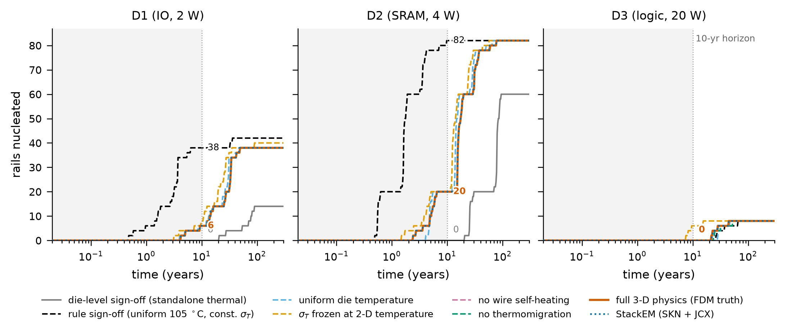

`e3_cdf`，累计成核曲线，E3 的主图。三个子图对应三层芯片。横轴是时间，对数刻度；纵轴是到该时刻为止已经成核的轨数。灰色底纹是 10 年以内，竖直点线是 10 年时限。每条曲线是一个变体，越靠左表示失效越早。线旁的数字是该变体在 10 年处已成核的轨数，只给芯片级签核、规则签核、完整物理三条线标注。黑色虚线的规则签核在 D1 和 D2 上远远靠左；灰色实线的芯片级签核远远靠右，10 年处为零；橙红色粗实线是完整物理，夹在两者之间。橙黄色虚线的冻结残余应力略靠左。天蓝色虚线的均匀温度在 D2 上先落后于完整物理，后又超前。去掉自热和去掉热迁移的两条虚线被完整物理的线盖住。蓝色点线是 StackEM，与完整物理重合。D3 子图里所有曲线都在 10 年之后才抬起，只有冻结残余应力那条在 10 年之前就开始上升。


`e3_cdf_paper`，上图的精简版，只保留五条曲线：两种现行做法、冻结残余应力、完整物理、StackEM。10 年处的标注是 D1 的 38、6、0 和 D2 的 82、20、0，依次对应规则签核、完整物理、芯片级签核。

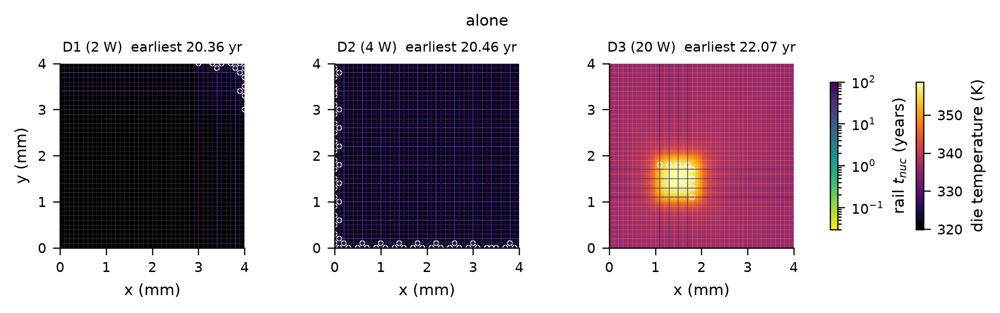

`e3_diemaps_alone`，`alone` 变体的芯片俯视图。底色是该芯片单独封装时的温度场，三个子图共用右侧第二个色标；细线是轨，颜色表示成核时间，用右侧第一个色标；白色小圆圈是成核位置。D1 和 D2 几乎全黑，温度在 320 K 上下且很均匀；D3 在左下偏中的位置有一个明亮的热斑。D1 的成核点集中在右上角，那里是 D1 自己的热块；D2 的成核点沿左边和下边排列；D3 的成核点围在热斑边缘。子图标题给出每层芯片的最早成核时间。

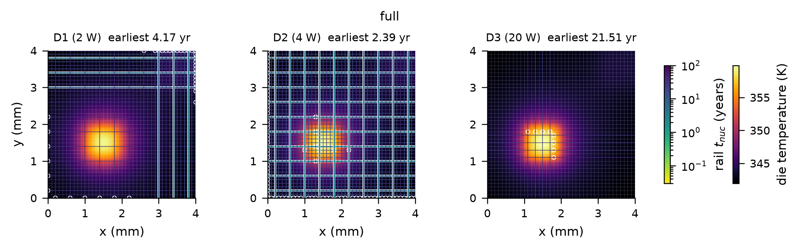

`e3_diemaps_full`，`full` 变体的同一种图，底色换成堆叠中的温度场。三层芯片上出现了位置相同的热斑，这是顶层热块向下投影的直接证据。带浅色描边的粗线是 10 年内失效的轨：D1 上有几条，集中在上边和右边；D2 上横竖各十条，几乎均匀铺满；D3 上没有。标题里的最早成核时间从二十年降到几年。


`e3_effect_ratios`，表 c 的图形版。每一行是一个简化变体，横轴是比值，对数刻度，三种颜色的点代表三层芯片。竖线在 1 处，左侧蓝色底纹是悲观，右侧红色底纹是乐观。每行只在偏离最大的点旁标出倍数。最下面一行芯片级签核的点在右侧远端，倒数第二行规则签核的点在左侧远端，冻结残余应力一行整体在左侧，最上面两行贴着竖线。两种现行做法朝相反的方向出错。

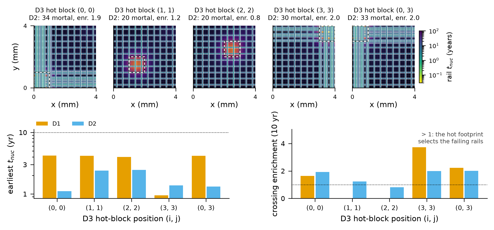

`e3_hotspot_alignment`，热块位置扫描。上排五个小图对应五个热块位置，画的是紧贴顶层的 D2：底色是 D2 的温度，带浅色描边的线是 10 年内失效的轨，虚线方框是顶层热块的投影，标题写着该位置下 D2 的 10 年内成核轨数和富集度。热块在中间两个位置时失效轨均匀分布；在三个角上时，穿过虚线框的那一束轨变亮，失效轨向热块集中。下排左图是 D1 与 D2 的最早成核时间，纵轴对数，点线是 10 年；(3,3) 处 D1 的柱子最矮。下排右图是 10 年富集度，点线是 1；(1,1) 和 (2,2) 处 D1 没有柱子，因为富集度为零。

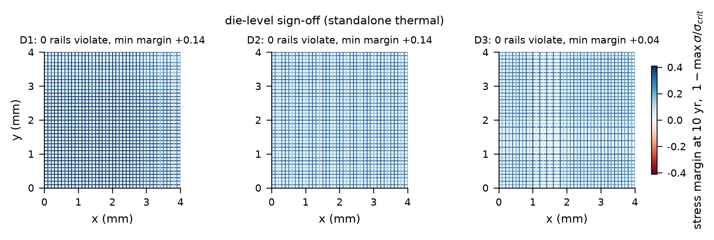

`e3_margin_alone`，`alone` 变体的应力裕量图。每条轨按裕量着色，色标以零为中心，蓝色为正即安全，红色为负即 10 年内越限。三个子图全是蓝色，标题写明每层芯片违例轨数为零和最小裕量。D3 的最小裕量最接近零。

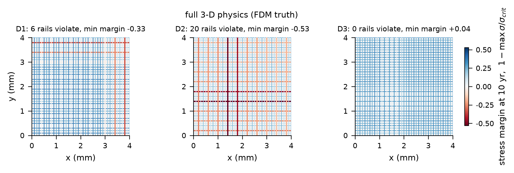

`e3_margin_full`，`full` 变体的裕量图。D1 出现几条红线，位于上边和右边；D2 出现一个横竖交叉的红色格子，颜色最深的四条穿过芯片中部偏左下，那里是热斑的投影；D3 全蓝。

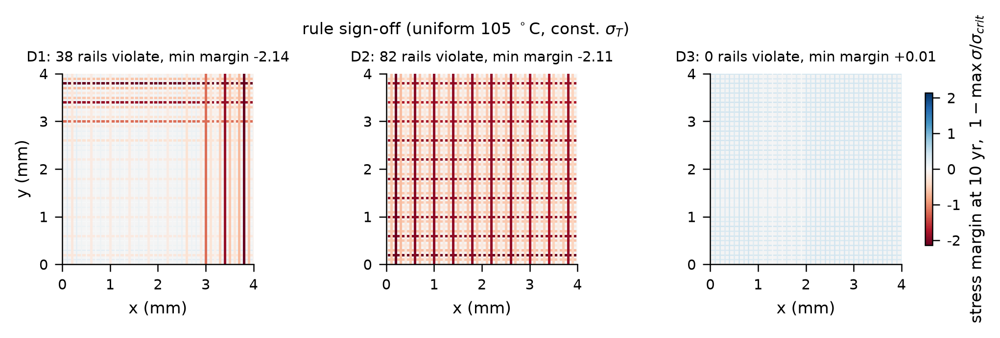

`e3_margin_uniform_signoff`，规则签核的裕量图。色标范围比前两张大得多，最小裕量低于负 2，即 10 年内的最大应力超过临界应力的三倍。D2 的全部轨都违例，D1 近一半违例，D3 是极淡的蓝色。与上一张图对比能看出规则签核误报的范围。

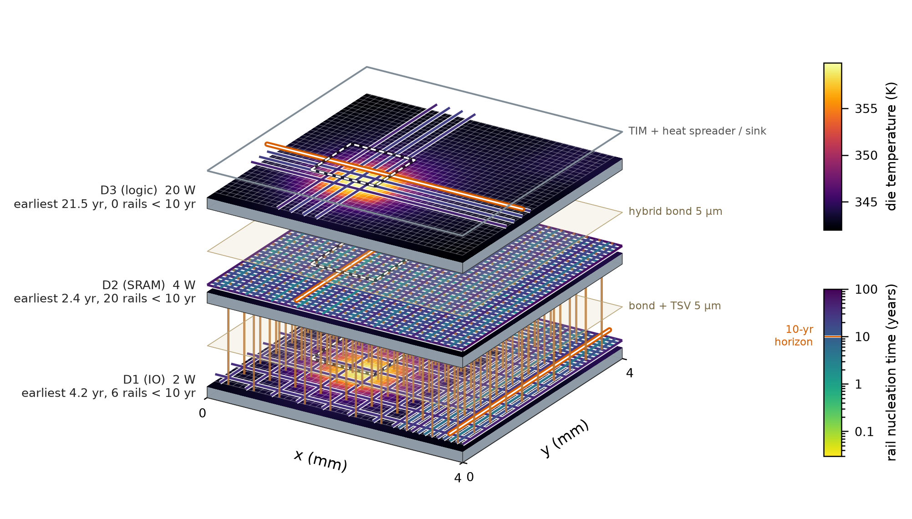

`e3_stack3d_full`，堆叠的三维分解图，论文的第一张图。三层芯片自下而上叠放，每层上表面贴着它的温度场，轨画在上面并按成核时间着色，越偏青绿失效越早，深紫表示接近或超过 100 年。铜色竖线是硅通孔。虚线方框是顶层热块在各层上的投影。每层最早失效的轨用橙色粗线勾出。左侧文字给出每层的角色、功耗、最早成核时间和 10 年内违例轨数。右侧两个色标分别是芯片温度和成核时间，后者标出了 10 年时限。

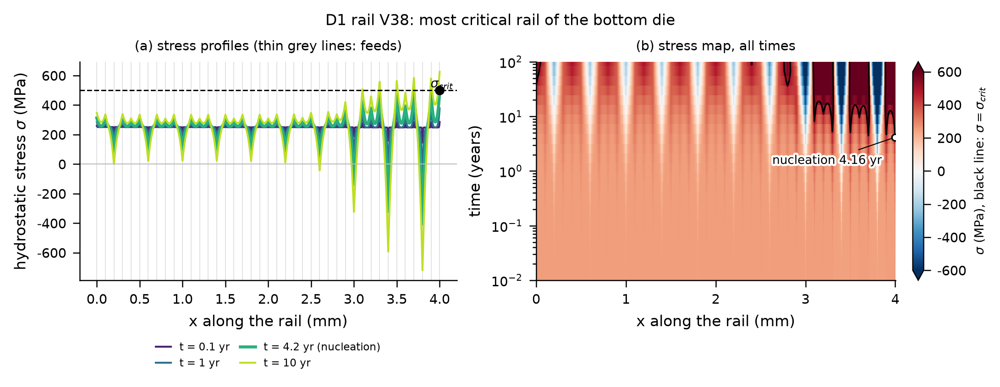

`e3_stress_surface`，底层芯片最危险那条轨的应力历史，这里是 D1 的 V38。左图是 0.1 年、1 年、成核时刻和 10 年四个时刻沿轨的应力分布，水平虚线是临界应力，细灰竖线是馈电点，黑点是成核点。初始时应力沿线几乎是平的；随时间推移每一段的一端上升、另一端下降，形成锯齿。轨右端四分之一的锯齿幅度远大于其余部分，那里是 D1 自己的热块，电流大。成核发生在最右端。右图是位置与时间平面上的应力图，红色为拉应力，蓝色为压应力，黑色等值线是应力等于临界应力，白点标出成核时刻。

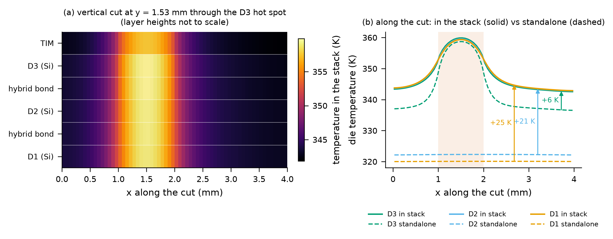

`e3_thermal_slice`，穿过顶层热斑的垂直剖面。左图横轴是沿切线的位置，纵向是 HotSpot 的各层：导热界面层、D3、键合层、D2、键合层、D1，层高只是示意。热斑是一根贯穿所有层的竖直亮柱，层与层之间几乎没有温差。右图是各层沿同一条切线的温度：实线是堆叠中的温度，三条实线几乎重合；虚线是单独封装时的温度，D1 和 D2 是两条贴近底部的水平线，D3 的虚线有热斑但整体低于实线。箭头标出切线上某一位置处堆叠与单独封装的温差。浅色竖带是热块的横向范围。

#### 5.1.3 E7 的两张图

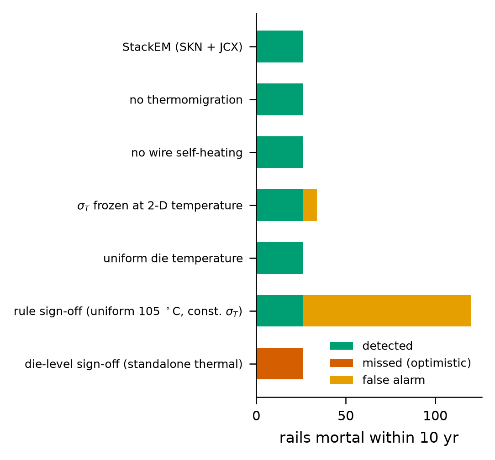

`e7_confusion`，10 年内失效集合的条形图。每一行是一个变体。绿色是检出的真失效轨，橘红色是漏报，橙黄色是误报。最下面一行芯片级签核整条是橘红色。规则签核一行绿色之后拖着很长的橙黄色条。冻结残余应力一行有一小段橙黄色。其余各行只有绿色。

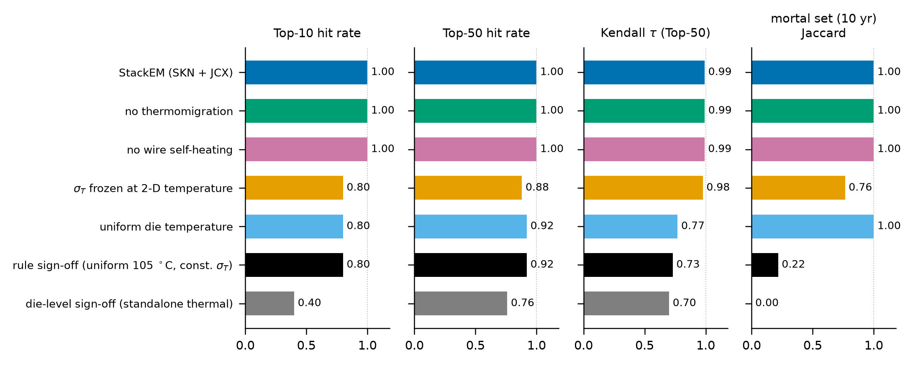

`e7_ranking`，四个指标的条形图：Top-10、Top-50、Kendall、10 年失效集合的 Jaccard。每一行是一个变体，条末标出数值，点线在 1 处。上面三行即 StackEM、去掉热迁移、去掉自热在四个指标上都接近 1。下面四行各有短板：冻结残余应力短在 Jaccard，均匀温度短在 Kendall，规则签核短在 Kendall 和 Jaccard，芯片级签核四项全短。

### 5.2 quad4

四层 6 mm 芯片，每层 122 条轨。D1 是底层 IO 芯片 3 W；D2 是逻辑芯片 12 W，在块 (4,1) 有 4 倍热块；D3 是 SRAM 芯片 6 W；D4 是顶层逻辑芯片 25 W，在块 (1,4) 有 5 倍热块。功耗块是 6 乘 6，每块边长 1 mm。

**表 a：堆叠级结果，参考解**

| 变体 | 含义 | 最早成核 年 | 最先失效的芯片 | 1 年内成核 | 10 年内成核 | 100 年内成核 | 不朽轨数 | 求解耗时 秒 |
|---|---|---|---|---|---|---|---|---|
| `alone` | 芯片级签核 | 20.384 | D3 | 0 | 0 | 86 | 102 | 13.9 |
| `uniform_signoff` | 规则签核 | 0.430 | D3 | 46 | 250 | 358 | 104 | 13.8 |
| `uniform` | 均匀芯片温度 | 3.591 | D3 | 0 | 70 | 288 | 104 | 13.5 |
| `sigmaT_const` | 冻结残余应力 | 3.047 | D3 | 0 | 84 | 300 | 103 | 13.5 |
| `no_joule` | 去掉自热 | 3.955 | D3 | 0 | 47 | 289 | 104 | 13.4 |
| `no_tm` | 去掉热迁移 | 3.949 | D3 | 0 | 47 | 289 | 104 | 13.0 |
| `full` | 完整物理 | 3.951 | D3 | 0 | 47 | 289 | 104 | 13.7 |

轨总数 488。

**表 b：逐芯片明细，参考解**

| 变体 | 芯片 | 最早成核 年 | 最早的轨 | 不朽轨数 | 1 / 10 / 100 年内成核 | 最小裕量 |
|---|---|---|---|---|---|---|
| `alone` | D1 | 59.627 | H2 | 0 | 0 / 0 / 30 | 0.261 |
| `alone` | D2 | 20.584 | H16 | 0 | 0 / 0 / 8 | 0.137 |
| `alone` | D3 | 20.384 | V58 | 0 | 0 / 0 / 40 | 0.131 |
| `alone` | D4 | 21.101 | V15 | 102 | 0 / 0 / 8 | 0.072 |
| `uniform_signoff` | D1 | 0.955 | H2 | 0 | 2 / 90 / 122 | -1.192 |
| `uniform_signoff` | D2 | 0.905 | V43 | 2 | 4 / 40 / 106 | -0.492 |
| `uniform_signoff` | D3 | 0.430 | V58 | 0 | 40 / 120 / 122 | -1.050 |
| `uniform_signoff` | D4 | 10.619 | V15 | 102 | 0 / 0 / 8 | 0.002 |
| `uniform` | D1 | 8.531 | V2 | 0 | 0 / 26 / 114 | -0.060 |
| `uniform` | D2 | 7.146 | V43 | 2 | 0 / 4 / 46 | -0.080 |
| `uniform` | D3 | 3.591 | V58 | 0 | 0 / 40 / 120 | -0.275 |
| `uniform` | D4 | 21.248 | V15 | 102 | 0 / 0 / 8 | 0.081 |
| `sigmaT_const` | D1 | 7.325 | V14 | 0 | 0 / 30 / 118 | -0.080 |
| `sigmaT_const` | D2 | 4.210 | H16 | 1 | 0 / 8 / 52 | -0.203 |
| `sigmaT_const` | D3 | 3.047 | H58 | 0 | 0 / 40 / 122 | -0.311 |
| `sigmaT_const` | D4 | 7.113 | V15 | 102 | 0 / 6 / 8 | -0.027 |
| `no_joule` | D1 | 9.704 | H2 | 0 | 0 / 3 / 113 | -0.015 |
| `no_joule` | D2 | 5.655 | H16 | 2 | 0 / 4 / 48 | -0.137 |
| `no_joule` | D3 | 3.955 | H58 | 0 | 0 / 40 / 120 | -0.250 |
| `no_joule` | D4 | 15.030 | H45 | 102 | 0 / 0 / 8 | 0.031 |
| `no_tm` | D1 | 9.696 | V2 | 0 | 0 / 3 / 113 | -0.015 |
| `no_tm` | D2 | 5.638 | H16 | 2 | 0 / 4 / 48 | -0.138 |
| `no_tm` | D3 | 3.949 | H58 | 0 | 0 / 40 / 120 | -0.250 |
| `no_tm` | D4 | 15.337 | H45 | 102 | 0 / 0 / 8 | 0.032 |
| `full` | D1 | 9.698 | H2 | 0 | 0 / 3 / 113 | -0.015 |
| `full` | D2 | 5.638 | H16 | 2 | 0 / 4 / 48 | -0.138 |
| `full` | D3 | 3.951 | H58 | 0 | 0 / 40 / 120 | -0.250 |
| `full` | D4 | 15.034 | H45 | 102 | 0 / 0 / 8 | 0.031 |

**表 c：效应比值，各变体的芯片最早成核时间除以 `full` 的**

| 变体 | 含义 | D1 | D2 | D3 | D4 |
|---|---|---|---|---|---|
| `alone` | 芯片级签核 | 6.148 | 3.651 | 5.159 | 1.404 |
| `uniform_signoff` | 规则签核 | 0.098 | 0.161 | 0.109 | 0.706 |
| `uniform` | 均匀芯片温度 | 0.880 | 1.268 | 0.909 | 1.413 |
| `sigmaT_const` | 冻结残余应力 | 0.755 | 0.747 | 0.771 | 0.473 |
| `no_joule` | 去掉自热 | 1.001 | 1.003 | 1.001 | 1.000 |
| `no_tm` | 去掉热迁移 | 1.000 | 1.000 | 0.999 | 1.020 |

**表 d：逐轨比值 `t_nuc(变体) / t_nuc(full)` 的分布**

| 变体 | 芯片 | 轨数 | 第 5 百分位 | 中位数 | 第 95 百分位 |
|---|---|---|---|---|---|
| `alone` | D1 | 30 | 6.191 | 6.487 | 6.786 |
| `alone` | D2 | 8 | 3.595 | 3.649 | 3.766 |
| `alone` | D3 | 40 | 4.993 | 5.170 | 5.405 |
| `alone` | D4 | 8 | 1.358 | 1.407 | 1.423 |
| `uniform_signoff` | D1 | 113 | 0.100 | 0.118 | 0.167 |
| `uniform_signoff` | D2 | 48 | 0.119 | 0.127 | 0.176 |
| `uniform_signoff` | D3 | 120 | 0.105 | 0.110 | 0.118 |
| `uniform_signoff` | D4 | 8 | 0.702 | 0.796 | 1.211 |
| `uniform` | D1 | 113 | 0.886 | 0.928 | 0.969 |
| `uniform` | D2 | 46 | 0.890 | 0.937 | 1.258 |
| `uniform` | D3 | 120 | 0.886 | 0.924 | 0.966 |
| `uniform` | D4 | 8 | 1.179 | 1.352 | 1.410 |
| `sigmaT_const` | D1 | 113 | 0.633 | 0.752 | 0.796 |
| `sigmaT_const` | D2 | 48 | 0.642 | 0.791 | 0.802 |
| `sigmaT_const` | D3 | 120 | 0.757 | 0.784 | 0.790 |
| `sigmaT_const` | D4 | 8 | 0.448 | 0.465 | 0.480 |
| `no_joule` | D1 | 113 | 1.000 | 1.000 | 1.001 |
| `no_joule` | D2 | 48 | 1.000 | 1.000 | 1.003 |
| `no_joule` | D3 | 120 | 1.000 | 1.000 | 1.001 |
| `no_joule` | D4 | 8 | 1.000 | 1.000 | 1.000 |
| `no_tm` | D1 | 113 | 0.998 | 0.999 | 1.000 |
| `no_tm` | D2 | 48 | 0.998 | 0.999 | 1.012 |
| `no_tm` | D3 | 120 | 0.999 | 0.999 | 1.000 |
| `no_tm` | D4 | 8 | 1.019 | 1.022 | 1.033 |

**表 e：对齐统计，`full` 变体**

| 芯片 | 穿越热块的轨占比 | 热块面积占比 | 10 年内成核 / 其中穿越 | 10 年富集度 | 100 年内成核 / 其中穿越 | 100 年富集度 | 成核时间中位比，穿越对不穿越 | Spearman | p 值 | 最早的轨穿越热块 |
|---|---|---|---|---|---|---|---|---|---|---|
| D1 | 0.1639 | 0.0278 | 3 / 1 | 2.033 | 113 / 20 | 1.080 | 1.010 | 0.014 | 0.8811 | 否 |
| D2 | 0.1639 | 0.0278 | 4 / 0 | 0.000 | 48 / 8 | 1.017 | 0.995 | -0.067 | 0.6515 | 否 |
| D3 | 0.1639 | 0.0278 | 40 / 8 | 1.220 | 120 / 20 | 1.017 | 0.964 | -0.216 | 0.0176 | 否 |

**表 f：热块位置扫描，堆叠级**

| 顶层热块位置 | 目录 | 顶层芯片平均温度 K | 顶层芯片最高温度 K | 堆叠最早成核 年 | 最先失效的芯片 | 顶层 D4 的 10 年内成核轨数 |
|---|---|---|---|---|---|---|
| (0, 0) | `hot_00` | 344.17 | 355.93 | 1.265 | D4 | 12 |
| (1, 1) | `hot_11` | 344.23 | 353.38 | 4.021 | D3 | 0 |
| (2, 2) | `hot_22` | 344.26 | 353.93 | 4.016 | D3 | 0 |
| (3, 3) | `hot_33` | 344.26 | 353.93 | 4.018 | D3 | 0 |
| (0, 3) | `hot_03` | 344.21 | 354.36 | 1.911 | D4 | 6 |

**表 g：热块位置扫描，顶层以下各芯片**

| 位置 | 芯片 | 最早成核 年 | 最早的轨 | 10 年内成核 | 100 年内成核 | 10 年富集度 | 100 年富集度 | 成核时间中位比 | Spearman | 最早的轨穿越热块 | 穿越占比 |
|---|---|---|---|---|---|---|---|---|---|---|---|
| (0, 0) | D1 | 3.852 | V2 | 10 | 112 | 2.440 | 0.980 | 0.438 | -0.270 | 是 | 0.1639 |
| (0, 0) | D2 | 5.629 | H16 | 4 | 48 | 0.000 | 0.763 | 1.029 | 0.095 | 否 | 0.1639 |
| (0, 0) | D3 | 2.286 | H1 | 40 | 120 | 0.915 | 1.017 | 1.030 | -0.146 | 是 | 0.1639 |
| (1, 1) | D1 | 9.379 | H2 | 7 | 112 | 3.486 | 1.089 | 0.972 | -0.136 | 否 | 0.1639 |
| (1, 1) | D2 | 5.607 | H16 | 4 | 48 | 3.050 | 1.525 | 1.010 | -0.088 | 是 | 0.1639 |
| (1, 1) | D3 | 4.021 | V58 | 40 | 120 | 1.220 | 1.017 | 0.986 | -0.318 | 否 | 0.1639 |
| (2, 2) | D1 | 9.649 | V2 | 2 | 112 | 0.000 | 1.089 | 0.992 | -0.094 | 否 | 0.1639 |
| (2, 2) | D2 | 5.559 | H16 | 4 | 48 | 0.000 | 0.763 | 0.978 | -0.272 | 否 | 0.1639 |
| (2, 2) | D3 | 4.016 | V58 | 40 | 120 | 0.915 | 1.017 | 0.987 | -0.387 | 否 | 0.1639 |
| (3, 3) | D1 | 9.713 | V2 | 2 | 112 | 0.000 | 1.089 | 0.981 | -0.102 | 否 | 0.1639 |
| (3, 3) | D2 | 5.561 | H16 | 4 | 48 | 0.000 | 0.763 | 0.975 | -0.259 | 否 | 0.1639 |
| (3, 3) | D3 | 4.018 | V58 | 40 | 120 | 0.915 | 1.017 | 0.993 | -0.353 | 否 | 0.1639 |
| (0, 3) | D1 | 4.991 | H34 | 10 | 113 | 3.050 | 1.026 | 0.579 | -0.154 | 是 | 0.1639 |
| (0, 3) | D2 | 5.640 | H16 | 4 | 48 | 0.000 | 0.763 | 1.007 | -0.048 | 否 | 0.1639 |
| (0, 3) | D3 | 2.584 | H34 | 40 | 120 | 0.915 | 1.017 | 1.004 | -0.210 | 是 | 0.1639 |

**表 h：StackEM 代理解对 `full`**

| 最早成核 年 | 最先失效的芯片 | 10 年内成核 | 100 年内成核 | 耗时 秒 | D1 最早 年 / 轨 | D2 最早 年 / 轨 | D3 最早 年 / 轨 | D4 最早 年 / 轨 |
|---|---|---|---|---|---|---|---|---|
| 3.948 | D3 | 48 | 290 | 45.1 | 9.658 / H2 | 5.657 / H16 | 3.948 / H58 | 15.475 / H45 |

**表 i：垂直互连的 Blech 筛查**

| 类型 | 芯片 | 直径 µm | 高度 µm | 单个电流 mA | 温度 K | jL A/cm | 临界 jL A/cm | 比值 | 不朽 |
|---|---|---|---|---|---|---|---|---|---|
| 硅通孔 | D1 | 5.0 | 50.0 | 0.167 | 344.90 | 4.24 | 1239.5 | 0.00342 | 是 |
| 键合焊盘 | D1 | 3.0 | 3.0 | 4.167 | 344.90 | 17.68 | 1239.5 | 0.01427 | 是 |
| 硅通孔 | D2 | 5.0 | 50.0 | 0.765 | 344.85 | 19.49 | 1239.2 | 0.01573 | 是 |
| 键合焊盘 | D2 | 3.0 | 3.0 | 5.000 | 344.85 | 21.22 | 1239.2 | 0.01712 | 是 |
| 硅通孔 | D3 | 5.0 | 50.0 | 0.383 | 344.59 | 9.74 | 1237.4 | 0.00787 | 是 |
| 键合焊盘 | D3 | 3.0 | 3.0 | 4.688 | 344.59 | 19.89 | 1237.4 | 0.01608 | 是 |
| 键合焊盘 | D4 | 3.0 | 3.0 | 5.000 | 344.23 | 21.22 | 1234.9 | 0.01718 | 是 |

**表 j：E7 排序结果**

轨总数 488，`full` 下 10 年内成核 47 条，参考解第 10 名与第 11 名成核时间的相对间隔 0.13 %。

| 变体 | 含义 | Top-10 | Top-10 带 1 % 容差 | Top-50 | Kendall | 最先失效的芯片相同 | 最早的轨相同 | Jaccard | 漏报 | 误报 |
|---|---|---|---|---|---|---|---|---|---|---|
| `alone` | 芯片级签核 | 0.20 | 0.20 | 0.88 | 0.5405 | 是 | 否 | 0.0000 | 47 | 0 |
| `uniform_signoff` | 规则签核 | 0.20 | 0.20 | 0.92 | 0.2216 | 是 | 否 | 0.1880 | 0 | 203 |
| `uniform` | 均匀芯片温度 | 0.20 | 0.20 | 0.92 | 0.2210 | 是 | 否 | 0.6714 | 0 | 23 |
| `sigmaT_const` | 冻结残余应力 | 1.00 | 1.00 | 0.90 | 0.9478 | 是 | 是 | 0.5595 | 0 | 37 |
| `no_joule` | 去掉自热 | 1.00 | 1.00 | 1.00 | 1.0000 | 是 | 是 | 1.0000 | 0 | 0 |
| `no_tm` | 去掉热迁移 | 1.00 | 1.00 | 1.00 | 0.9984 | 是 | 是 | 1.0000 | 0 | 0 |
| `stackem` | StackEM 代理解 | 1.00 | 1.00 | 1.00 | 0.9984 | 是 | 是 | 0.9792 | 0 | 1 |

| 变体 | D1 最早 年 | D2 最早 年 | D3 最早 年 | D4 最早 年 | D1 乐观倍数 | D2 乐观倍数 | D3 乐观倍数 | D4 乐观倍数 |
|---|---|---|---|---|---|---|---|---|
| `alone` | 59.627 | 20.584 | 20.384 | 21.101 | 6.148 | 3.651 | 5.159 | 1.404 |
| `uniform_signoff` | 0.955 | 0.905 | 0.430 | 10.619 | 0.098 | 0.161 | 0.109 | 0.706 |
| `uniform` | 8.531 | 7.146 | 3.591 | 21.248 | 0.880 | 1.268 | 0.909 | 1.413 |
| `sigmaT_const` | 7.325 | 4.210 | 3.047 | 7.113 | 0.755 | 0.747 | 0.771 | 0.473 |
| `no_joule` | 9.704 | 5.655 | 3.955 | 15.030 | 1.001 | 1.003 | 1.001 | 1.000 |
| `no_tm` | 9.696 | 5.638 | 3.949 | 15.337 | 1.000 | 1.000 | 0.999 | 1.020 |
| `stackem` | 9.658 | 5.657 | 3.948 | 15.475 | 0.996 | 1.003 | 0.999 | 1.029 |

#### 5.2.1 与 base3 相比

1. 结论的方向相同。`alone` 下 10 年内无失效，`full` 下有 47 条，最先失效的是紧贴顶层的 D3。
2. D1 的线宽在定线宽时饱和在下限 0.5 µm，它单独封装时的最早成核时间接近 60 年。表 c 里 D1 的芯片级比值 6.1 并不对应“2 倍裕量恰好用完”的情形。D1 在堆叠里的最早成核时间仍接近 10 年，只有 3 条轨落在 10 年以内。去掉 D1，受影响芯片的乐观倍数是 D2 的 3.7 和 D3 的 5.2。
3. `uniform` 在 quad4 上不再给出正确的集合：它判出 70 条，比 `full` 多 23 条。`uniform_signoff` 判出 250 条，误报 203 条。
4. 两种基于均匀温度的做法排序很差，Top-10 只有 0.2，Kendall 只有 0.2 出头。参考解第 10 名与第 11 名之间只差千分之一左右，Top-10 对极小的误差都敏感；但带 1 % 容差的一列数值相同，说明低命中率并非并列名次造成。
5. 热迁移和自热的影响比 base3 还小，四层芯片的比值与 1 的偏差最大约 2 %。
6. D3 的 10 年内成核轨数在五个热块位置下始终是 40 条，富集度始终在 1 附近。D3 功耗均匀，它的失效轨是每隔几条出现一条的规则图案，由馈电间距与电流分布决定。热块位置不改变失效的是哪些轨，只改变失效时间：热块在 (0,0) 和 (0,3) 时 D3 的最早成核时间明显缩短。D1 和 D2 的失效轨很少，富集度在有的位置为零、有的位置超过 3，样本太小，不宜解读。
7. 热块在 (0,0) 和 (0,3) 时，最先失效的变成顶层的 D4。
8. quad4 的扫描位置按 6 乘 6 的块网格取同样五组坐标，(3,3) 是芯片中部，五个位置都不等于基准热块位置 (1,4)，所以表 f 里没有一行与基准情形相同。
9. 代理解的 10 年内成核轨数是 48，比参考解多 1 条，100 年内也多 1 条。这两条轨是谁见 [04_逐轨精度_E2.md](04_逐轨精度_E2.md) 5.2 节。E7 里 `stackem` 一行因此有 1 条误报。

#### 5.2.2 E3 的 12 张图

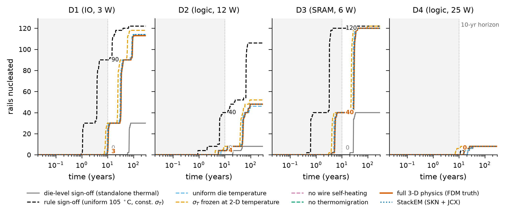

`e3_cdf`。四个子图。D1 和 D3 的曲线都是台阶状：同一层芯片上有几组电流相近的轨，每组几乎同时成核。D3 在 10 年处完整物理是 40 条，规则签核是 120 条。D1 在 10 年处完整物理只有 3 条，规则签核是 90 条。D4 的所有曲线都在 10 年之后。右上角 D1 子图里蓝色点线在最右端略高于完整物理，那是时间窗末端代理解多判的一条轨。

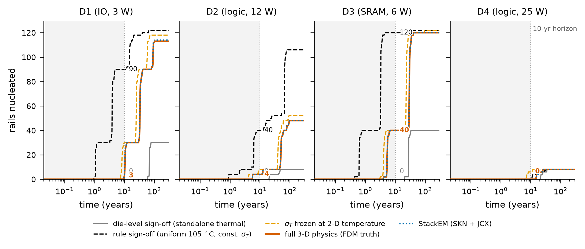

`e3_cdf_paper`，五条曲线的精简版。

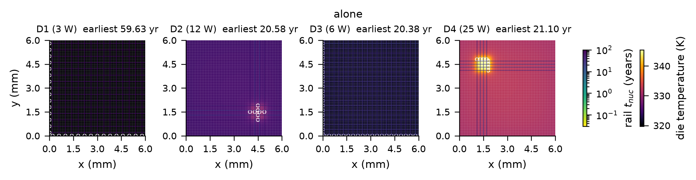

`e3_diemaps_alone`。D1 和 D3 单独时几乎等温，成核点沿左边和下边排列。D2 在右下有一个弱热斑，对应它自己的热块，成核点围着它。D4 在左上有一个明亮的热斑。D1 标题里的最早成核时间约 60 年，是线宽饱和的结果。

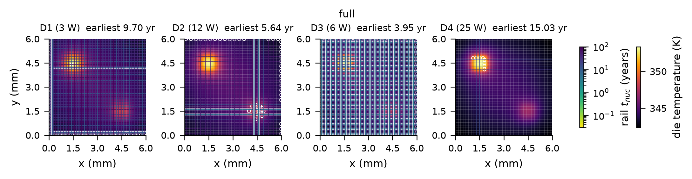

`e3_diemaps_full`。四层芯片上都能看到两个热斑：左上的来自 D4，右下较弱的来自 D2。D3 上每隔几条就有一条竖直的轨带浅色描边，铺满整个芯片，这就是 40 条规则分布的失效轨。D2 上的失效轨只有穿过它自己热块的那几条。

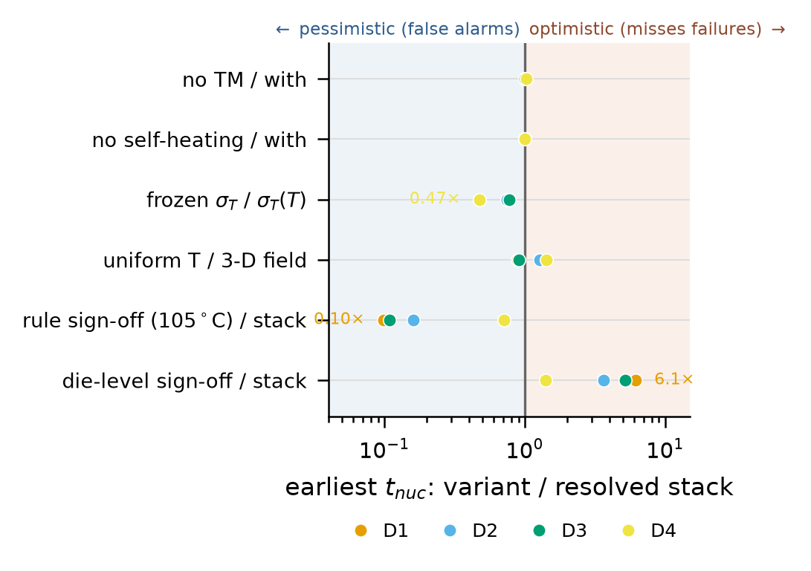

`e3_effect_ratios`。形状与 base3 相同。芯片级签核一行最右的点是 D1 的 6.1 倍，规则签核一行最左的点是 D1 的 0.10 倍，冻结残余应力一行最左的是 D4 的 0.47 倍。

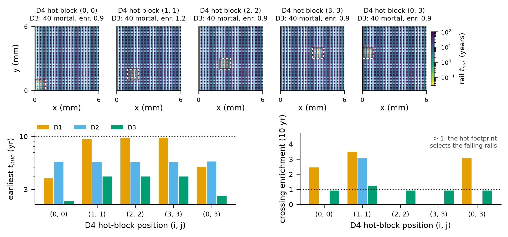

`e3_hotspot_alignment`。上排画的是 D3。五个小图里失效轨的图案完全一样，都是 40 条等间隔的竖线，只有虚线框的位置在变。下排左图里绿色的 D3 在 (0,0) 和 (0,3) 两处柱子最矮。下排右图 D3 的柱子始终在 1 附近；D1 和 D2 的柱子有的位置很高有的位置没有，对应很少的失效轨数。

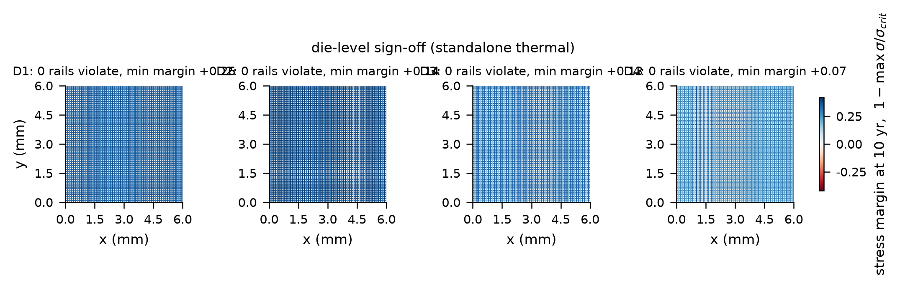

`e3_margin_alone`。四个子图全蓝。这张图和下面两张裕量图的子图标题互相重叠，读不清，数值请看表 b 的最小裕量列。

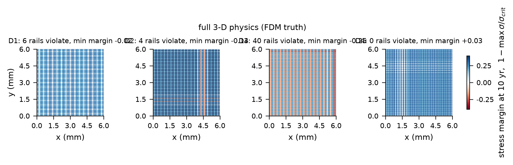

`e3_margin_full`。D3 上是规则排列的浅红色竖线；D2 上有几条穿过右下热块的浅红线；D1 上的违例线颜色极淡，因为它的最小裕量只略低于零；D4 全蓝。

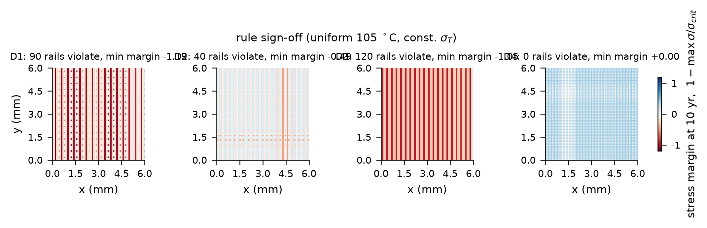

`e3_margin_uniform_signoff`。D1 和 D3 布满深红色竖线，D2 只有几条橙色线，D4 是淡蓝色。

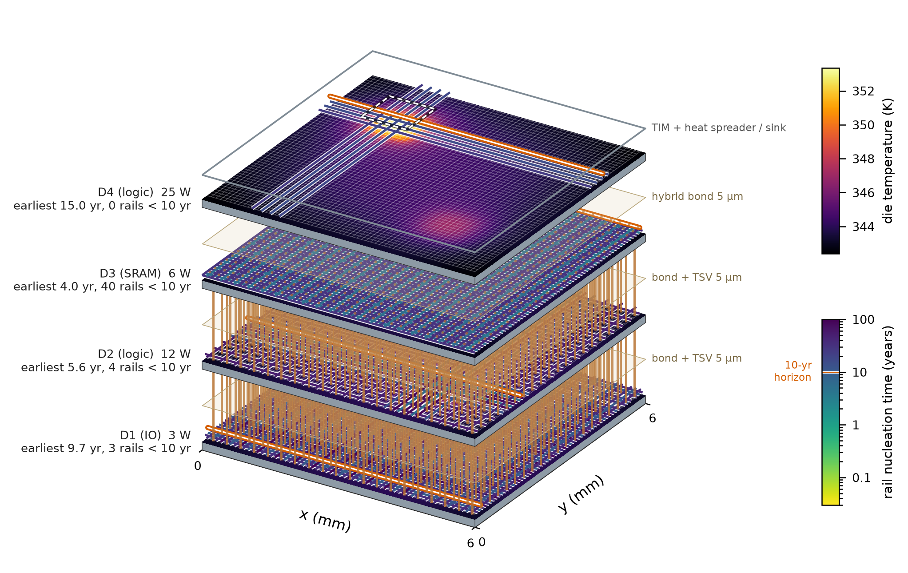

`e3_stack3d_full`。四层芯片的分解图。顶层 D4 的温度图上能看到左后方的主热斑和右前方来自 D2 的次热斑。左侧文字给出各层的最早成核时间和违例轨数。硅通孔很密，遮住了下面两层的大部分细节。

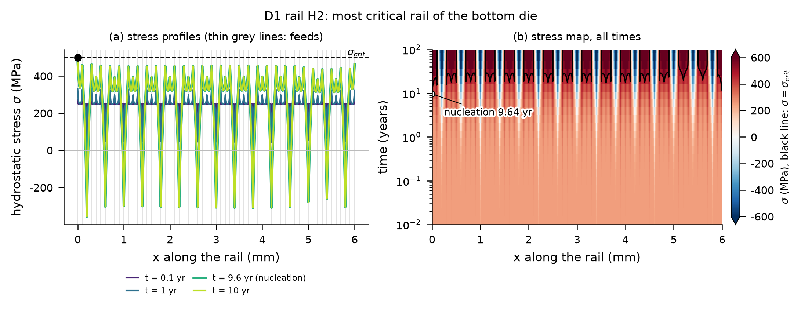

`e3_stress_surface`，D1 的 H2。D1 功耗均匀，沿轨的锯齿是等幅的周期图案，成核点在轨的最左端。右图里等值线在 10 到 20 年之间沿整条轨几乎同时出现，说明这条轨上很多结点差不多同时到达临界应力。图上标注的成核时间是画图时用较粗网格重新求解得到的，与表 b 的值在第三位有效数字上有出入。

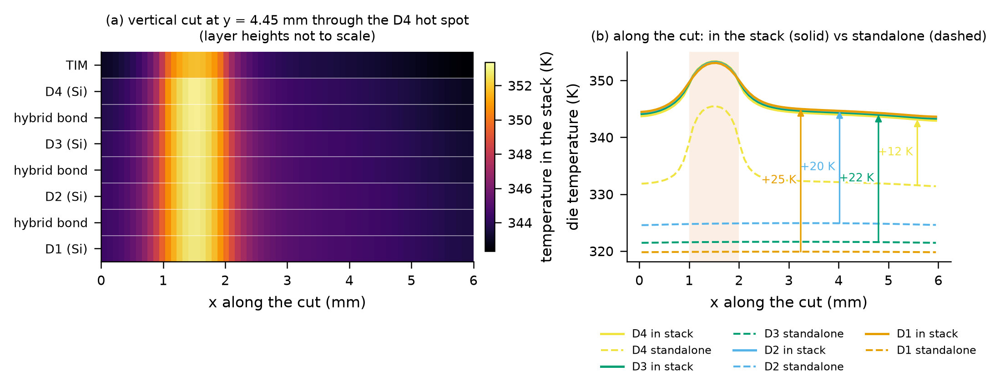

`e3_thermal_slice`。七层的垂直剖面，同样是一根贯穿各层的亮柱。右图四条实线几乎重合，箭头标出各层在切线某处的温升，从 D4 的 12 K 到 D1 的 25 K。

#### 5.2.3 E7 的两张图

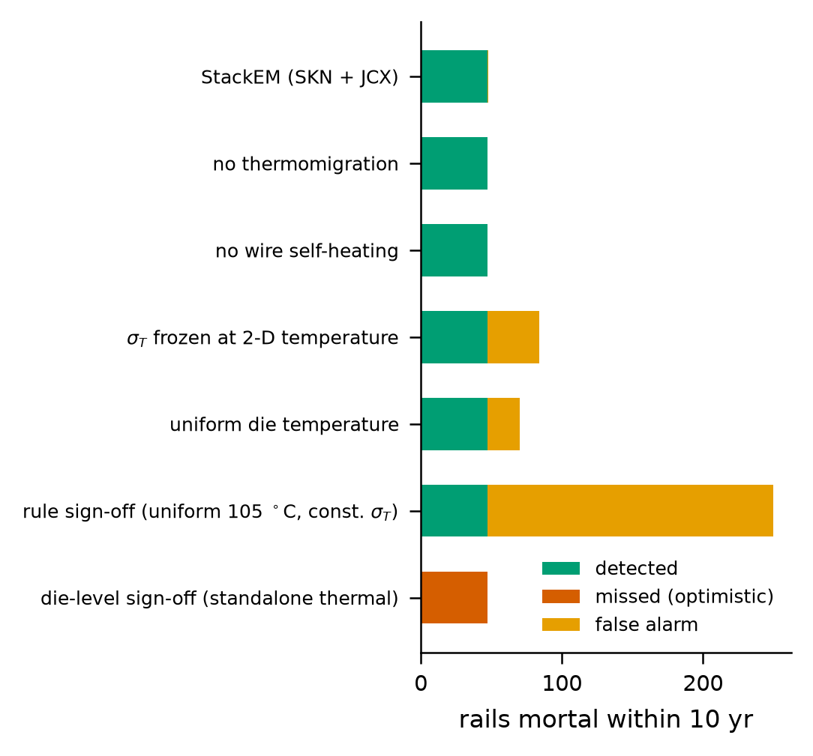

`e7_confusion`。规则签核一行的橙黄色条长度超过 200。均匀温度和冻结残余应力两行各有一段橙黄色。最上面 StackEM 一行在绿色条末端有极窄的一条橙黄色，就是那一条边界轨。

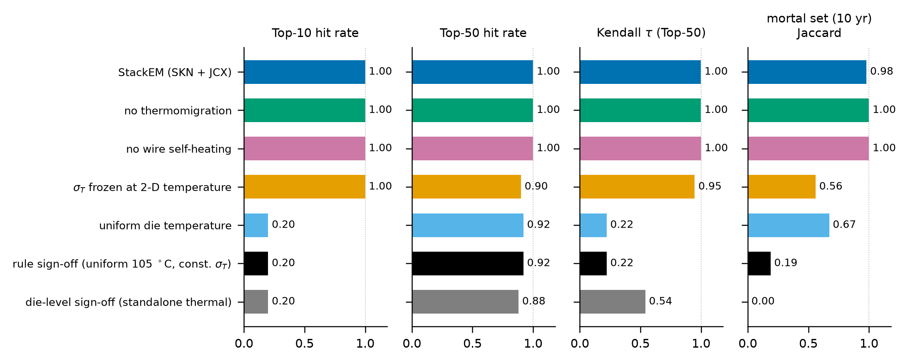

`e7_ranking`。最下面三行在 Top-10 和 Kendall 两个子图里只有很短的条。上面三行在四个指标上接近 1，StackEM 的 Jaccard 是 0.98。

### 5.3 dense3

与 base3 同一个堆叠，电源带间距减半到 50 µm，每层 162 条轨，线宽按同一规则重新定过。温度场与 base3 相同。

**表 a：堆叠级结果，参考解**

| 变体 | 含义 | 最早成核 年 | 最先失效的芯片 | 1 年内成核 | 10 年内成核 | 100 年内成核 | 不朽轨数 | 求解耗时 秒 |
|---|---|---|---|---|---|---|---|---|
| `alone` | 芯片级签核 | 23.026 | D1 | 0 | 0 | 32 | 210 | 12.7 |
| `uniform_signoff` | 规则签核 | 1.178 | D1 | 0 | 128 | 210 | 224 | 12.5 |
| `uniform` | 均匀芯片温度 | 9.335 | D1 | 0 | 4 | 136 | 212 | 12.7 |
| `sigmaT_const` | 冻结残余应力 | 2.793 | D2 | 0 | 36 | 156 | 210 | 13.0 |
| `no_joule` | 去掉自热 | 4.363 | D2 | 0 | 10 | 136 | 212 | 12.4 |
| `no_tm` | 去掉热迁移 | 4.340 | D2 | 0 | 10 | 136 | 212 | 11.8 |
| `full` | 完整物理 | 4.331 | D2 | 0 | 10 | 136 | 212 | 12.6 |

轨总数 486。

**表 b：逐芯片明细，参考解**

| 变体 | 芯片 | 最早成核 年 | 最早的轨 | 不朽轨数 | 1 / 10 / 100 年内成核 | 最小裕量 |
|---|---|---|---|---|---|---|
| `alone` | D1 | 23.026 | H76 | 88 | 0 / 0 / 4 | 0.033 |
| `alone` | D2 | 52.128 | V4 | 0 | 0 / 0 / 20 | 0.087 |
| `alone` | D3 | 23.998 | V30 | 122 | 0 / 0 / 8 | 0.004 |
| `uniform_signoff` | D1 | 1.178 | V76 | 102 | 0 / 28 / 48 | -1.182 |
| `uniform_signoff` | D2 | 1.192 | H4 | 0 | 0 / 100 / 136 | -1.159 |
| `uniform_signoff` | D3 | 12.119 | H30 | 122 | 0 / 0 / 26 | 0.012 |
| `uniform` | D1 | 9.335 | V76 | 90 | 0 / 2 / 28 | -0.015 |
| `uniform` | D2 | 9.427 | H4 | 0 | 0 / 2 / 100 | -0.012 |
| `uniform` | D3 | 29.633 | V30 | 122 | 0 / 0 / 8 | 0.063 |
| `sigmaT_const` | D1 | 7.577 | V76 | 88 | 0 / 4 / 46 | -0.073 |
| `sigmaT_const` | D2 | 2.793 | V28 | 0 | 0 / 26 / 100 | -0.370 |
| `sigmaT_const` | D3 | 7.013 | H30 | 122 | 0 / 6 / 10 | -0.015 |
| `no_joule` | D1 | 9.761 | V76 | 90 | 0 / 2 / 28 | -0.004 |
| `no_joule` | D2 | 4.363 | V28 | 0 | 0 / 8 / 100 | -0.267 |
| `no_joule` | D3 | 22.227 | H30 | 122 | 0 / 0 / 8 | 0.028 |
| `no_tm` | D1 | 9.674 | V76 | 90 | 0 / 2 / 28 | -0.006 |
| `no_tm` | D2 | 4.340 | H28 | 0 | 0 / 8 / 100 | -0.266 |
| `no_tm` | D3 | 24.090 | V30 | 122 | 0 / 0 / 8 | 0.045 |
| `full` | D1 | 9.684 | V76 | 90 | 0 / 2 / 28 | -0.006 |
| `full` | D2 | 4.331 | H28 | 0 | 0 / 8 / 100 | -0.268 |
| `full` | D3 | 22.251 | H30 | 122 | 0 / 0 / 8 | 0.028 |

**表 c：效应比值，各变体的芯片最早成核时间除以 `full` 的**

| 变体 | 含义 | D1 | D2 | D3 |
|---|---|---|---|---|
| `alone` | 芯片级签核 | 2.378 | 12.035 | 1.078 |
| `uniform_signoff` | 规则签核 | 0.122 | 0.275 | 0.545 |
| `uniform` | 均匀芯片温度 | 0.964 | 2.176 | 1.332 |
| `sigmaT_const` | 冻结残余应力 | 0.782 | 0.645 | 0.315 |
| `no_joule` | 去掉自热 | 1.008 | 1.007 | 0.999 |
| `no_tm` | 去掉热迁移 | 0.999 | 1.002 | 1.083 |

**表 d：逐轨比值 `t_nuc(变体) / t_nuc(full)` 的分布**

| 变体 | 芯片 | 轨数 | 第 5 百分位 | 中位数 | 第 95 百分位 |
|---|---|---|---|---|---|
| `alone` | D1 | 4 | 2.378 | 3.840 | 5.302 |
| `alone` | D2 | 20 | 4.565 | 5.199 | 12.950 |
| `alone` | D3 | 8 | 1.078 | 1.088 | 1.139 |
| `uniform_signoff` | D1 | 28 | 0.100 | 0.120 | 0.152 |
| `uniform_signoff` | D2 | 100 | 0.095 | 0.129 | 0.210 |
| `uniform_signoff` | D3 | 8 | 0.477 | 0.532 | 0.545 |
| `uniform` | D1 | 28 | 0.894 | 0.962 | 0.966 |
| `uniform` | D2 | 100 | 0.851 | 0.885 | 1.651 |
| `uniform` | D3 | 8 | 1.121 | 1.261 | 1.332 |
| `sigmaT_const` | D1 | 28 | 0.713 | 0.779 | 0.844 |
| `sigmaT_const` | D2 | 100 | 0.700 | 0.758 | 0.844 |
| `sigmaT_const` | D3 | 8 | 0.315 | 0.329 | 0.407 |
| `no_joule` | D1 | 28 | 1.000 | 1.000 | 1.008 |
| `no_joule` | D2 | 100 | 1.000 | 1.000 | 1.008 |
| `no_joule` | D3 | 8 | 0.999 | 0.999 | 0.999 |
| `no_tm` | D1 | 28 | 0.999 | 1.000 | 1.000 |
| `no_tm` | D2 | 100 | 0.997 | 0.999 | 1.005 |
| `no_tm` | D3 | 8 | 1.083 | 1.090 | 1.154 |

**表 e：对齐统计，`full` 变体**

| 芯片 | 穿越热块的轨占比 | 热块面积占比 | 10 年内成核 / 其中穿越 | 10 年富集度 | 100 年内成核 / 其中穿越 | 100 年富集度 | 成核时间中位比，穿越对不穿越 | Spearman | p 值 | 最早的轨穿越热块 |
|---|---|---|---|---|---|---|---|---|---|---|
| D1 | 0.2469 | 0.0625 | 2 / 0 | 0.000 | 28 / 0 | 0.000 | 无 | 0.386 | 0.0425 | 否 |
| D2 | 0.2469 | 0.0625 | 8 / 6 | 3.038 | 100 / 26 | 1.053 | 0.609 | -0.292 | 0.0032 | 是 |

**表 f：热块位置扫描，堆叠级**

| 顶层热块位置 | 目录 | 顶层芯片平均温度 K | 顶层芯片最高温度 K | 堆叠最早成核 年 | 最先失效的芯片 | 顶层 D3 的 10 年内成核轨数 |
|---|---|---|---|---|---|---|
| (0, 0) | `hot_00` | 344.45 | 364.43 | 1.843 | D3 | 10 |
| (1, 1) | `hot_11` | 344.59 | 359.87 | 4.331 | D2 | 0 |
| (2, 2) | `hot_22` | 344.59 | 359.94 | 4.421 | D2 | 0 |
| (3, 3) | `hot_33` | 344.45 | 366.21 | 2.001 | D3 | 10 |
| (0, 3) | `hot_03` | 344.45 | 364.44 | 2.019 | D3 | 10 |

**表 g：热块位置扫描，顶层以下各芯片**

| 位置 | 芯片 | 最早成核 年 | 最早的轨 | 10 年内成核 | 100 年内成核 | 10 年富集度 | 100 年富集度 | 成核时间中位比 | Spearman | 最早的轨穿越热块 | 穿越占比 |
|---|---|---|---|---|---|---|---|---|---|---|---|
| (0, 0) | D1 | 9.782 | V76 | 2 | 28 | 0.000 | 0.000 | 无 | 0.339 | 否 | 0.2469 |
| (0, 0) | D2 | 2.624 | H4 | 18 | 104 | 3.150 | 1.090 | 0.448 | -0.496 | 是 | 0.2469 |
| (1, 1) | D1 | 9.684 | V76 | 2 | 28 | 0.000 | 0.000 | 无 | 0.386 | 否 | 0.2469 |
| (1, 1) | D2 | 4.331 | H28 | 8 | 100 | 3.038 | 1.053 | 0.609 | -0.292 | 是 | 0.2469 |
| (2, 2) | D1 | 9.310 | V76 | 2 | 28 | 0.000 | 0.579 | 2.313 | 0.372 | 否 | 0.2469 |
| (2, 2) | D2 | 4.421 | V52 | 8 | 100 | 2.025 | 0.972 | 0.680 | -0.164 | 是 | 0.2469 |
| (3, 3) | D1 | 2.288 | V76 | 14 | 40 | 3.857 | 3.471 | 0.363 | -0.115 | 是 | 0.2593 |
| (3, 3) | D2 | 3.068 | V76 | 16 | 100 | 3.857 | 1.003 | 0.259 | -0.544 | 是 | 0.2593 |
| (0, 3) | D1 | 9.670 | V76 | 2 | 28 | 1.976 | 1.693 | 0.556 | 0.043 | 否 | 0.2531 |
| (0, 3) | D2 | 2.959 | H76 | 17 | 100 | 3.486 | 0.988 | 0.270 | -0.560 | 是 | 0.2531 |

**表 h：StackEM 代理解对 `full`**

| 最早成核 年 | 最先失效的芯片 | 10 年内成核 | 100 年内成核 | 耗时 秒 | D1 最早 年 / 轨 | D2 最早 年 / 轨 | D3 最早 年 / 轨 |
|---|---|---|---|---|---|---|---|
| 4.343 | D2 | 10 | 136 | 43.6 | 9.690 / V76 | 4.343 / V28 | 21.340 / H30 |

**表 i：垂直互连的 Blech 筛查**

| 类型 | 芯片 | 直径 µm | 高度 µm | 单个电流 mA | 温度 K | jL A/cm | 临界 jL A/cm | 比值 | 不朽 |
|---|---|---|---|---|---|---|---|---|---|
| 硅通孔 | D1 | 5.0 | 50.0 | 0.250 | 344.90 | 6.37 | 1239.5 | 0.00514 | 是 |
| 键合焊盘 | D1 | 3.0 | 3.0 | 5.000 | 344.90 | 21.22 | 1239.5 | 0.01712 | 是 |
| 硅通孔 | D2 | 5.0 | 50.0 | 0.500 | 344.83 | 12.73 | 1239.0 | 0.01028 | 是 |
| 键合焊盘 | D2 | 3.0 | 3.0 | 5.000 | 344.83 | 21.22 | 1239.0 | 0.01713 | 是 |
| 键合焊盘 | D3 | 3.0 | 3.0 | 5.000 | 344.59 | 21.22 | 1237.4 | 0.01715 | 是 |

**表 j：E7 排序结果**

轨总数 486，`full` 下 10 年内成核 10 条，参考解第 10 名与第 11 名成核时间的相对间隔 6.27 %。

| 变体 | 含义 | Top-10 | Top-10 带 1 % 容差 | Top-50 | Kendall | 最先失效的芯片相同 | 最早的轨相同 | Jaccard | 漏报 | 误报 |
|---|---|---|---|---|---|---|---|---|---|---|
| `alone` | 芯片级签核 | 0.20 | 0.20 | 0.48 | 0.6476 | 否 | 否 | 0.0000 | 10 | 0 |
| `uniform_signoff` | 规则签核 | 0.60 | 0.60 | 0.88 | 0.5739 | 否 | 否 | 0.0781 | 0 | 118 |
| `uniform` | 均匀芯片温度 | 0.40 | 0.40 | 0.88 | 0.5913 | 否 | 否 | 0.1667 | 8 | 2 |
| `sigmaT_const` | 冻结残余应力 | 0.80 | 0.80 | 0.88 | 0.9298 | 是 | 否 | 0.2778 | 0 | 26 |
| `no_joule` | 去掉自热 | 1.00 | 1.00 | 1.00 | 0.9886 | 是 | 否 | 1.0000 | 0 | 0 |
| `no_tm` | 去掉热迁移 | 1.00 | 1.00 | 1.00 | 0.9886 | 是 | 是 | 1.0000 | 0 | 0 |
| `stackem` | StackEM 代理解 | 1.00 | 1.00 | 0.96 | 0.9837 | 是 | 否 | 1.0000 | 0 | 0 |

| 变体 | D1 最早 年 | D2 最早 年 | D3 最早 年 | D1 乐观倍数 | D2 乐观倍数 | D3 乐观倍数 |
|---|---|---|---|---|---|---|
| `alone` | 23.026 | 52.128 | 23.998 | 2.378 | 12.035 | 1.078 |
| `uniform_signoff` | 1.178 | 1.192 | 12.119 | 0.122 | 0.275 | 0.545 |
| `uniform` | 9.335 | 9.427 | 29.633 | 0.964 | 2.176 | 1.332 |
| `sigmaT_const` | 7.577 | 2.793 | 7.013 | 0.782 | 0.645 | 0.315 |
| `no_joule` | 9.761 | 4.363 | 22.227 | 1.008 | 1.007 | 0.999 |
| `no_tm` | 9.674 | 4.340 | 24.090 | 0.999 | 1.002 | 1.083 |
| `stackem` | 9.690 | 4.343 | 21.340 | 1.001 | 1.003 | 0.959 |

#### 5.3.1 与 base3 相比

1. `full` 下 10 年内成核 10 条，D2 占 8 条，D1 占 2 条。最先失效的仍是 D2。
2. 定线宽的结果有两处特别：D2 单独封装时的最早成核时间是 52 年，D3 几乎正好 24 年，见 [03_签核定线宽.md](03_签核定线宽.md)。D2 的芯片级比值因此达到 12 倍，是三个堆叠里最大的，其中带有定线宽曲线跳变的成分。
3. `uniform` 在这里既漏报又误报：它只判出 4 条，D1 和 D2 各 2 条。E7 显示这 4 条里有 2 条是误报，真正的 10 条里漏掉 8 条。
4. 对齐效应比 base3 强得多。D2 的 10 年富集度约 3：失效的 8 条轨里穿越热块的比例是总体比例的三倍。网格加密后，热块内外都有足够多的轨，热块位置开始直接决定哪些轨失效。D1 的 10 年内成核只有 2 条，都不穿越顶层热块。D1 的成核时间中位比是空值，因为穿越热块的轨里没有成核的。
5. 热块在三个角上时 D2 的 10 年内成核轨数升到 16 至 18，富集度在 3.2 到 3.9 之间。热块在 (3,3) 时，D1 与 D2 最早的轨都是 V76，同一个平面位置的轨在两层芯片上同时最先失效。另两个角上两层最早的轨不同。
6. 热块在 (0,0)、(3,3)、(0,3) 时最先失效的都是顶层的 D3。
7. E7 里 `stackem` 的 10 年内集合完全正确，Top-50 是 0.96。“最早的轨相同”一列为否，原因是并列：参考解里 D2 的 H28 和 V28 成核时间只差 1e-13 量级，代理解里两者的先后次序反过来了，它们是位置对称的一对轨。`no_joule` 一行的“否”是同一个原因。

#### 5.3.2 E3 的 12 张图

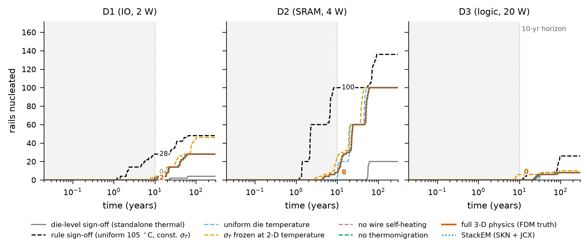

`e3_cdf`。纵轴上限随轨数增加到 160 以上。D2 在 10 年处完整物理是 8 条，规则签核是 100 条。D2 子图里天蓝色的均匀温度曲线在 10 年附近明显晚于完整物理，这就是它漏报的来源。芯片级签核的灰线在 D2 上到 50 年以后才抬起。

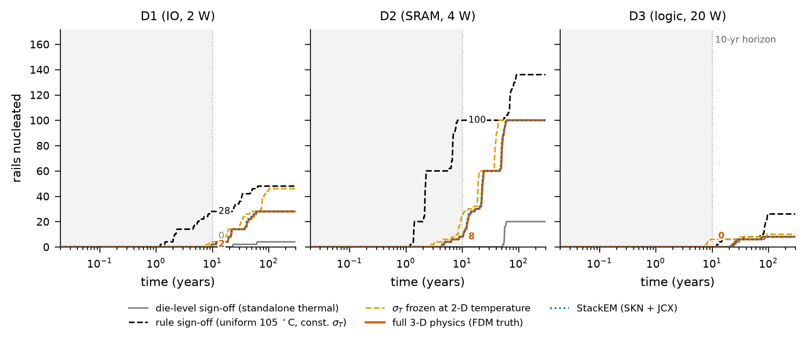

`e3_cdf_paper`，五条曲线的精简版。

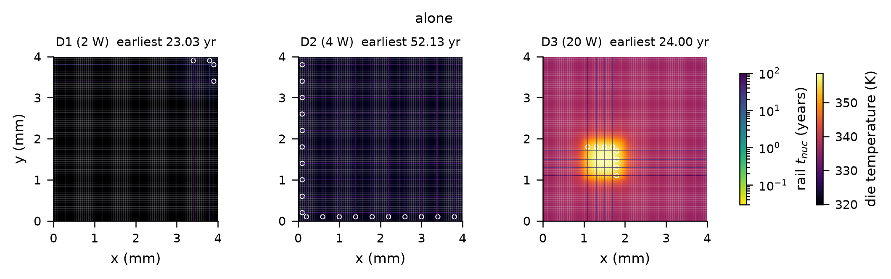

`e3_diemaps_alone`。D1 只有右上角 4 个成核点，对应 `alone` 下仅有的 4 条成核轨。D2 的成核点沿左边和下边等距排列。D3 与 base3 的图几乎一样。

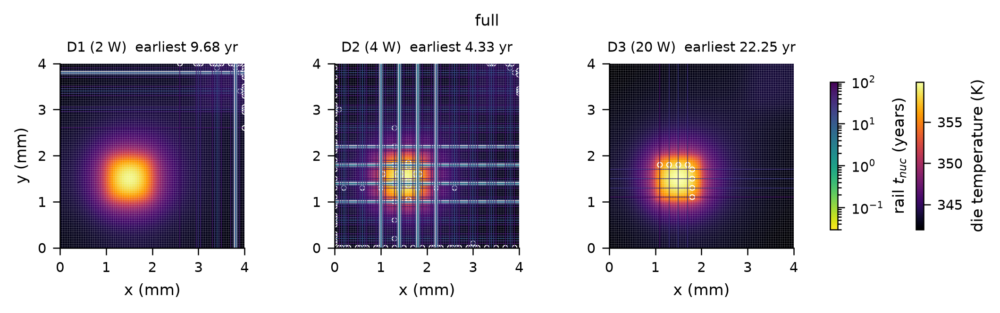

`e3_diemaps_full`。D2 上带浅色描边的失效轨横竖各四条，全部穿过或紧贴热斑。D1 上只有右边的两条竖线。与 base3 的同名图对比，失效轨从“铺满整层”变成了“集中在热斑附近”。

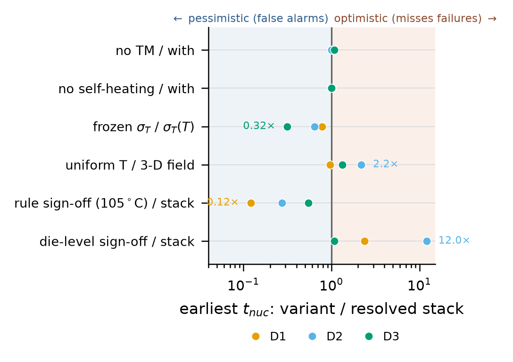

`e3_effect_ratios`。芯片级签核一行最右的点是 D2 的 12 倍。均匀温度一行 D2 的点在 2.2 倍处，比 base3 更偏乐观。规则签核一行三层芯片的点都在左侧，D3 也变成了悲观。

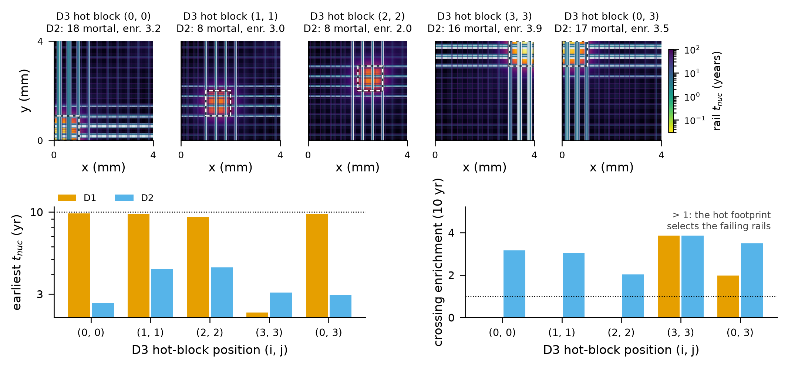

`e3_hotspot_alignment`。上排五个小图里，D2 的失效轨都是穿过虚线框的那几条，跟着热块移动。下排右图 D2 的富集度在五个位置都在 2 以上。下排左图 D1 的柱子在 (3,3) 处骤降到 2 年多，其余位置接近 10 年。

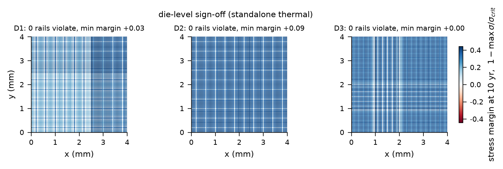

`e3_margin_alone`。全蓝。D1 的左下大半区域颜色较浅，D3 的最小裕量显示为 +0.00，说明它正好卡在阈值上。

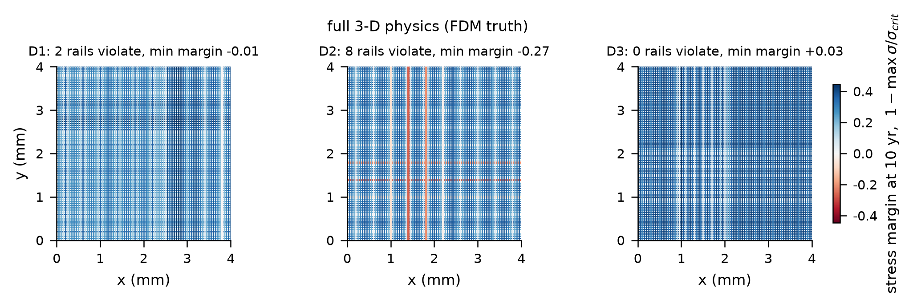

`e3_margin_full`。D2 上有横竖各两条红线和几条浅色线，位于热斑投影处。D1 的两条违例线几乎看不出红色，它的最小裕量只有负 0.01。

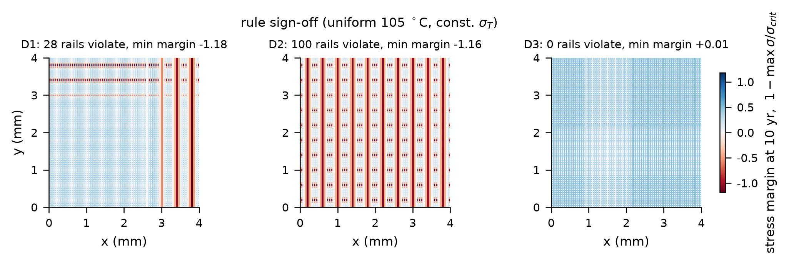

`e3_margin_uniform_signoff`。D2 上布满深红色竖线，D1 右侧和上方有几条。

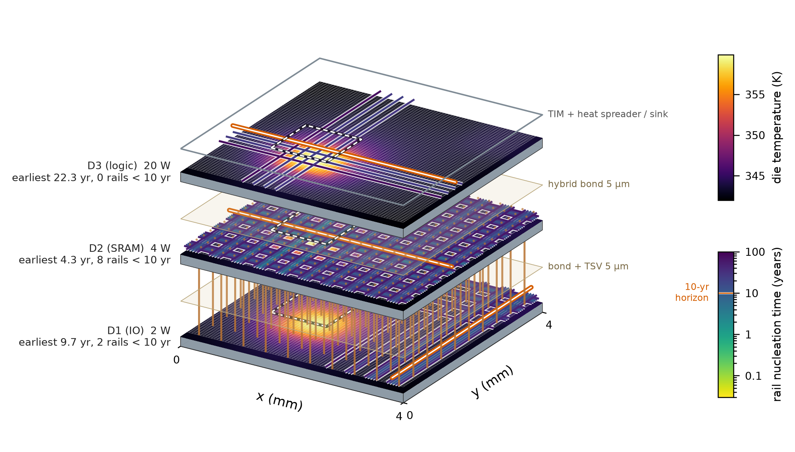

`e3_stack3d_full`。与 base3 的分解图同一个堆叠，轨更密。D2 层上最早失效的橙色粗线正好穿过虚线框。

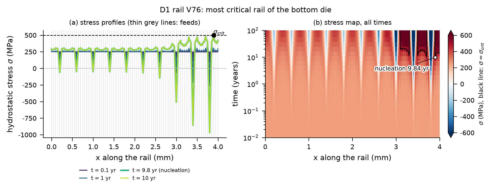

`e3_stress_surface`，D1 的 V76。形状与 base3 的 V38 相似：右端四分之一的锯齿最大，成核点在右端附近。10 年时的应力曲线只是刚刚碰到临界应力线。


`e3_thermal_slice`。与 base3 的图相同，因为温度场相同。

#### 5.3.3 E7 的两张图

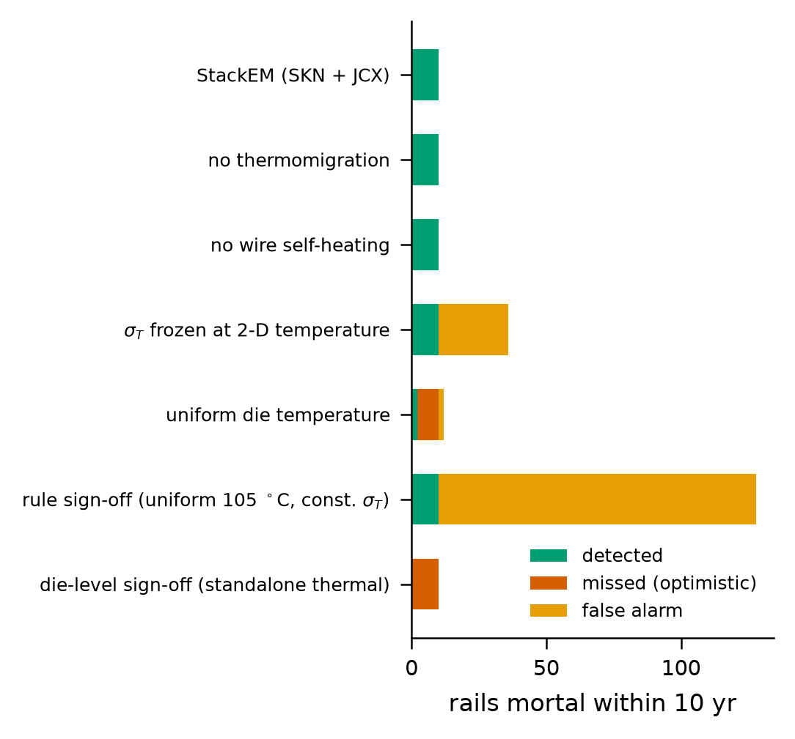

`e7_confusion`。均匀温度一行出现了三种颜色：很短的绿色、一段橘红色和末端一小段橙黄色，对应检出 2 条、漏报 8 条、误报 2 条。规则签核一行的橙黄色条超过 100。

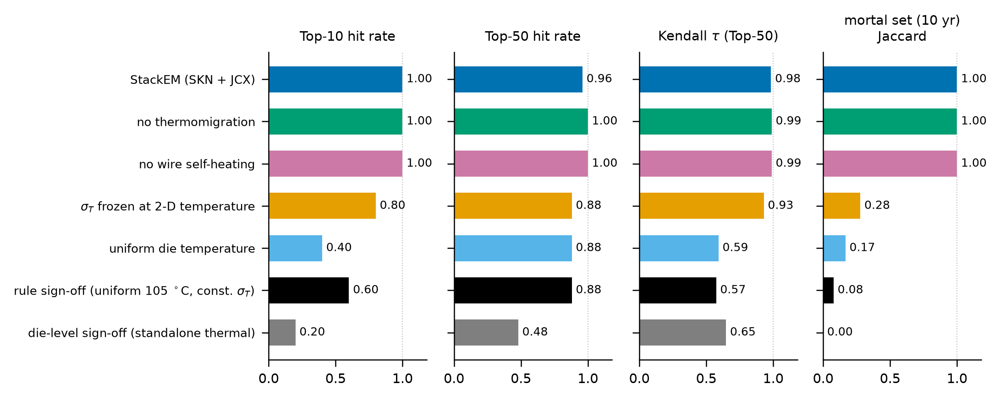

`e7_ranking`。Jaccard 子图里最下面四行的条都很短。Top-10 子图里芯片级签核只有 0.2，均匀温度 0.4，规则签核 0.6。StackEM 一行的 Top-50 是 0.96。

## 6. 怎么理解

三个堆叠给出同一个结论，下表把它们并排：

| 算例 | 堆叠最早成核 年，单独到键合 | 键合后 10 年内成核轨数 | 芯片级签核的乐观倍数 | 芯片级签核漏报 | 规则签核误报 | 均匀温度 漏报 / 误报 | StackEM 漏报 / 误报 |
|---|---|---|---|---|---|---|---|
| base3 | 20.36 到 2.39 | 26 | D1 4.89，D2 8.56，D3 1.03 | 26 | 94 | 0 / 0 | 0 / 0 |
| quad4 | 20.38 到 3.95 | 47 | D1 6.15，D2 3.65，D3 5.16，D4 1.40 | 47 | 203 | 0 / 23 | 0 / 1 |
| dense3 | 23.03 到 4.33 | 10 | D1 2.38，D2 12.04，D3 1.08 | 10 | 118 | 8 / 2 | 0 / 0 |

1. 每层芯片单独通过签核，不保证堆叠通过。键合把冷芯片加热二十多度，它们的寿命缩短到原来的几分之一。
2. 芯片级签核漏掉全部违例。规则签核一条不漏，代价是几倍于真实数量的误报，而且它排出的最危险轨不是真正最危险的轨。
3. 给芯片级签核补一个堆叠平均温度并不可靠：base3 上集合恰好对，quad4 上多报，dense3 上既漏又多。
4. 物理通道里，三维温度场和随温度变化的残余应力两项必须保留；自热和热迁移对冷芯片的影响在 1 % 上下。
5. 顶层热块的平面位置决定下层哪些轨失效，网格越密这个效应越明显。
6. StackEM 代理解在三个堆叠上都恢复了 10 年内的失效集合，只在 quad4 上多一条边界轨。

## 7. 论文用了哪些，哪些是论文之外的

| 论文中的说法 | 本章对应 |
|---|---|
| 26 条轨在 10 年内成核 | 5.1 表 a |
| 最凉的芯片被加热 25 K | 5.1.1 第一段 |
| 芯片级签核乐观 4.9 到 8.6 倍 | 5.1 表 c 第一行 D1、D2 |
| D2 从 20.5 年降到 2.4 年，D1 从 20.4 年降到 4.2 年，D3 几乎不变 | 5.1 表 b |
| 规则签核：0.47 年，120 条，其中 94 条在真实堆叠中是健康的，最危险的轨也不对 | 5.1 表 a、表 j |
| 冻结残余应力悲观 1.3 到 3 倍，多 8 条误报 | 5.1 表 c 的倒数，表 j |
| 自热的影响不超过 1 %；热迁移在两层凉芯片上不超过 1 %，在逻辑芯片上 11 % | 5.1 表 c 末两行 |
| D2 的失效轨在热块下富集 1.2 倍，最早的轨穿越热块 | 5.1 表 e |
| 热块移到角上，D2 的失效轨从 20 升到 30 至 34，最早寿命降到 1.1 至 1.4 年 | 5.1 表 g |
| (3,3) 处 D1 在 0.95 年失效，富集 3.7 倍 | 5.1 表 g |
| dense3 上富集度达到 3.0；热块在角上时同一条轨在两层下层芯片上最先失效 | 5.3 表 e、表 g |
| dense3 上带平均温度的芯片级签核只标出 4 条，其中 2 条是错的 | 5.3 表 a、表 j |
| 签核对比表的各行：最早成核时间、10 年内成核数、漏报与误报、Top-50、Kendall | 5.1 表 a 和表 j |
| 各算例汇总表的 base3、quad4、dense3 三行 | 第 6 节的表 |
| 论文的堆叠分解图和热块位置图 | `base3/e3/e3_stack3d_full`、`base3/e3/e3_hotspot_alignment` |
| 论文的累计成核曲线图 | 内容对应 `base3/e3/e3_cdf_paper` 的 D1、D2 两个子图里芯片级、规则、完整物理三条线 |

论文之外的内容：最小裕量和三张裕量图，逐轨比值分布，Spearman 统计，垂直互连的筛查表，1 年和 100 年的计数，quad4 的完整分解与热块扫描，dense3 热块扫描的大部分，芯片俯视图、应力历史图、热剖面图、效应比值图，E7 的两张图、Top-10、带容差的 Top-10 和 Jaccard。

## 8. 注意事项

1. quad4 的 D1 线宽饱和在下限，它的芯片级比值 6.1 不是 2 倍裕量算例的结果。论文汇总表给 quad4 写的范围 3.7 到 6.1 的上限来自它。dense3 的 D2 单独寿命 52 年，12 倍这个上限同样带有定线宽跳变的成分。
2. 热块在 (0,0) 和 (0,3) 时，base3 最先失效的是顶层 D3 自己，堆叠最早成核时间不足一年，比 D2 的数更早。热块在三个角上时顶层芯片都有 10 条以上的轨在 10 年内成核，已不满足单独签核的前提。论文描述热块扫描时只讲了 D2 和 D1。
3. 论文说热块移到角上富集度翻倍。数据是从 1.23 升到 1.93 至 2.01，增幅约 1.6 倍。
4. 论文签核对比表芯片级一行的最早成核时间写 20.3 年，参考解是 20.355 年，就近取整是 20.4。同一张表 StackEM 一行写 2.39 年，代理解是 2.405 年。
5. `min_margin_h` 依赖输出时刻的个数，在裕量接近零的芯片上，它的符号可能与“是否有轨在 10 年内成核”不一致。判断是否违例以成核计数为准。
6. `e3_stress_surface` 图上标注的成核时间来自画图时用每段 30 个单元的重新求解，与表 b 里同一条轨的值不完全相同。
7. quad4 的三张裕量图子图标题互相重叠。
8. 表 g 不含顶层芯片自己的数据。表 f 最后一列是从 `hot_<ij>/e3_full_truth.json` 补出来的。
9. 对齐统计的两条规则是固定写在代码里的：热块的阈值是 1.5 倍平均功耗，穿越只看段的中点。扫描只取五个位置，线宽不重新定。
10. 5.1.1 里关于规则签核在 D3 上略偏乐观的解释是推断。
11. 失效判据是成核。成核之后空洞长大、电阻上升的阶段没有建模，电源网格的冗余也没有考虑。每条轨当作一条独立的、两端封闭的多段线来求解，同层横竖轨之间不交换原子通量。
12. E7 的 Kendall 只在 `full` 最早的 50 条轨上计算。并列的对称轨会让“最早的轨相同”一列出现“否”，见 5.3.1 第 7 条。
