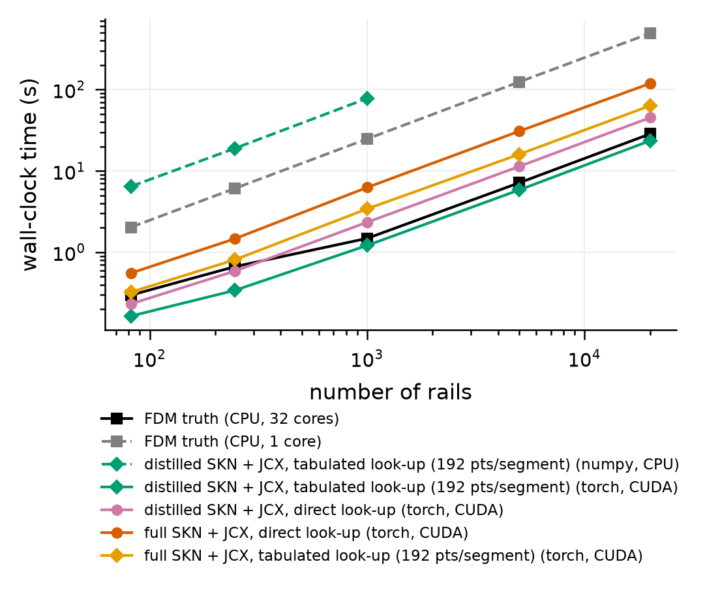
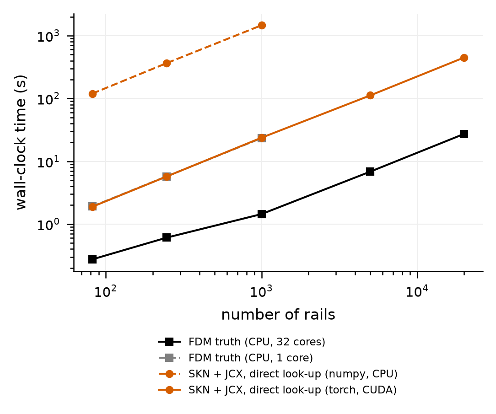

# 实验 E4：规模与速度

本章说明 `reference_results/base3/e4/` 和 `reference_results/base3_teacher/e4/`。核对清单是 `docs/checks/results_06.jsonl`。

## 1. 这个实验回答什么问题

电源轨的数量从几十条增加到两万条时，各种求解方式的墙钟时间怎样增长，StackEM 的闭合引擎与参考求解器相比快多少。

术语：

- 墙钟时间：从开始到结束实际经过的时间，与 CPU 占用时间相区别。
- 直接求值，图里写 direct look-up：闭合每需要一个核函数值就调用一次网络。
- 查表，图里写 tabulated look-up：每段先在 192 个对数时间点上求一次核函数，之后全部靠插值。
- M：输出时间点个数。学生引擎 32，教师引擎 64。
- numpy 路径与 torch 路径：闭合有两套实现。numpy 的在 CPU 上运行，不需要 PyTorch；torch 的在 GPU 上运行，是部署用的路径。

## 2. 原理与做法

### 2.1 被计时的引擎

`stackem/experiments/e4_scaling.py` 先跑一次 HotSpot 和电源网格直流解，取 `full` 变体下三层芯片的全部电源轨作为基础集合，共 246 条。这部分准备工作不计时。之后对每个规模依次计时：

| 引擎 | 做法 |
|---|---|
| 参考求解器，多进程 | 把轨平均切成与逻辑处理器数相同的份数，每个进程各解一份。参考机器上是 32 个进程 |
| 参考求解器，单进程 | 同一求解器只用一个进程 |
| 闭合，numpy，CPU | 每批 256 条轨。只测到 `--numpy-max` 为止，默认 2000 条 |
| 闭合，torch，GPU | 先用 1 条轨热身，再分批计算。直接求值每批 64 条轨，查表每批 1024 条 |

学生引擎的运行加了 `--teacher` 和 `--ablate-modes`，于是 torch 路径一次计时四个组合：学生查表、学生直接求值、教师直接求值、教师查表。教师引擎的运行只有教师直接求值一种，并且单进程参考求解器只测到 1000 条。

### 2.2 两万条轨是怎么造出来的

脚本循环遍历 246 条基础轨，直到凑够 n 条。每复制一条轨做两处随机扰动：每一段的电流密度乘以 0.8 到 1.2 之间的独立随机因子；整条轨两端的温度同时加上正负 5 K 以内的同一个偏移。段数不变，随机种子固定。由此：

1. n 为 82 时取到的是基础集合的前 82 条，即 D1 的全部轨。n 为 246 时三层芯片各出现一次。n 为 20000 时基础集合被重复约 81 遍。
2. 轨上的焦耳温升和初始应力沿用基础轨的值，没有按新电流和新温度重算。E4 只计时，不比较成核时间，这一点不影响计时的含义。
3. E4 不做不朽筛选，每条轨都真的被求解。

### 2.3 核函数求值次数

查表方式每处理 n 段就求值 6 乘 n 乘 192 个点。E4 把各引擎的累计次数写入 `kernel_evals_by_engine`。计数器在五个规模之间不清零，并包含每个规模开始前 1 条轨的热身。直接求值的引擎没有这个计数，对应项为空。

### 2.4 论文用的计时图

`tools/paper_timing_fig.py` 读取 `e4_timing.json`，只保留三类曲线：学生查表 GPU 引擎，图例写作 StackEM (1 GPU)；两条参考求解器曲线；以及用 `--external 标签=csv` 给出的外部基线。`run_all.sh` 的 `figs.timing` 步骤在 `<根>/comsol/comsol_timing.csv` 存在时自动把 COMSOL 加为外部基线。

## 3. 怎么运行

| 步骤 | 命令 |
|---|---|
| `e4` | `python -m stackem.experiments.e4_scaling --config configs/base3.json --root <根> --hotspot <HotSpot> --teacher <根>/base3/skn/skn_best.npz --ablate-modes --sizes 82,246,1000,5000,20000` |
| `teacher.e4` | `python -m stackem.experiments.e4_scaling --config configs/base3_teacher.json --root <根> --hotspot <HotSpot> --sizes 82,246,1000,5000,20000 --single-core-max 1000` |
| `figs.timing` | `python tools/paper_timing_fig.py --root <根> --name base3`，有 COMSOL 计时文件时再加 `--external "COMSOL (FEM)=<根>/comsol/comsol_timing.csv"` |

```bash
STACKEM_ONLY=e4,teacher.e4,figs.timing bash scripts/run_all.sh
```

E4 是计时实验。运行它的时候机器上不能有别的任务占用 GPU 或 CPU，否则数字没有意义。规模可以用环境变量 `STACKEM_E4_SIZES` 改。没有 GPU 时 torch 路径在 CPU 上运行，没有 PyTorch 时只测参考求解器和 numpy 路径。屏幕上每个规模打印一行，列出各引擎的秒数，未测的显示 `nans`。

参考机器上整个步骤的耗时：

| 步骤 | 耗时 | 来源 |
|---|---|---|
| `e4` | 1125 秒，即 18.8 分钟 | `logs/final_3_full.log` |
| `teacher.e4` | 2609 秒，即 43.5 分钟 | `logs/final_1_full.log` |

教师引擎一步耗时长，主要花在 numpy 直接求值上，它在 1000 条轨上就要二十多分钟。

## 4. 输出文件

`reference_results/base3/e4/` 共 10 个文件，`reference_results/base3_teacher/e4/` 共 6 个。

| 文件 | 内容 |
|---|---|
| `e4_timing.json` | `sizes` 是五个规模；`timings` 是每个引擎一组秒数，未测的规模为空；`device`、`workers`、`provider`、`closure_mode`、`n_tab`、`M`；`kernel_evals_by_engine`；`_meta` |
| `config_used.json` | 这次运行的完整配置 |
| `e4_timing.png`、`.pdf` | 全部引擎的对数坐标计时图 |
| `e4_timing_data.json`、`.npz` | 上图的曲线坐标 |
| `fig_e4_paper_timing.png`、`.pdf`、`_data.json`、`_data.npz` | 只在 `base3/e4/`。三条曲线的精简计时图 |

## 5. 结果

### 5.1 学生引擎的运行，`base3/e4/`

设备 `cuda`，进程数 32，M 为 32，表点数 192。单位秒。

| 引擎 | 结果文件里的标签 | 82 条 | 246 条 | 1000 条 | 5000 条 | 20000 条 |
|---|---|---|---|---|---|---|
| 参考求解器，32 进程 | `FDM truth (CPU, 32 cores)` | 0.30 | 0.66 | 1.48 | 7.13 | 28.44 |
| 参考求解器，单进程 | `FDM truth (CPU, 1 core)` | 2.03 | 6.08 | 24.73 | 123.89 | 490.41 |
| 学生查表，numpy，CPU | `distilled SKN + JCX, tabulated look-up (192 pts/segment) (numpy, CPU)` | 6.44 | 18.90 | 77.77 | 未测 | 未测 |
| 学生查表，torch，GPU。正式引擎 | `distilled SKN + JCX, tabulated look-up (192 pts/segment) (torch, CUDA)` | 0.16 | 0.34 | 1.21 | 5.83 | 23.45 |
| 学生直接求值，torch，GPU | `distilled SKN + JCX, direct look-up (torch, CUDA)` | 0.23 | 0.59 | 2.34 | 11.33 | 45.11 |
| 教师直接求值，torch，GPU | `full SKN + JCX, direct look-up (torch, CUDA)` | 0.55 | 1.46 | 6.26 | 30.71 | 118.64 |
| 教师查表，torch，GPU | `full SKN + JCX, tabulated look-up (192 pts/segment) (torch, CUDA)` | 0.32 | 0.81 | 3.41 | 15.97 | 63.20 |

从这张表算出的几个关系，都以两万条轨为准：

| 比较 | 倍数 |
|---|---|
| 单进程参考求解器 对 正式引擎 | 20.92 |
| 32 进程参考求解器 对 正式引擎 | 1.21 |
| 单进程 对 32 进程参考求解器 | 17.24 |
| 学生直接求值 对 学生查表 | 1.92 |
| 教师直接求值 对 教师查表 | 1.88 |
| 教师查表 对 学生查表 | 2.70 |
| 教师直接求值 对 正式引擎 | 5.06 |

正式引擎每条轨的平均时间是 1.17 毫秒。从 5000 条到 20000 条，规模变成 4 倍，正式引擎的时间变成 4.02 倍，增长是线性的。

核函数求值次数：torch 查表引擎 1213424640 次，numpy 查表 61194240 次。按每条轨 40 段核算，torch 路径处理了五个规模共 26328 条轨加 5 条热身轨，6 乘 192 乘 40 乘 26333 正是前一个数；numpy 路径只测到 1000 条，三个规模共 1328 条，6 乘 192 乘 40 乘 1328 是后一个数。



横轴是轨数，纵轴是墙钟时间，都是对数刻度。七条线对应上表的七行，图例的顺序与表相同。所有线在 1000 条以上都是斜率为 1 的直线。最下面的绿色实线是正式引擎。黑色实线的 32 进程参考求解器在小规模时斜率较小，因为进程池的启动开销占了主要部分，到两万条时它紧贴在绿线上方。粉色、黄色、橙红色三条依次是学生直接求值、教师查表、教师直接求值。灰色虚线是单进程参考求解器。绿色虚线是 numpy 路径，耗时是 GPU 路径的几十倍，只画到 1000 条。


`fig_e4_paper_timing`，三条曲线：橙红色是正式引擎，黑色是 32 进程参考求解器，灰色虚线是单进程参考求解器。图例把两万条轨处的秒数取整后写在每条线的名字后面。参考结果里的这张图没有 COMSOL 曲线。自己运行 `figs.timing` 时若 COMSOL 计时文件存在，图上会多一条。

### 5.2 教师引擎的运行，`base3_teacher/e4/`

设备 `cuda`，进程数 32，M 为 64，闭合方式 `direct`。单位秒。

| 引擎 | 结果文件里的标签 | 82 条 | 246 条 | 1000 条 | 5000 条 | 20000 条 |
|---|---|---|---|---|---|---|
| 参考求解器，32 进程 | `FDM truth (CPU, 32 cores)` | 0.27 | 0.61 | 1.44 | 6.85 | 27.26 |
| 参考求解器，单进程 | `FDM truth (CPU, 1 core)` | 1.91 | 5.75 | 23.38 | 未测 | 未测 |
| 教师直接求值，numpy，CPU | `SKN + JCX, direct look-up (numpy, CPU)` | 119.59 | 364.78 | 1461.19 | 未测 | 未测 |
| 教师直接求值，torch，GPU | `SKN + JCX, direct look-up (torch, CUDA)` | 1.89 | 5.72 | 23.70 | 111.95 | 448.37 |

教师直接求值在 GPU 上解两万条轨需要 448 秒，是同一次运行里 32 进程参考求解器的 16.4 倍。numpy 直接求值在 1000 条轨上要 1461 秒，即 24.4 分钟。

同一个教师网络、同样是直接求值，这里的耗时是 5.1 节表里“教师直接求值”一行的 3.8 倍。差别来自 M：这里是 64，5.1 节是 32，直接求值的点数随 M 的平方增长。



四条线。黑色实线是 32 进程参考求解器。橙红色实线是教师直接求值 GPU 路径，它与灰色的单进程参考求解器几乎完全重合，图上只看得见灰色方块叠在橙红色圆点上。橙红色虚线是 numpy 路径，在最上方，只到 1000 条。

## 6. 怎么理解

1. 所有引擎的时间都随轨数线性增长。
2. 正式引擎，即学生网络加查表加 M=32 在一块 GPU 上，两万条轨用 23 秒，每条轨约 1 毫秒。单进程参考求解器的耗时约为它的 21 倍。
3. 它对 32 进程参考求解器的优势很小，只快约两成。参考求解器本身是一维问题，每条轨独立，天然适合多进程并行；在一台 32 线程的机器上把它全部跑满，与一块 GPU 上的代理解差不多快。速度不是这个方法相对自家参考求解器的主要卖点。
4. 查表是速度的关键。同一个学生网络，直接求值的耗时约为查表的两倍；教师网络也是如此。
5. 网络大小是第二个因素。同样查表，教师的耗时约为学生的 2.7 倍。
6. 教师引擎的原始设置，直接求值加 M=64，在 GPU 上的耗时是 32 进程参考求解器的十几倍。这是后来改用学生加查表加 M=32 的直接原因。
7. 与商业有限元软件的比较在 [11_COMSOL交叉验证.md](11_COMSOL交叉验证.md)。COMSOL 一侧两万条轨的时间是外推值。

## 7. 论文用了哪些，哪些是论文之外的

| 论文中的说法 | 本章对应 |
|---|---|
| 两万条轨在一块 GPU 上 23 秒 | 5.1 节表，正式引擎最后一列 |
| 闭合一条轨约 1 毫秒 | 5.1 节 |
| 墙钟时间随轨数线性增长 | 5.1 节 |
| 每段 192 个查表点，M 为 32 | 5.1 节开头 |

论文之外的内容：正式引擎以外的全部引擎，32 进程与单进程参考求解器的耗时，numpy 路径，小规模各点，核函数求值次数，教师引擎的整个 E4，两张计时图。论文正文把计时结果写成了一句话，没有放图，所以 32 进程参考求解器的 28 秒和单进程的 490 秒这两个数没有出现在论文里。

## 8. 注意事项

1. 两万条轨是把 246 条基础轨复制并加扰动得到的，段数、几何、馈电位置都不变。它检验的是批处理吞吐量，不代表两万条互不相同的真实走线。真实走线上的规模测试见 [10_IBM电源网格基准.md](10_IBM电源网格基准.md)。
2. 每个引擎每个规模只测一次，没有重复取平均，没有误差条。同一引擎在两次运行之间有百分之几的波动，例如两万条轨上 32 进程参考求解器在学生引擎的运行里是 28.4 秒，在教师引擎的运行里是 27.3 秒。
3. 计时只含求解本身。参考求解器一侧含进程池的创建，torch 一侧含把轨转成张量的时间。HotSpot 热仿真、电源网格直流解、不朽筛选都不在内。
4. GPU 计时前只用 1 条轨热身。
5. 对 32 进程参考求解器只快约两成，见第 6 节第 3 条。论文的速度结论依赖与单进程和与 COMSOL 的对比。
6. 参考机器的处理器是 16 核 32 线程。结果文件和图里写的 32 cores 指 32 个进程，即逻辑处理器数。
7. 教师引擎的图里，单进程参考求解器的线被 GPU 闭合的线遮住。
8. `e4_timing.json` 的 `_meta.cmd` 记录的是参考运行当时的命令行，其中 `--single-core-max 20000` 现在已是脚本默认值，`run_all.sh` 不再显式传它。
