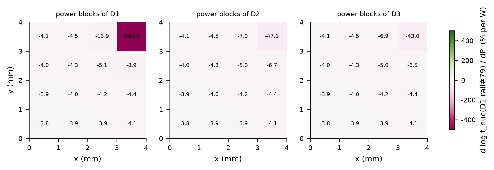
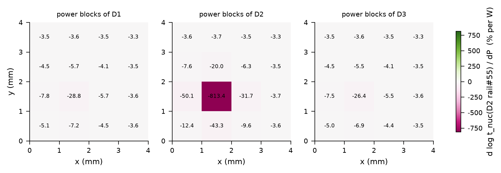
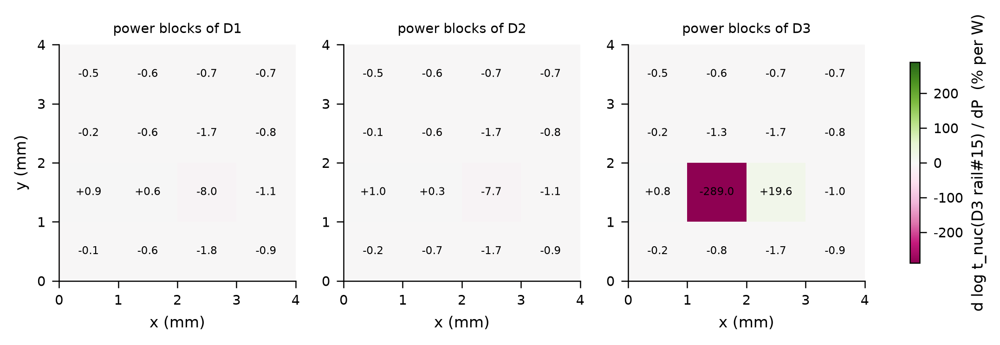
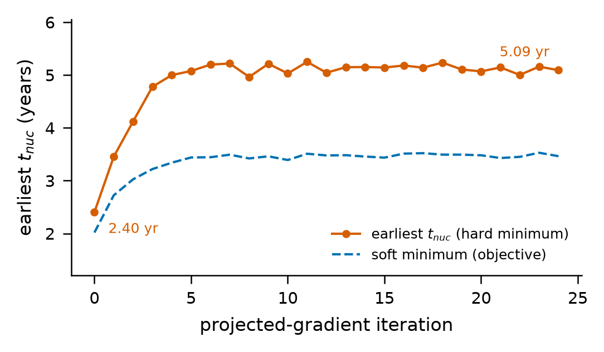
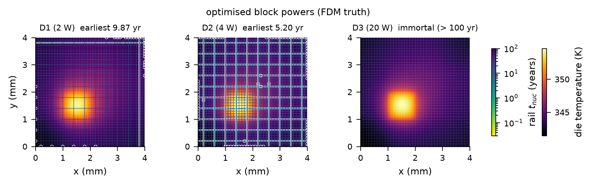

# 实验 E5：定点修复、功耗灵敏度与功耗再分配

本章说明 `reference_results/base3/e5/`，这是学生引擎在 base3 上的结果，也是论文采用的结果。教师引擎的同一个实验在 `reference_results/base3_teacher/e5/`，放在 [12_教师引擎与学生引擎对比.md](12_教师引擎与学生引擎对比.md) 里说明。核对清单是 `docs/checks/results_07.jsonl`。

## 1. 这个实验回答什么问题

E3 已经给出结论：三层芯片各自通过签核，键合成堆叠后有 26 条电源轨在 10 年内成核。E5 回答接下来的三个问题。

1. 知道了是哪些轨出问题，只加宽这些轨要多花多少金属，与整层芯片统一加宽相比省多少。
2. 每条关键轨的寿命对每个功耗块的功耗有多敏感，自动微分给出的梯度是否可信。
3. 在每层芯片总功耗不变的前提下重新分配各块功耗，最早成核时间能推迟多少。

术语：

- 违例轨：堆叠中成核时间小于 10 年的轨。
- 定点修复，图里写 targeted：每条违例轨按自己需要的倍数加宽。统一加宽，图里写 blanket：整层芯片的全部轨都按最大的那个倍数加宽，代表没有逐轨分辨能力的规则会采取的做法。
- 功耗块：每层芯片的功耗图分成 4 乘 4 共 16 块，三层合计 48 块，标签形如 `D3/D3_1_1`，两个数字是 x 方向和 y 方向的块序号，从 0 开始。
- 自动微分：PyTorch 沿计算图反向求导。有限差分：把输入改变一个小量重新算一遍，用差商近似导数。
- 投影梯度法：沿梯度走一步，再把结果拉回约束集合。

## 2. 原理与做法

核心函数在 `stackem/sensitivity.py`，实验脚本是 `stackem/experiments/e5_sensitivity.py`。

### 2.1 第一部分：定点修复对比统一加宽

只用 numpy 闭合，不需要 PyTorch。对每层芯片：

1. 取 `full` 变体的全部轨，筛掉不朽的，对其余轨用代理解算成核时间。
2. 成核时间小于 10 年的记为违例。
3. 对每条违例轨在加宽倍数的对数上二分，找最小的倍数 f 使加宽后的成核时间不小于 10 年。倍数精确到约 2 %，上限 20。
4. 加宽的含义：线宽乘 f，电流密度除以 f，按新电流重算焦耳温升，再按新的平均温度重算初始应力。
5. 计算金属面积。记 W 为原线宽，L 为一条轨的总长：

```text
area_targeted = sum_i (f_i - 1) * W * L          只对违例轨求和
f_blanket     = max_i f_i
area_blanket  = n_rails * (f_blanket - 1) * W * L
area_grid     = n_rails * W * L                  该芯片原有的网格金属面积
ratio         = area_blanket / area_targeted
```

6. 用参考求解器分别验证两种修复后的整层芯片，记录修复后的最早成核时间。

结果写入 `e5_repair.json`。

### 2.2 第二部分：线性映射与梯度

HotSpot 的热模型和电源网格的直流解对功耗块功耗都是线性的。脚本用单位功耗响应建立两个线性映射：每个功耗块 1 W 在每条轨每个结点上产生的温升，和本层每个功耗块 1 W 在每段上产生的电流密度。于是结点温度和段电流都是 48 维功耗向量 P 的线性函数。把这两步、焦耳温升、初始应力和 torch 闭合串成一条可微的计算链，输入 P，输出每条轨的成核时间。

对选中的每条轨求

$$ g_b = \frac{\partial \ln t_{nuc}}{\partial P_b} \quad [1/\mathrm{W}] $$

含义是块 b 的功耗每增加 1 W，该轨寿命的对数变化多少。负值表示增加功耗会缩短寿命。数值为负 5 时，功耗增加 0.01 W 寿命约缩短 5 %。

目标轨：每层芯片取代理解下成核最早的 5 条，三层共 15 条。梯度矩阵是 15 行 48 列，存为 `grads_dlogt_dP_per_W`。轨的下标按先 41 条横向、后 41 条纵向排列，下标 79 是 V38，55 是 V14，15 是 H15。

### 2.3 有限差分检查

对每层芯片最关键的那条轨取两个块：梯度绝对值最大的块，和梯度绝对值最小但不为零的块。每个块做中心差分，步长是块功耗的 1 %：

```text
finite_diff = ln( t_nuc(P0 + delta e_b) / t_nuc(P0 - delta e_b) ) / (2 delta)
```

差分一侧用同一组线性映射和 numpy 闭合重算成核时间，不重跑 HotSpot，也不用参考求解器。所以这项检查比较的是 torch 闭合的自动微分与 numpy 闭合的差商，两边是同一个代理模型。它检查的是自动微分的实现，不检查代理解的梯度相对参考求解器有多准。

### 2.4 第三部分：投影梯度功耗再分配

目标函数是全部轨的 $\ln t_{nuc}$ 的软最小值：

$$ J(P) = -T \ln \sum_i \exp(-\ln t_i / T), \qquad T = 0.15 $$

软最小值是最小值的光滑近似，它的梯度等于各轨梯度的加权和，最早失效的几条轨权重最大。每次迭代先前向算出全部轨的成核时间并记录，再反向求梯度，然后对每层芯片单独更新：梯度减去均值以保持总功耗不变；步长是该层块平均功耗的 5 %；每块功耗限制在平均功耗的 0.3 到 3 倍之间；最后整体缩放使总和回到原值。默认迭代 25 次。循环结束后返回的是第 25 次更新之后的功耗向量。

最后用完整流程验证：把优化后的功耗写回堆叠定义，重跑 HotSpot 和电源网格，用参考求解器解 `full` 变体，与基准功耗的参考解一起写入 `verification`。

## 3. 怎么运行

步骤名 `e5`：

```bash
STACKEM_ONLY=e5 bash scripts/run_all.sh
# 等价于
python -m stackem.experiments.e5_sensitivity --config configs/base3.json --root <根> --hotspot <HotSpot>
```

可选参数：`--topk` 每层芯片取几条关键轨，`--iters` 再分配的迭代次数，`--device` 选 `auto`、`cuda` 或 `cpu`。E5 必须有训练好的网络权重。没有 PyTorch 时只执行第一部分，只写出 `e5_repair.json` 和修复图。

屏幕输出依次是：每层芯片一行修复摘要，`linear maps built in ...`，`gradients for 15 rails in ...`，六行有限差分对比，25 行迭代轨迹，最后是验证结果和 `[saved] .../e5_summary.json`。

参考机器上的耗时。参考结果目录里的文件由单独运行 E5 一步得到，日志是 `logs/e5_redraw.log`；整条流程的日志 `logs/final_3_full.log` 里也有一次 E5，两次的屏幕输出在修复、差分和迭代轨迹上相同。

| 日志 | 整个步骤 秒 | 建立线性映射 秒 | 15 条轨的梯度 秒 |
|---|---|---|---|
| `logs/e5_redraw.log` | 173 | 34 | 2 |
| `logs/final_3_full.log` | 184 | 35 | 3 |

建立线性映射要做 48 次单位功耗的 HotSpot 仿真。梯度的计时只打印到整秒。

## 4. 输出文件

`reference_results/base3/e5/` 共 27 个文件。

| 文件 | 内容 |
|---|---|
| `e5_repair.json` | `horizon_years`；`sizing` 是定线宽结果的副本；`dies` 是每层芯片的 `n_rails`、`n_violating`、`violating` 列表含轨名、代理解成核时间和加宽倍数，`W_um`、`f_blanket`、三个面积、面积比、两个参考解验证值 |
| `e5_summary.json` | `block_labels` 48 个；`P0` 基准功耗；`targets` 目标轨下标；`device`；`repair` 同上；`base_earliest_years` 代理解下各层最早成核时间；`grads_dlogt_dP_per_W`；`finite_difference_check`；`optimized_P`；`trajectory`；`verification` 含 `base` 和 `optimized` 两份堆叠摘要 |
| `config_used.json` | 完整配置 |
| `e5_repair` 图 | 违例轨位置加金属成本柱状图 |
| `e5_sensmap_D1`、`e5_sensmap_D2`、`e5_sensmap_D3` 图 | 每层芯片最关键轨的 48 块灵敏度图 |
| `e5_budget_trajectory` 图 | 再分配的迭代轨迹 |
| `e5_diemaps_optimized` 图 | 优化功耗下的芯片温度与轨寿命图 |

每张图有 `.png`、`.pdf`、`_data.json`、`_data.npz` 四个文件。

## 5. 结果

### 5.1 修复

| 芯片 | 轨数 | 违例轨 | 原线宽 µm | 最大倍数 | 定点面积 µm² | 统一面积 µm² | 网格面积 µm² | 定点占比 % | 统一占比 % | 面积比 | 验证，定点 年 | 验证，统一 年 |
|---|---|---|---|---|---|---|---|---|---|---|---|---|
| D1 | 82 | 6 | 1.3494 | 1.6540 | 12985 | 289456 | 442601 | 2.93 | 65.40 | 22.29 | 10.078 | 10.078 |
| D2 | 82 | 20 | 0.9916 | 1.9946 | 41076 | 323468 | 325238 | 12.63 | 99.46 | 7.87 | 10.031 | 10.122 |
| D3 | 82 | 0 | 15.3377 | 1.0000 | 0 | 0 | 5030752 | 0.00 | 0.00 | 无 | 不成核 | 不成核 |

违例轨逐条列表。H 是横向轨，V 是纵向轨。成核时间是代理解在修复前算出的值。

| 芯片 | 轨 | 代理解成核时间 年 | 加宽倍数 |
|---|---|---|---|
| D1 | H30 | 9.193 | 1.0603 |
| D1 | H34 | 5.065 | 1.4887 |
| D1 | H38 | 4.147 | 1.6540 |
| D1 | V30 | 9.193 | 1.0603 |
| D1 | V34 | 5.065 | 1.4887 |
| D1 | V38 | 4.147 | 1.6540 |
| D2 | H2 | 4.763 | 1.5239 |
| D2 | H6 | 5.221 | 1.4542 |
| D2 | H10 | 3.615 | 1.4887 |
| D2 | H14 | 2.405 | 1.9946 |
| D2 | H18 | 2.692 | 1.8377 |
| D2 | H22 | 4.929 | 1.4542 |
| D2 | H26 | 5.462 | 1.4206 |
| D2 | H30 | 6.033 | 1.3398 |
| D2 | H34 | 6.364 | 1.3088 |
| D2 | H38 | 5.874 | 1.3556 |
| D2 | V2 | 4.763 | 1.5239 |
| D2 | V6 | 5.221 | 1.4542 |
| D2 | V10 | 3.615 | 1.4887 |
| D2 | V14 | 2.405 | 1.9946 |
| D2 | V18 | 2.693 | 1.8377 |
| D2 | V22 | 4.929 | 1.4542 |
| D2 | V26 | 5.462 | 1.4206 |
| D2 | V30 | 6.033 | 1.3398 |
| D2 | V34 | 6.364 | 1.3088 |
| D2 | V38 | 5.874 | 1.3556 |

1. D1 有 6 条违例轨，位于右上角它自己的热块附近，横竖各 3 条，成对出现，倍数相同。D2 有 20 条，横竖各 10 条。D3 没有违例轨。
2. D1 的定点修复只增加网格金属的不到 3 %，统一加宽要增加约 65 %。D2 的定点修复约 13 %，统一加宽几乎把金属翻倍。
3. 修复后的参考解验证值都略高于 10 年，说明按代理解求出的倍数在参考求解器下也成立。
4. D1 两种修复的验证值相同。合理的解释是两种修复下最早失效的都是被加宽到最大倍数的那条轨，它在两种修复里的线宽相同。


左边两个面板是 D1 和 D2 的俯视图，灰色细线是全部电源轨，彩色粗线是违例轨，颜色表示需要的加宽倍数，从浅黄的 1.0 到深红的约 2.0。D1 的违例轨集中在右上角，三横三竖。D2 的违例轨是遍布全片的十横十竖，颜色最深的两对在 x 和 y 约 1.4 与 1.8 mm 处，正好穿过顶层热块的投影。D3 没有违例轨所以不画。右边的柱状图给出恢复 10 年期限需要增加的金属，以该芯片原网格金属的百分比表示。蓝色是定点修复，灰色是统一加宽，柱顶标着面积比 22 倍和 8 倍，D3 处写 no repair needed。

### 5.2 目标轨与代理解基准

| 芯片 | 目标轨下标 | 代理解最早成核 年 | 参考解最早成核 年 |
|---|---|---|---|
| D1 | 79、38、75、34、30 | 4.147 | 4.166 |
| D2 | 55、14、59、18、51 | 2.404 | 2.389 |
| D3 | 15、56、54、13、17 | 22.043 | 21.508 |

### 5.3 有限差分检查，全部 6 行

| 芯片 | 轨下标 | 功耗块 | 自动微分 1/W | 有限差分 1/W | 步长 W | 相对偏差 % |
|---|---|---|---|---|---|---|
| D1 | 79 | `D1/D1_3_3` | -5.008907 | -5.005852 | 0.004211 | 0.06 |
| D1 | 79 | `D2/D2_0_0` | -0.037855 | -0.037510 | 0.002500 | 0.92 |
| D2 | 55 | `D2/D2_1_1` | -8.134263 | -8.134008 | 0.002500 | 0.00 |
| D2 | 55 | `D3/D3_3_3` | -0.033058 | -0.032894 | 0.010000 | 0.50 |
| D3 | 15 | `D3/D3_1_1` | -2.889701 | -2.799800 | 0.050000 | 3.21 |
| D3 | 15 | `D2/D2_0_2` | -0.001200 | 0.000653 | 0.002500 | 283.87 |

前 5 行的灵敏度绝对值都大于 0.01/W，其中最大的相对偏差是 3.21 %，出现在 D3 的轨 15 对它自己的热块。第 6 行自动微分为负，有限差分为正，符号相反。它的绝对值约 0.001/W，比主导项小三个数量级。

### 5.4 灵敏度

每层芯片最关键轨的梯度里绝对值最大的 5 个块，单位 1/W：

| 芯片 | 轨下标 | 第 1 | 第 2 | 第 3 | 第 4 | 第 5 |
|---|---|---|---|---|---|---|
| D1 | 79 | `D1/D1_3_3` -5.0089 | `D2/D2_3_3` -0.4710 | `D3/D3_3_3` -0.4301 | `D1/D1_2_3` -0.1388 | `D1/D1_3_2` -0.0888 |
| D2 | 55 | `D2/D2_1_1` -8.1343 | `D2/D2_0_1` -0.5009 | `D2/D2_1_0` -0.4331 | `D2/D2_2_1` -0.3167 | `D1/D1_1_1` -0.2881 |
| D3 | 15 | `D3/D3_1_1` -2.8897 | `D3/D3_2_1` 0.1957 | `D1/D1_2_1` -0.0805 | `D2/D2_2_1` -0.0766 | `D1/D1_2_0` -0.0179 |

跨芯片的耦合可以直接读出：D2 最关键轨对顶层热块 `D3/D3_1_1` 的灵敏度是 -0.2643，对正下方 D1 同位置块 `D1/D1_1_1` 的灵敏度是 -0.2881。



三个面板分别是 D1、D2、D3 的 4 乘 4 功耗块，每格里的数字是 D1 轨 79 的 $\ln t_{nuc}$ 对该块功耗的导数乘以 100，单位是每瓦百分之几。紫红色表示负值即缩短寿命，绿色表示正值。D1 自己右上角的块是 -500.9，颜色最深：这条轨就在这个块里，块功耗同时决定它的电流和局部温度。D2 和 D3 同一位置的块是 -47.1 和 -43.0，只通过传热起作用，小一个数量级。其余块都在 -4 左右，是整体升温的背景贡献。



D2 轨 55 的图。D2 自己 x 和 y 都在 1 到 2 mm 的块是 -813.4。D1 和 D3 同位置的块是 -28.8 和 -26.4。D2 该块的上下左右相邻块在 -20 到 -50 之间，因为它们也给这条轨的其他段供电流。



D3 轨 15 的图。主导块是 D3 自己的热块，-289.0。它右侧相邻的块是 +19.6，浅绿色：增加这个块的功耗反而延长该轨寿命。一个可能的原因是电流分布改变后这条轨上的电流部分抵消，这一点没有单独验证。D1 和 D2 的块大多在正负 2 以内，个别为小的正值。有限差分第 6 行符号不一致的地方就在这个量级。

### 5.5 功耗再分配

迭代轨迹。`min_tnuc_yr` 是代理解在当前功耗下全部轨的最早成核时间，软最小值换算成了年。

| 迭代 | 最早成核 年 | 软最小值 年 |
|---|---|---|
| 0 | 2.404 | 2.018 |
| 1 | 3.455 | 2.723 |
| 2 | 4.123 | 3.026 |
| 3 | 4.778 | 3.220 |
| 4 | 5.000 | 3.341 |
| 5 | 5.077 | 3.440 |
| 6 | 5.198 | 3.444 |
| 7 | 5.219 | 3.492 |
| 8 | 4.965 | 3.421 |
| 9 | 5.214 | 3.461 |
| 10 | 5.030 | 3.391 |
| 11 | 5.250 | 3.511 |
| 12 | 5.044 | 3.478 |
| 13 | 5.149 | 3.483 |
| 14 | 5.152 | 3.457 |
| 15 | 5.143 | 3.437 |
| 16 | 5.181 | 3.512 |
| 17 | 5.140 | 3.521 |
| 18 | 5.236 | 3.493 |
| 19 | 5.105 | 3.493 |
| 20 | 5.070 | 3.481 |
| 21 | 5.145 | 3.429 |
| 22 | 5.003 | 3.452 |
| 23 | 5.160 | 3.529 |
| 24 | 5.092 | 3.464 |

最早成核时间在第 4 次迭代达到约 5.0 年，之后在 5.0 到 5.25 年之间来回波动，不再上升。25 次迭代里的最大值出现在第 11 次，为 5.250 年。固定步长的投影梯度法在最优点附近振荡，算法没有保留最好的一次迭代。



横轴是迭代次数，纵轴是年。橙红色带点实线是最早成核时间，蓝色虚线是软最小值。软最小值始终低于最早成核时间，因为它把多条接近最早的轨一起计入。图上标注的两个数是第 0 次和第 24 次迭代的值。

参考求解器的验证：

| 量 | 基准功耗 | 优化后功耗 |
|---|---|---|
| 堆叠最早成核 年 | 2.389 | 5.204 |
| 最先失效的芯片 | D2 | D2 |
| 10 年内成核轨数 | 26 | 22 |
| 100 年内成核轨数 | 128 | 116 |

分芯片明细：

| 芯片 | 状态 | 最早成核 年 | 最早的轨 | 10 年内 | 100 年内 | 不朽轨数 | 最高温度 K | 平均温度 K | 最大电流密度 MA/cm² | 最大压降 mV | 最小裕量 |
|---|---|---|---|---|---|---|---|---|---|---|---|
| D1 | 基准 | 4.166 | V38 | 6 | 38 | 14 | 359.36 | 344.90 | 0.629 | 29.66 | -0.3350 |
| D1 | 优化后 | 9.870 | H38 | 2 | 34 | 12 | 354.42 | 344.90 | 0.406 | 19.13 | -0.0098 |
| D2 | 基准 | 2.389 | V14 | 20 | 82 | 0 | 359.56 | 344.83 | 0.624 | 29.31 | -0.5305 |
| D2 | 优化后 | 5.204 | H22 | 20 | 82 | 0 | 354.53 | 344.82 | 0.580 | 27.24 | -0.2293 |
| D3 | 基准 | 21.508 | H15 | 0 | 8 | 62 | 359.87 | 344.59 | 0.122 | 4.87 | 0.0388 |
| D3 | 优化后 | 不成核 | 无 | 0 | 0 | 66 | 354.68 | 344.58 | 0.091 | 3.63 | 0.0090 |

1. 堆叠最早成核时间从 2.39 年推迟到 5.20 年，是原来的 2.18 倍。
2. 10 年内成核的轨从 26 条降到 22 条：D1 从 6 条降到 2 条，D2 仍是 20 条。再分配推迟了最早失效，但没有让堆叠通过 10 年签核。
3. 各层的平均温度几乎不变，最高温度下降约 5 K，热点被摊平。
4. 参考解验证的是第 25 次更新后的功耗向量，轨迹最后一行是第 24 次迭代功耗下的代理解值。这两个数对应的不是同一个功耗向量。

基准功耗与优化后功耗，单位 W：

| 功耗块 | 基准 | 优化后 | 变化 |
|---|---|---|---|
| `D1/D1_0_0` | 0.1053 | 0.1105 | 0.0053 |
| `D1/D1_0_1` | 0.1053 | 0.1177 | 0.0124 |
| `D1/D1_0_2` | 0.1053 | 0.1104 | 0.0051 |
| `D1/D1_0_3` | 0.1053 | 0.1121 | 0.0069 |
| `D1/D1_1_0` | 0.1053 | 0.1177 | 0.0124 |
| `D1/D1_1_1` | 0.1053 | 0.1067 | 0.0014 |
| `D1/D1_1_2` | 0.1053 | 0.1246 | 0.0194 |
| `D1/D1_1_3` | 0.1053 | 0.1095 | 0.0043 |
| `D1/D1_2_0` | 0.1053 | 0.1104 | 0.0051 |
| `D1/D1_2_1` | 0.1053 | 0.1246 | 0.0194 |
| `D1/D1_2_2` | 0.1053 | 0.1283 | 0.0230 |
| `D1/D1_2_3` | 0.1053 | 0.1175 | 0.0122 |
| `D1/D1_3_0` | 0.1053 | 0.1121 | 0.0069 |
| `D1/D1_3_1` | 0.1053 | 0.1095 | 0.0043 |
| `D1/D1_3_2` | 0.1053 | 0.1175 | 0.0122 |
| `D1/D1_3_3` | 0.4211 | 0.2707 | -0.1503 |
| `D2/D2_0_0` | 0.2500 | 0.2286 | -0.0214 |
| `D2/D2_0_1` | 0.2500 | 0.2499 | -0.0001 |
| `D2/D2_0_2` | 0.2500 | 0.2443 | -0.0057 |
| `D2/D2_0_3` | 0.2500 | 0.2485 | -0.0015 |
| `D2/D2_1_0` | 0.2500 | 0.2499 | -0.0001 |
| `D2/D2_1_1` | 0.2500 | 0.1948 | -0.0552 |
| `D2/D2_1_2` | 0.2500 | 0.2464 | -0.0036 |
| `D2/D2_1_3` | 0.2500 | 0.2652 | 0.0152 |
| `D2/D2_2_0` | 0.2500 | 0.2443 | -0.0057 |
| `D2/D2_2_1` | 0.2500 | 0.2464 | -0.0036 |
| `D2/D2_2_2` | 0.2500 | 0.2614 | 0.0114 |
| `D2/D2_2_3` | 0.2500 | 0.2628 | 0.0128 |
| `D2/D2_3_0` | 0.2500 | 0.2485 | -0.0015 |
| `D2/D2_3_1` | 0.2500 | 0.2652 | 0.0152 |
| `D2/D2_3_2` | 0.2500 | 0.2628 | 0.0128 |
| `D2/D2_3_3` | 0.2500 | 0.2810 | 0.0310 |
| `D3/D3_0_0` | 1.0000 | 0.8840 | -0.1160 |
| `D3/D3_0_1` | 1.0000 | 1.0166 | 0.0166 |
| `D3/D3_0_2` | 1.0000 | 1.0390 | 0.0390 |
| `D3/D3_0_3` | 1.0000 | 1.0782 | 0.0782 |
| `D3/D3_1_0` | 1.0000 | 1.0166 | 0.0166 |
| `D3/D3_1_1` | 5.0000 | 3.7276 | -1.2724 |
| `D3/D3_1_2` | 1.0000 | 1.2155 | 0.2155 |
| `D3/D3_1_3` | 1.0000 | 1.1190 | 0.1190 |
| `D3/D3_2_0` | 1.0000 | 1.0389 | 0.0389 |
| `D3/D3_2_1` | 1.0000 | 1.2155 | 0.2155 |
| `D3/D3_2_2` | 1.0000 | 1.2291 | 0.2291 |
| `D3/D3_2_3` | 1.0000 | 1.1588 | 0.1588 |
| `D3/D3_3_0` | 1.0000 | 1.0781 | 0.0781 |
| `D3/D3_3_1` | 1.0000 | 1.1190 | 0.1190 |
| `D3/D3_3_2` | 1.0000 | 1.1588 | 0.1588 |
| `D3/D3_3_3` | 1.0000 | 0.9052 | -0.0948 |

各层总功耗在优化前后不变：

| 芯片 | 基准总和 W | 优化后总和 W |
|---|---|---|
| D1 | 2.0000 | 2.0000 |
| D2 | 4.0000 | 4.0000 |
| D3 | 20.0000 | 20.0000 |

变化最大的是顶层的热块 `D3/D3_1_1`，移出 1.27 W。D1 右上角的热块 `D1/D1_3_3` 从 0.421 W 降到 0.271 W。



三个面板是三层芯片的俯视图。底色是优化功耗下的芯片温度，色标在最右。叠加的线是轨，颜色按左侧色标表示成核时间，带浅色描边的是 10 年内失效的轨，白色小圆圈标出成核位置。面板标题给出参考解的最早成核时间，D3 写着 immortal (> 100 yr)。顶层热块的投影仍在三层的同一位置，D2 的十横十竖违例轨还在，D1 只剩右上角贴边的两条，D3 没有任何轨成核。

## 6. 怎么理解

1. 逐轨的分辨能力可以直接换成金属面积。知道是哪 26 条轨、各差多少，修复成本是原网格金属的 3 % 和 13 %；不知道的话只能整层加宽，成本是 65 % 和 100 %。
2. 灵敏度图把“这条轨为什么短命”分解到了每个功耗块上。最大的一项总是轨自己所在的块，它同时影响电流和温度。跨芯片的项小一到两个数量级，但能分辨出来，例如 D2 的关键轨对顶层热块的灵敏度是 -0.26/W。
3. 不改线宽、只挪功耗，最早寿命可以翻一倍多。这给布局阶段提供了一个不花金属的手段。它推迟了最早的失效，没有消除违例。

## 7. 论文用了哪些，哪些是论文之外的

| 论文中的说法 | 本章对应 |
|---|---|
| 只加宽违例轨花费 D1 网格金属的 2.9 %、D2 的 12.6 % | 5.1 节定点占比 |
| 整层按最大倍数加宽花费 65 % 和 100 % | 5.1 节统一占比 |
| 相差 22 倍和 7.9 倍 | 5.1 节面积比 |
| 两种修复后参考解确认 10.0 年 | 5.1 节验证列。四个值是 10.03 到 10.12 年 |
| 自动微分与中心差分在灵敏度超过 0.01/W 的块上一致到 3.2 % | 5.3 节 |
| D2 关键轨下方的块主导，-8.1/W；顶层热块贡献 -0.26/W；跨芯片的块小到 -0.03/W 也能分辨 | 5.3、5.4 节 |
| 从顶层热块移出 1.3 W，最早成核从 2.39 年升到 5.20 年，参考解确认 | 5.5 节 |
| 最早成核时间在四次迭代后达到 5 年 | 5.5 节迭代轨迹 |
| 15 乘 48 的灵敏度图用自动微分 3 秒 | 第 3 节耗时表 |
| 论文的修复成本图 | 内容对应 `e5_repair` 右侧的柱状图 |

论文之外的内容：三张灵敏度图，优化后的芯片图，迭代轨迹图，逐轨的加宽倍数，优化后的 48 个块功耗和违例数。

## 8. 注意事项

1. 有限差分检查的两侧是同一个代理模型，差分一侧用的是 numpy 闭合，没有用参考求解器。论文写的是与参考流程的中心差分一致，这个说法比实际做的强。
2. 15 乘 48 共 720 个梯度元素里只检查了 6 个，其中 5 个超过 0.01/W 的阈值。3.2 % 这个数只覆盖这 5 个元素。
3. 第 6 个检查项符号相反。对 0.001/W 量级的跨芯片灵敏度，查表闭合的梯度精度有限。
4. 再分配后仍有 22 条轨在 10 年内成核，堆叠没有通过签核。
5. 迭代在最优点附近振荡，返回的不是最好的一次迭代。图上标的 5.09 年与验证的 5.20 年对应不同的功耗向量。
6. 论文写两种修复后参考解确认 10.0 年。四个验证值保留一位小数是 10.1、10.1、10.0、10.1。
7. 论文提到用参考流程做中心差分需要 96 次堆叠求值、约 8 分钟。仓库里没有这样一次运行，也没有这个耗时的日志。
8. 梯度的 3 秒不含建立线性映射的三十多秒。
9. 这两个 json 文件用字符串 `"inf"` 表示不成核，D3 的面积比是空值。优化后 D3 全部轨不成核时，`earliest_rail` 字段里的 `H0` 只是取到的第一个下标，没有物理含义。
10. E5 只在 base3 上做，quad4 和 dense3 没有这个实验。
