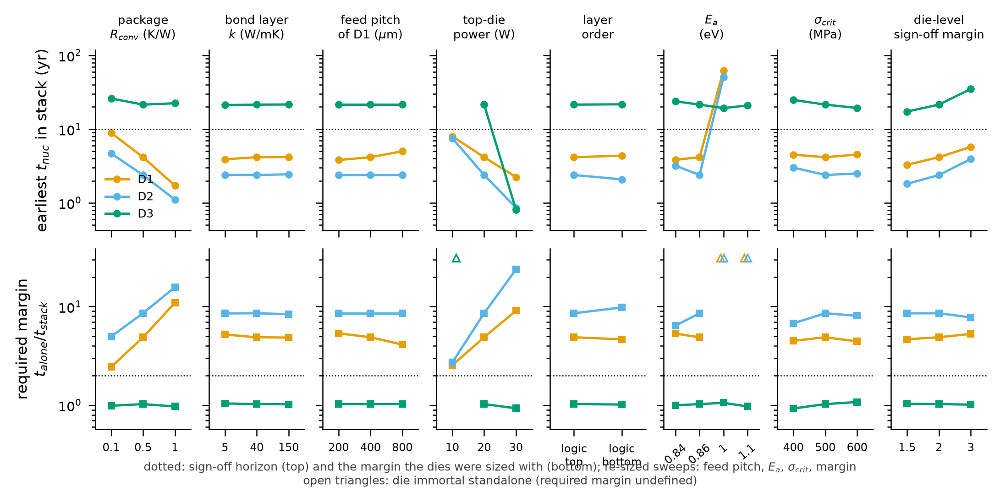

# 实验 E6：参数扫描与所需裕量

本章说明 `reference_results/base3/e6/`。核对清单是 `docs/checks/results_08.jsonl`。

## 1. 这个实验回答什么问题

base3 的核心结论是：每层芯片单独签核都通过，键合后较冷的两层提前失效。这个结论会不会只是某一组参数下的巧合。E6 逐个改变封装、键合层、馈电间距、顶层功耗、叠放顺序、材料参数和签核裕量，每次只改一项，看结论是否仍然成立，并给出一个量化指标：所需裕量。

术语：

- 单独，文件里写 alone：芯片在自己的封装里单独工作时的温度场，即芯片级签核看到的情况。堆叠，文件里写 full：三层芯片键合后的三维温度场。
- 所需裕量，文件里写 required margin：单独最早成核时间除以堆叠最早成核时间。它的含义是芯片级签核要把裕量设到多大，才能保证键合后仍然撑过期限。基准签核裕量是 2，所需裕量大于 2 就说明芯片级签核不够。
- 激活能 $E_a$：原子扩散的能量势垒，数值越大扩散越慢、寿命越长。
- 临界应力 $\sigma_{crit}$：空洞成核的应力门槛。

## 2. 原理与做法

### 2.1 八组扫描

`stackem/experiments/e6_sweeps.py` 定义了 8 组共 24 个点。每个点从基准配置复制一份，只改一个字段。

| 扫描名 | 取值 | 修改的配置字段 | 是否重新定线宽 |
|---|---|---|---|
| `r_convec` | 0.1、0.5、1.0 K/W | `stack.r_convec`，封装对流热阻 | 否 |
| `bond_k` | 5、40、150 W/mK | `stack.bond_k`，键合层热导率 | 否 |
| `feed_pitch_bottom_um` | 200、400、800 µm | 只改最底层 D1 的馈电间距 | 是 |
| `top_power_W` | 10、20、30 W | 顶层 D3 的总功耗 | 否 |
| `layer_order` | logic_top、logic_bottom | logic_bottom 时把芯片次序倒过来 | 否 |
| `Ea_eV` | 0.84、0.86、1.0、1.1 eV | `em.Ea_eV`，激活能 | 是 |
| `sigma_crit_MPa` | 400、500、600 MPa | `em.sigma_crit`，临界应力 | 是 |
| `signoff_margin` | 1.5、2.0、3.0 | `signoff.margin`，芯片级签核自己的裕量 | 是 |

每组里都有一个点等于基准值。这 8 个点应当给出相同的结果，可以用来检查流程是否自洽。

### 2.2 哪些扫描重新定线宽

分两类：

- 环境类扫描，包括封装热阻、键合层、顶层功耗、叠放顺序：芯片已经按基准条件设计好，之后外部环境变了。线宽沿用基准的定线宽结果。
- 设计规则和材料类扫描，包括馈电间距、激活能、临界应力、签核裕量：设计者会用自己假设的规则和参数重新做芯片级签核。所以先按新参数重新求每层芯片的线宽，结果记入 `W_um_D1` 等字段。

### 2.3 每个点算什么

每个点在自己的子目录里重跑 HotSpot 和电源网格，然后对 `full` 和 `alone` 两个变体各求一次参考解。全部使用参考求解器，不涉及网络。E6 的结果因此与用哪个引擎无关。

对每层芯片记录三项：最早成核时间、10 年内成核的轨数、轨上最高温度。所需裕量是单独与堆叠两个最早成核时间之比。无穷和空值的规则：

- 一层芯片的全部轨都不朽时，最早成核时间是无穷，json 里写成字符串 `"inf"`。
- 单独为无穷、堆叠为有限值时，所需裕量是无穷。含义是单独时永不失效的芯片在堆叠里会失效，任何有限裕量都不够。
- 单独和堆叠都为无穷时，所需裕量没有定义，json 里写成 `null`。

## 3. 怎么运行

步骤名 `e6`：

```bash
STACKEM_ONLY=e6 bash scripts/run_all.sh
# 等价于
python -m stackem.experiments.e6_sweeps --config configs/base3.json --root <根> --hotspot <HotSpot>
```

需要 base3 的定线宽结果和 HotSpot，不需要网络权重。加 `--replot` 只读已有的 `e6_sweeps.json` 重画图。运行时每个点打印一行，最后是 `[saved] .../e6_sweeps.json`。

参考机器上整个步骤用了 795 秒，即 13.2 分钟，取自 `reference_results/logs/final_3_full.log`。24 个点各自的 `seconds` 之和是 781 秒。不重新定线宽的点每个约 11 秒，重新定线宽的点约 40 到 58 秒。

## 4. 输出文件

`reference_results/base3/e6/` 顶层 7 个文件，另有 24 个子目录各 2 个文件。

| 文件 | 内容 |
|---|---|
| `e6_sweeps.json` | `rows` 列表，每个扫描点一条：`sweep`、`value`、`seconds`，每层芯片的 `alone_*_earliest_yr`、`alone_*_mortal10`、`alone_*_Tmax`，`full_*` 的同样三项，`required_margin_*`，重新定线宽的点另有 `W_um_*`；以及 `_meta` |
| `e6_sweeps.csv` | 同样的 24 行，列按字母序排列，没有的字段留空 |
| `e6_sweeps.png`、`.pdf`、`_data.json`、`_data.npz` | 16 个面板的汇总图及其数据 |
| `config_used.json` | 完整配置 |
| 24 个子目录 | 目录名是扫描名加取值，例如 `r_convec_0.1`、`Ea_eV_1.0`、`layer_order_logic_bottom`。每个里面是 `e6_full_truth.json` 和 `e6_alone_truth.json`，即该点两个变体的逐轨参考解，字段与 E2 的逐轨文件相同 |

汇总表每一行的最早成核时间与对应子目录逐轨文件的摘要一致。以基准点 `r_convec_0.5` 为例，子目录 `e6_full_truth.json` 里 D2 的最早成核时间是 2.389 年。

## 5. 结果

### 5.1 最早成核时间与所需裕量

时间单位是年。“不成核”表示该层全部轨不朽。

| 序号 | 扫描点 | 单独 D1 | 单独 D2 | 单独 D3 | 堆叠 D1 | 堆叠 D2 | 堆叠 D3 | 所需裕量 D1 | 所需裕量 D2 | 所需裕量 D3 |
|---|---|---|---|---|---|---|---|---|---|---|
| 0 | `r_convec = 0.1` | 21.713 | 23.279 | 25.726 | 8.897 | 4.676 | 26.074 | 2.440 | 4.979 | 0.987 |
| 1 | `r_convec = 0.5` | 20.355 | 20.457 | 22.072 | 4.166 | 2.389 | 21.508 | 4.886 | 8.562 | 1.026 |
| 2 | `r_convec = 1` | 18.792 | 17.460 | 21.767 | 1.720 | 1.108 | 22.431 | 10.924 | 15.762 | 0.970 |
| 3 | `bond_k = 5` | 20.355 | 20.457 | 22.072 | 3.902 | 2.401 | 21.184 | 5.216 | 8.522 | 1.042 |
| 4 | `bond_k = 40` | 20.355 | 20.457 | 22.072 | 4.166 | 2.389 | 21.508 | 4.886 | 8.562 | 1.026 |
| 5 | `bond_k = 150` | 20.355 | 20.457 | 22.072 | 4.195 | 2.443 | 21.599 | 4.852 | 8.373 | 1.022 |
| 6 | `feed_pitch_bottom_um = 200` | 20.448 | 20.457 | 22.072 | 3.815 | 2.389 | 21.508 | 5.360 | 8.562 | 1.026 |
| 7 | `feed_pitch_bottom_um = 400` | 20.355 | 20.457 | 22.072 | 4.166 | 2.389 | 21.508 | 4.886 | 8.562 | 1.026 |
| 8 | `feed_pitch_bottom_um = 800` | 20.639 | 20.457 | 22.072 | 5.011 | 2.389 | 21.508 | 4.119 | 8.562 | 1.026 |
| 9 | `top_power_W = 10` | 20.355 | 20.457 | 不成核 | 8.001 | 7.547 | 不成核 | 2.544 | 2.711 | 无定义 |
| 10 | `top_power_W = 20` | 20.355 | 20.457 | 22.072 | 4.166 | 2.389 | 21.508 | 4.886 | 8.562 | 1.026 |
| 11 | `top_power_W = 30` | 20.355 | 20.457 | 0.753 | 2.242 | 0.860 | 0.810 | 9.080 | 23.776 | 0.930 |
| 12 | `layer_order = logic_top` | 20.355 | 20.457 | 22.072 | 4.166 | 2.389 | 21.508 | 4.886 | 8.562 | 1.026 |
| 13 | `layer_order = logic_bottom` | 20.355 | 20.457 | 22.072 | 4.371 | 2.087 | 21.725 | 4.656 | 9.803 | 1.016 |
| 14 | `Ea_eV = 0.84` | 20.473 | 20.516 | 23.786 | 3.846 | 3.187 | 23.817 | 5.323 | 6.437 | 0.999 |
| 15 | `Ea_eV = 0.86` | 20.355 | 20.457 | 22.072 | 4.166 | 2.389 | 21.508 | 4.886 | 8.562 | 1.026 |
| 16 | `Ea_eV = 1` | 不成核 | 不成核 | 20.382 | 62.042 | 50.905 | 19.286 | 无穷 | 无穷 | 1.057 |
| 17 | `Ea_eV = 1.1` | 不成核 | 不成核 | 20.343 | 不成核 | 不成核 | 20.942 | 无定义 | 无定义 | 0.971 |
| 18 | `sigma_crit_MPa = 400` | 20.285 | 20.399 | 23.050 | 4.509 | 3.014 | 24.903 | 4.499 | 6.767 | 0.926 |
| 19 | `sigma_crit_MPa = 500` | 20.355 | 20.457 | 22.072 | 4.166 | 2.389 | 21.508 | 4.886 | 8.562 | 1.026 |
| 20 | `sigma_crit_MPa = 600` | 20.114 | 20.250 | 20.897 | 4.528 | 2.511 | 19.386 | 4.442 | 8.065 | 1.078 |
| 21 | `signoff_margin = 1.5` | 15.387 | 15.465 | 17.944 | 3.295 | 1.812 | 17.327 | 4.670 | 8.537 | 1.036 |
| 22 | `signoff_margin = 2` | 20.355 | 20.457 | 22.072 | 4.166 | 2.389 | 21.508 | 4.886 | 8.562 | 1.026 |
| 23 | `signoff_margin = 3` | 30.403 | 30.563 | 35.511 | 5.752 | 3.931 | 35.055 | 5.286 | 7.775 | 1.013 |

### 5.2 10 年内成核的轨数与轨上最高温度

温度单位 K。

| 序号 | 扫描点 | 堆叠 10 年内 D1 | 堆叠 10 年内 D2 | 堆叠 10 年内 D3 | 单独 10 年内 D1 | 单独 10 年内 D2 | 单独 10 年内 D3 | 堆叠最高温度 D1 | 堆叠最高温度 D2 | 堆叠最高温度 D3 | 单独最高温度 D1 | 单独最高温度 D2 | 单独最高温度 D3 |
|---|---|---|---|---|---|---|---|---|---|---|---|---|---|
| 0 | `r_convec = 0.1` | 2 | 8 | 0 | 0 | 0 | 0 | 348.92 | 349.12 | 349.44 | 321.08 | 320.72 | 350.67 |
| 1 | `r_convec = 0.5` | 6 | 20 | 0 | 0 | 0 | 0 | 359.36 | 359.56 | 359.87 | 321.88 | 322.32 | 358.70 |
| 2 | `r_convec = 1` | 14 | 60 | 0 | 0 | 0 | 0 | 372.37 | 372.57 | 372.88 | 322.88 | 324.32 | 368.71 |
| 3 | `bond_k = 5` | 6 | 20 | 0 | 0 | 0 | 0 | 359.00 | 359.49 | 360.21 | 321.88 | 322.32 | 358.70 |
| 4 | `bond_k = 40` | 6 | 20 | 0 | 0 | 0 | 0 | 359.36 | 359.56 | 359.87 | 321.88 | 322.32 | 358.70 |
| 5 | `bond_k = 150` | 6 | 20 | 0 | 0 | 0 | 0 | 359.04 | 359.20 | 359.48 | 321.88 | 322.32 | 358.70 |
| 6 | `feed_pitch_bottom_um = 200` | 10 | 20 | 0 | 0 | 0 | 0 | 359.36 | 359.56 | 359.87 | 321.88 | 322.32 | 358.70 |
| 7 | `feed_pitch_bottom_um = 400` | 6 | 20 | 0 | 0 | 0 | 0 | 359.36 | 359.56 | 359.87 | 321.88 | 322.32 | 358.70 |
| 8 | `feed_pitch_bottom_um = 800` | 2 | 20 | 0 | 0 | 0 | 0 | 359.36 | 359.56 | 359.87 | 321.88 | 322.32 | 358.70 |
| 9 | `top_power_W = 10` | 4 | 8 | 0 | 0 | 0 | 0 | 341.94 | 342.00 | 342.05 | 321.88 | 322.32 | 338.43 |
| 10 | `top_power_W = 20` | 6 | 20 | 0 | 0 | 0 | 0 | 359.36 | 359.56 | 359.87 | 321.88 | 322.32 | 358.70 |
| 11 | `top_power_W = 30` | 14 | 58 | 10 | 0 | 0 | 10 | 376.79 | 377.12 | 377.70 | 321.88 | 322.32 | 378.98 |
| 12 | `layer_order = logic_top` | 6 | 20 | 0 | 0 | 0 | 0 | 359.36 | 359.56 | 359.87 | 321.88 | 322.32 | 358.70 |
| 13 | `layer_order = logic_bottom` | 6 | 20 | 0 | 0 | 0 | 0 | 359.08 | 361.77 | 364.60 | 321.88 | 322.32 | 358.70 |
| 14 | `Ea_eV = 0.84` | 6 | 20 | 0 | 0 | 0 | 0 | 359.36 | 359.56 | 359.87 | 321.88 | 322.32 | 358.70 |
| 15 | `Ea_eV = 0.86` | 6 | 20 | 0 | 0 | 0 | 0 | 359.36 | 359.56 | 359.87 | 321.88 | 322.32 | 358.70 |
| 16 | `Ea_eV = 1` | 0 | 0 | 0 | 0 | 0 | 0 | 359.36 | 359.56 | 359.87 | 321.88 | 322.32 | 358.70 |
| 17 | `Ea_eV = 1.1` | 0 | 0 | 0 | 0 | 0 | 0 | 359.36 | 359.56 | 359.87 | 321.88 | 322.32 | 358.70 |
| 18 | `sigma_crit_MPa = 400` | 6 | 20 | 0 | 0 | 0 | 0 | 359.36 | 359.56 | 359.87 | 321.88 | 322.32 | 358.70 |
| 19 | `sigma_crit_MPa = 500` | 6 | 20 | 0 | 0 | 0 | 0 | 359.36 | 359.56 | 359.87 | 321.88 | 322.32 | 358.70 |
| 20 | `sigma_crit_MPa = 600` | 6 | 20 | 0 | 0 | 0 | 0 | 359.36 | 359.56 | 359.87 | 321.88 | 322.32 | 358.70 |
| 21 | `signoff_margin = 1.5` | 6 | 20 | 0 | 0 | 0 | 0 | 359.36 | 359.56 | 359.87 | 321.88 | 322.32 | 358.70 |
| 22 | `signoff_margin = 2` | 6 | 20 | 0 | 0 | 0 | 0 | 359.36 | 359.56 | 359.87 | 321.88 | 322.32 | 358.70 |
| 23 | `signoff_margin = 3` | 4 | 20 | 0 | 0 | 0 | 0 | 359.36 | 359.56 | 359.87 | 321.88 | 322.32 | 358.70 |

### 5.3 重新定出的线宽与每个点的耗时

| 序号 | 扫描点 | 重新定线宽 | 线宽 D1 µm | 线宽 D2 µm | 线宽 D3 µm | 耗时 秒 |
|---|---|---|---|---|---|---|
| 0 | `r_convec = 0.1` | 否 | 沿用基准 | 沿用基准 | 沿用基准 | 11.1 |
| 1 | `r_convec = 0.5` | 否 | 沿用基准 | 沿用基准 | 沿用基准 | 10.9 |
| 2 | `r_convec = 1` | 否 | 沿用基准 | 沿用基准 | 沿用基准 | 11.0 |
| 3 | `bond_k = 5` | 否 | 沿用基准 | 沿用基准 | 沿用基准 | 10.7 |
| 4 | `bond_k = 40` | 否 | 沿用基准 | 沿用基准 | 沿用基准 | 11.0 |
| 5 | `bond_k = 150` | 否 | 沿用基准 | 沿用基准 | 沿用基准 | 11.9 |
| 6 | `feed_pitch_bottom_um = 200` | 是 | 1.1970 | 0.9916 | 15.3377 | 43.1 |
| 7 | `feed_pitch_bottom_um = 400` | 是 | 1.3494 | 0.9916 | 15.3377 | 55.4 |
| 8 | `feed_pitch_bottom_um = 800` | 是 | 3.6417 | 0.9916 | 15.3377 | 54.9 |
| 9 | `top_power_W = 10` | 否 | 沿用基准 | 沿用基准 | 沿用基准 | 10.1 |
| 10 | `top_power_W = 20` | 否 | 沿用基准 | 沿用基准 | 沿用基准 | 11.0 |
| 11 | `top_power_W = 30` | 否 | 沿用基准 | 沿用基准 | 沿用基准 | 11.1 |
| 12 | `layer_order = logic_top` | 否 | 沿用基准 | 沿用基准 | 沿用基准 | 11.1 |
| 13 | `layer_order = logic_bottom` | 否 | 沿用基准 | 沿用基准 | 沿用基准 | 11.0 |
| 14 | `Ea_eV = 0.84` | 是 | 1.8680 | 1.3727 | 16.1458 | 48.3 |
| 15 | `Ea_eV = 0.86` | 是 | 1.3494 | 0.9916 | 15.3377 | 54.8 |
| 16 | `Ea_eV = 1` | 是 | 0.5000 | 0.5000 | 3.2305 | 38.9 |
| 17 | `Ea_eV = 1.1` | 是 | 0.5000 | 0.5000 | 0.6804 | 38.9 |
| 18 | `sigma_crit_MPa = 400` | 是 | 2.3336 | 1.7148 | 24.7691 | 57.6 |
| 19 | `sigma_crit_MPa = 500` | 是 | 1.3494 | 0.9916 | 15.3377 | 55.1 |
| 20 | `sigma_crit_MPa = 600` | 是 | 1.0087 | 0.7412 | 11.0793 | 52.2 |
| 21 | `signoff_margin = 1.5` | 是 | 1.1970 | 0.8796 | 15.0774 | 55.1 |
| 22 | `signoff_margin = 2` | 是 | 1.3494 | 0.9916 | 15.3377 | 55.0 |
| 23 | `signoff_margin = 3` | 是 | 1.6013 | 1.1767 | 15.8718 | 50.8 |

### 5.4 逐组解读

**基准点自洽。** 第 1、4、7、10、12、15、19、22 行是 8 组里各自等于基准的点。它们的所需裕量完全相同，24 个数与第 1 行的最大差是 0.0。重新定线宽的 4 个基准点得到的线宽也等于基准定线宽结果。

**封装热阻。** 这是影响最大的环境参数。热阻从 0.1 增加到 1.0 K/W，堆叠最高温度从约 349 K 升到约 372 K，D1 的所需裕量从 2.44 升到 10.92，D2 从 4.98 升到 15.76。即使在散热最好的 0.1 K/W，两层冷芯片的所需裕量也超过签核用的 2，10 年内仍有 10 条轨成核。D3 的所需裕量始终在 1 附近，它自己就是热源，键合前后差别不大。

**键合层热导率。** 从 5 到 150 W/mK 跨 30 倍，所需裕量变化很小，D1、D2 两层相对基准的最大变化是 6.76 %。键合层只有 5 µm 厚，热导率低时热阻也很小。

**D1 的馈电间距。** 只改 D1，所以 D2 和 D3 的数值不变。D1 重新定线宽后，间距 200 µm 时所需裕量 5.36，800 µm 时 4.12。馈电越稀，段越长，签核要求的线越宽，堆叠效应相对弱一些，但没有消失。更密的 200 µm 给出的所需裕量比基准更大。

**顶层功耗。**

1. 10 W：D3 在单独和堆叠下都完全不朽，所需裕量无定义。D1 和 D2 的所需裕量降到 2.54 和 2.71，仍高于 2，10 年内成核 12 条。
2. 30 W：D2 的所需裕量达到 23.78。D3 自己单独时最早成核时间只有 0.75 年，10 年内成核 10 条。这组扫描不重新定线宽，D3 的线宽还是按 20 W 定的，功耗升到 30 W 后它连自己的芯片级签核都不通过。

**叠放顺序。** logic_bottom 把逻辑芯片放到最底层。表里的 D1、D2、D3 仍按芯片的名字给出，不按位置。D2 的所需裕量升到 9.80，D1 降到 4.66，方向相反，D1、D2 相对基准的最大变化是 14.5 %。

**激活能，重新定线宽。**

1. 0.84 eV：线宽变宽，所需裕量 5.32 和 6.44。
2. 1.0 eV：D1 和 D2 的线宽落到搜索下限 0.5 µm，单独时全部不朽。堆叠里它们仍会成核，D1 在 62.0 年，D2 在 50.9 年，都远超 10 年期限。所需裕量记为无穷。
3. 1.1 eV：D1 和 D2 在单独和堆叠下都不朽，所需裕量无定义。

**临界应力，重新定线宽。** 400 MPa 时线要宽得多，600 MPa 时变窄。所需裕量 D1 在 4.44 到 4.89 之间，D2 在 6.77 到 8.56 之间。

**芯片级签核裕量，重新定线宽。** 单独最早成核时间随裕量变为约 15、20、30 年，符合定线宽目标。所需裕量 D1 为 4.67、4.89、5.29，D2 为 8.54、8.56、7.77。芯片级签核用 3 倍裕量时，D2 在堆叠里的最早成核时间也只有 3.93 年，20 条轨违例。结论不依赖基准定义里那个 2。

### 5.5 图



8 列对应 8 组扫描，列标题依次是封装热阻、键合层热导率、D1 的馈电间距、顶层功耗、叠放顺序、激活能、临界应力、芯片级签核裕量。橙黄色是 D1，浅蓝色是 D2，绿色是 D3。

上排圆点是堆叠中的最早成核时间，纵轴对数刻度，水平点线是 10 年期限，落在点线下方就是违例。D1 和 D2 在几乎所有扫描点都在点线下方，例外只有激活能为 1 时两条线一起跳到 50 年以上，以及激活能为 1.1 时没有点。D3 的绿线始终在点线上方，只有顶层功耗 30 W 时掉到 1 年以下。顶层功耗 10 W 处 D3 没有点，因为它不朽。

下排方块是所需裕量，水平点线是签核用的裕量 2。D1 和 D2 全部在点线上方，D3 贴着 1。封装热阻和顶层功耗两列的斜率最大。空心三角画在面板顶部，表示该层芯片的所需裕量无定义或为无穷：顶层功耗 10 W 处有一个绿色三角，激活能为 1 和 1.1 处各有橙蓝两个三角。

图下方两行说明文字写明了点线的含义、哪四组扫描重新定线宽、空心三角的含义。左上面板的图例压着 D1 的曲线，叠放顺序一列的横轴标签与说明文字有重叠。

## 6. 怎么理解

1. 在所有会成核的扫描点上，两层冷芯片的所需裕量都大于 2。24 个点里 D1 和 D2 的有限所需裕量最小是 2.44，出现在散热最好的封装上。结论不是某组参数下的巧合。
2. 决定效应大小的是堆叠带来的温升。封装热阻和顶层功耗直接改变温升，所需裕量随之变化好几倍。键合层热导率和叠放顺序对温升影响小，所需裕量几乎不变。
3. 设计者重新定线宽并不能消除效应。换激活能、临界应力、签核裕量后重新签核，冷芯片的所需裕量仍在 4 到 9 之间。原因是芯片级签核看不到邻居带来的温升，线定得再合规也是按错误的温度定的。
4. 唯一让效应消失的情形是激活能高到冷芯片在最小线宽下不朽。此时电迁移本身不再是约束。

## 7. 论文用了哪些，哪些是论文之外的

| 论文中的说法 | 本章对应 |
|---|---|
| 封装热阻从 0.1 到 1.0 K/W，D1 的裕量从 2.4 升到 10.9，D2 从 5.0 升到 15.8 | 5.1 节第 0、2 行 |
| 30 W 的顶层芯片把 D2 的裕量推到 24 | 第 11 行 |
| 10 W 的顶层芯片仍有 12 条违例，所需裕量 2.5 到 2.7 | 第 9 行 |
| 键合层热导率改变裕量不到 10 %，叠放顺序不到 15 % | 5.4 节 |
| 用 0.84 到 0.86 eV、400 到 600 MPa 或 1.5 到 3 的裕量重新定线宽，所需裕量 D1 为 4.4 到 5.3，D2 为 6.4 到 8.6 | 第 14、15、18 到 23 行 |
| 激活能不低于 1.0 eV 时冷芯片在最小线宽下单独不朽，在堆叠里也存活 | 第 16、17 行 |
| 更密的馈电间距也不能消除效应，重新定线宽后 4.1 到 5.4 | 第 6 到 8 行 |
| 参数表里各扫描范围 | 2.1 节 |

论文之外的内容：D3 的全部列，各点的最高温度，重新定出的线宽，汇总图，24 个子目录的逐轨数据。

## 8. 注意事项

1. 顶层功耗 30 W 一行里 D3 自身不满足签核。这一行里 D2 的所需裕量 24 是算出来的真实比值，但整个堆叠已经不是“每层芯片都单独通过”的前提。
2. 论文说更密的馈电间距给出 4.1 到 5.4。区间的 4.1 一端来自 800 µm，那是比基准更稀的馈电；真正更密的 200 µm 给出的是 5.4，比基准大。
3. 论文说激活能不低于 1.0 eV 时冷芯片在堆叠里也存活。1.0 eV 时它们撑过了 10 年期限但并非不朽，1.1 eV 时才不成核。
4. 只做了单参数扫描，而且只在 base3 上做。高热阻加高功耗这类组合没有算过。
5. `e6_sweeps.json` 里无穷写成字符串 `"inf"`，无定义写成 `null`；csv 里对应的是 `inf` 和空白。读取时要分别处理。
6. 重新定线宽的搜索上下限没有写在 E6 的输出里。0.5 µm 的下限和 40 µm 的上限来自配置的 `signoff` 段。
7. 叠放顺序一组里，单独状态的数值与基准相同，因为单独封装的仿真与芯片在堆叠里的位置无关。
8. 图上有两处文字重叠，见 5.5 节。
