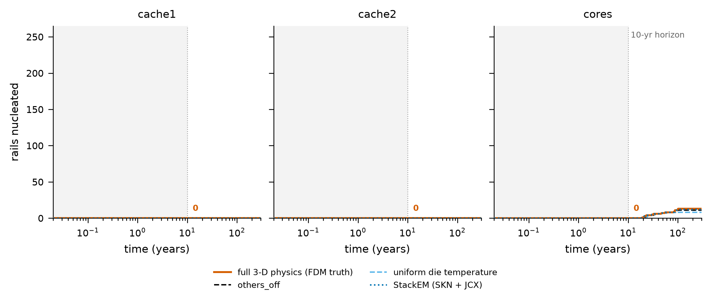
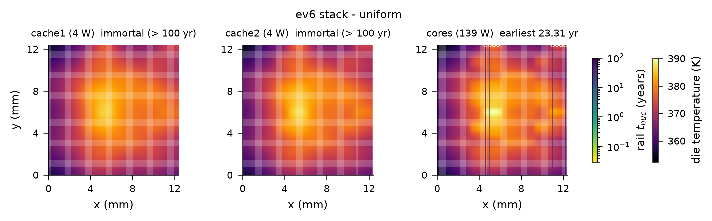
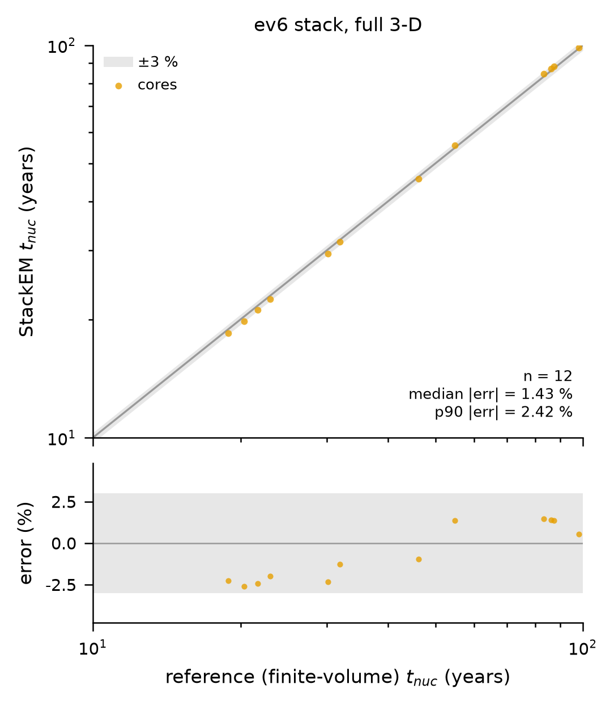

# 实验 E8：真实版图 ev6 三层堆叠

本章说明 `reference_results/base3/e8/`，学生引擎的结果。教师引擎的同一个实验在 `reference_results/base3_teacher/e8/`，见 [12_教师引擎与学生引擎对比.md](12_教师引擎与学生引擎对比.md)。核对清单是 `docs/checks/results_09.jsonl`。

## 1. 这个实验回答什么问题

base3、quad4、dense3 三个堆叠的功耗图都是人为设定的方块。E8 换成一个公开的真实处理器版图，回答两个问题。

1. 在真实版图和它自带的功耗分布上，芯片级签核与堆叠级结果差多少。
2. 代理解在长轨、非方块功耗的情况下，相对参考求解器的成核时间误差是多少。

术语：

- ev6：Alpha 21264 处理器的代号。HotSpot 自带的 `examples/example4` 是一个 ev6 三层三维堆叠示例，包含版图、层定义和功耗轨迹。
- 版图块：版图文件里的一个矩形功能模块，例如一个缓存或一个运算单元，各有自己的功耗。

## 2. 原理与做法

### 2.1 堆叠的构成

`stackem/experiments/e8_ev6.py` 把 HotSpot 示例目录里的文件复制到工作目录，把网格改成 64 乘 64 后运行 HotSpot。层定义文件给出从下到上的 6 层：

| 层号 | 材料 | 厚度 | 本实验中的名字 |
|---|---|---|---|
| 0 | 硅，耗散功率 | 150 µm | cache1 |
| 1 | 导热界面材料，含硅通孔 | 20 µm | |
| 2 | 硅，耗散功率 | 150 µm | cache2 |
| 3 | 导热界面材料，含硅通孔 | 20 µm | |
| 4 | 硅，耗散功率 | 150 µm | cores |
| 5 | 导热界面材料 | 20 µm | |

两层二级缓存芯片在下，四核逻辑芯片在上靠近散热器。芯片尺寸是 12.40 mm 乘 12.76 mm。封装参数沿用 HotSpot 示例的配置。

### 2.2 功耗与电源网格

每个版图块的功耗取功耗轨迹文件里整条轨迹的平均值。日志打印的各层总功耗是 cache1 3.7 W，cache2 3.7 W，cores 138.8 W。逻辑芯片的功耗是缓存芯片的三十多倍。

每层芯片建一对被分析的电源网格金属层：

- 网格间距 100 µm，覆盖 12.4 mm 见方。每个方向 125 条线，每层 250 条轨，每条轨 124 段。
- 馈电间距 400 µm，每层 961 个馈电点。
- 每个版图矩形的电流均匀分给落在矩形内的网格结点。块电流等于块功耗乘 `current_fraction` 再除以电源电压。E8 的 `current_fraction` 是 0.15，即这对金属层承担块电流的 15 %。

### 2.3 两套温度场

- 堆叠场：三层全部通电跑一次 HotSpot。
- 单独场：对每层芯片再跑一次 HotSpot，把功耗轨迹里不属于该层的块全部置零。其他两层仍在堆叠里，只是不发热。结果文件里把它叫 `others_off`。

### 2.4 定线宽

与合成堆叠相同的规则：在 0.5 到 40 µm 之间二分，找最小线宽使该层在单独场下的最早成核时间不小于 20 年。最小线宽已经满足时取下限并标记饱和。

### 2.5 三个变体与代理解

定线宽之后，对每层的 250 条轨在三种温度下各用参考求解器解一遍：

| 变体 | 温度 | 含义 |
|---|---|---|
| `full` | 堆叠场 | 真实的三维堆叠 |
| `others_off` | 单独场 | 芯片级签核的视角 |
| `uniform` | 堆叠场的芯片平均温度，全片一个值 | 只给一个平均温度的做法 |

E8 没有 105 °C 规则变体。在 `full` 变体上再用代理解算一遍，把三层合在一起，只取参考解和代理解都成核的轨，计算相对误差的中位数、90 % 分位数、最大值，以及 Top-10 命中率和前 50 的 Kendall tau，写入 `stackem_overlay`。

## 3. 怎么运行

步骤名 `e8`：

```bash
STACKEM_ONLY=e8 bash scripts/run_all.sh
# 等价于
python -m stackem.experiments.e8_ev6 --config configs/base3.json --root <根> --hotspot <HotSpot>
```

E8 借用 base3 的配置文件，只用其中的电迁移参数、时间网格、闭合设置、签核设置和网络权重，输出放在 `base3/e8/`。屏幕开头那行 `[sign-off sizing] strap widths: D1=1.35 um ...` 是公共初始化打印的 base3 线宽，E8 不使用它。它需要 HotSpot 目录下的 `examples/example4`，按环境说明从仓库自带的压缩包编译 HotSpot 后这个目录就在。可选参数：`--current-fraction`、`--r-convec`、`--pitch`、`--no-sizing`。

参考机器上整个步骤用了 286 秒，即 4.8 分钟，取自 `reference_results/logs/final_3_full.log`。其中三个变体的参考解各约 4 秒，代理解 10.4 秒，其余是 HotSpot 和定线宽。

## 4. 输出文件

`reference_results/base3/e8/` 共 22 个文件。

| 文件 | 内容 |
|---|---|
| `e8_summary.json` | `provider`；`sizing` 每层的线宽、单独最早成核时间、是否饱和；`pg` 每层的压降、电流密度分位数、总电流、馈电点数、`warnings`；`current_fraction`；`die_size_m`；`thermal` 温度表；`full`、`others_off`、`uniform` 各含 `seconds` 和每层的摘要；`stackem_overlay`；`_meta` |
| `config_used.json` | 完整配置 |
| `e8_cdf` 图 | 三层芯片的累计成核曲线 |
| `e8_diemaps_full`、`e8_diemaps_others_off`、`e8_diemaps_uniform` 图 | 各变体的芯片温度图加会成核的轨 |
| `e8_parity` 图 | 代理解对参考解的对角图 |

每张图有 `.png`、`.pdf`、`_data.json`、`_data.npz`。自己运行时还会写出 750 条轨的几何描述和成核时间数组，体积大，不在仓库里。

## 5. 结果

### 5.1 定线宽与电源网格

| 芯片 | 线宽 µm | 饱和 | 单独最早成核 年 | 最大电流密度 MA/cm² | 90 % 分位 MA/cm² | 中位 MA/cm² | 总电流 A | 最大压降 mV | 平均压降 mV | 警告条数 |
|---|---|---|---|---|---|---|---|---|---|---|
| cache1 | 0.50 | 是 | 不成核 | 0.047 | 0.0336 | 0.0054 | 0.70 | 2.21 | 1.17 | 1 |
| cache2 | 0.50 | 是 | 不成核 | 0.047 | 0.0336 | 0.0054 | 0.70 | 2.21 | 1.17 | 1 |
| cores | 35.48 | 否 | 21.044 | 0.106 | 0.0116 | 0.0029 | 26.02 | 4.66 | 0.61 | 0 |

### 5.2 温度

单位 K。

| 芯片 | 堆叠最低 | 堆叠最高 | 堆叠平均 | 单独平均 | 单独最高 | 平均温升 |
|---|---|---|---|---|---|---|
| cache1 | 354.77 | 386.10 | 373.32 | 319.86 | 320.09 | 53.46 |
| cache2 | 353.68 | 387.27 | 373.18 | 319.69 | 319.93 | 53.49 |
| cores | 351.53 | 390.36 | 372.95 | 370.16 | 387.09 | 2.79 |

### 5.3 三个变体，参考解

| 变体 | 芯片 | 轨数 | 不朽轨数 | 最早成核 年 | 10 年内成核 | 100 年内成核 | 轨上最高温度 K |
|---|---|---|---|---|---|---|---|
| `full` | cache1 | 250 | 250 | 不成核 | 0 | 0 | 386.06 |
| `full` | cache2 | 250 | 250 | 不成核 | 0 | 0 | 387.21 |
| `full` | cores | 250 | 212 | 18.908 | 0 | 12 | 390.21 |
| `others_off` | cache1 | 250 | 250 | 不成核 | 0 | 0 | 320.09 |
| `others_off` | cache2 | 250 | 250 | 不成核 | 0 | 0 | 319.93 |
| `others_off` | cores | 250 | 212 | 21.048 | 0 | 11 | 386.94 |
| `uniform` | cache1 | 250 | 250 | 不成核 | 0 | 0 | 373.50 |
| `uniform` | cache2 | 250 | 250 | 不成核 | 0 | 0 | 373.38 |
| `uniform` | cores | 250 | 212 | 23.312 | 0 | 8 | 373.17 |

三个变体的求解耗时分别是 4.0、4.1、4.0 秒。

### 5.4 代理解对参考解

| 量 | 值 |
|---|---|
| 参与统计的轨数 | 12 |
| 成核时间相对误差，中位数 | 1.43 % |
| 90 % 分位数 | 2.42 % |
| 最大值 | 2.62 % |
| Top-10 命中率 | 1.00 |
| Kendall tau | 0.966 |
| 代理解耗时 | 10.4 秒 |

### 5.5 图



`e8_cdf`，三层芯片的累计成核曲线，读法与 E3 的同类图相同。cache1 和 cache2 两个子图里所有曲线都贴在零线上，10 年处标着 0。cores 子图里曲线从 20 年左右开始抬起，最高只到十几条。纵轴上限是 250 多条，所以曲线挤在图的最底部，细节读不清。


`e8_diemaps_full`。底色是堆叠中的温度，三层的温度图案相近，最热处在芯片中部偏左，约 390 K。温度分布不再是方块，能看到版图块的轮廓。cache1 和 cache2 标题写着 immortal (> 100 yr)，上面没有任何轨被画出。cores 上只画出会成核的十来条纵向轨，分成两束：一束在 x 约 5 mm 处，穿过最热的区域；一束在右边缘 x 约 11 到 12 mm 处。成核点都在轨的上端。


`e8_diemaps_others_off`。两层缓存芯片几乎全黑，约 320 K，因为只有它们自己那几瓦在发热。cores 的图案与上一张相似，色标整体低几度。标题里 cores 的最早成核时间是 21 年。



`e8_diemaps_uniform`。cores 上画出的成核轨比 `full` 少，标题里的最早成核时间是 23 年。这张图的底色仍是堆叠的三维温度场，并不是这个变体求解时使用的均匀温度。



`e8_parity`，读法与 E2 的对角图相同。12 个点全部来自 cores，都在正负 3 % 的灰带内。下半幅显示出一个趋势：20 到 30 年成核的轨误差在负 2 % 到负 2.6 %，50 年以后成核的轨误差转为正 1 % 上下。

## 6. 怎么理解

1. 代理解在真实版图上仍然可用。轨长 124 段，是 base3 的三倍，功耗分布是真实版图块，成核时间的中位误差 1.4 %，最大 2.6 %，最早的 10 条轨全部命中。
2. 这个算例展示不了“单独通过、堆叠失效”。两层缓存芯片从单独时的 320 K 升到堆叠里的 373 K，温升超过 50 K，但它们的电流密度太低，在最小线宽下所有轨都不朽，堆叠里仍然不朽。唯一会成核的 cores 自己就是热源，键合只让它的平均温度升高不到 3 K，最早成核时间从 21.05 年变到 18.91 年，比值 1.11。10 年内没有任何违例。
3. 只给平均温度的 `uniform` 把 cores 的最早成核时间估成 23.31 年，比真实的堆叠晚，方向是乐观。

## 7. 论文用了哪些，哪些是论文之外的

| 论文中的说法 | 本章对应 |
|---|---|
| ev6 上按线宽定出的关键芯片键合后只变化 1.1 倍 | 第 6 节第 2 条 |
| 各算例汇总表 ev6 一行：3 层，750 条轨，21.0 到 18.9 年，漏报 0，中位误差 1.4 % | 5.3、5.4 节 |
| ev6 版图上中位误差 1.4 %，失效集合被恢复 | 5.4 节。集合被恢复的方式是两边都为空 |

论文之外的内容：温度表，`uniform` 变体，100 年内的计数，电源网格的警告，Kendall，90 % 分位数与最大误差，五张图。

## 8. 注意事项

1. 结论只来自一层芯片。cache1 和 cache2 的 500 条轨全部不朽，定线宽落在下限，并且各有一条警告，说最大电流密度 0.047 MA/cm² 低于 0.1 到 3 MA/cm² 这个电迁移分析有意义的范围。没有为此调整 `current_fraction`、功耗或线宽。
2. ev6 上没有 10 年内的违例。这个算例支持的是代理解在真实版图上的精度，不支持“芯片级签核会漏报”这个论点。
3. 精度统计只有 12 条轨。
4. 误差有系统性趋势：成核早的轨代理解偏早，成核晚的偏晚。
5. 电源网格是规则的 100 µm 正交网格，与 ev6 真实的供电网络无关。真实的只有版图块的位置和功耗。15 % 的电流比例和 400 µm 的馈电间距都是设定值。
6. 网格覆盖 12.4 mm 见方，芯片实际高 12.76 mm，温度场经过重采样压到正方形上。
7. `sizing.cores.t_earliest_years` 是 21.044 年，`others_off` 变体里 cores 的最早成核时间是 21.048 年。两者在第三位小数上不同，因为定线宽时导线按单面散热计算，变体求解时用默认设置。
8. `e8_diemaps_uniform` 的底色不是该变体使用的温度。`e8_cdf` 的纵轴范围使曲线几乎读不出来。
9. 没有规则签核变体，论文汇总表里 ev6 一行的误报数因此是一条横线。
10. `e8_summary.json` 里不成核写成字符串 `"inf"`。输出借放在 `base3/` 目录下，但它与 base3 堆叠无关。
