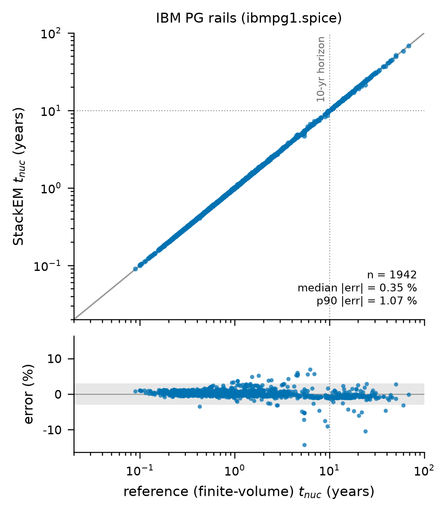
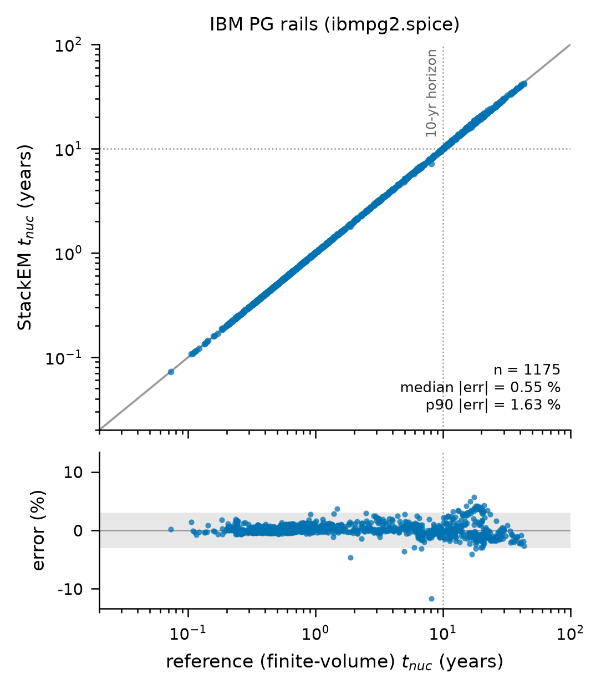
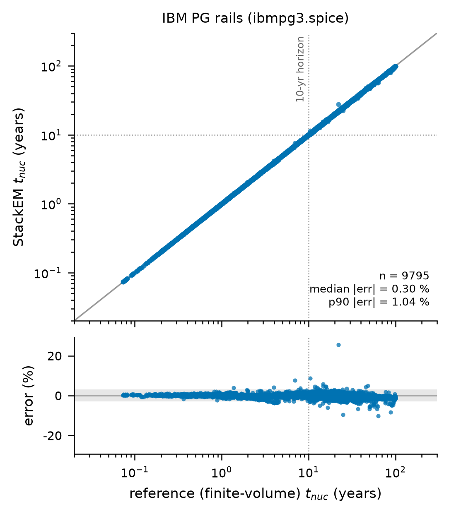
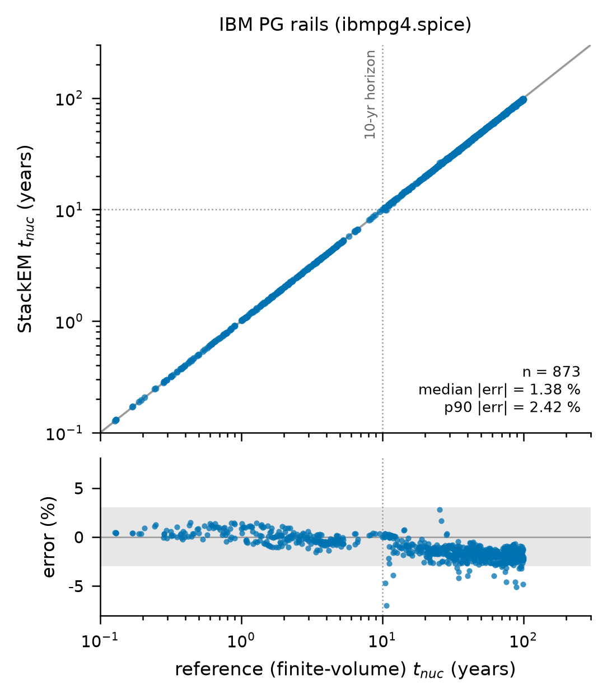
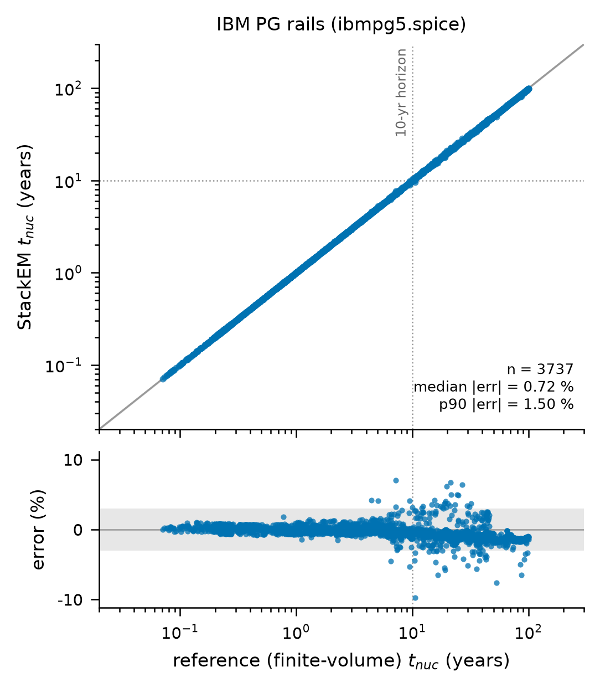
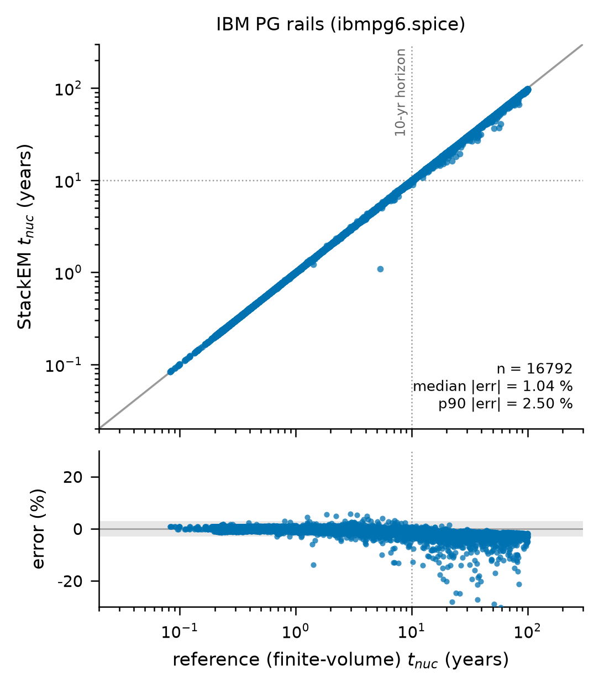

# IBM 电源网格基准：ibmpg1 到 ibmpg6

本章说明 `reference_results/ibmpg/` 下的六个目录。核对清单是 `docs/checks/results_10.jsonl`。清单里有一部分数字是从 `ibmpg_rails.npz` 数组算出来的，核对这一个清单需要机器上装有 numpy。

## 1. 这个实验回答什么问题

前面的实验用的都是自己生成的规则网格：每条电源轨段数相同、段长相同。换成真实工业电源网格那种不规则的走线，代理解还准不准、还快不快。IBM Power Grid Benchmarks 是 2008 年公开的一组 SPICE 格式电源网格，共六个网表，结点数从三万到一百六十七万。本实验做三件事。

1. 从每个网表里抽出所有直线电源轨，用网表自己的直流电流作为每一段的电流。
2. 对每条轨同时跑参考求解器和 StackEM 代理解，比较成核时间。
3. 记录两者的墙钟时间。

要先说明一点：这些基准是单芯片的二维网表，本身不带温度信息，也不带导线宽度。温度场是把 base3 堆叠顶层芯片 D3 的 HotSpot 结果拉伸后贴上去的，线宽是按电流密度上限反推的。这个实验检验的是引擎在真实拓扑和全芯片规模下的表现，不代表这些芯片真实的电迁移寿命。

术语：

- SPICE 网表：电路的文本描述，每行一个元件。这里的元件只有电阻、电压源、电流源。
- 直流求解：解出网表里每个结点的电压，从而得到每个电阻上的电流。

## 2. 原理与做法

代码在 `stackem/ibmpg.py` 和驱动脚本 `tools/run_ibmpg.py`。

### 2.1 解析与直流求解

结点名形如 `n<层>_<x>_<y>`，直接编码了金属层号和坐标。脚本装配全网的电导矩阵，把接地的电压源当作已知电压消去，用稀疏 LU 分解求解。每个基准附带一个官方的直流解文件 `ibmpgN.solution`，脚本发现它在网表旁边时会逐结点比较并打印最大和平均电压差。

### 2.2 坐标单位

基准文件没有说明坐标的长度单位，而段长直接决定电迁移的时间尺度。`--unit auto` 的规则是：从 1 微米开始，只要芯片边长超过 40 毫米就把单位除以 10；也就是取能让芯片边长不超过 40 毫米的最大的 10 的整数次幂。这是本项目自己定的假设。运行时屏幕上有一行 `coordinate unit: auto -> ...`，会打印它推出的芯片尺寸，每个新网表都应当看一眼这个尺寸是否合理，不合理时用 `--unit 1e-9` 之类的写法手工指定。

### 2.3 轨的提取

1. 只保留两端结点都有坐标且在同一层的电阻。两端 x 相同的归为纵向，y 相同的归为横向，其余的是过孔，丢弃。
2. 按方向、层号、所在直线分组，组内按坐标排序，把首尾相接的段串成链。
3. 短于 2 微米的段并入相邻的段。网表里的过孔残桩会产生 1 到 2 微米的假段，夹在几十微米的正常段之间。
4. 合并后少于 3 段的链丢弃。

一条轨就是同层直线上相邻过孔之间的整根导线。同层分叉没有建模。

### 2.4 线宽

基准的电阻是粗化过的总线，从电阻反推截面会得到不合理的值。脚本用 `--size-to-jmax 1e6` 给每条轨定线宽：

```text
I_max = 轨上最大的段电流
W     = max( I_max / (j_max * H), 0.2 um )        j_max = 1 MA/cm^2, H = 1 um
```

定宽后每条轨的峰值电流密度正好等于 1 MA/cm²，除非被 0.2 微米的线宽下限卡住。被下限卡住的轨，实际电流密度低于 1 MA/cm²。

### 2.5 温度场、筛选与求解

脚本用 base3 的堆叠参数跑一次 HotSpot，取顶层芯片 D3 的温度网格，范围是 342.0 到 359.9 K，等比例拉伸到网表的包围盒上。之后先筛掉不朽的轨；参考解用多进程，每段的单元数随最长段的长度自适应，不超过 0.3 毫米用 60 个，不超过 3 毫米用 240 个，更长用 960 个；代理解在有 GPU 时走 torch 路径，否则走 numpy 路径。引擎设置与主流程相同：学生网络，192 点查表，32 个输出时刻。

统计只在两种解法都成核的轨上算相对误差。

## 3. 怎么运行

先下载基准，再运行：

```bash
bash scripts/download_ibmpg.sh                 # 六个网表和官方直流解，下载约 76 MB，解压后约 610 MB，并核对 MD5
bash scripts/run_ibmpg.sh                      # 等价于 STACKEM_ONLY=ibmpg bash scripts/run_all.sh
```

`run_all.sh` 对 `~/stackem_work/ibmpg/` 里找到的每个 `ibmpgN.spice` 执行一个步骤 `ibmpg.ibmpgN`：

```bash
python tools/run_ibmpg.py --spice ~/stackem_work/ibmpg/ibmpgN.spice --config configs/base3.json \
    --root <根> --hotspot <HotSpot> --weights <根>/base3/skn_distill/skn_student.npz \
    --unit auto --size-to-jmax 1e6 --max-rails 0 --min-segments 3
```

`--max-rails 0` 表示保留全部轨。运行前需要 base3 的学生权重和 HotSpot。运行 GPU 版本前先确认 `python -c "import torch; print(torch.cuda.is_available())"` 打印 `True`。屏幕上要看两行：`coordinate unit: auto -> ...` 里的芯片尺寸，和 `closure (torch/cuda, tabulated): ...` 这一行。后者若显示 `numpy/cpu`，说明代理解没有用上 GPU，耗时会大得多。

参考机器上每个网表整个步骤的耗时，含解析、直流求解、HotSpot、筛选、两种求解和画图，取自日志里相邻标题的时间戳：

| 网表 | 日志 | 整个步骤 秒 | 其中直流求解 秒 |
|---|---|---|---|
| ibmpg1 | `logs/final_4_extras.log` | 9 | 0.1 |
| ibmpg2 | `logs/ibmpg_full.log` | 16 | 0.7 |
| ibmpg3 | `logs/ibmpg_full.log` | 148 | 17.4 |
| ibmpg4 | `logs/ibmpg_full.log` | 108 | 17.6 |
| ibmpg5 | `logs/ibmpg_full.log` | 163 | 9.4 |
| ibmpg6 | `logs/ibmpg_full.log` | 193 | 11.2 |

## 4. 输出文件

每个 `reference_results/ibmpg/ibmpgN/` 目录 6 个文件。

| 文件 | 内容 |
|---|---|
| `ibmpg_summary.json` | `n_nodes`、`n_resistors`、`n_rails`、`n_immortal`；`unit_m` 坐标单位；`size_to_jmax`、`W_um_median`、`segment_length_um_median`、`j_max_A_per_cm2`；`seconds_truth`、`truth_workers`；`closure_backend`、`seconds_closure`；`n_mortal_truth`、`n_mortal_pred`、`mortality_agreement`；`earliest_years`、`n_mortal_10yr`；`tnuc_rel_median`、`tnuc_rel_p90`、`top10_hit`、`kendall_top50` |
| `ibmpg_rails.npz` | 逐轨数组，只含没被筛成不朽的轨：`t_truth`、`t_pred` 是两种解法的成核时间，单位秒；`n_seg` 段数；`L_min_um`、`L_med_um`、`L_max_um` 段长；`j_max_A_per_cm2`；`T_mean`、`T_m_max`；`n_sign_changes` 电流沿轨变号的次数；`W_um` 线宽 |
| `ibmpg_parity.png`、`.pdf`、`_data.json`、`_data.npz` | 对角图及其数据 |

## 5. 结果

### 5.1 网表、单位与提取出的轨

| 网表 | 结点数 | 电阻数 | 坐标单位 m | 芯片尺寸 mm | 轨数 | 每轨段数中位数 | 段长中位数 µm | 直流解与官方解的最大电压差 mV |
|---|---|---|---|---|---|---|---|---|
| ibmpg1 | 30636 | 30027 | 1e-6 | 20.8 × 21.0 | 1942 | 9 | 96 | 0.006 |
| ibmpg2 | 127236 | 208325 | 1e-6 | 8.1 × 8.2 | 1177 | 115 | 48 | 0.005 |
| ibmpg3 | 851582 | 1401572 | 1e-9 | 30.6 × 30.7 | 11135 | 22 | 86 | 0.009 |
| ibmpg4 | 953581 | 1560645 | 1e-6 | 13.7 × 13.8 | 13348 | 22 | 48 | 0.005 |
| ibmpg5 | 1079308 | 1076848 | 1e-6 | 21.3 × 21.3 | 4123 | 259 | 35 | 0.005 |
| ibmpg6 | 1670492 | 1649002 | 1e-9 | 10.2 × 10.2 | 20732 | 41 | 11 | 0.005 |

六个网表的轨数合计 52457 条。直流解与官方解的差在千分之几毫伏，段电流可以放心使用。

### 5.2 线宽与筛选

| 网表 | 线宽中位数 µm | 求解的轨里线宽落在 0.2 µm 下限的比例 % | 筛为不朽的轨 | 实际求解的轨 | 参考解成核 | 代理解成核 | 成核判断一致率 | 参考解 10 年内成核 | 参考解最早成核 年 |
|---|---|---|---|---|---|---|---|---|---|
| ibmpg1 | 11.48 | 0.0 | 0 | 1942 | 1942 | 1942 | 1.0000 | 1767 | 0.089 |
| ibmpg2 | 1.63 | 0.2 | 2 | 1175 | 1175 | 1175 | 1.0000 | 877 | 0.073 |
| ibmpg3 | 0.20 | 78.1 | 456 | 10679 | 9795 | 9809 | 0.9987 | 5730 | 0.073 |
| ibmpg4 | 0.20 | 98.3 | 8245 | 5103 | 873 | 888 | 0.9971 | 241 | 0.127 |
| ibmpg5 | 0.20 | 64.8 | 0 | 4123 | 3737 | 3744 | 0.9983 | 1725 | 0.071 |
| ibmpg6 | 0.20 | 62.2 | 2755 | 17977 | 16792 | 16825 | 0.9982 | 10534 | 0.082 |

### 5.3 精度与耗时

| 网表 | 参与统计的轨 | 中位误差 % | p90 % | 最大误差 % | 误差超过 3 % 的比例 % | Top-10 命中 | Kendall | 代理解后端 | 代理解 秒 | 参考解 秒 | 参考解对代理解的时间比 |
|---|---|---|---|---|---|---|---|---|---|---|---|
| ibmpg1 | 1942 | 0.35 | 1.07 | 14.2 | 1.8 | 1.0 | 0.9820 | torch/cuda | 2.6 | 3.0 | 1.14 |
| ibmpg2 | 1175 | 0.55 | 1.63 | 11.7 | 3.1 | 1.0 | 0.9788 | torch/cuda | 5.5 | 4.0 | 0.74 |
| ibmpg3 | 9795 | 0.30 | 1.04 | 25.5 | 0.9 | 1.0 | 0.9967 | torch/cuda | 43.2 | 69.0 | 1.59 |
| ibmpg4 | 873 | 1.38 | 2.42 | 7.0 | 2.2 | 1.0 | 0.9951 | torch/cuda | 33.3 | 37.2 | 1.12 |
| ibmpg5 | 3737 | 0.72 | 1.50 | 9.7 | 1.8 | 1.0 | 0.9837 | torch/cuda | 34.7 | 98.1 | 2.83 |
| ibmpg6 | 16792 | 1.04 | 2.50 | 79.6 | 5.7 | 1.0 | 0.9837 | torch/cuda | 51.8 | 97.0 | 1.87 |

六个目录的 `closure_backend` 都是 `torch/cuda`，参考解都用 32 个进程。

### 5.4 图

六张对角图的读法与 E2 相同：上半幅横轴是参考解成核时间，纵轴是代理解，灰带是正负 3 %，点线是 10 年；下半幅是带符号的相对误差。这里所有轨只用一种颜色。



ibmpg1。成核时间从 0.1 年到约 70 年，点都贴着对角线。下半幅里绝大部分点在灰带内，5 到 30 年之间有十来个点超出，最远的一个在负 14 % 处。



ibmpg2。每条轨一百多段。10 到 30 年之间的点分成上下两簇，上面一簇到正 5 %，下面一簇在负 1 % 到负 3 %。10 年线左侧有一个点在负 12 % 处。



ibmpg3。近一万个点。10 年以后的点云变宽，整体略偏负。有一个孤立点在正 25 % 处。



ibmpg4。只有 873 条轨成核，因为大部分轨被筛成不朽。10 年以后的点整体落在负 1 % 到负 3 % 之间，是一个清楚的系统性负偏；中位误差在六个网表里最大就是这个原因。



ibmpg5。每条轨段数的中位数是 259。10 年附近到 50 年之间有一批点散到正负 5 % 以上。



ibmpg6。最大的网表。上半幅在参考解约 5 年处有一个明显偏离对角线的点，代理解只有约 1 年。下半幅里 10 年以后有一条向下的拖尾，不少点低于负 10 %，最远的超出了下半幅的显示范围。

## 6. 怎么理解

1. 在真实拓扑上精度仍在百分之一上下。六个网表的中位误差从 0.30 % 到 1.38 %，最早失效的 10 条轨全部命中，Kendall 都在 0.97 以上。这些轨的段数从 3 到近千，段长从几微米到毫米，都不在训练时见过的规则网格里。
2. 中位数好看，尾部不小。每个网表都有单条轨误差超过 5 %，ibmpg3 有 25 %，ibmpg6 有接近 80 % 的一条。按逐轨数组统计，误差超过 3 % 的轨占 1 % 到 6 %。用代理解做签核筛查时，落在期限附近的轨应当再用参考求解器复核。
3. 成核晚的轨普遍偏早。ibmpg4、ibmpg5、ibmpg6 在 10 年以后都有负偏。偏早是保守方向。
4. 速度上代理解与 32 进程参考求解器同一量级。参考解的耗时是代理解的 0.7 到 2.8 倍，ibmpg2 上代理解反而略慢。与 E4 的结论一致：这个一维问题的参考求解器本身很快，并行后与单块 GPU 上的代理解相当。

## 7. 论文用了哪些，哪些是论文之外的

| 论文中的说法 | 本章对应 |
|---|---|
| 六个基准，三万到一百六十七万结点，共约五万二千条直线轨 | 5.1 节 |
| 按 1 MA/cm² 定线宽；取让芯片不超过 40 mm 的 10 的幂作单位 | 2.2、2.4 节 |
| 基准表每行：结点数、轨数、每轨段数中位数、代理解秒数、中位与 p90 误差、Kendall | 5.1、5.3 节 |
| 中位误差 0.3 % 到 1.4 %，每个网表 Top-10 命中率 1.0 | 5.3 节 |

论文之外的内容：成核判断一致率，单轨最大误差和超过 3 % 的比例，参考解耗时，线宽落在下限的比例，筛查数量，六张对角图。

## 8. 注意事项

1. 线宽下限。ibmpg3 到 ibmpg6 的线宽中位数就是 0.2 µm 的下限，求解的轨里有六成到九成八落在下限上。这些轨并没有被定到 1 MA/cm²，它们的电流密度更低。论文只说按 1 MA/cm² 定线宽。
2. 坐标单位是推断出来的。ibmpg3 和 ibmpg6 取 1 纳米，其余取 1 微米，依据只是“芯片不超过 40 毫米”。ibmpg6 在 1 纳米下段长中位数只有 11 µm，芯片 10 mm。单位若差一个量级，段长和时间尺度都会变。
3. 温度场和线宽都是外加的，见第 1 节。结果里“10 年内成核”的轨数不代表这些芯片的真实可靠性。
4. 单轨最大误差很大，见第 6 节第 2 条。`ibmpg_summary.json` 里没有最大误差这个字段，表里的值是从 `ibmpg_rails.npz` 算的。
5. 成核判断不完全一致。ibmpg3 到 ibmpg6 里代理解判为成核的轨比参考解多几条到几十条。按 E2 里看到的情形，这类轨多半是在时间窗末端被代理解判为成核，这里没有逐条核对。
6. ibmpg2 上代理解比参考解慢。这个网表的轨少而长，GPU 批处理的优势发挥不出来。
7. 参考结果的六个目录来自两份日志。ibmpg1 对应 `logs/final_4_extras.log` 里的那一次，代理解在 GPU 上运行。ibmpg2 到 ibmpg6 对应 `logs/ibmpg_full.log`。这两份日志还记录了一些不在参考结果里的运行：`ibmpg_full.log` 开头有一次 ibmpg1，代理解走的是 numpy/cpu 路径，耗时 51.4 秒；有两次没有跑完的 ibmpg2；有一次坐标单位取 1e-8 m 的 ibmpg6，芯片尺寸算成 102 mm，随后以 1e-9 m 重跑，重跑的才是参考结果。`final_4_extras.log` 里的 ibmpg2 和 ibmpg3 只保留了电流最大的 2000 条轨，也不在参考结果里。现在的 `run_all.sh` 一律保留全部轨，按现在的规则 ibmpg6 直接得到 1e-9 m。
8. 日志里的标题文字和路径是参考运行当时的写法，例如 `IBM power-grid benchmark (paper engine)` 和 `~/stackem_work/ibmpg_bench/`，与现在脚本打印的步骤名 `ibmpg.ibmpgN` 和默认目录 `~/stackem_work/ibmpg/` 不同。
9. `ibmpg_full.log` 里含有空字节，用 `grep` 查它要加 `-a`。
10. 每轨段数的中位数只在日志里，`ibmpg_summary.json` 没有这个字段。`ibmpg_rails.npz` 的 `n_seg` 只覆盖实际求解的轨，它的中位数与日志里全部轨的中位数不同。
11. 同层分叉没有建模。基准里同层分叉有多少没有统计过。
