# 教师引擎与学生引擎对比

本章说明 `reference_results/base3_teacher/` 整个目录，重点是其中的 `comparison/`、`e5/`、`e8/`。同一目录下的 `e1/`、`e2/`、`e4/` 已在前面各章与学生引擎的结果并排给出，这里只汇总。核对清单是 `docs/checks/results_12.jsonl`。

## 1. 这个实验回答什么问题

正式流程的引擎是三样东西的组合：学生网络、192 点查表、32 个输出时刻。它是为速度选的。本章回答：与“教师网络、直接求值、64 个输出时刻”这个更重的组合相比，正式引擎丢了多少精度，换来多少速度。

两种引擎的定义：

| | 教师引擎 | 学生引擎，正式流程 |
|---|---|---|
| 配置文件 | `configs/base3_teacher.json` | `configs/base3.json` |
| 网络 | 6 层每层 256 单元，343811 个参数 | 4 层每层 128 单元，54915 个参数 |
| 核函数求值 | 直接求值 | 192 点查表 |
| 输出时刻数 M | 64 | 32 |
| 输出目录 | `base3_teacher/` | `base3/` |

两者用同一个堆叠 base3、同一组定线宽结果、同一个参考求解器。`base3_teacher.json` 里的 `base_case` 是 `base3`，定线宽、核数据和权重都从 `base3/` 读。

## 2. 原理与做法

教师引擎的各个实验与学生引擎是同一批脚本，只换配置文件。比较表由 `tools/compare_engines.py` 生成：它读两个目录下各实验的摘要文件，挑出对应的数排成两列，写成 markdown、LaTeX 和 json 三种格式，并画两张图。

## 3. 怎么运行

`run_all.sh` 的 `teacher` 组共六步：

| 步骤 | 命令 |
|---|---|
| `teacher.e1` | `python -m stackem.experiments.e1_skn_eval --config configs/base3_teacher.json --root <根> --hotspot <HotSpot>` |
| `teacher.e2` | `python -m stackem.experiments.e2_rail_accuracy` 加同样的参数 |
| `teacher.e4` | `python -m stackem.experiments.e4_scaling` 加同样的参数，再加 `--sizes 82,246,1000,5000,20000 --single-core-max 1000` |
| `teacher.e5` | `python -m stackem.experiments.e5_sensitivity` 加同样的参数 |
| `teacher.e8` | `python -m stackem.experiments.e8_ev6` 加同样的参数 |
| `teacher.compare` | `python tools/compare_engines.py --root <根> --student base3 --teacher base3_teacher` |

```bash
STACKEM_ONLY=teacher bash scripts/run_all.sh
```

需要先有 base3 的教师权重、定线宽结果，比较一步还需要学生引擎的 E1、E2、E3、E4、E5、E7、E8 已经跑完。教师引擎没有单独的 E0、E3、E6、E7：这些实验要么不用网络，要么结论不依赖引擎。

参考机器上的耗时，取自 `reference_results/logs/final_1_full.log`：

| 步骤 | 耗时 秒 | 学生引擎同一步 秒 |
|---|---|---|
| `teacher.e1` | 125 | 344 |
| `teacher.e2` | 790 | 61 |
| `teacher.e4` | 2609 | 1125 |
| `teacher.e5` | 1199 | 184 |
| `teacher.e8` | 446 | 286 |

学生引擎的 E1 一步反而更长，因为它要评估三个提供者。`teacher.compare` 只读文件，几秒钟。

## 4. 输出文件

`reference_results/base3_teacher/` 的六个子目录：

| 子目录 | 文件数 | 内容 | 详细说明 |
|---|---|---|---|
| `e1/` | 26 | 教师的核函数精度 | [02_核数据集与网络训练_E1.md](02_核数据集与网络训练_E1.md) |
| `e2/` | 20 | 教师引擎的逐轨精度 | [04_逐轨精度_E2.md](04_逐轨精度_E2.md) |
| `e4/` | 6 | 教师引擎的计时 | [06_规模与速度_E4.md](06_规模与速度_E4.md) |
| `e5/` | 27 | 教师引擎的修复、灵敏度、功耗再分配 | 本章 5.3 节 |
| `e8/` | 22 | 教师引擎的 ev6 | 本章 5.4 节 |
| `comparison/` | 11 | 比较表和两张图 | 本章 5.1、5.2 节 |

`comparison/` 的文件：

| 文件 | 内容 |
|---|---|
| `comparison_teacher_student.md`、`.tex`、`.json` | 同一张两列比较表的三种格式 |
| `compare_accuracy.png`、`.pdf`、`_data.json`、`_data.npz` | 逐芯片精度的柱状图 |
| `compare_timing.png`、`.pdf`、`_data.json`、`_data.npz` | 两次 E4 合在一起的计时图 |

`e5/` 和 `e8/` 的文件名与学生引擎的同名目录完全相同，见 [07_修复_灵敏度_功耗再分配_E5.md](07_修复_灵敏度_功耗再分配_E5.md) 和 [09_真实版图_ev6_E8.md](09_真实版图_ev6_E8.md) 的第 4 节。

## 5. 结果

### 5.1 总表

下表按 `comparison_teacher_student.md` 的行重新排了一遍，每个数直接取自两个目录的摘要文件。

| 量 | 教师引擎 | 学生引擎 |
|---|---|---|
| E1 验证集 rel-L2 中位数 $s_G$，% | 0.218 | 0.831 |
| E1 验证集 rel-L2 中位数 $s_M$，% | 0.688 | 2.590 |
| E1 验证集 rel-L2 中位数 $a$，% | 0.035 | 0.107 |
| E2 `full` D1 成核时间误差中位，% | 0.23 | 0.26 |
| E2 `full` D1 成核时间误差p90，% | 0.41 | 0.61 |
| E2 `full` D1 成核时间误差最大，% | 0.44 | 0.91 |
| E2 `full` D2 成核时间误差中位，% | 0.19 | 0.14 |
| E2 `full` D2 成核时间误差p90，% | 0.61 | 0.66 |
| E2 `full` D2 成核时间误差最大，% | 4.73 | 1.60 |
| E2 `full` D3 成核时间误差中位，% | 2.27 | 1.72 |
| E2 `full` D3 成核时间误差p90，% | 2.39 | 2.34 |
| E2 `full` D3 成核时间误差最大，% | 2.39 | 2.34 |
| E2 `full` 闭合耗时，246 条轨，numpy，秒 | 251.4 | 13.5 |
| E2 代理解的堆叠最早成核，年 | 2.425 | 2.405 |
| E2 参考解的堆叠最早成核，年 | 2.389 | 2.389 |
| E2 10 年内成核轨数，代理解 | 26 | 26 |
| E5 自动微分对有限差分的最大相对偏差，灵敏度大于 0.01/W 的项，% | 1.47 | 3.21 |
| E5 功耗再分配后参考解的最早成核，年 | 5.192 | 5.204 |
| E8 参与统计的轨数 | 13 | 12 |
| E8 ev6 成核时间误差中位，% | 0.64 | 1.43 |
| E8 ev6 成核时间误差p90，% | 1.72 | 2.42 |
| E8 ev6 成核时间误差最大，% | 1.77 | 2.62 |
| E8 Kendall | 1.000 | 0.966 |
| E8 代理解耗时，numpy，秒 | 173.0 | 10.4 |
| E4 两万条轨，本引擎的 GPU 闭合，秒 | 448.4 | 23.4 |
| E4 两万条轨，32 进程参考求解器，秒 | 27.3 | 28.4 |

学生引擎一侧另有两行没有教师对应项：E3 里代理解的堆叠最早成核时间 2.405 年，E7 里 `stackem` 的 Top-50、Kendall、Jaccard 是 1.00、0.99、1.00。`comparison_teacher_student.md` 在教师一列的这两行填的是 2.425 年和 1.00、0.99、1.00；教师引擎的 E3 和 E7 不在参考结果里，那几个数无法从本仓库的文件核对，2.425 年与上表 E2 代理解的堆叠最早成核时间相同。

`comparison_teacher_student.md` 里的列名是 `plain (teacher)` 和 `distilled + tabulated (student)`，分别就是这里的教师引擎和学生引擎。

### 5.2 比较图

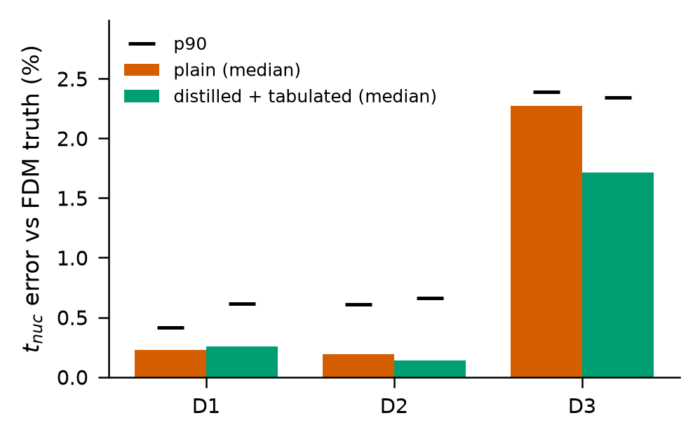

`compare_accuracy`。横轴是三层芯片，纵轴是 E2 `full` 变体的成核时间误差。橙红色柱是教师引擎的中位误差，绿色柱是学生引擎的中位误差，柱上方的黑色短横线是各自的 p90。D1 上两根柱差不多高，学生的 p90 更高。D2 上学生的柱略矮。D3 上两根柱都在 2 % 上下，学生的更矮。图例里的 plain 指教师引擎，distilled + tabulated 指学生引擎。

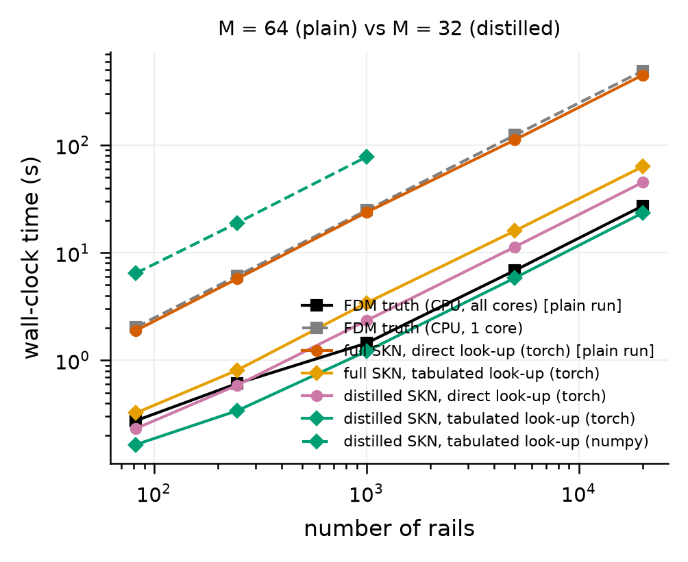

`compare_timing`。把两次 E4 的曲线画在一起，标题写明教师引擎 M=64、学生引擎 M=32。最下面的绿色实线是学生查表 GPU，紧贴其上的黑色实线是 32 进程参考求解器。最上面的橙红色实线是教师引擎自己那次运行的 GPU 闭合，它与灰色虚线的单进程参考求解器重合，比绿线高一个量级以上。中间的黄色和粉色两条是学生引擎那次运行里顺带测的教师查表和学生直接求值，这两条用的是 M=32。绿色虚线是学生查表的 numpy 路径。图例放在图内，压住了几条线的中段。

### 5.3 教师引擎的 E5

修复：

| 芯片 | 引擎 | 违例轨 | 最大倍数 | 定点占比 % | 统一占比 % | 面积比 | 验证，定点 年 | 验证，统一 年 |
|---|---|---|---|---|---|---|---|---|
| D1 | 教师 | 6 | 1.6540 | 2.93 | 65.40 | 22.29 | 10.078 | 10.078 |
| D1 | 学生 | 6 | 1.6540 | 2.93 | 65.40 | 22.29 | 10.078 | 10.078 |
| D2 | 教师 | 20 | 1.9946 | 12.59 | 99.46 | 7.90 | 10.031 | 10.122 |
| D2 | 学生 | 20 | 1.9946 | 12.63 | 99.46 | 7.87 | 10.031 | 10.122 |
| D3 | 教师 | 0 | 1.0000 | 0.00 | 0.00 | 无 | 不成核 | 不成核 |
| D3 | 学生 | 0 | 1.0000 | 0.00 | 0.00 | 无 | 不成核 | 不成核 |

两种引擎找出的违例轨是同一批，最大加宽倍数相同。D2 的定点面积略有差别，因为个别轨的加宽倍数差了一个二分格。

有限差分检查，教师引擎的全部 6 行：

| 芯片 | 轨下标 | 功耗块 | 自动微分 1/W | 有限差分 1/W | 相对偏差 % |
|---|---|---|---|---|---|
| D1 | 79 | `D1/D1_3_3` | -5.046838 | -5.047217 | 0.01 |
| D1 | 79 | `D2/D2_0_0` | -0.037758 | -0.037654 | 0.28 |
| D2 | 55 | `D2/D2_1_1` | -9.019041 | -9.018765 | 0.00 |
| D2 | 55 | `D3/D3_3_3` | -0.035285 | -0.035364 | 0.22 |
| D3 | 15 | `D3/D3_1_1` | -2.769046 | -2.728988 | 1.47 |
| D3 | 15 | `D2/D2_0_2` | -0.001230 | -0.002163 | 43.12 |

检查的是同样的 6 个元素。第 6 行在教师引擎下两者同号，相对偏差仍然很大；学生引擎下这一行符号相反。主导项上，D2 关键轨对自己所在块的灵敏度教师引擎是 -9.02/W，学生引擎是 -8.13/W，相差约一成。

功耗再分配：

| 量 | 教师引擎 | 学生引擎 |
|---|---|---|
| 迭代第 0 次，代理解最早成核 年 | 2.425 | 2.404 |
| 迭代第 24 次，代理解最早成核 年 | 5.063 | 5.092 |
| 25 次迭代里的最大值 年 | 5.092 | 5.250 |
| 优化后参考解最早成核 年 | 5.192 | 5.204 |
| 优化后参考解 10 年内成核轨数 | 22 | 22 |
| 从顶层热块 `D3/D3_1_1` 移出的功耗 W | 1.263 | 1.272 |
| 优化后 D1 最早成核 年 | 9.62 | 9.87 |

教师引擎的六张 E5 图，读法与 [07_修复_灵敏度_功耗再分配_E5.md](07_修复_灵敏度_功耗再分配_E5.md) 里学生引擎的同名图相同，下面只说差别。

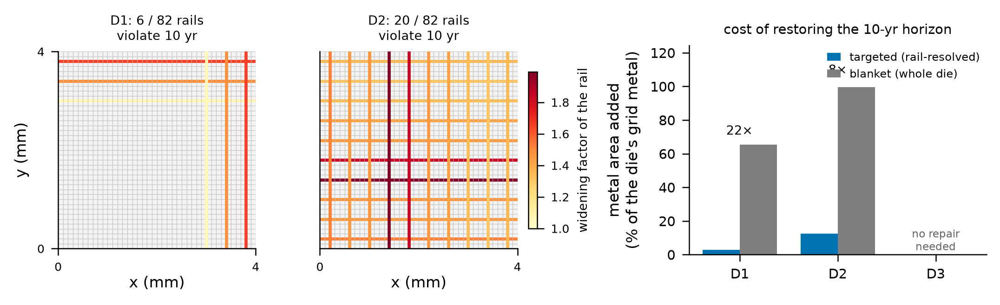

违例轨的位置和颜色与学生引擎的图一致。右侧柱状图里图例压住了 D2 柱顶的倍数标注，只露出一半。

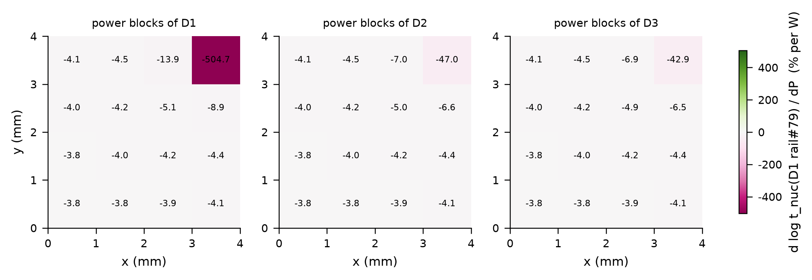

D1 轨 79。主导块 -504.7，学生引擎是 -500.9。其余格子的数与学生引擎的图相差不超过 0.1。

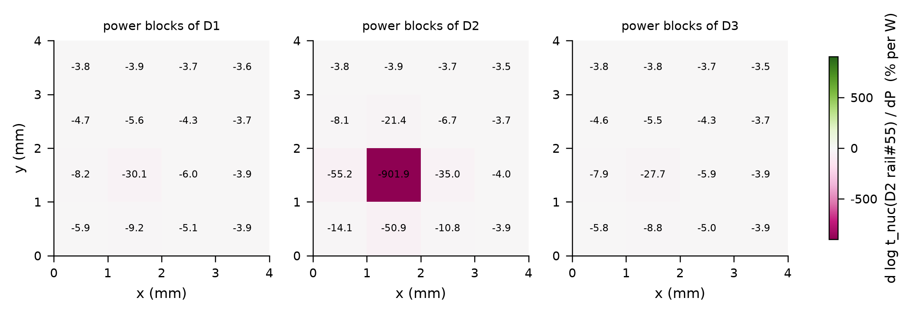

D2 轨 55。主导块 -901.9，学生引擎是 -813.4。相邻块也都比学生引擎的绝对值大一成左右。

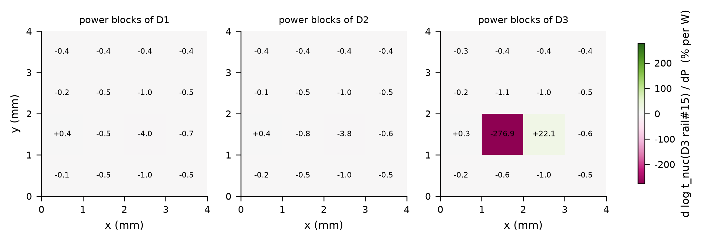

D3 轨 15。主导块 -276.9，右侧相邻块 +22.1。D1 和 D2 面板里的小数值普遍比学生引擎的图小一半，例如同一格这里是 -4.0，学生引擎是 -8.0。两种引擎在这些很小的跨芯片灵敏度上差别最大。

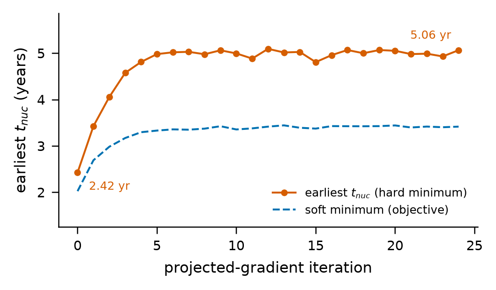

形状与学生引擎相同：前四五次迭代快速上升，之后在 5 年附近振荡。图上标注的首末值是 2.42 年和 5.06 年。

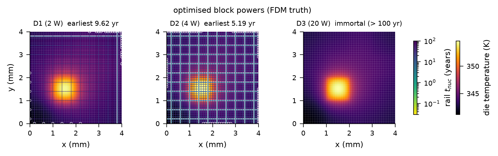

优化后的芯片图。D1 的最早成核时间标为 9.62 年，学生引擎优化出的功耗下是 9.87 年。D2 是 5.19 年。D3 不成核。

### 5.4 教师引擎的 E8

参考解一侧，两种引擎的 E8 应当相同。实际的差别：

| 量 | 教师引擎的运行 | 学生引擎的运行 |
|---|---|---|
| cores 线宽 µm | 35.48 | 35.48 |
| 定线宽时 cores 单独最早成核 年 | 21.0450 | 21.0443 |
| `full` cores 最早成核 年，参考解 | 18.9075 | 18.9077 |
| `others_off` cores 最早成核 年，参考解 | 21.0484 | 21.0476 |
| `full` cores 100 年内成核轨数，参考解 | 12 | 12 |

线宽和计数相同，成核时间在第四、五位有效数字上不同。两种引擎的输出时刻数不同，参考求解器的内部时间步要落在输出时刻上，结果因此有万分之一以内的差别。代理解一侧的比较在 5.1 节的表里。

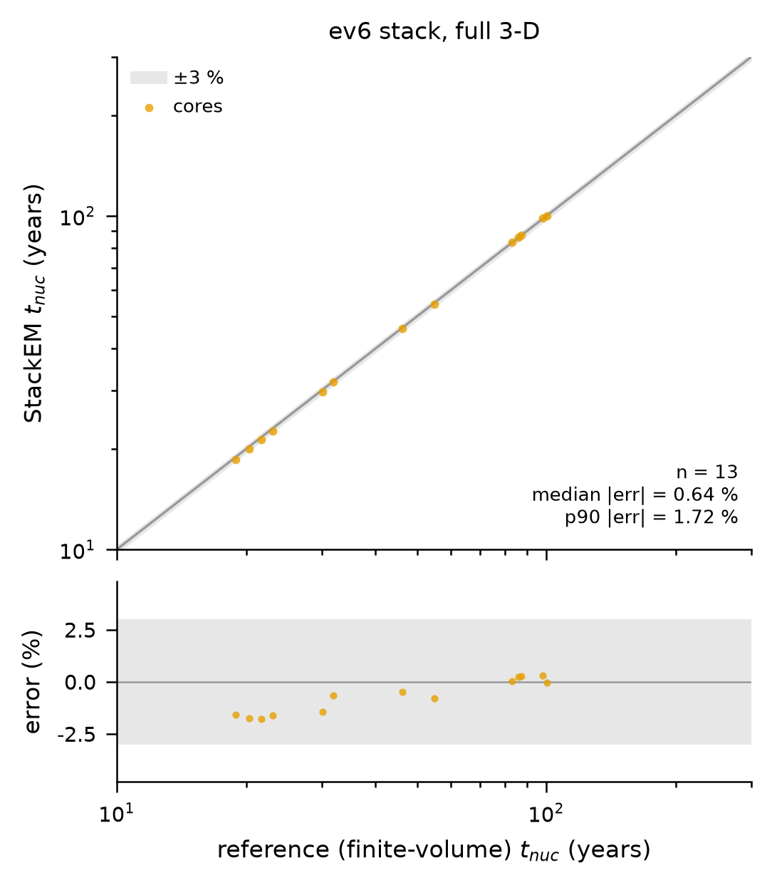

13 个点，都在灰带内。趋势与学生引擎的图相同，成核早的轨偏负，幅度更小，最负的约负 1.8 %。横轴范围比学生引擎的图宽，因为多了一条在时间窗末端成核的轨。

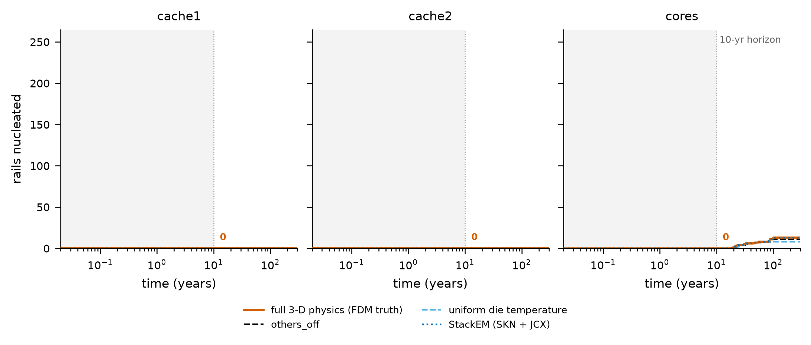

与学生引擎的图看不出差别。

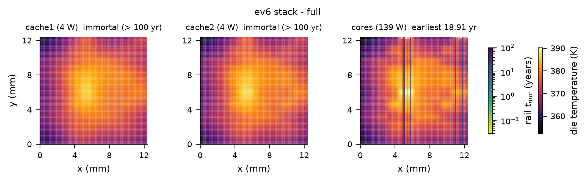

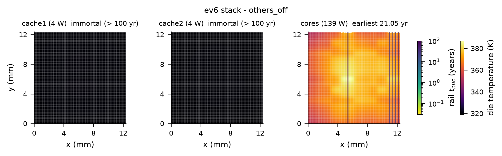


三张芯片图画的都是参考解，与学生引擎目录里的同名图内容相同，读法见 [09_真实版图_ev6_E8.md](09_真实版图_ev6_E8.md)。

## 6. 怎么理解

1. 核函数层面教师更准，误差是学生的三分之一到四分之一。
2. 轨级精度上两者相当。base3 的三层芯片里，学生引擎在 D2、D3 上的中位误差更小，D1 上略大；教师引擎在 D2 上有一个 4.7 % 的离群点。ev6 上教师更准，中位误差约为学生的一半。
3. 下游结论不变。10 年内的失效集合、修复的违例轨、功耗再分配后的寿命，两种引擎给出的结果一致或相差不到 1 %。
4. 速度差一个量级以上。两万条轨上学生引擎的 GPU 闭合耗时是教师引擎的 0.052 倍，即约十九分之一；246 条轨的 numpy 闭合也是十八分之一左右。
5. 所以正式流程选学生引擎是合理的：精度损失主要体现在核函数指标和很小的跨芯片灵敏度上，对签核结论没有影响，换来的是从“比参考求解器慢十几倍”到“与 32 进程参考求解器相当”的速度。

## 7. 论文用了哪些，哪些是论文之外的

| 论文中的说法 | 本章对应 |
|---|---|
| 消融表：4 层 128 对 6 层 256 的留出核函数误差 | 5.1 节 E1 三行 |
| 消融表：D1、D2、D3 中位误差两列 | 5.1 节 E2 中位三行 |

论文之外的内容：比较表本身和两张比较图，教师引擎的 E4、E5、E8 的全部数字和图。

## 8. 注意事项

1. 两种引擎同时差了三个因素：网络大小、查表与否、输出时刻数。5.1 节任何一行的差别都不能只归因于其中一个。[06_规模与速度_E4.md](06_规模与速度_E4.md) 5.1 节的四种组合在速度上把网络和查表分开了，精度上没有做这样的分解。
2. `comparison_teacher_student.md` 里教师一列的 E3、E7 两行无法从本仓库核对，见 5.1 节。
3. `comparison_teacher_student.md` 最后一行“教师直接求值”在学生一列写的 118.6 秒是 M=32 下测的，教师一列的 448.4 秒是 M=64 下测的，两个数不是同一设置。
4. 教师引擎的 E8 多统计了一条轨，13 对 12。那条轨在时间窗末端成核，只有 M=64 的代理解判它成核。
5. 有限差分检查在教师引擎下同样只覆盖 6 个元素，两侧同样是同一个代理模型。
6. `base3_teacher/` 各文件的 `_meta.cmd`、`_meta.config_name` 和 `config_used.json` 记录的是参考运行当时的写法：输出根目录写作 `~/stackem_work/outputs_teacher`，算例名写作 `base3`。现在的流程把教师引擎的结果写到同一个输出根下的 `base3_teacher/`。日志 `final_1_full.log` 里的步骤标题也是当时的写法。
7. 比较图的图例和列名沿用 plain、distilled 两个词。
8. `compare_timing` 的图例压住曲线，`base3_teacher/e5/e5_repair` 的图例压住一个标注。
